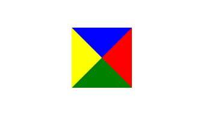
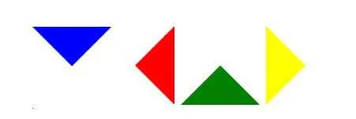
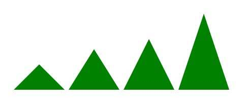
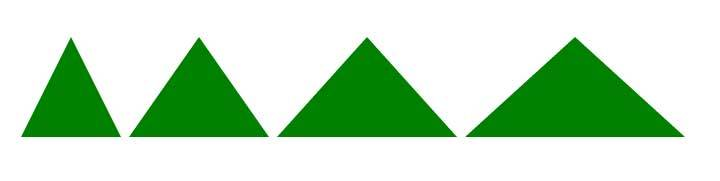

<!-- css/less/sass/stylus/styled components/jss on css
~+not:P（）>等符号用法

移动端适配方案，viewport,转换成vm、vh，rem
sass/less优点

<https://zhuanlan.zhihu.com/p/36486806> -->

## padding计算

absolute(绝对定位)：参考距其最近一个不为static的父级元素；
fixed(固定定位)：所固定的参照对像是可视窗口

## css图形绘制

### 三角形

#### 实心三角形

画一个三角形，首先想到的是如何画三角形的形状，然后给一个背景颜色。但是在写div时，会发现，div是的边框是直线。那么，我想到，要是给div的高和宽设置为0，然后设置四个border不同的颜色，那么这个颜色会重叠覆盖么？ps：当然会想到设置padding或者margin值，但是这两种属性无法设置颜色。
（每个border都是一个梯形梯形的顶边变成0 ，就是三角形。）

```css
#triangle02{
    width: 0;
    height: 0;
    border-top: 50px solid blue;
    border-right: 50px solid red;
    border-bottom: 50px solid green;
    border-left: 50px solid yellow;
    }
```



因为我们只想要一个三角形，如果把其他三个三角形的颜色变白，那就只剩下一个，等等，如果背景颜色不是白色呢？css中有这样一个属性，transparent，背景透明。这样便可以达到我们的目的了。

```css
#triangle03{
    width: 0;
    height: 0;
    border: 50px solid transparent;
    border-top: 50px solid blue;
    }
#triangle04{
    width: 0;
    height: 0;
    border: 50px solid transparent;
    border-right: 50px solid red;
    }
#triangle05{
    width: 0;
    height: 0;
    border: 50px solid transparent;
    border-bottom: 50px solid green;
    }
#triangle06{
    width: 0;
    height: 0;
    border: 50px solid transparent;
    border-left: 50px solid yellow;
    }
```



设计稿中可能还会出现高和底长度有限制的三角形，这里以第三个绿色三角形为例。看上面的代码，我们可以发现，三角形的底为border的两倍，border-bottom为三角形的高。

```css
#my01{
    width: 0;
    height: 0;
    border: 50px solid transparent;
    border-bottom: 50px solid green;
    }
#my02{
    width: 0;
    height: 0;
    border: 50px solid transparent;
    border-bottom: 80px solid green;
    }
#my03{
    width: 0;
    height: 0;
    border: 50px solid transparent;
    border-bottom: 100px solid green;
    }
#my04{
    width: 0;
    height: 0;
    border: 50px solid transparent;
    border-bottom: 150px solid green;
    }
```



```css
#my11{
    width: 0;
    height: 0;
    border: 50px solid transparent;
    border-bottom: 100px solid green;
    }
#my12{
    width: 0;
    height: 0;
    border: 70px solid transparent;
    border-bottom: 100px solid green;
    }
#my13{
    width: 0;
    height: 0;
    border: 90px solid transparent;
    border-bottom: 100px solid green;
    }
#my14{
    width: 0;
    height: 0;
    border: 110px solid transparent;
    border-bottom: 100px solid green;
    }
```



### 半圆

```css
#semi-circle{
   width: 200px;
   height: 100px;
   background-color: red;
   border-radius:100px 100px 0 0;/* 左上、右上、右下、左下 */
  }
/* 一个上半圆 */
```

## 图片转为base64

将图片转换为base64编码最常见的应用应该就是在将网页中的一些图片转换为base64编码可以实现网页图片在网速不好的时候先于内容加载和减少HTTP的请求次数来减少网站服务器的负担。
图片转换成base64有两大好处

1. 主要：减少了HTTP请求

我们的网站采用的都是HTTP协议，而HTTP协议是一种无状态的链接，就是连接和传输后都会断开连接节省资源。此时解决的方法就是尽量的减少HTTP请求，此时base64编码可以将图片添加到css中，实现请求css即可下载下来图片，减少了在此请求图片的请求。当然减少HTTP请求次数的方法还有很多，如css sprite技术，将网页中的小图片拼在一张大图片中，下载时只需要一次完整的HTTP请求就可以，减少了请求次数。

2. 提前加载图片的应用
把css中的图片使用成base64编码的，css是在html头部引用的，要优先于下面的内容被加载，所以在网速不好的时候就会出现先加载出base64图片。

图片转换成base64有两大缺点

使用 Base64 不代表性能优化

使用 Base64 的好处是能够减少一个图片的 HTTP 请求，然而，与之同时付出的代价则是 CSS 文件体积的增大。
CSS 文件的体积直接影响渲染，导致用户会长时间注视空白屏幕。HTML 和 CSS 会阻塞渲染，而图片不会。
页面解析 CSS 生成的 CSSOM 时间增加
Base64 跟 CSS 混在一起，大大增加了浏览器需要解析CSS树的耗时。其实解析CSS树的过程是很快的，一般在几十微妙到几毫秒之间。

**图片转换成base64体积到底是增大了还是缩小了**
Base64图片编码原理Base64编码要求把3个8位字节（38=24）转化为4个6位的字节（46=24），之后在6位的前面补两个0，形成8位一个字节的形式。 如果剩下的字符不足3个字节，则用0填充，输出字符使用’=’，因此编码后输出的文本末尾可能会出现1或2个’=，一般是**增大**了
