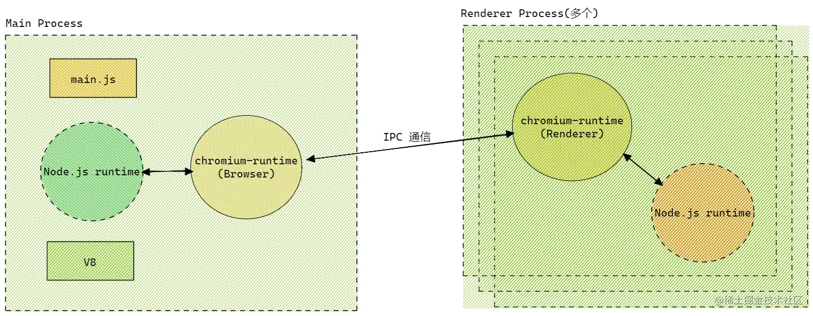

# Electron
**Electron 是使用 JavaScript，HTML 和 CSS 构建跨平台的桌面应用程序的框架，可构建出兼容 Mac、Windows 和 Linux 三个平台的应用程序。**

## Electron 为什么能跨平台
一个跨端框架的设计，有三个问题需要考虑，分别是 UI 渲染、原生 API 以及客户端构建方式。
Electron 的跨端原理并不难理解：它通过集成浏览器内核，使用前端的技术来实现不同平台下的渲染，并结合了 Chromium 、Node.js 和用于调用系统本地功能的 API 三大板块。


- Chromium 为 Electron 提供强大的 UI 渲染能力，由于 Chromium 本身跨平台，因此无需考虑代码的兼容性。最重要的是，可以使用前端三板斧进行 Electron 开发。
- Chromium 并不具备原生 GUI 的操作能力，因此 Electron 内部集成 Node.js，编写 UI 的同时也能够调用操作系统的底层 API，例如 path、fs、crypto 等模块。
- Native API 为 Electron 提供原生系统的 GUI 支持，借此 Electron 可以调用原生应用程序接口。

总结起来，Chromium 负责页面 UI 渲染，Node.js 负责业务逻辑，Native API 则提供原生能力和跨平台。

## Chromium 架构
JavaScript 是单线程语言，但浏览器是多线程的，Chromium 作为 Chrome 的实验版，自然也是基于多线程工作机制。(图源: Chromium 官网)


1.浏览器进程
Chromium 分为 Browser 主进程和若干个 Render 进程，一个个 Render 进程对应着我们浏览器中的一个个 tab，而每个 render 进程通过分配的端口号与远程的 server 建立连接。当 Chrome 打开时，进程启动。浏览器为每个渲染进程维护对应的 RenderProcessHost，负责浏览器与渲染器的交互。RenderViewHost 则是与 RenderView 对象进行交互，渲染网页的内容。浏览器与渲染器通过 IPC 进行通信。
2.渲染进程管理
每个渲染进程都有一个全局 RenderProcess 对象，可以管理其与父浏览器进程之间的通信，并维护其全局状态。
3.view 管理
每个渲染器可以维护多个 RenderView 对象，当新开标签页或弹出窗口后，渲染进程就会创建一个 RenderView，RenderView 对象与它在浏览器进程中对应的 RenderViewHost 和 Webkit 嵌入层通信，渲染出网页网页内容。

- 主进程的 RenderProcessHost 和 渲染进程的 RenderProcess 专门处理 IPC 事件。
- 渲染进程的 RenderView： 我们的页面就是在这里基于 Webkit 排版展示出来的。
- ResourceDispatcher 处理资源请求，当页面需要请求资源时，通过 ResourceDispatcher，创建一个请求 ID 转发到 IPC，在 Browser 进程中处理然后返回。

## Electron 架构解析
Electron 架构参考了 Chromium 的多进程架构模式，即将主进程和渲染进程隔离，并且在 Chromium 多进程架构基础上做一定扩展。

将上面复杂的 Chromium 架构简化:


Chromium 运行时由一个 Browser Process，以及一个或者多个 Renderer Process 构成。Renderer Process 负责渲染页面 Web ，Browser Process 负责管理各个 Renderer Process 以及其他功能(菜单栏、收藏夹等)

下面我们看一下Electron 架构有那些变化:



Electron 架构中仍然使用了 Chromium 的 Renderer Process 渲染界面，Renderer Process 可以有多个，互相独立不干扰。由于 Electron 为其集成了 Node。运行时，Renderer Process 可以调用 Node API。主要负责: 利用 HTML 和 CSS 渲染页面；利用 JavaScript 实现页面交互效果。


相较于 Chromium 架构，Electron 对 Browser 线程做了很多改动，将其更改名 Main Process，每个应用程序只能有一个主线程，主线程位于 Node.js 下运行，因此其可以调用系统底层功能。其主要负责：渲染进程的创建；系统底层功能及原生资源的调用；应用生命周期的控制(包裹启动、推出以及一些事件监听)


经过上面的分析，Electron 多进程的系统架构可以总结为下图:


可以发现，主线程和渲染线程都集成了 Native API 和 Node.js，渲染线程还集成 Chromium 内核，成功实现跨端开发。

## Node 与 Chromium

Chromium 是多进程的架构，主进程负责 GUI 例如创建窗口等等，而渲染进程处理 web 页面的运行和渲染，所以如果想将 nodejs 与 Chromium 集成，需要考虑如何将 Nodejs 与 Chromium 的主进程、渲染进程事件循环机制结合在一起。

> Node 的事件循环基于 libuv 实现，而 Chromium 基于 message bump 实现。主线程只能同时运行一个事件循环，因此需要将两个完全不同的事件循环整合起来。

### NodeJS事件循环

#### Node.js进程

##### 异步IO
接口，这就是我们生活中可见的IO能力；这个接口在向下会进入到操作系统这个层面，在操作系统中，会提供诸多的能力，比如：磁盘的读写，DNS的查询，数据库的连接啊，网络请求的处理，等等；
在不同的操作系统层面，表现的不一致。有的是异步非阻塞的；有的是同步的阻塞的，无论如何，我们都可以看做是上层应用于下层系统之间的数据交互；上层依赖于下层，但是反过来，上层也可以对下层提供的这些能力进行改造；如果这种操作是异步的，非阻塞的，那么这种就是异步非阻塞的异步IO模型；如果是同步的阻塞的，那么就是同步IO模型；
koa就是一个上层的web服务框架，全部由js实现，他有操作系统之间的交互，全部通过nodejs来实现；如nodejs的 readFile就是一个异步非阻塞的接口，readFileSync就是一个同步阻塞接口；

##### 事件循环
事件循环是指Node.js执行非阻塞I/O操作，尽管JavaScript是单线程的,但由于大多数内核都是多线程的，node.js会尽可能将操作装载到系统内核。因此它们可以处理在后台执行的多个操作。当其中一个操作完成时，内核会告诉Node.js，以便node.js可以将相应的回调添加到轮询队列中以最终执行。

**总结**
nodejs是单线程执行的，同时它又是基于事件驱动的非阻塞IO编程模型。这就使得我们不用等待异步操作结果返回，就可以继续往下执行代码。当异步事件触发之后，就会通知主线程，主线程执行相应事件的回调。

#### Nodejs 架构分析


##### Application Code(JS)

> 框架代码以及用户代码即我们编写的应用程序代码、npm包、nodejs内置的js模块等，我们日常工作中的大部分时间都是编写这个层面的代码。

##### binding代码
> binding代码或者三方插件（js 或 C/C++ 代码）胶水代码.
能够让js调用C/C++的代码。可以将其理解为一个桥，桥这头是js，桥那头是C/C++，通过这个桥可以让js调用C/C++。

在nodejs里，胶水代码的主要作用是把nodejs底层实现的C/C++库暴露给js环境。
三方插件是我们自己实现的C/C++库，同时需要我们自己实现胶水代码，将js和C/C++进行桥接。

Nodejs 通过一层 C++ Binding, 把 JS 传入 V8, V8 解析后交给 libUV 发起 asnyc I/O, 并等待消息循环调度.

##### 底层库
nodejs的依赖库，包括V8、libuv。

- V8: 执行 JS 的引擎. 也就是翻译 JS. 包括我们熟悉的编译优化, 垃圾回收等等.
- libUV: 用C语言实现的一套异步功能库，nodejs高效的异步编程模型很大程度上归功于libuv的实现，提供 async I/O, 提供消息循环. 可见, 是操作系统 API 层的一个抽象层.

还有一些其他的依赖库

- http-parser：负责解析http响应
- openssl：加解密
- c-ares：dns解析
- npm：nodejs包管理器

#### libuv 架构

nodejs实现异步机制的核心便是libuv，libuv承担着nodejs与文件、网络等异步任务的沟通桥梁，如下图，nodejs的网络I/O、文件I/O、DNS操作、还有一些用户代码都是在 libuv 工作的。


##### nodejs里的异步事件

**非 I/O操作**
- 定时器（setTimeout，setInterval）
- microtask（promise）
- process.nextTick
- setImmediate
- DNS.lookup

**I/O操作**
- 网络I/O

对于网络I/O，各个平台的实现机制不一样，linux 是 epoll 模型，类 unix 是 kquene 、windows 下是高效的 IOCP 完成端口、SunOs 是 event ports，libuv 对这几种网络I/O模型进行了封装。

- 文件I/O 与DNS操作

libuv内部还维护着一个默认4个线程的线程池，这些线程负责执行文件I/O操作、DNS操作、用户异步代码。当 js 层传递给 libuv 一个操作任务时，libuv 会把这个任务加到队列中。之后分两种情况：

1、线程池中的线程都被占用的时候，队列中任务就要进行排队等待空闲线程。
2、线程池中有可用线程时，从队列中取出这个任务执行，执行完毕后，线程归还到线程池，等待下个任务。同时以事件的方式通知event-loop，event-loop接收到事件执行该事件注册的回调函数。

> 当然，如果觉得4个线程不够用，可以在nodejs启动时，设置环境变量UV_THREADPOOL_SIZE来调整，出于系统性能考虑，libuv 规定可设置线程数不能超过128个。

#### Nodejs 线程模型
node.js启动过程可以分为以下步骤：
1、调用platformInit方法 ，初始化 nodejs 的运行环境。
2、调用 performance_node_start 方法，对 nodejs 进行性能统计。
3、openssl设置的判断。
4、调用v8_platform.Initialize，初始化 libuv 线程池。
5、调用 V8::Initialize，初始化 V8 环境。
6、创建一个nodejs运行实例。
7、启动上一步创建好的实例。
8、开始执行js文件，同步代码执行完毕后，进入事件循环。
9、在没有任何可监听的事件时，销毁 nodejs 实例，程序执行完毕。


#### 消息循环


- timers：执行setTimeout() 和 setInterval()中到期的callback。
- I/O callbacks：上一轮循环中有少数的I/Ocallback会被延迟到这一轮的这一阶段执行
- idle, prepare：仅内部使用
- poll：最为重要的阶段，执行I/O callback，在适当的条件下会阻塞在这个阶段
- check：执行setImmediate的callback
- close callbacks：执行close事件的callback，例如socket.on("close",func)

Nodejs 将消息循环又细分为 6 个阶段(官方叫做 Phase), 每个阶段都会有一个类似于队列的结构, 存储着该阶段需要处理的回调函数. 我们来看一下这 6 个 Phase 的作用,这六个阶段的核心代码如下：
```ts
int uv_run(uv_loop_t* loop, uv_run_mode mode) {
  int timeout;
  int r;
  int ran_pending;
  //判断事件循环是否存活。
  r = uv__loop_alive(loop);
  //如果没有存活，更新时间戳
  if (!r)
    uv__update_time(loop);
  //如果事件循环存活，并且事件循环没有停止。
  while (r != 0 && loop->stop_flag == 0) {
    //更新当前时间戳
    uv__update_time(loop);
    //执行 timers 队列
    uv__run_timers(loop);
    //执行由于上个循环未执行完，并被延迟到这个循环的I/O 回调。
    ran_pending = uv__run_pending(loop); 
    //内部调用，用户不关注，忽略
    uv__run_idle(loop); 
    //内部调用，用户不关注，忽略
    uv__run_prepare(loop); 
    
    timeout = 0; 
    if ((mode == UV_RUN_ONCE && !ran_pending) || mode == UV_RUN_DEFAULT)
    //计算距离下一个timer到来的时间差。
      timeout = uv_backend_timeout(loop);
   //进入 轮询 阶段，该阶段轮询I/O事件，有则执行，无则阻塞，直到超出timeout的时间。
    uv__io_poll(loop, timeout);
    //进入check阶段，主要执行 setImmediate 回调。
    uv__run_check(loop);
    //进行close阶段，主要执行 **关闭** 事件
    uv__run_closing_handles(loop);

    if (mode == UV_RUN_ONCE) {
      
      //更新当前时间戳
      uv__update_time(loop);
      //再次执行timers回调。
      uv__run_timers(loop);
    }
    //判断当前事件循环是否存活。
    r = uv__loop_alive(loop); 
    if (mode == UV_RUN_ONCE || mode == UV_RUN_NOWAIT)
      break;
  }

  /* The if statement lets gcc compile it to a conditional store. Avoids
   * dirtying a cache line.
   */
  if (loop->stop_flag != 0)
    loop->stop_flag = 0;

  return r;
}
```
#### node 的初始化
- 初始化 node 环境。
- 执行输入代码。
- 执行 process.nextTick 回调。
- 执行 microtasks（Promise）。

####  event-loop

##### timers 阶段（Timer Phase）

这是消息循环的第一个阶段, 用一个 for 循环处理所有 setTimeout 和 setInterval 的回调. 核心代码如下：

```ts
void uv__run_timers(uv_loop_t* loop) {
  struct heap_node* heap_node;
  uv_timer_t* handle;

  for (;;) {
  //取出定时器堆中超时时间最近的定时器句柄
    heap_node = heap_min((struct heap*) &loop->timer_heap);
    if (heap_node == NULL)
      break;
    
    handle = container_of(heap_node, uv_timer_t, heap_node);
    // 判断最近的一个定时器句柄的超时时间是否大于当前时间，如果大于当前时间，说明还未超时，跳出循环。
    if (handle->timeout > loop->time)
      break;
    // 停止最近的定时器句柄
    uv_timer_stop(handle);
    // 判断定时器句柄类型是否是repeat类型，如果是，重新创建一个定时器句柄。
    uv_timer_again(handle);
    //执行定时器句柄绑定的回调函数
    handle->timer_cb(handle);
  }
}
```
这些回调被保存在一个最小堆(min heap) 中. 这样引擎只需要每次判断头元素, 如果符合条件就拿出来执行, 直到遇到一个不符合条件或者队列空了, 才结束 Timer Phase.

Timer Phase 中判断某个回调是否符合条件的方法也很简单. 消息循环每次进入 Timer Phase 的时候都会保存一下当时的系统时间,然后只要看上述最小堆中的回调函数设置的启动时间是否超过进入 Timer Phase 时保存的时间, 如果超过就拿出来执行.

此外, Nodejs 为了防止某个 Phase 任务太多, 导致后续的 Phase 发生饥饿的现象, 所以消息循环的每一个迭代(iterate) 中, 每个 Phase 执行回调都有个最大数量. 如果超过数量的话也会强行结束当前 Phase 而进入下一个 Phase. 这一条规则适用于消息循环中的每一个 Phase.

- 检查 timer 队列是否有到期的 timer 回调，如果有，将到期的 timer回调按照 timerId 升序执行。
- 检查是否有 process.nextTick 任务，如果有，全部执行。
- 检查是否有microtask，如果有，全部执行。
- 退出该阶段。

##### IO callbacks阶段
Pending I/O Callback Phase

这一阶段是执行你的 fs.read, socket 等 IO 操作的回调函数, 同时也包括各种 error 的回调.

- 检查是否有 pending 的 I/O 回调。如果有，执行回调。如果没有，退出该阶段。
- 检查是否有 process.nextTick 任务，如果有，全部执行。
- 检查是否有microtask，如果有，全部执行。
- 退出该阶段。

##### idle，prepare 阶段
Idle, Prepare Phase主要是内部使用

##### Poll Phase阶段

这是整个消息循环中最重要的一个 Phase, 作用是等待异步请求和数据(原文: accepts new incoming connections (new socket establishment etc) and data (file read etc)).
它支撑了整个消息循环机制.

Poll Phase 首先会执行 watch_queue 队列中的 IO 请求, 一旦 watch_queue 队列空, 则整个消息循环就会进入 sleep , 从而等待被内核事件唤醒.
```ts
void uv__io_poll(uv_loop_t* loop, int timeout) {
  /*一连串的变量初始化*/
  //判断是否有事件发生    
  if (loop->nfds == 0) {
    //判断观察者队列是否为空，如果为空，则返回
    assert(QUEUE_EMPTY(&loop->watcher_queue));
    return;
  }
  
  nevents = 0;
  // 观察者队列不为空
  while (!QUEUE_EMPTY(&loop->watcher_queue)) {
    /*
    取出队列头的观察者对象
    取出观察者对象感兴趣的事件并监听。
    */
    ....省略一些代码
    w->events = w->pevents;
  }

  
  assert(timeout >= -1);
  //如果有超时时间，将当前时间赋给base变量
  base = loop->time;
  // 本轮执行监听事件的最大数量
  count = 48; /* Benchmarks suggest this gives the best throughput. */
  //进入监听循环
  for (;; nevents = 0) {
  // 有超时时间的话，初始化spec
    if (timeout != -1) {
      spec.tv_sec = timeout / 1000;
      spec.tv_nsec = (timeout % 1000) * 1000000;
    }
    
    if (pset != NULL)
      pthread_sigmask(SIG_BLOCK, pset, NULL);
    // 监听内核事件，当有事件到来时，即返回事件的数量。
    // timeout 为监听的超时时间，超时时间一到即返回。
    // 我们知道，timeout是传进来得下一个timers到来的时间差，所以，在timeout时间内，event-loop会一直阻塞在此处，直到超时时间到来或者有内核事件触发。
    nfds = kevent(loop->backend_fd,
                  events,
                  nevents,
                  events,
                  ARRAY_SIZE(events),
                  timeout == -1 ? NULL : &spec);

    if (pset != NULL)
      pthread_sigmask(SIG_UNBLOCK, pset, NULL);

    /* Update loop->time unconditionally. It's tempting to skip the update when
     * timeout == 0 (i.e. non-blocking poll) but there is no guarantee that the
     * operating system didn't reschedule our process while in the syscall.
     */
    SAVE_ERRNO(uv__update_time(loop));
    //如果内核没有监听到可用事件，且本次监听有超时时间，则返回。
    if (nfds == 0) {
      assert(timeout != -1);
      return;
    }
    
    if (nfds == -1) {
      if (errno != EINTR)
        abort();

      if (timeout == 0)
        return;

      if (timeout == -1)
        continue;

      /* Interrupted by a signal. Update timeout and poll again. */
      goto update_timeout;
    }

    。。。
    //判断事件循环的观察者队列是否为空
    assert(loop->watchers != NULL);
    loop->watchers[loop->nwatchers] = (void*) events;
    loop->watchers[loop->nwatchers + 1] = (void*) (uintptr_t) nfds;
    // 循环处理内核返回的事件，执行事件绑定的回调函数
    for (i = 0; i < nfds; i++) {
        。。。。
    }
}
```

当js层代码注册的事件回调都没有返回的时候，事件循环会阻塞在poll阶段，但是会进行如下处理：

1. 它首先会判断后面的 Check Phase 以及 Close Phase 是否还有等待处理的回调. 如果有, 则不等待, 直接进入下一个 Phase.

2. 如果没有其他回调等待执行, 它会给 epoll 这样的方法设置一个 timeout.

> 这个 timeout设置的时间为Timer Phase 中最近要执行的回调启动时间到现在的差值, 假设这个差值是 detal. 因为 Poll Phase 后面没有等待执行的回调了. 所以这里最多等待 delta 时长, 如果期间有事件唤醒了消息循环, 那么就继续下一个 Phase 的工作; 如果期间什么都没发生, 那么到了 timeout 后, 消息循环依然要进入后面的 Phase, 让下一个迭代的 Timer Phase 也能够得到执行.
Nodejs 就是通过 Poll Phase, 对 IO 事件的等待和内核异步事件的到达来驱动整个消息循环的.

**总结**
首先检查是否存在尚未完成的回调，如果存在，那么分两种情况。

- 第一种情况：
  - 如果有可用回调（可用回调包含到期的定时器还有一些IO事件等），执行所有可用回调。
  - 检查是否有 process.nextTick 回调，如果有，全部执行。
  - 检查是否有 microtaks，如果有，全部执行。
  - 退出该阶段。

- 第二种情况：
  - 如果没有可用回调。
  - 检查是否有 immediate 回调，如果有，退出 poll 阶段。如果没有，阻塞在此阶段，等待新的事件通知。
  - 如果不存在尚未完成的回调，退出poll阶段。

##### check 阶段
这个阶段只处理 setImmediate 的回调函数.
因为 Poll Phase 阶段可能设置一些回调, 希望在 Poll Phase 后运行. 所以在 Poll Phase 后面增加了这个 Check Phase.

- 如果有immediate回调，则执行所有immediate回调。
- 检查是否有 process.nextTick 回调，如果有，全部执行。
- 检查是否有 microtaks，如果有，全部执行。
- 退出 check 阶段

##### closing  阶段
专门处理一些 close 类型的回调. 比如 socket.on('close', ...). 用于资源清理。
- 如果有immediate回调，则执行所有immediate回调。
- 检查是否有 process.nextTick 回调，如果有，全部执行。
- 检查是否有 microtaks，如果有，全部执行。
- 退出 closing 阶段

**检查是否有活跃的 handles（定时器、IO等事件句柄）**
- 如果有，继续下一轮循环。
- 如果没有，结束事件循环，退出程序。


顺序就是:
同步任务-> 本轮循环-> 次轮循环

1. 本轮循环与次轮循环
异步任务可以分成两种。
- 追加在本轮循环的异步任务
- 追加在次轮循环的异步任务

Node 规定，process.nextTick和Promise的回调函数，追加在本轮循环，即同步任务一旦执行完成，就开始执行它们。而setTimeout、setInterval、setImmediate的回调函数，追加在次轮循环。

2. process.nextTick()
- Node 执行完所有同步任务，接下来就会执行process.nextTick的任务队列。
- 如果想让异步任务尽可能快地执行，可以使用process.nextTick来完成。

3. 微任务（microtack）
Promise对象的回调函数，会进入异步任务里面的”微任务”（microtask）队列。

微任务队列追加在process.nextTick队列的后面，也属于本轮循环。

4. setTimeOut与setImmediate
setTimeout在 timers 阶段执行，而setImmediate在 check 阶段执行。所以，setTimeout会早于setImmediate完成。
```js
setTimeout(() => console.log(1));
setImmediate(() => console.log(2));
```
上面代码应该先输出1，再输出2，但是实际执行的时候，结果却是不确定，有时还会先输出2，再输出1。

这是因为setTimeout的第二个参数默认为0。但是实际上，Node 做不到0毫秒，最少也需要1毫秒，根据官方文档，第二个参数的取值范围在1毫秒到2147483647毫秒之间。也就是说，setTimeout(f, 0)等同于setTimeout(f, 1)。

实际执行的时候，进入事件循环以后，有可能到了1毫秒，也可能还没到1毫秒，取决于系统当时的状况。如果没到1毫秒，那么 timers 阶段就会跳过，进入 check 阶段，先执行setImmediate的回调函数。

但是，下面的代码一定是先输出2，再输出1。
```js
const fs = require('fs');
fs.readFile('test.js', () => {
 setTimeout(() => console.log(1));
 setImmediate(() => console.log(2));
});
```
上面代码会先进入 I/O callbacks 阶段，然后是 check 阶段，最后才是 timers 阶段。因此，setImmediate才会早于setTimeout执行。


### libuv和chromium事件循环的融合

1. Electron 首先采用的是，用 libuv 代替 chromium 中的 message loop 的方案。
在渲染器进程很容易做到，因为它的消息循环只监听文件描述符和定时器，所以只需要用libuv实现接口。
但是在主进程中很困难，Chromium 中每个平台都有自己的 GUI message loop 机制，例如 macos 的 chromium 使用 NSRunLoop，而 Linux 使用 glib，实现过程特别复杂，也会遇到很多无法工作的边界情况，资源消耗和延迟问题也无法得到有效解决，最终放弃了第一种方案。

2. Electron 第二次尝试使用小间隔的定时器来轮询 GUI 事件循环，结果是进程会消耗大量的 CPU 资源，并且一些操作会有很大延时。

3. 随后libuv 引入了 backend_fd 概念，可以理解为libuv轮询其事件循环的文件描述符（或handle）。 因此，通过轮询backend fd，可以在libuv中发生新事件时收到通知。
在Electron中，创建了一个单独的安全线程来轮询backend_fd，每当libuv事件循环中发生新事件时，都会将消息发布到Chromium的消息循环中，然后在主线程中处理libuv事件，使用Chromium 的 messagebump 事件循环去调度NodeJS 的事件。

所以整个流程可以用图表示为：


总结来说：Electron 是将 libuv 集成到 Chromium 的 message loop 中，但是，相比于直接运行 libuv 事件循环，Electron 用更加底层的 uv_backend_fd 作为替代，去监听 libuv 的 events，这样使 Node 的事件在 Chromium 架构下能够得到高效、安全处理。

