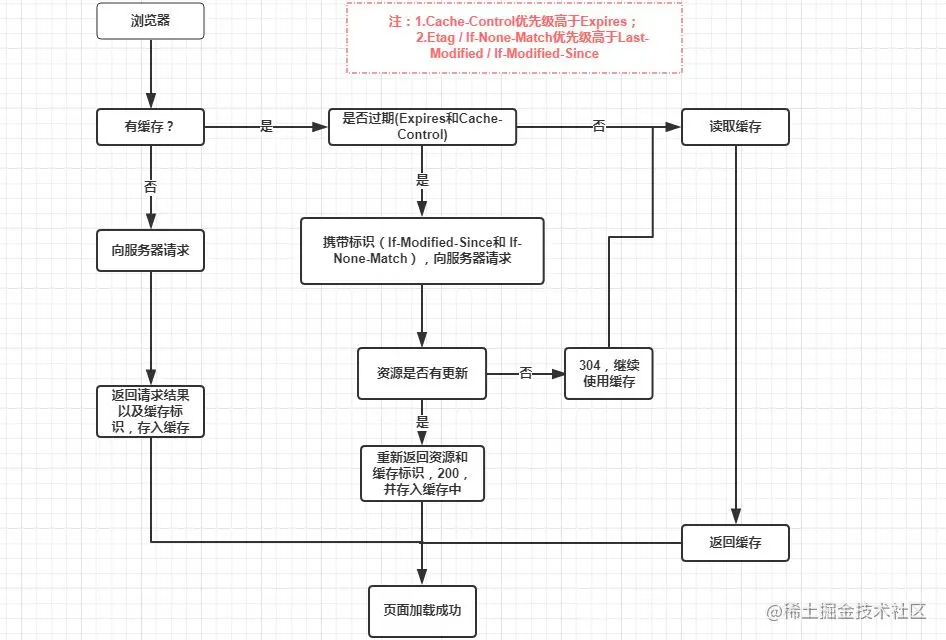
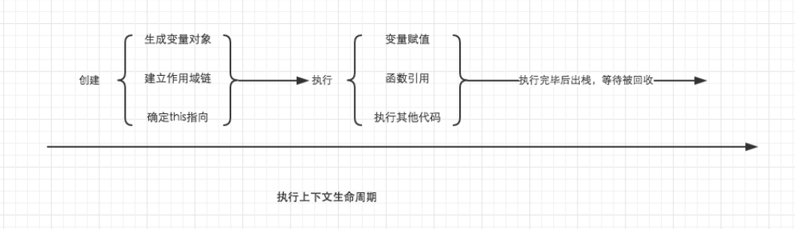

# supplement

## 缓存

<https://juejin.cn/post/6844903593275817998>

### 缓存查找的顺序

- Service Worker</br>
  Service Worker 是运行在浏览器背后的独立线程，一般可以用来实现缓存功能。使用 Service Worker的话，传输协议必须为 HTTPS。
- 内存缓存
- 磁盘缓存
- 推送缓存</br>
  Push Cache（推送缓存）是 HTTP/2 中的内容，当以上三种缓存都没有命中时，它才会被使用。它只在会话（Session）中存在，一旦会话结束就被释放，并且缓存时间也很短暂，在Chrome浏览器中只有5分钟左右，同时它也并非严格执行HTTP头中的缓存指令。
当以上四种缓存都失效的时候，才会去发送请求，请求时，又根据请求头信息，可分为强缓存、协商缓存。

**浏览器缓存过程分析**

> 浏览器与服务器通信的方式为应答模式，即是：浏览器发起HTTP请求 – 服务器响应该请求。那么浏览器第一次向服务器发起该请求后拿到请求结果，会根据响应报文中HTTP头的缓存标识，决定是否缓存结果，是则将请求结果和缓存标识存入浏览器缓存中，简单的过程如下图：

第一次请求：


由上图我们可以知道：

- 浏览器每次发起请求，都会先在浏览器缓存中查找该请求的结果以及缓存标识
- 浏览器每次拿到返回的请求结果都会将该结果和缓存标识存入浏览器缓存中

第二次请求相同网页：</br>


### 强缓存(本地缓存)
>
> 不用跟服务器进行通信，直接使用本地缓存的资源，
> 强制缓存就是向浏览器缓存查找该请求结果，并根据该结果的缓存规则来决定是否使用该缓存结果的过程，强制缓存的情况主要有三种(暂不分析协商缓存过程)，如下：

- 不存在该缓存结果和缓存标识，强制缓存失效，则直接向服务器发起请求（跟第一次发起请求一致）：
- 存在该缓存结果和缓存标识，但该结果已失效，强制缓存失效，则使用协商缓存
- 存在该缓存结果和缓存标识，且该结果尚未失效，强制缓存生效，直接返回该结果

**相关header字段**

- **expires** ---- HTTP1.0使用的expire
    一个未来时间，代表资源的有效期，没有过期之前都使用当前资源

- **cache-control** ------HTTP1.1及其之后使用cache-control 优先级高于 expires
  value 是一个时间段，请求有效的最大时间段，限制：
  1. 需要记住请求时间还需要计算是否在这个时间段内
  2. 服务器与客户端时间必须一致。
  因为它是一个时间段，所以意味着，可以设置一些默认值，常见的默认值设置：
  - max-age: 当值设为max-age=300时，则代表在这个请求正确返回时间(浏览器也会记录下来)的5分钟内再次加载资源，就会命中强缓存。
  - no-cache：不使用本地缓存。向浏览器发送新鲜度校验请求
  - no-store：禁止浏览器缓存数据，也禁止保存至临时文件中，每次都重新请求，
  - pubilc：任何情况下都缓存（即使是HTTP认证的资源）
  - private：只能被终端用户的浏览器缓存，不允许CDN等中间层缓存服务器对其进行缓存。

**强制缓存如何重新加载缓存过的资源？**

    更新页面中引用的资源路径，让浏览器主动放弃缓存，加载新资源

### 协商缓存
>
> 将资源一些相关信息返回服务器，让服务器判断浏览器是否能直接使用本地缓存，整个过程至少与服务器通信一次
> 协商缓存就是强制缓存失效后，浏览器携带缓存标识向服务器发起请求，由服务器根据缓存标识决定是否使用缓存的过程，主要有以下两种情况
>
> - 协商缓存生效，返回304
> - 协商缓存失效，返回200和请求结果结果
> 同样，协商缓存的标识也是在响应报文的HTTP头中和请求结果一起返回给浏览器的，控制协商缓存的字段分别有：Last-Modified / If-Modified-Since和Etag / If-None-Match，其中Etag / If-None-Match的优先级比Last-Modified / If-Modified-Since高。

**相关header字段**

**Last-Modified/If-Modified-Since**（两个都是时间格式字符串）
过程：

> 1. 浏览器第一次发请求，服务器在返回的 respone 的 header 加上 Last-Modified，表示资源的最后修改时间

> 2. 再次请求资源，在 requset 的 header 加上 If-Modified-Since ，值就是上一次请求返回的 Last-Modified 值

> 3. 服务器根据请求传过来的值判断资源是否有变化，没有则返回 304，有变化就正常返回资源内容，更新 Last-Modified 的值

> 4. 304 从缓存加载资源，否则直接从服务器加载资源

**Etag/If-None-Match**（标识符字符串）
与 Last-Modified/If-Modified-Since 不同的是，返回 304 时，ETag 还是会重新生成返回至浏览器
> Etag是服务器响应请求时，返回当前资源文件的一个唯一标识(由服务器生成)

> If-None-Match是客户端再次发起该请求时，携带上次请求返回的唯一标识Etag值，通过此字段值告诉服务器该资源上次请求返回的唯一标识值。服务器收到该请求后，发现该请求头中含有If-None-Match，则会根据If-None-Match的字段值与该资源在服务器的Etag值做对比，一致则返回304，代表资源无更新，继续使用缓存文件；不一致则重新返回资源文件，状态码为200

优点：
> 有些文件可能会周期性更改，但内容并没有修改时，用 Etag 就不用重新拉取；
> 1S 内修改的文件也会检测到；
> 优先级高于 Last-Modified。

**为什么协商缓存有两个属性一起出现：**
协商缓存是浏览器判断资源是否可用，所以需要两个标识，第一个是第一次请求的响应头带上某个字段（Last-Modified或者Etag），第二个则是后续请求带上的对应请求字段（If-Modified-Since或者If-None-Match），两个标识一起出现才有意义，单独则没有什么效果。

**总结**
> 强制缓存优先于协商缓存进行，若强制缓存(Expires和Cache-Control)生效则直接使用缓存，若不生效则进行协商缓存(Last-Modified / If-Modified-Since和Etag / If-None-Match)，协商缓存由服务器决定是否使用缓存，若协商缓存失效，那么代表该请求的缓存失效，重新获取请求结果，再存入浏览器缓存中；生效则返回304，继续使用缓存，主要过程如下：



用户第一次访问页面——

    1、200 数值大小，与服务器通信，服务器返回全部资源大小，浏览器把获取到的数据根据缓存规则进行缓存。

    2、更新项目，用户打开页面是旧的资源——200 from disk cache，命中强缓存，使用了本地缓存，
    没有请求服务器

    3、用户手动刷新页面，得到新资源——200 数值大小，用户刷新，强缓存失效，使用协商缓存，
    根据缓存标识发现资源修改了，服务器返回全部新资源和缓存标识

    4、用户再刷新页面——304 数值大小，协商缓存，资源没有修改，数值不是全部资源大小，
    是报文信息大小。同时，这里会出现一些资源200 from memory的情况，它们存在内存中。

### 文件资源缓存在打包过程中的处理方式

强缓存的优势很明显，无需向服务器发送请求，节省了大量的时间和带宽。但是有一个问题，缓存有效期内想更新资源怎么办？我在工程中还遇到另外一个问题，一个项目有四个环境，测试环境、开发环境、在线确认环境、在线环境，四个环境的域名相同，这样就会造成四个环境的缓存共用问题。比如先访问了测试环境，index.js被换成到浏览器中，再切换到在线环境，在线环境会请求index.js,此时浏览器就会使用本地缓存中测试环境的index.js,造成代码错乱。

 > 为了让代码上线运行缓存更好使用，我们在webpack打包过程中，如果修改了相应的css或者js文件的话，因为浏览器的强缓存机制，在打包后我们的页面是不会发生变动的，所以在我们的webpack中需要对打包后的文件名进行相应的处理，去告诉浏览器这是个新的文件（发生变动的文件）需要重新请求资源。

如何使强缓存失效，是问题的关键。通常的解决方法是更新文件名，文件名不一样的话，浏览器就会重新请求资源。我们要保证新发布版本和不同环境中的文件名是不一样的。其中一种方法在文件名后加版本号：

```js
index.js?version=1
index.css?version=1
```

webpack提供了很简单的方法可以配置缓存。

```js
// webpack.config.js
module.exports = {
  entry: "main.js",
  output: {
    path: "/build",
    filename: "main.[hash].js"
  }
};
```

通过hash占位符，在每次生成打包文件时，都会通过文件内容生成唯一的hash，并添加到输出的文件名中。如果有多个入口文件，可以使用name占位符设置输出：

```js
// webpack.config.js
module.exports = {
  entry: {
      main:"main.js",
      sub:"sub.js"
  },
  output: {
    path: "/dist",
    filename: "[name].[hash].js"
  }
};
```

> 此时的hash是根据两个文件的内容来生成的，两个文件名使用的hash是一致的。如果main.js和sub.js只有一个改变，两个文件名都会改变，两个文件都会重新请求，造成资源浪费。webpack提供了chunkhash来代替hash在多入口情况下使用。chunkhash是根据每个入口文件单独生成的哈希值，避免上述情况。

在webpack中输出文件通常有三种命名方式：</br>

- hash：每次webpack打包会生成一个唯一的hash值
问题：因为js和css同时使用一个hash值 如果重新打包会导致所有缓存失效（可能我只改动一个文件）
- chunkhash：根据chunk生成hash值。如果打包来源同一个chunk，那么hash值一样</br>
  问题：js和css的hash值还是一样，因为css是在js中被引入的，所以同属于一个chunk
- contenthash：根据文件的内容生成hash值。不同文件的hash值一定不一样
上述方法可以看出使用contenthash的方式输出文件是最好的方法。

**实际问题分析**

- 代码更新到线上后用户浏览器不能自行更新，我们不能要求客户在系统更新后都进行一次缓存清理的操作。 到底该如何解决呢？ 在资源请求的URL中增加一个参数，比如：js/mian.js?ver=0.7.1。这个参数是一个版本号，每一次部署的时候变更一下，当这个参数变化的时候，强缓存都会失效并重新加载。这样一来，静态资源，部署以后就需要重新加载。这样就比较完美的解决了问题。

在webpack打包的时候，css和js名字都加了哈希值，所以改动后打包生成的js和css是唯一的，页面请求的是新资源，不会有缓存问题。但是入口文件index.html会因为缓存造成更新问题，如果我们更新了，但是浏览器使用的是缓存，就会出现问题。所以需要对入口文件设置不使用强制缓存，需要每次去服务器验证文件是否修改，即使用协商缓存。

### 浏览器缓存DNS顺序

浏览器先查询自己的缓存，查不到，则调用域名解析函数库对域名进行解析，以得到此域名对应的IP地址

DNS查询顺序：浏览器缓存→系统缓存→路由器缓存→ISP DNS 缓存→递归搜索

    浏览器缓存：
    浏览器会按照一定的频率缓存DNS记录。chrome://net-internals/#dns 查看chormeDNS缓存。

    操作系统缓存：
    如果浏览器缓存中找不到需要的DNS记录，那就去操作系统中找。
    cmd命令ipconfig /displaydns 用于查看操作系统dns缓存。

    路由缓存：
    路由器也有DNS缓存。

    找本机的hosts文件
    Windows host文件路径： C:\WINDOWS\system32\drivers\etc\hosts 
    （修改之后不能保存，可以copy一份到桌面，修改之后，在替换掉原路径下的文件就可以了）

    找DNS服务器

    ISP的DNS服务器：
    ISP是互联网服务提供商(Internet Service Provider)的简称，ISP有专门的DNS服务器应对DNS查询请求。

    根服务器：
    ISP的DNS服务器还找不到的话，它就会向根服务器发出请求，进行递归查询
    （DNS服务器先问根域名服务器.com域名服务器的IP地址，然后再问.com域名服务器，依次类推）。

## 常见content-type

<https://segmentfault.com/a/1190000013056786>

- application/x-www-form-urlencoded

    最常见的 POST 提交数据的方式了。浏览器的原生 form 表单，如果不设置 enctype 属性，那么最终就会以 application/x-www-form-urlencoded 方式提交数据
    数据被编码为名称/值对。这是标准的编码格式

    首先，Content-Type 被指定为 application/x-www-form-urlencoded；
    其次，提交的数据按照 key1=val1&key2=val2 的方式进行编码，key 和 val 都进行了 URL 转码。大部分服务端语言都对这种方式有很好的支持。
    很多时候，我们用 Ajax 提交数据时，也是使用这种方式。例如 JQuery 和 QWrap 的 Ajax，Content-Type 默认值都是「application/x-www-form-urlencoded;charset=utf-8」。

- multipart/form-data
    常见的 POST 数据提交的方式。我们使用表单上传文件时，必须让 form 的 enctyped 等于这个值。
    需要在表单中进行文件上传时，就需要使用该格式。常见的媒体格式是上传文件之时使用的

- application/json
    消息主体是序列化后的 JSON 字符串

- text/plain
    数据以纯文本形式(text/json/xml/html)进行编码，其中不含任何控件或格式字符。

<br>

- application/json 和 application/> x-www-form-urlencoded的区别
>
> - application/json;;charset=utf-8
> 作用： 告诉服务器请求的主题内容是json格式的字符串，服务器端会对json字符串进行解析
> 好处：前端人员不需要关心数据结构的复杂度，只要是标准的json格式就能提交成功。
>

> - application/x-www-form-urlencoded;> charset=utf-8
> 作用：默认方式在请求发送过程中会对数据进行序列化处理，以键值对形式?key1=value1&key2=value2的方式发送到服务器
> 好处： 所有浏览器都支持

## JS延迟加载

- < script src="script.js"></ script>

    没有 defer 或 async，浏览器会立即加载并执行指定的脚本，“立即”指的是在渲染该 script 标签之下的文档元素之前，也就是说不等待后续载入的文档元素，读到就加载并执行。
    文档解析的过程中，如果遇到script脚本，就会停止页面的解析进行下载（但是Chrome会做一个优化，如果遇到script脚本，会快速的查看后边有没有需要下载其他资源的，如果有的话，会先下载那些资源，然后再进行下载script所对应的资源，这样能够节省一部分下载的时间

- < script defer src="myscript.js"></ script>

    这个属性的用途是表明脚本在执行时不会影响页面的构造。也就是说，脚本会被延迟到整个页面都解析完毕后再运行。因此，在元素中设置defer属性，相当于告诉浏览器立即下载，但延迟执行。HTML5规范要求脚本按照它们出现的先后顺序执行，因此第一个延迟脚本会先于第二个延迟脚本执行，而这两个脚本会先于DOMContentLoaded事件执行。在现实当中，延迟脚本并不一定会按照顺序执行，也不一定会在DOMContentLoad时间触发前执行，因此最好只包含一个延迟脚本。

    有 defer，加载后续文档元素的过程将和 script.js 的加载并行进行（异步），但是 script.js 的执行要在所有元素解析完成之后，DOMContentLoaded 事件触发之前完成。

- < script async src="script.js"></ script>
    有 async，加载和渲染后续文档元素的过程将和 script.js 的加载与执行并行进行（异步）

    > 这个属性与defer类似，都用于改变处理脚本的行为。同样与defer类似，async只适用于外部脚本文件，并告诉浏览器立即下载文件。但与defer不同的是，标记为async的脚本并不保证按照它们的先后顺序执行。
    第二个脚本文件可能会在第一个脚本文件之前执行。因此确保两者之间互不依赖非常重要。指定async属性的目的是不让页面等待两个脚本下载和执行，从而异步加载页面其他内容。

<br>


蓝色线代表网络读取，红色线代表执行时间，这俩都是针对脚本的；绿色线代表 HTML 解析。

所以，通俗来讲，chrome浏览器首先会请求HTML文档，然后对其中的各种资源调用相应的资源加载器进行异步网络请求，同时进行DOM渲染，直到遇到script标签的时候，主进程才会停止渲染等待此资源加载完毕然后调用V8引擎对js解析，继而继续进行DOM解析。我的理解如果加了async属性就相当于单独开了一个进程去独立加载和执行，而**defer是和将`<script>`放到`<body>`底部一样的效果**。

#### Object方法

<https://juejin.cn/post/6844903983295774734>

.clone() 浅拷贝
.toString()

## for in 和for of

**for in**

- for…in 语句以任意顺序遍历一个对象的除Symbol以外的可枚举属性(enumerable)
- for…in 不应该用于迭代一个关注索引顺序的 Array。
- for … in是为遍历对象属性而构建的，不建议用来遍历数组，
- 遍历数组我们可以用Array.prototype.forEach()和for … of
- for…in 最常用的地方应该是用于调试，可以更方便的去检查对象属性

```js
const obj = {
 name: 'zhangsan',
 age: 20,
 address: 'beijing'
}

for (let prop in obj) {
 // if (obj.hasOwnProperty(prop))
 console.log(`obj.${prop} = ${obj[prop]}`)
}
```

**for of**

- for…of语句在可迭代对象（包括 Array，Map，Set，String，TypedArray，arguments 对象等等）上创建一个迭代循环，调用自定义迭代方法，并为每个不同属性的值执行语句

```js
const arr = ['apple', 'banana', 'peach', 'mango']
for (let option of arr) {
 console.log(option)
}
```

迭代Map

```js
let map = [['name', 'zhangsan'], ['age', 20], ['gender', 'male'], ['address', 'beijing']]
for (let entry of map) {
 console.log(entry)
}
// (2) ['name', 'zhangsan']
// (2) ['age', 20]
// (2) ['gender', 'male']
// (2) ['address', 'beijing']
for (let [key, val] of map) {
 console.log(`key is ${key} and value is ${val}`)
}
// key is name and value is zhangsan
// key is age and value is 20
// key is gender and value is male
// key is address and value is beijing
```

迭代set

```js
let iterable = new Set([1, 1, 2, 2, 3, 3]);

for (let value of iterable) {
  console.log(value)
}
// 1 2 3
```

迭代Arguments对象

```js
(function() {
  for (let argument of arguments) {
    console.log(argument)
  }
})(1, 2, 3)

// 1 2 3
```

迭代Dom集合

```js
let divs = document.querySelectorAll('div')
for (let div of divs) {
 console.log(div)
}
```

迭代生成器

```js
var gen = (function *(){
    yield 1
    yield 2
    yield 3
})();
for (let o of gen) {
    console.log(o)
    break // 对于for...of的循环，可以由break或return终止，在这些情况下，迭代器关闭
} 
```

迭代其他可迭代对象 可以迭代显式实现可迭代协议的对象

```js
var iterable = {
  [Symbol.iterator]() {
    return {
      i: 0,
      next() {
        if (this.i < 3) {
          return { 
           value: this.i++, 
           done: false 
          }
        }
        return { 
         value: undefined, 
         done: true 
        }
      }
    }
  }
}
for (var value of iterable) {
  console.log(value)
}
```

区别：

1. for in 遍历的是对象的属性名(key)，for of 遍历的是对象的元素值(value)，所以用for in 来遍历对象
2. 用for of 来遍历数组可以保证顺序，以及实现了iterator接口的对象，遍历普通对象会报错

## Object和Map的区别

Map对象

  Map 对象保存键值对。任何值(对象、函数等或者原始值) 都可以作为一个键或一个值。

特殊场景

- 函数

```js
var myMap = new Map();
var keyFunc = function () {}, // 函数
 
myMap.set(keyFunc, "和键 keyFunc 关联的值");
 
myMap.get(keyFunc); // "和键 keyFunc 关联的值"
myMap.get(function() {}) // undefined, 因为 keyFunc !== function () {}
```

- NAN
  
虽然 NaN 和任何值甚至和自己都不相等(NaN !== NaN 返回true)，NaN作为Map的键来说是没有区别的。

```js
var myMap = new Map();
myMap.set(NaN, "not a number");
 
myMap.get(NaN); // "not a number"
 
var otherNaN = Number("foo");
myMap.get(otherNaN); // "not a number"
```

Map与Array的转换

```js
var kvArray = [["key1", "value1"], ["key2", "value2"]];
 
// Map 构造函数可以将一个 二维 键值对数组转换成一个 Map 对象
var myMap = new Map(kvArray);
// Map(2) {'key1' => 'value1', 'key2' => 'value2'}
 
// 使用 Array.from 函数可以将一个 Map 对象转换成一个二维键值对数组
var outArray = Array.from(myMap);
// [["key1", "value1"], ["key2", "value2"]]
```

Map 的克隆

```js
var myMap1 = new Map([["key1", "value1"], ["key2", "value2"]]);
var myMap2 = new Map(myMap1);

console.log(original === clone); 
// 打印 false。 Map 对象构造函数生成实例，迭代出新的对象。
```

Map的合并

```js
var first = new Map([[1, 'one'], [2, 'two'], [3, 'three'],]);
var second = new Map([[1, 'uno'], [2, 'dos']]);
 
// 合并两个 Map 对象时，如果有重复的键值，则后面的会覆盖前面的，对应值即 uno，dos， three
var merged = new Map([...first, ...second]);
// Map(3) {1 => 'uno', 2 => 'dos', 3 => 'three'}
```

**区别**

- 一个 Object 的键只能是字符串或者 Symbols(es6新增的具有唯一性的数据类型)，但一个 Map 的键可以是任意值。
- Map 中的键值是有序的（FIFO 原则），而添加到对象中的键则不是。
- Map 的键值对个数可以从 size 属性获取，而 Object 的键值对个数只能手动计算。
- Object 都有自己的原型，原型链上的键名有可能和你自己在对象上的设置的键名产生冲突。

## reduce、forEach、filter、map、some、sort

### forEach

- **没有返回值**

  ```js
  var a = [1,2,3,4,5]
  var b = a.forEach((item) => {
      item = item * 2
  })
  console.log(b) // undefined
  console.log(a) // [1,2,3,4,5]
  ```

- 当数组中元素是值类型，forEach绝对不会改变数组；当是引用类型，则可以改变数组

  ```js
  var arr1 = [
    {name:'鸣人',age:16},
    {name:'佐助',age:17}
  ];
  var arr2 = [1,2,3];

  arr1.forEach(item => { 
    item.age = item.age + 1}
  );

  //=> [{name:'鸣人',age:17},{name:'佐助',age:18}]

  arr2.forEach(item => {
    item = item * 2}
  )

  // => [1,2,3]
  ```

- **不支持链式操作**

  ```js
  // 该情况会报错
  [1,2,3,4,5].forEach(
    item => console.log(item)
  ).filter(item => { 
    return item > 2 
  })
  // Uncaught TypeError: Cannot read property 'filter' of undefined
  ```

- **无法中断执行**
  
  forEach 遍历过程中无法中断执行，如果希望符合某种条件时，就中断遍历，要使用for循环。

  ```js
  var arr = [1, 2, 3];

  for (var i = 0; i < arr.length; i++) {
    if (arr[i] === 2) break;
    console.log(arr[i]);
  }
  ```

- **跳过空位**

  ```js
  let a = [null, , undefined]
  for (let i = 0; i < a.length; i++) {
      console.log('a', a[i]) // null undefined undefined
  }
  a.forEach(item => {
      console.log('item', item) // null undefined
  });
  ```

上面代码中，forEach()方法不会跳过undefined和null，但会跳过空位。而for循环不会跳过空位，会认为是undefined。

### map

- **返回一个经过处理后的新数组，但不改变原数组的值**

  ```js
  const a = [1,2,3,4,5]
  const b = a.map((item) => {
      return item = item * 2
  })
  console.log(a)  // [1,2,3,4,5]
  console.log(b)  // [2,4,6,8,10]
  ```

- **无法中断执行**

- **跳过空位**

### map和foreach性能对比

- for 循环当然是最简单的，因为它没有任何额外的函数调用栈和上下文；

- forEach 其次，因为它其实比我们想象得要复杂一些，它的函数签名实际上是array.forEach(function(currentValue, index, arr), thisValue)它不是普通的 for 循环的语法糖，还有诸多参数和上下文需要在执行的时候考虑进来，这里可能拖慢性能

- map 最慢，因为它的返回值是一个等长的全新的数组，数组创建和赋值产生的性能开销很大。

### filter

map()没法做到的过滤，就交给filter()去完成，这个大家肯定也都知道。filter()和map()很像，也是创建一个新数组，新数组中的元素是筛选出来的符合条件的所有对象。

```js
let newArr = [1,2,3,4,5].filter(item =>{
   if(item > 3) return item 
})
//  => [4,5]
```

### sort

sort()用于对数组的元素进行排序。排序顺序可以是字母或数字，并按升序或降序。

**默认排序按字母升序（更准确一些是根据字符串Unicode码点）**

```js
[3,4,2,1,5].sort()
// => [1,2,3,4,5]

['Javascript','Vue','React','Node','Webpack'].sort();
// => ["Javascript", "Node", "React", "Vue", "Webpack"]
```

1. **sort()与map()、filter()等不同，它直接改变原始数组**

2. 如果想按照其他标准进行排序，就需提供比较函数compareFunction(a,b)，数组会按照调用该函数的返回值排序，即a和b是两个将要比较的元素：

   - 如果compareFunction(a,b)小于0，则a排列到b之前；
   - 如果 compareFunction(a, b)等于0，a和b的相对位置不变（并不保证）;
   - 如果 compareFunction(a, b)大于0，b排列到a之前；
d

  ```js
  let Users = [  {name:'鸣人',age:16},  {name:'卡卡西',age:28},  {name:'自来也',age:50},  {name:'佐助',age:17}];
  Users.sort((a,b)=> {
    return a.age - b.age
  })

  // => 鸣人、佐助、卡卡西、自来也
  ```

### some

用于检查数组中是否有某些符合条件。

**只要有一个满足即返回true，之后的不再执行(所以说对性能很友好！)**

```js
var result = [
   {name:'鸣人',age:16},
   {name:'佐助',age:17}
].some(item => {
 return item.age > 16 
});
=> true
```

**some()和下面讲的every()返回的都是Boolean值**

### find和findIndex

find和some很类似，都是寻找符合条件的，有一个就可以 ,不过some返回是否满足条件boolen，而find则返回第一个符合条件的对象，findIndex返回第一个符合条件的索引号

### every

如果说some()是"||"判断，那every()就是"&&"判断，它用于检测数组中的每一项是否都满足条件，只有都满足了才会返回true。

```js
var result = [
   {name:'鸣人',age:16},
   {name:'佐助',age:17}
].every(item => {
 return item.age > 16 
});
=> false
```

### reduce

<https://juejin.cn/post/6916087983808626701>

- 定义：对数组中的每个元素执行一个自定义的累计器，将其结果汇总为单个返回值
- 形式：array.reduce((t, v, i, a) => {}, initValue)
- 参数
  - initValue：初始值(可选)
  - callback：回调函数(必选)

    回调函数的参数:
    - total(t)：累计器完成计算的返回值(必选)
    - value(v)：当前元素(必选)
    - index(i)：当前元素的索引(可选)
    - array(a)：当前元素所属的数组对象(可选)

- 过程
  
  以t作为累计结果的初始值，不设置t则以数组第一个元素为初始值
  开始遍历，使用累计器处理v，将v的映射结果累计到t上，结束此次循环，返回t
  进入下一次循环，重复上述操作，直至数组最后一个元素
  结束遍历，返回最终的t

reduce的精华所在是将累计器逐个作用于数组成员上，把上一次输出的值作为下一次输入的值。下面举个简单的栗子，看看reduce的计算结果。

```js
const arr = [3, 5, 1, 4, 2];
const a = arr.reduce((t, v) => t + v);
// 等同于
const b = arr.reduce((t, v) => t + v, 0);
```


reduce实质上是一个累计器函数，通过用户自定义的累计器对数组成员进行自定义累计，得出一个由累计器生成的值。另外reduce还有一个胞弟reduceRight，两个方法的功能其实是一样的，只不过reduce是升序执行，reduceRight是降序执行。

**对空数组调用reduce()和reduceRight()是不会执行其回调函数的，可认为reduce()对空数组无效**

#### reduce -> map

map 方法接收一个回调函数，函数内接收三个参数，当前项、索引、原数组，返回一个新的数组，并且数组长度不变。 知道了这些特征之后，我们用 reduce 重塑 map 。

```js
const testArr = [1, 2, 3, 4]
Array.prototype.reduceMap = function(callback) {
  return this.reduce((acc, cur, index, array) => {
    const item = callback(cur, index, array)
    acc.push(item)
    return acc
  }, [])
}
testArr.reduceMap((item, index) => {
  return item + index
})
// [1, 3, 5, 7]
```

在 Array 的原型链上添加 reduceMap 方法，接收一个回调函数 callback 作为参数（就是 map 传入的回调函数），内部通过 this 拿到当前需要操作的数组，这里 reduce 方法的第二个参数初始值很关键，需要设置成一个 [] ，这样便于后面把操作完的单项塞入 acc 。我们需要给 callback 方法传入三个值，当前项、索引、原数组，也就是原生 map 回调函数能拿到的值。返回 item 塞进 acc，并且返回 acc ，作为下一个循环的 acc（贪吃蛇原理）。最终 this.reduce 返回了新的数组，并且长度不变。

#### reduce -> forEach

forEach 接收一个回调函数作为参数，函数内接收四个参数当前项、索引、原函数、当执行回调函数 callback 时，用作 this 的值，并且不返回值。

```js
const testArr = [1, 2, 3, 4]
Array.prototype.reduceForEach = function(callback) {
  this.reduce((acc, cur, index, array) => {
    callback(cur, index, array)
  }, [])
}

testArr.reduceForEach((item, index, array) => {
  console.log(item, index)
})
// 1234
// 0123
```

#### reduce -> filter

filter 同样接收一个回调函数，回调函数返回 true 则返回当前项，反之则不返回。回调函数接收的参数同 forEach 。

```js
const testArr = [1, 2, 3, 4]
Array.prototype.reduceFilter = function (callback) {
   return this.reduce((acc, cur, index, array) => {
    if (callback(cur, index, array)) {
      acc.push(cur)
    }
    return acc
  }, [])
}
testArr.reduceFilter(item => item % 2 == 0) // 过滤出偶数项。
// [2, 4]
```

filter 方法中 callback 返回的是 Boolean 类型，所以通过 if 判断是否要塞入累计器 acc ，并且返回 acc 给下一次对比。最终返回整个过滤后的数组。

#### reduce -> find

find 方法中 callback 同样也是返回 Boolean 类型，返回你要找的第一个符合要求的项。

```js
const testArr = [1, 2, 3, 4]
const testObj = [{ a: 1 }, { a: 2 }, { a: 3 }, { a: 4 }]
Array.prototype.reduceFind = function (callback) {
  return this.reduce((acc, cur, index, array) => {
    if (callback(cur, index, array)) {
      if (acc instanceof Array && acc.length == 0) {
       acc = cur
      }
    }
    // 循环到最后若 acc 还是数组，且长度为 0，代表没有找到想要的项，则 acc = undefined
    if ((index == array.length - 1) && acc instanceof Array && acc.length == 0) {
      acc = undefined
    }
    return acc
  }, [])
}
testArr.reduceFind(item => item % 2 == 0) // 2
testObj.reduceFind(item => item.a % 2 == 0) // {a: 2}
testObj.reduceFind(item => item.a % 9 == 0) // undefined
```

## let const暂时性死区

- var存在变量提升，而let和const不存在变量提升
- var声明的变量会添加进window对象中，而let和const声明的变量不会
- let和const声明的变量不可以重复声明
- let和const声明的变量存在暂时性死区
- const声明的基础类型不可修改，const声明的引用类型只能修改该引用类型的属性，而不能给该变量重新赋值（const确定了一个地址，该地址不能被修改）
- const 声明的变量，必须在声明同时被初始化，否则会报错
- let和const存在块级作用域，而var不存在
- let在for循环中每循环一次就会重新声明一次（因为let有块级作用域）

**暂时性死区**

```js
var me = 'icon';

{
 me = 'lee';
 let me;
}
```


一些同学可能会有点摸不着头脑：这个块作用域和函数作用域都是局部作用域。你说 let 声明前不可用，我理解。但是这个例子中，明明全局作用域也有一个 me 变量。代码块第一行这个 me，按照作用域规则，难道不能引用父级作用域里的 me 吗？为啥会报错呢？
这是因为 ES6 中有明确的规定：如果区块中存在 let 和 const 命令，这个区块对这些命令声明的变量，从一开始就形成了封闭作用域。假如我们尝试在声明前去使用这类变量，就会报错。

这一段会报错的危险区域，有一个专属的名字，叫”暂时性死区“。在我们的 demo 中，以红线为界，上面的区域就是暂时性死区


这个 demo 里，如果我们想成功引用全局的 me 变量，需要把 let 声明给去掉

```js
var me = 'icon';

{
 me = 'lee';
}
```


是不是觉得这个“死区”非常鸡贼？它并不意味着引擎感知不到 me 这个变量的存在，恰恰相反，它感知到了，而且它清楚地知道 me 是用 let 声明在当前块里的——正因如此，它才会给这个变量加上暂时性死区的限制。一旦我们把 let 关键字撤走了，它反而也不吭声了。
其实这也就是暂时性死区的本质：当我们进入当前作用域时，let 或者 const 声明的变量已经存在了——它们只是不允许被获取而已。要想获取它们，必须得等到代码执行到声明处。

(可以看到chrome中说在初始化前无法访问a。所以说，使用let和const声明的变量的声明提升了(看起来似乎很不可思议，尽管很多书上都会说let和const不存在变量提升，但实际上提升这个词本身就是不规范的)，但是没有初始化，连一个undefined的值都没有。)

## JS异步操作

- 回调函数
- 事件监听
- 发布/订阅
- promise
- generator（ES6）
- async/await(ES7)
- setTimeout和setInterval
- process.nextTick

## Ajax、Fetch API、Axios

<https://juejin.cn/post/7211103821082394682>
(axios二次封装，请求拦截器和响应拦截器里面还做了什么工作)

浏览器中的 http请求 有哪些方式？有这些：

- URL
- Links
- JavaScript（window.location.href = 'http://www.google.com'）
- XMLHttpRequest (XHR)
- Fetch API
- Axios
- WebSocket

在实际开发中，XHR 和 Fetch API 是发送异步 HTTP 请求的两种主要方式，在使用它们时需要注意跨域问题和安全问题。Axios 提供了更多易于使用的功能和选项，使得发送 HTTP 请求更加方便和灵活。WebSocket 则适用于需要实现实时双向通信的应用场景。

### Ajax

```js
  <script>
    (() => {
      let httpRequest;
      document.getElementById('ajaxButton').addEventListener('click', makeRequest);

      function makeRequest() {
        // 1. 创建XMLHttpRequest对象
        httpRequest = new XMLHttpRequest();

        // 2. 检查是否成功创建XMLHttpRequest对象，如果失败，则显示错误消息并返回false
        if (!httpRequest) {
          alert('Giving up :( Cannot create an XMLHTTP instance');
          return false;
        }
        
        // 3. 设置XMLHttpRequest对象的回调函数，当XMLHttpRequest对象的状态发生变化时，将调用该函数
        httpRequest.onreadystatechange = alertContents;
        
        // 4. 初始化XMLHttpRequest对象，指定HTTP请求的类型和URL
        httpRequest.open('GET', 'https://fakestoreapi.com/products/1');
        
        // 5. 发送HTTP请求
        httpRequest.send();
      }

      /*
      如果发生通信错误（例如服务器宕机），则在 onreadystatechange 访问响应状态时方法中会抛出异常。
      为了缓解这个问题，可以将 if...else 语句包装在 try...catch。
      */
      function alertContents() {
        try {
          if (httpRequest.readyState === XMLHttpRequest.DONE) {
            if (httpRequest.status === 200) {
              alert(httpRequest.responseText);
            } else {
              alert('There was a problem with the request.');
            }
          }
        } catch (e) {
          alert(`Caught Exception: ${e.description}`);
        }
      }
    })();
  </script>
```

**优缺点**

Ajax（Asynchronous JavaScript and XML） 是一种用于在 Web 页面中实现异步通信的技术，通过在页面不刷新的情况下，使得用户可以与服务器进行数据交互。以下是 Ajax 的优缺点：

- 优点：
  - 减少页面刷新：Ajax 可以在页面不刷新的情况下获取和显示数据，减少了用户等待时间和流量消耗。
  - 提高用户体验：由于 Ajax 可以实现异步请求和响应，使得用户可以在不中断操作的情况下获取数据，从而提高了用户的体验。
  - 减轻服务器压力：由于 Ajax 可以部分更新页面，减少了服务器处理请求的次数，从而减轻了服务器的压力。
  - 支持多种数据格式：Ajax 可以支持多种数据格式，如 XML、JSON 等，使得数据的传输和处理更加灵活。

- 缺点：
  - 对 SEO 不友好：由于 Ajax 的异步请求不会刷新整个页面，搜索引擎很难获取 Ajax 加载的数据，从而降低了网站的 SEO 优化效果。
  - 安全性问题：Ajax 可能会导致跨站点脚本攻击（Cross-site scripting, XSS）和跨站点请求伪造（Cross-site request forgery, CSRF）等安全问题，开发人员需要采取相应的安全措施。
  - 开发复杂度高：Ajax 的开发需要涉及到多个技术领域，包括 HTML、CSS、JavaScript、XML 或 JSON 等，开发人员需要具备多方面的技能，开发难度较大。

### Fetch API

Fetch API是 ES6 之后出现的基于 Promise 的一个强大而灵活的JavaScript库，是一个现代的网络请求API，可以使客户端与服务器之间的通信变得更加容易和直观。它提供了一种简单的方法来发送和接收数据，并支持各种HTTP请求和响应类型。

**优缺点**

Fetch API 是一个基于 Promise 设计的 JavaScript API，用于在 Web 应用程序中进行网络请求。

```js
const requestOptions = {
  method: 'POST',
  headers: { 'Content-Type': 'application/json' },
  body: JSON.stringify({ username: 'JohnDoe', password: 'mySecretPassword' })
};

fetch('https://example.com/login', requestOptions)
  .then(response => console.log(response))
  .catch(error => console.error(error));
```

以下是 Fetch API 的优缺点：

- 优点：

  - 更简洁的代码：相比 XMLHttpRequest，Fetch API 的语法更加简单易懂，使用起来更加方便。
  - 基于 Promise 设计：Promise 是 JavaScript 中一种非常强大的异步编程机制，可以帮助开发者更好地处理异步操作，避免回调地狱。
  - 支持跨域请求：Fetch API 内置了跨域请求的支持，可以让开发者更加轻松地处理跨域问题。
  - 更好的错误处理：Fetch API 在网络请求失败时会抛出异常，可以帮助开发者更好地处理错误。
  - 可以自定义请求头：Fetch API 允许开发者自定义请求头，可以更好地控制请求。

- 缺点：

  - 不兼容旧版本浏览器：Fetch API 并不是所有浏览器都支持的，特别是在一些旧版本浏览器中可能会有兼容性问题。
  - 默认不携带 cookie：Fetch API 默认不携带 cookie，需要手动设置才能携带 cookie。
  - 无法取消请求：Fetch API 并不支持直接取消请求，需要开发者自己处理取消请求的逻辑。

### Axios

<https://juejin.cn/post/6856706569263677447>
> 官方：Axios 是一个基于 promise 的 JavaScript HTTP 客户端，可用于node.js和浏览器。它是同构的（=它可以在浏览器和nodejs中以相同的代码库运行）。在服务器端，它使用本地 node.js 的 http 模块，而在客户端（浏览器）则使用 XMLHttpRequests。

> **axios还是属于 XMLHttpRequest， 因此需要实现一个ajax。或者基于http**
  **还需要一个promise对象来对结果进行处理。**
  
Axios 支持 JS ES6 原生的 Promise API，它比 .fetch() 具有的另一个特性是它执行 JSON 数据的自动转换。

- 从浏览器中发出 XMLHttpRequests
- 从 node.js 发出http请求
- 支持 Promise API
- 拦截请求和响应
- 转换请求和响应数据
- 取消请求
- 超时处理
- 查询参数序列化，支持嵌套条目
- 自动将请求主体序列化为:
  - JSON (application/json)
  - Multipart/FormData(multipart/form-data)
  - URL编码的表单（application/x-www-form-urlencoded）
- 将HTML表单发布为 JSON
- 响应中自动处理 JSON数据
- 为浏览器和 node.js 捕捉进度，并提供额外的信息（速度、剩余时间）。
- 为 node.js 设置带宽限制
- 与符合规范的 FormData 和 Blob（包括node.js）兼容
- 客户端支持对 XSRF 的保护

```js
class Axios {
    constructor() {

    }

    request(config) {
        return new Promise(resolve => {
            const {url = '', method = 'get', data = {}} = config;
            // 发送ajax请求
            console.log(config);
            const xhr = new XMLHttpRequest();
            xhr.open(method, url, true);
            xhr.onload = function() {
                console.log(xhr.responseText)
                resolve(xhr.responseText);
            }
            xhr.send(data);
        })
    }
}

// 定义get,post...方法，挂在到Axios原型上
const methodsArr = ['get', 'delete', 'head', 'options', 'put', 'patch', 'post'];
methodsArr.forEach(met => {
    Axios.prototype[met] = function() {
        console.log('执行'+met+'方法');
        // 处理单个方法
        if (['get', 'delete', 'head', 'options'].includes(met)) { // 2个参数(url[, config])
            return this.request({
                method: met,
                url: arguments[0],
                ...arguments[1] || {}
            })
        } else { // 3个参数(url[,data[,config]])
            return this.request({
                method: met,
                url: arguments[0],
                data: arguments[1] || {},
                ...arguments[2] || {}
            })
        }

    }
})


// 工具方法，实现b的方法或属性混入a;
// 方法也要混入进去
const utils = {
  extend(a,b, context) {
    for(let key in b) {
      if (b.hasOwnProperty(key)) {
        if (typeof b[key] === 'function') {
          a[key] = b[key].bind(context);
        } else {
          a[key] = b[key]
        }
      }
      
    }
  }
}


// 最终导出axios的方法-》即实例的request方法
function CreateAxiosFn() {
    let axios = new Axios();

    let req = axios.request.bind(axios);
    // 混入方法， 处理axios的request方法，使之拥有get,post...方法
    utils.extend(req, Axios.prototype, axios)
    return req;
}

// 得到最后的全局变量axios
let axios = CreateAxiosFn();
```

**优缺点**

- 优点：
  - Promise API：Axios使用Promise API，因此可以轻松处理异步操作。Promise API具有更清晰的语法和更好的可读性，因为它们允许在异步操作完成之前进行链式调用，从而避免了回调地狱问题。
  - 简单易用：Axios的API设计简单且易于使用，而且它还提供了许多可用的配置选项，例如设置请求头、超时时间、认证等等，让开发者可以更轻松地定制请求。
  - 可扩展性：Axios可以通过添加拦截器(interceptors)来实现许多自定义功能，例如添加请求拦截器、响应拦截器和错误拦截器等等。这些拦截器可以让开发者在请求和响应过程中进行自定义操作。
  - 支持浏览器和Node.js：Axios可以同时在浏览器和Node.js环境中使用。这意味着开发者可以使用相同的代码库在两个不同的环境中实现网络请求功能。
  - 轻量级：Axios是一个轻量级库，它只依赖于Promise和一些基本的JavaScript库，因此它的体积相对较小。

- 缺点：
  - 学习曲线：尽管Axios的API设计简单且易于使用，但是它仍然需要一些学习和理解。特别是对于初学者来说，可能需要一些时间才能掌握如何使用Axios。
  - 对于大型应用程序可能不够强大：对于大型应用程序来说，Axios可能会显得有些简单。因为它不提供复杂的数据管理功能，例如状态管理、数据缓存等等。这时候可能需要使用其他更为强大的HTTP客户端库（比如 TanStack Query）来实现这些功能。
  - 可能出现跨域问题：Axios不能直接解决跨域请求的问题。尽管Axios可以设置跨域请求头，但是它不能绕过浏览器的安全限制。这意味着在某些情况下，开发者可能需要通过其他方式来解决跨域请求的问题。

**Axios 安全性**

Axios 在 Web 安全方面做了以下工作：

- 防止跨站点请求伪造（CSRF）攻击：Axios 会自动在请求头中添加 CSRF token（如果可用的话），以防止攻击者利用用户身份进行 CSRF 攻击。此外，Axios 还支持自定义请求头，允许开发人员手动添加其他安全相关的请求头。
- 防止 XSS 攻击：Axios 不会自动解析或执行响应的内容，因此可以防止跨站点脚本（XSS）攻击。
- 支持 HTTPS：Axios 支持使用 HTTPS 进行加密传输，从而保护数据的安全性。
- 支持自定义验证：Axios 提供了自定义验证的接口，允许开发人员根据自己的需求进行验证，以确保请求和响应的安全性。
- 支持取消请求：Axios 提供了取消请求的接口，允许开发人员在请求过程中取消请求，以避免恶意攻击或其他安全问题的发生。

**Fetch API 和 Axios 的区别**

Ajax 实际上不是一个特定的技术，而是一系列技术的统称，通常我们将其默认为是 XMLHttpRequest。
Fetch API 是ES6之后出现的一个新的基于 Promise 的新API，可以认为是 XMLHttpRequest 的最新替代品，开发人员终于可以忘记丑陋且难以使用的HTMLHttpRequests了。
Axios 则是一个专门用于HTTP请求的库，也是基于 Promise。实际开发中我们可能更多使用 Fetch API 和 Axios，接下来就结合实际例子来分析它们的区别。

#### axios取消请求

<https://juejin.cn/post/7029729114378469383>

1. 通过 CancelToken.source 工厂函数进行取消
使用

```js
const CancelToken = axios.CancelToken;
const source = CancelToken.source();

axios.get('/user/12345', {
  cancelToken: source.token
}).catch(function (thrown) {
  if (axios.isCancel(thrown)) {
    console.log('Request canceled', thrown.message);
  } else {
    // handle error
  }
});

axios.post('/user/12345', {
  name: 'new name'
}, {
  cancelToken: source.token
})

// cancel the request (the message parameter is optional)
source.cancel('Operation canceled by the user.');
```

**工厂函数实现**

可以看到 CancelToken.source 这个工厂函数就是帮助我们实例化了一个 CancelToken 的实例，然后返回给我们需要使用的 实例(token) 和 取消请求的函数(cancel) 。

```js
CancelToken.source = function source() {
  var cancel;
  var token = new CancelToken(function executor(c) {
    cancel = c;
  });
  return {
    token: token,
    cancel: cancel
  };
};

module.exports = CancelToken;
```

2. 通过 CancelToken 构造函数进行取消

```js
const CancelToken = axios.CancelToken;
let cancel;

axios.get('/user/12345', {
  cancelToken: new CancelToken(function executor(c) {
    // An executor function receives a cancel function as a parameter
    cancel = c;
  })
});

// cancel the request
cancel();

```

3. 通过 AbortController 中断请求
  AbortController接口代表一个控制器对象，允许你在需要时中止一个或多个Web(网络)请求。

  ```js
   download() {
      this.downloadController = new AbortController();
      this.signal = this.downloadController.signal;
      fetch(`http://localhost:4200/test?str=${this.searchStr}`, {
        signal: this.signal
      })
        .then(res => {
         console.log(res);
        })
        .catch(err => {
         console.log(err);
        });
    },
    termination() {
      this.downloadController.abort();
    }
  ```

## 闭包和作用域

<https://segmentfault.com/a/1190000012646221>

### 作用域和作用域链

#### 作用域

- 在JavaScript中，我们可以将作用域定义为一套规则,这套规则用来管理引擎如何在当前作用域以及
嵌套的子作用域中根据标识符名称进行变量查找。（这里的标识符，指的是变量名或者函数名）
- JavaScript中只有全局作用域与函数作用域(因为eval我们平时开发中几乎不会用到它，这里不讨
论)。
- 作用域与执行上下文是完全不同的两个概念

JavaScript代码的整个执行过程，分为两个阶段，代码编译阶段与代码执行阶段。

- 编译阶段由编译器完成，将代码翻译成可执行代码，**这个阶段作用域规则会确定**。
- 执行阶段由引擎完成，主要任务是执行可执行代码，执行上下文在这个阶段创建。


#### 作用域链


在调用激活时，会开始创建对应的执行上下文，在执行上下文生成的过程中，变量对象，作用域链，以及this的值会分别被确定。

作用域链，是由当前环境与上层环境的一系列变量对象组成，它保证了当前执行环境对符合访问权限的变量和函数的有序访问。

```js
const a = 20;
function test() {
  const b = a + 10;
  function innerTest() {
    const c = 10;
    return b + c;
  }
  return innerTest();
}
test();
```

在上面的例子中，全局，函数test，函数innerTest的执行上下文先后创建。我们设定他们的变量对象分别为VO(global)，VO(test), VO(innerTest)。而innerTest的作用域链，则同时包含了这三个变量对象，所以innerTest的执行上下文可如下表示:

```js
innerTestEC = {
    VO: {...}, // 变量对象
    scopeChain: [VO(innerTest), VO(test), VO(global)], // 作用域链
}
```

我们可以直接用一个数组来表示作用域链，数组的第一项scopeChain[0]为作用域链的最前端，而数组的最后一项，为作用域链的最末端，所有的最末端都为全局变量对象。
很多人会误解为当前作用域与上层作用域为包含关系，但其实并不是。以最前端为起点，最末端为终点的单方向通道我认为是更加贴切的形容。

### 闭包

闭包就是能够读取其他函数内部变量的函数，或者子函数在外调用，子函数所在的父函数的作用域不会被释放。当在一个函数内定义另外一个函数就会产生闭包。

理解闭包的关键在于(为什么闭包能访问父级的变量)：内部函数的作用域链中包含外部函数的作用域
（本身作用域的上一级）。

#### 闭包的作用

- 缓存数据,延长作用域链
- 匿名自执行函数：我们知道所有的变量，如果不加上var关键字，则默认的会添加到全局对象的属性上去，这样的临时变量加入全局对象有很多坏处，比如：别的函数可能误用这些变量；造成全局对象过于庞大，影响访问速度(因为变量的取值是需要从原型链上遍历的)。除了每次使用变量都是用var关键字外，我们在实际情况下经常遇到这样一种情况，即有的函数只需要执行一次，其内部变量无需维护，可以用闭包。
- 结果缓存：我们开发中会碰到很多情况，设想我们有一个处理过程很耗时的函数对象，每次调用都会花费很长时间，那么我们就需要将计算出来的值存储起来，当调用这个函数的时候，首先在缓存中查找，如果找不到，则进行计算，然后更新缓存并返回值，如果找到了，直接返回查找到的值即可。闭包正是可以做到这一点，因为它不会释放外部的引用，从而函数内部的值可以得以保留。
- 封装：实现类和继承等。

#### 1.2.2 优缺点及解决方法

**优点**：

- 保护函数内的变量安全,加强了封装性
- 可以让这些局部变量保存在内存中，实现变量数据共享。

**缺点**：

- 常驻内存，会增大内存使用量，使用不当很容易造成内存泄露。所以不能滥用闭包，否则会造成网页的性能问题，在IE中可能导致内存泄露。解决方法是，在退出函数之前，将不使用的局部变量全部删除。
- 内存浪费问题，这个内存浪费不仅仅因为它常驻内存，更重要的是，对闭包的使用不当会造成无效内存的产生
- 闭包会在父函数外部，改变父函数内部变量的值。所以，如果你把父函数当作对象（object）使用，把闭包当作它的公用方法（Public Method），把内部变量当作它的私有属性（private value），这时一定要小心，不要随便改变父函数内部变量的值。

闭包之所以会占用资源是当函数a执行结束后, 变量i不会因为函数a的结束而销毁, 因为b的执行需要依赖a中的变量。

**不适合场景**
返回闭包的函数是个非常大的函数。

#### 实例

1. JS 实现一个闭包函数,每次调用都自增1

    ```js
    const add = (function () {
    // 立即调用，变量只声明一次，add为返回的函数
    let num = 0;
    return function () {
        return console.log(num++);
    };
    }());
    add(); // 0
    add(); // 1
    add(); // 2
    ```

2. 作用JS 实现一个闭包函数,每次调用都自增1

    ```js
    let fn = null;
    function foo() {
    const a = 2;
    function innnerFoo() {
        console.log(a);
    }
    fn = innnerFoo; // 将 innnerFoo的引用，赋值给全局变量中的fn
    }
    function bar() {
    fn(); // 此处的保留的innerFoo的引用
    }
    foo();
    bar(); 

    // ------分割线


    // 2
    ```

3. 利用闭包，修改下面的代码，让循环输出的结果依次为1， 2， 3， 4， 5

```js
for (var i = 1; i <= 5; i++) {
  setTimeout(() => {
    console.log(i);
  }, i * 1000);
}


// ---------------分割线------------
// 当前输出：66666
// tips:
// 1. 类似于settimeout的定义函数不会中断循环，此时函数还为调用
// 2. 函数调用是，var定义的i为全局变量，已经结束循环完成递增了
// 3. 函数退出循环前会走最后一次增加，所以是6不是5


for (let i = 1; i <= 5; i++) {
  (function (i) {
    setTimeout(() => {
      console.log(i);
    }, 1000 * i);
  }(i));// 每次循环时，将值保存在一个闭包中，将定时器用函数包裹起来，并传入i值
}

for (let i = 1; i <= 5; i++) {
  setTimeout((function (i) {
    return function () {
      console.log(i);
    };
  }(i)), 1000 * i);// 在定时器第一个参数处利用闭包，保存i值，立即调用返回函数作为定时器第一个函数，并在循环的定时器中输出。
}

// 错误答案，函数直接调用了，会马上输出1到5
for (var i = 1; i <= 5; i++) {
  setTimeout(((index) => {
    console.log(index);
  })(i), i * 1000);
}
```

## Promise

### **含义和规范**

Promise是一个异步编程的解决方案，简单来讲，Promise类似一个盒子，里面保存着在未来某个时间
点才会结束的事件。

Promise允许我们通过链式调用的方式来解决“回调地狱”的问题，特别是在异步过程中，通过Promise
可以保证代码的整洁性和可读性。

三种状态：

- pending：进行中
- fulfilled（resolve） :已经成功
- rejected :已经失败
-

状态改变，只能从pending变成fulfilled或者rejected，状态不可逆。

### 要求

- 术语
  - （1）"promise"是一个对象或者函数，该对象或者函数有一个then方法
  - （2）"thenable"是一个对象或者函数，用来定义then方法
  - （3）"value"是promise状态成功时的值
  - （4）"reason"是promise状态失败时的值
- 要求
  - （1）一个promise必须有3个状态，pending，fulfilled(resolved)，rejected当处于pending状态的时候，可以转移到fulfilled(resolved)或者rejected状态。当处于fulfilled(resolved)状态或者rejected状态的时候，就不可变。**promise的状态一旦发生改变，就永远是不可逆的。**
  - (2)一个promise必须有一个then方法，then方法接受两个参数：

   ```js
   promise.then(onFulfilled,onRejected)
   ```

  其中onFulfilled方法表示状态从pending——>fulfilled(resolved)时所执行的方法，而onRejected表示
  状态从pending——>rejected所执行的方法。

### 基本用法

```js
// 这是Promise的构造方法，参数是一个函数
new Promise((resolve, reject) => {
  if (condition) {
    resolve();
  } else {
    reject();
  }
})

// 创建一个promise实例
const p = new Promise(((resolve, reject) => {
  setTimeout(() => {
    resolve('success');
  }, 1000);
  console.log('创建一个新的promise');
}));
p.then((x) => {
  console.log(x);
});

// 异步耗时操作处理
function fn(num) {
  return new Promise((resolve, reject) => {
    setTimeout(() => {
      console.log('');
    }, 1000);
  });
}
fn(1).then((data) => { // 在resolve或者reject之后 then方法注册的才能被调用
  console.log(data); // 1
});
// 这样我们就可以将多个异步封装成多个promise，串行，当然也可以用promise.all 或者race 并行
```

### promise.resolve和promise.reject

Promise 构造函数接受一个函数作为参数，该函数的两个参数分别是 resolve 和 reject 。它们是两个函数，由 JavaScript 引擎提供，不用自己部署。
resolve 函数的作用是，将 Promise 对象的状态从“未完成”变为“成功”（即从 pending 变为resolved），在异步操作成功时调用，并将异步操作的结果，作为参数传递出去；
reject 函数的作用是，将 Promise 对象的状态从“未完成”变为“失败”（即从 pending 变为rejected），在异步操作失败时调用，并将异步操作报出的错误，作为参数传递出去。（应该是这个答案？）

**Promise.resolve**

```js
Promise.resolve('foo')
// 等价于
new Promise(resolve => resolve('foo'))
```

- 参数不是具有then方法的对象，或根本就不是对象

如果参数是一个原始值，或者是一个不具有 then 方法的对象，则 Promise.resolve 方法返回一个新的Promise 对象，状态为 resolved 。

- 不带有任何参数

Promise.resolve 方法允许调用时不带参数，直接返回一个 resolved 状态的 Promise 对象

**Promise.reject**
Promise.reject(reason) 方法也会返回一个新的 Promise 实例，该实例的状态为 rejected 。

```js
const p = Promise.reject('出错了');
// 等同于
const p = new Promise((resolve, reject) => reject('出错了'));
p.then(null, (s) => {
    console.log(s);
});
// 出错了
```

上面代码生成一个 Promise 对象的实例 p ，状态为 rejected ，回调函数会立即执行。

注意， Promise.reject() 方法的参数，会原封不动地作为 reject 的理由，变成后续方法的参数。这一点与 Promise.resolve 方法不一致。

```js
const thenable = {
  then(resolve, reject) {
    reject('出错了');
  }
};
Promise.reject(thenable)
  .catch((e) => {
    console.log(e === thenable);
  });
// true
```

### 手写promise

- 1.0 初始版本myPromise

```js
function myPromise(constructor) {
    let self = this;
    self.status = "pending" //定义状态改变前的初始状态
    self.value = undefined;//定义状态为resolved的时候的状态
    self.reason = undefined;//定义状态为rejected的时候的状态
    function resolve(value) {
        //两个==="pending"，保证了状态的改变是不可逆的
        if (self.status === "pending") {
            self.value = value;
            self.status = "resolved";
        }
    }
    function reject(reason) {
        //两个==="pending"，保证了状态的改变是不可逆的
        if (self.status === "pending") {
            self.reason = reason;
            self.status = "rejected";
        }
    }
    //捕获构造异常
    try {
        constructor(resolve, reject);
    } catch (e) {
        reject(e);
    }
}
```

同时，需要在myPromise的原型上定义链式调用的then方法：

```js
myPromise.prototype.then = function (onFullfilled, onRejected) {
    let self = this;
    switch (self.status) {
        case "resolved":
            onFullfilled(self.value);
            break;
        case "rejected":
            onRejected(self.reason);
            break;
        default:
    }
}
```

上述就是一个初始版本的myPromise，在myPromise里发生状态改变，然后在相应的then方法里面根
据不同的状态可以执行不同的操作。

```js
const p = new myPromise(((resolve, reject) => { resolve(1); }));
p.then((x) => { console.log(x); });
//输出1
```

但是这里myPromise无法处理异步的resolve.比如：

```js
const p = new myPromise(((resolve, reject) => {
    setTimeout(() => { resolve(1); }, 1000);
}));
p.then((x) => { console.log(x); });
// 无输出
```

## ES6新特性

es6也叫es2015，ES6的特性比较多，在 ES5 发布近 6 年（2009-11 至 2015-6）之后才将其标准化。两个发布版本之间时间跨度很大，所以ES6中的特性比较多。 在这里列举几个常用的：

- 类
- 模块化
- 箭头函数
- 函数参数默认值
- 模板字符串
- 解构赋值
- 延展操作符
- 对象属性简写
- Promise
- Let与Const

### 箭头函数

1. 箭头函数没有prototype(原型)，所以箭头函数本身没有this

    ```js
    let a = () =>{};
    console.log(a.prototype); // undefined
    ```

2. 箭头函数的this指向在**定义**的时候继承自外层第一个普通函数的this。

    ```js
    let a,barObj = { msg: 'bar的this指向' };
    fooObj = { msg: 'foo的this指向' };
    bar.call(barObj); // 将bar的this指向barObj
    foo.call(fooObj); // 将foo的this指向fooObj
    function foo() {
      a(); // 结果：{ msg: 'bar的this指向' }
    }
    function bar() {
      a = () => {
        console.log(this, 'this指向定义的时候外层第一个普通函数'); // 
      }; // 在bar中定义 this继承于bar函数的this指向
    }
    ```

    - 箭头函数的this指向定义时所在的外层第一个普通函数，**跟使用位置没有关系**。
    - 被继承的普通函数的this指向改变，箭头函数的this指向会跟着改变
3. 不能直接修改箭头函数的this指向。
4. 箭头函数外层没有普通函数，严格模式和非严格模式下它的this都会指向window(全局对象)。
5. 箭头函数的this指向全局，使用arguments会报未声明的错误。

    ```js
    let b = () => {
    console.log(arguments);
    };
    b(1, 2, 3, 4); // Uncaught ReferenceError: arguments is not defined
    ```

    如果箭头函数的this指向window(全局对象)使用arguments会报错，未声明arguments。
6. 箭头函数的参数
   1. this指向普通函数时,它的argumens继承于该普通函数。

    ```js
    function bar() {
      console.log(arguments); // ['外层第二个普通函数的参数']
      bb('外层第一个普通函数的参数');
      function bb() {
        console.log(arguments); // ["外层第一个普通函数的参数"]
        let a = () => {
          console.log(arguments, 'arguments继承this指向的那个普通函数'); // ["外层第一个普通函数的参数"]
        };
        a('箭头函数的参数'); // this指向bb
      }
    }
    bar('外层第二个普通函数的参数');
    ```

    2. rest参数获取函数的多余参数

    ```js
    let a = (first, ...abc) => {
      console.log(first, abc); // 1 [2, 3, 4]
    };
    a(1, 2, 3, 4);
    ```

    3. rest是一个真正的数组，可以使用数组的API。
    因为arguments是一个类数组的对象，有些人以为它是真正的数组，所以会出现以下场景：
    `arguments.push(0); // arguments.push is not a function`
    如上，如果我们需要使用数组的API，需要使用扩展符/Array.from来将它转换成真正的数组:
    `arguments = [...arguments]; 或者 ：arguments = Array.from(arguments);`

6. 使用new调用箭头函数会报错,因为箭头函数没有constructor
7. 箭头函数不支持new.target
   new.target是ES6新引入的属性，普通函数如果通过new调用，new.target会返回该函数的引用。此属性主要：用于确定构造函数是否为new调用的。
8. 箭头函数不支持重命名函数参数,普通函数的函数参数支持重命。

  ```js
  // 普通函数的函数参数支持重命名，后面出现的会覆盖前面的，箭头函数会抛出错误：
    function func1(a, a) {
    console.log(a, arguments); // 2 [1,2]
  }

  var func2 = (a,a) => {
    console.log(a); // 报错：在此上下文中不允许重复参数名称
  };
  func1(1, 2); func2(1, 2);
  ```

10. 箭头函数相对于普通函数语法更简洁优雅。

#### 总结

- 箭头函数的 this 永远指向其上下文的 this ，**任何方法都改变不了其指向**，如 call() , bind() ,
apply()
- **普通函数的this指向调用它的那个对象**。 -->

## 元编程和proxy

理解元编程 Symbol、Reflect 和 Proxy 是属于 ES6 元编程范畴的，能“介入”的对象底层操作进行的过程中，并加以影响。元编程中的 **元** 的概念可以理解为 程序 本身。**”元编程能让你拥有可以扩展程序自身能力“**。

<https://juejin.cn/post/7182084369454989349>
<https://juejin.cn/post/6844903695864299534>
<https://juejin.cn/post/7007857473700757517>

## 迭代器和生成器

## 类数组对象与 arguments

### 类数组对象

所谓的类数组对象:拥有一个 length 属性和若干索引属性的对象。

```js
var array = ['name', 'age', 'sex'];

var arrayLike = {
    0: 'name',
    1: 'age',
    2: 'sex',
    length: 3
}
```

```js
// 读写:
console.log(array[0]); // name
console.log(arrayLike[0]); // name

array[0] = 'new name';
arrayLike[0] = 'new name';

// 长度
console.log(array.length); // 3
console.log(arrayLike.length); // 3

// 遍历
for(var i = 0, len = array.length; i < len; i++) {
   ……
}
for(var i = 0, len = arrayLike.length; i < len; i++) {
    ……
}
```

是不是很像？

那类数组对象可以使用数组的方法吗？比如：`arrayLike.push('4');`
然而上述代码会报错: `arrayLike.push is not a function`，所以终归还是类数组

### 调用数组方法

既然无法直接调用，我们可以用 Function.call 间接调用：

```js
var arrayLike = {0: 'name', 1: 'age', 2: 'sex', length: 3 }

Array.prototype.join.call(arrayLike, '&'); // name&age&sex

Array.prototype.slice.call(arrayLike, 0); // ["name", "age", "sex"] 
// slice可以做到类数组转数组

Array.prototype.map.call(arrayLike, function(item){
    return item.toUpperCase();
}); 
// ["NAME", "AGE", "SEX"]
```

### 类数组转对象

<https://juejin.cn/post/6844903477202649101>
在上面的例子中已经提到了一种类数组转数组的方法，再补充三个：

```js
var arrayLike = {0: 'name', 1: 'age', 2: 'sex', length: 3 }
// 1. slice
Array.prototype.slice.call(arrayLike); // ["name", "age", "sex"] 
// 2. splice
Array.prototype.splice.call(arrayLike, 0); // ["name", "age", "sex"] 
// 3. ES6 Array.from
Array.from(arrayLike); // ["name", "age", "sex"] 
// 4. apply
Array.prototype.concat.apply([], arrayLike)
```

要说到类数组对象，Arguments 对象就是一个类数组对象。在客户端 JavaScript 中，一些 DOM 方法(document.getElementsByTagName()等)也返回类数组对象。

### Arguments对象

Arguments 对象只定义在函数体中，包括了函数的参数和其他属性。在函数体中，arguments 指代该函数的 Arguments 对象。

```js
function foo(name, age, sex) {
    console.log(arguments);
}

foo('name', 'age', 'sex')
```


我们可以看到除了类数组的索引属性和length属性之外，还有一个callee属性

#### length属性

Arguments对象的length属性，表示实参的长度，举个例子：

```js
function foo(b, c, d){
    console.log("实参的长度为：" + arguments.length)
}

console.log("形参的长度为：" + foo.length)

foo(1)

// 形参的长度为：3
// 实参的长度为：1
```

#### callee属性

Arguments 对象的 callee 属性，通过它可以调用函数自身。

讲个闭包经典面试题使用 callee 的解决方法：

```js
const data = [];

for (let i = 0; i < 3; i++) {
  (data[i] = function () {
    console.log(arguments.callee.i);
  }).i = i;
}

data[0]();
data[1]();
data[2]();

// 0
// 1
// 2

```

#### arguments 和对应参数的绑定

```js
function foo(name, age, sex, hobbit) {
  console.log(name, arguments[0]); // name name

  // 改变形参
  name = 'new name';

  console.log(name, arguments[0]); // new name new name

  // 改变arguments
  arguments[1] = 'new age';

  console.log(age, arguments[1]); // new age new age

  // 测试未传入的是否会绑定
  console.log(sex); // undefined

  sex = 'new sex';

  console.log(sex, arguments[2]); // new sex undefined

  arguments[3] = 'new hobbit';

  console.log(hobbit, arguments[3]); // undefined new hobbit
}

foo('name', 'age');
```

传入的参数，实参和 arguments 的值会共享，当没有传入时，实参与 arguments 值不会共享

除此之外，以上是在非严格模式下，如果是在严格模式下，实参和 arguments 是不会共享的。

#### 传递参数

```js
// 使用 apply 将 foo 的参数传递给 bar
function foo() {
    bar.apply(this, arguments);
}
function bar(a, b, c) {
   console.log(a, b, c);
}

foo(1, 2, 3)
// 1 2 3
```

#### 强大的ES6

使用ES6的 ... 运算符，我们可以轻松转成数组。

```js
function func(...arguments) {
    console.log(arguments); // [1, 2, 3]
}

func(1, 2, 3);
```

## 继承

### 构造函数

每个构造函数(constructor)都有一个原型对象(prototype),原型对象都包含一个指向构造函数的指针,而实例(instance)都包含一个指向原型对象的内部指针。

引用类型的四个规则：

- 都具有对象特性，即可自由扩展属性。
- 都有一个隐式原型 \_**proto**_ 属性，属性值是一个普通的对象。
- 引用类型，隐式原型 \_**proto**_ 的属性值指向它的构造函数的显式原型 prototype 属性值。

  ```js
    const obj = {};
    const arr = [];
    const fn = function() {}

    obj.__proto__ == Object.prototype // true
    arr.__proto__ === Array.prototype // true
    fn.__proto__ == Function.prototype // true
  ```

- 当你试图得到一个对象的某个属性时，如果这个对象本身没有这个属性，那么它会去它的隐式原型 _**proto**_（也就是它的构造函数的显式原型 prototype）中寻找。

> 引用类型：Object、Array、Function、Date、RegExp。这里我姑且称 proto 为隐式原型，没有官方中文叫法，大家都瞎叫居多。

```js
function Parent(age) {
    this.age = age;
}

var p = new Parent(50);
p.constructor === Parent; // true
p.constructor === Object; // false
```

构造函数本身就是一个函数，与普通函数没有任何区别，不过为了规范一般将其首字母大写。构造函数和普通函数的区别在于，使用 new 生成实例的函数就是构造函数，直接调用的就是普通函数。

那是不是意味着普通函数创建的实例没有 constructor 属性呢？不一定。

```js
function parent2(age) {
  this.age = age;
}
const p2 = parent2(50);
// undefined

// 普通函数
function parent3(age) {
  return {
    age
  };
}
const p3 = parent3(50);
p3.constructor === Object; // true
```

### 模拟实现new

```js
function create() {
  // 1、创建一个空的对象
  const obj = new Object();
  // 2、获得构造函数，同时删除 arguments 中第一个参数
  const Con = [].shift.call(arguments);
  // 3、链接到原型，obj 可以访问构造函数原型中的属性
  Object.setPrototypeOf(obj, Con.prototype);
  // 4、绑定 this 实现继承，obj 可以访问到构造函数中的属性
  const ret = Con.apply(obj, arguments);
  // 5、优先返回构造函数返回的对象
  return ret instanceof Object ? ret : obj;
}
```

### 原型链

原型链是一种关系,是实例对象和原型对象之间的关系,关系是通过原型(proto)来联系的。
每个对象拥有一个原型对象，通过 \_**proto**_ 指针指向上一个原型 ，并从中继承方法和属性，同时原型对象也可能拥有原型，这样一层一层，最终指向 null。这种关系被称为原型链 (prototype chain)，通过原型链一个对象会拥有定义在其他对象中的属性和方法。

- 构造函数原型链：

> Person.proto === Object.prototype
> Person.prototype指向constructor

- 实例化对象原型链：

> p.proto === Person.prototype
> Person.prototype.proto = == Object.prototype
> Object.prototype.proto === null

```js
function Parent(age) {
  this.age = age;
}
const p = new Parent(50);

p; // Parent {age: 50}
p.__proto__ === Parent.prototype; // true
p.__proto__.__proto__ === Object.prototype; // true
p.__proto__.__proto__.__proto__ === null; // true

```

;

;

### 1. 原型链继承

<https://juejin.cn/post/6844903696111763470#heading-0>

构造函数、原型和实例之间的关系：每个构造函数都有一个原型对象，原型对象都包含一个指向构造函数的指针，而实例都包含一个原型对象的指针。

继承的本质就是**复制，即重写原型对象，代之以一个新类型的实例**。

原型链继承的关键是**创建父类的实例，使子类的原型指向它**。

```js
function SuperType() {
  this.property = true;
}

SuperType.prototype.getSuperValue = function () {
  return this.property;
};

function SubType() {
  this.subproperty = false;
}

// 这里是关键，**创建SuperType的实例，并将该实例赋值给SubType.prototype**
SubType.prototype = new SuperType();

SubType.prototype.getSubValue = function () {
  return this.subproperty;
};

const instance = new SubType();
console.log(instance.getSuperValue()); // true
```

特点：基于原型链，既是父类的实例，也是子类的实例

缺点：无法实现多继承(多继承：即继承多个类，一个子类 可以有多个父类)，因为改变原型指向的同时实现继承,直接初始化了属性，继承过来的属性的值都是一样的了，只能重新调用对象的属性进行重新赋值。多个实例对引用类型的操作会被篡改。

### 2. 借用构造函数继承

使用父类的构造函数来增强子类实例，等同于复制父类的实例给子类（不使用原型）
继承的时候,不用改变原型的指向,直接调用父级的构造函数的方式来为属性赋值就可以了

```js
function SuperType() {
  this.color = ['red', 'green', 'blue'];
}
function SubType() {
  // 继承自SuperType
  SuperType.call(this);
}
const instance1 = new SubType();
instance1.color.push('black');
console.log(instance1.color);// "red,green,blue,black"

const instance2 = new SubType();
console.log(instance2.color);// "red,green,blue"
```

核心代码是SuperType.call(this)，**创建子类实例时调用SuperType构造函数，于是SubType的每个实例都会将SuperType中的属性复制一份**。
特点：可以实现多继承，解决了属性继承,并且值不重复的问题
缺点：只能继承父类实例的属性和方法，不能继承原型上的属性和方法，无法实现复用，每个子类都有父类实例函数的副本，影响性能

### 3. 组合继承

组合上述两种方法就是组合继承。用原型链实现对原型属性和方法的继承，用借用构造函数技术来实现实例属性的继承。

```js
function SuperType(name) {
  this.name = name;
  this.colors = ['red', 'blue', 'green'];
}
SuperType.prototype.sayName = function () {
  console.log(this.name);
};

function SubType(name, age) {
  // 继承属性
  // 第二次调用SuperType()
  SuperType.call(this, name);
  this.age = age;
}

// 继承方法
// 构建原型链
// 第一次调用SuperType()
SubType.prototype = new SuperType();
// 重写SubType.prototype的constructor属性，指向自己的构造函数SubType
SubType.prototype.constructor = SubType;
SubType.prototype.sayAge = function () {
  console.log(this.age);
};

const instance1 = new SubType('Nicholas', 29);
instance1.colors.push('black');
console.log(instance1.colors); // "red,blue,green,black"
instance1.sayName(); // "Nicholas";
instance1.sayAge(); // 29

const instance2 = new SubType('Greg', 27);
console.log(instance2.colors); // "red,blue,green"
instance2.sayName(); // "Greg";
instance2.sayAge(); // 27
```

;

缺点：

第一次调用SuperType()：给SubType.prototype写入两个属性name，color。
第二次调用SuperType()：给instance1写入两个属性name，color。

实例对象instance1上的两个属性就屏蔽了其原型对象SubType.prototype的两个同名属性。所以，组合模式的缺点就是在使用子类创建实例对象时，其原型中会存在两份相同的属性/方法。

### 4. 寄生组合继承

#### 原型式继承

利用一个空对象作为中介，将某个对象直接赋值给空对象构造函数的原型。

```js
function object(obj){
  function F(){}
  F.prototype = obj;
  return new F();
}
```

- 创建一个构造函数f
- 使该构造函数的prototype指针指向参数
- 创建f对象的一个实例，幷返回
- 在该函数调用完以后，f的构造函数便会销毁，所以整个函数的工作就是让一个对象的proto指针指
向参数。

object()对传入其中的对象执行了一次浅复制，将构造函数F的原型直接指向传入的对象。

```js
const person = {
  name: 'Nicholas',
  friends: ['Shelby', 'Court', 'Van']
};

const anotherPerson = object(person);
anotherPerson.name = 'Greg';
anotherPerson.friends.push('Rob');

const yetAnotherPerson = object(person);
yetAnotherPerson.name = 'Linda';
yetAnotherPerson.friends.push('Barbie');

alert(person.friends); // "Shelby,Court,Van,Rob,Barbie"
```

缺点：

原型链继承多个实例的引用类型属性指向相同，存在篡改的可能。
无法传递参数
另外，ES5中存在Object.create()的方法，能够代替上面的object方法。

#### 寄生式继承

核心：在原型式继承的基础上，增强对象，返回构造函数

```js
function createAnother(original) {
  const clone = object(original); // 通过调用 object() 函数创建一个新对象
  clone.sayHi = function () { // 以某种方式来增强对象
    alert('hi');
  };
  return clone; // 返回这个对象
}

// 函数的主要作用是为构造函数新增属性和方法，以**增强函数**
const person = {
  name: 'Nicholas',
  friends: ['Shelby', 'Court', 'Van']
};
const anotherPerson = createAnother(person);
anotherPerson.sayHi(); // "hi"
```

缺点（同原型式继承）：

原型链继承多个实例的引用类型属性指向相同，存在篡改的可能。
无法传递参数

#### 寄生组合式继承

结合借用构造函数传递参数和寄生模式实现继承

```js
function inheritPrototype(subType, superType) {
  const prototype = Object.create(superType.prototype); // 创建对象，创建父类原型的一个副本 等价于原型式继承中的object方法，使得新创建的prototype对象的proto指针指向SuperType的原型对象
  prototype.constructor = subType; // 增强对象，弥补因重写原型而失去的默认的constructor 属性
  subType.prototype = prototype; // 指定对象，将新创建的对象赋值给子类的原型；
}
//所以inheritPrototype的工作就是使subType继承于superType(也就是subType的原型对象的proto指针指向superType的原型对象)，

// 父类初始化实例属性和原型属性
function SuperType(name) {
  this.name = name;
  this.colors = ['red', 'blue', 'green'];
}
SuperType.prototype.sayName = function () {
  alert(this.name);
};

// 借用构造函数传递增强子类实例属性（支持传参和避免篡改）
function SubType(name, age) {
  SuperType.call(this, name);
  this.age = age;
}

// 将父类原型指向子类
inheritPrototype(SubType, SuperType);

// 新增子类原型属性
SubType.prototype.sayAge = function () {
  alert(this.age);
};

const instance1 = new SubType('xyc', 23);
const instance2 = new SubType('lxy', 23);

instance1.colors.push('2'); // ["red", "blue", "green", "2"]
instance2.colors.push('3'); // ["red", "blue", "green", "3"]
```

;
;

### 5. ES6类继承extends

extends关键字主要用于类声明或者类表达式中，以创建一个类，该类是另一个类的子类。其中constructor表示构造函数，一个类中只能有一个构造函数，有多个会报出SyntaxError错误,如果没有显式指定构造方法，则会添加默认的 constructor方法，使用例子如下。

```js
class Rectangle {
  // constructor
  constructor(height, width) {
    this.height = height;
    this.width = width;
  }

  // Getter
  get area() {
    return this.calcArea()
  }

  // Method
  calcArea() {
    return this.height * this.width;
  }
}

const rectangle = new Rectangle(10, 20);
console.log(rectangle.area);
// 输出 200

-----------------------------------------------------------------
  // 继承
  class Square extends Rectangle {

    constructor(length) {
      super(length, length);

      // 如果子类中存在构造函数，则需要在使用“this”之前首先调用 super()。
      this.name = 'Square';
    }

    get area() {
      return this.height * this.width;
    }
  }

const square = new Square(10);
console.log(square.area);
// 输出 100
```

extends继承的核心代码如下，其实现和上述的寄生组合式继承方式一样

```js
function _inherits(subType, superType) {
  // 创建对象，创建父类原型的一个副本
  // 增强对象，弥补因重写原型而失去的默认的constructor 属性
  // 指定对象，将新创建的对象赋值给子类的原型
  subType.prototype = Object.create(superType && superType.prototype, {
    constructor: {
      value: subType,
      enumerable: false,
      writable: true,
      configurable: true
    }
  });

  if (superType) {
    Object.setPrototypeOf
      ? Object.setPrototypeOf(subType, superType)
      : subType.__proto__ = superType;
  }
}

```

### ES5继承和ES6继承的区别

- ES5的继承实质上是先创建子类的实例对象，然后再将父类的方法添加到this上（Parent.call(this)）.

- ES6的继承有所不同，实质上是先创建父类的实例对象this，然后再用子类的构造函数修改this。因为子类没有自己的this对象，所以必须先调用父类的super()方法，否则新建实例报错。

## get/post

- GET使用URL或Cookie传参。而POST将数据放在BODY中。

- GET的URL会有长度上的限制，则POST的数据则可以非常大。

- POST比GET安全，因为数据在地址栏上不可见。
- GET在浏览器回退时是无害的，而POST会再次提交请求。
- GET产生的URL地址可以被Bookmark，而POST不可以。
- GET请求会被浏览器主动cache，而POST不会，除非手动设置。 GET请求只能进行url编码，而POST支持多种编码方式。
- GET请求参数会被完整保留在浏览器历史记录里，而POST中的参数不会被保留。
- 参数的数据类型，GET只接受ASCII字符，而POST没有限制。

- 对于GET方式的请求，浏览器会把http header和data一并发送出去，服务器响应200(返回数据);
- 而对于POST，浏览器先发送header，服务器响应100 continue，浏览器再发送data，服务器响应200 ok(返回数据)。
- 并不是所有浏览器都会在POST中发送两次包，chrome、firefox、360会发两次，safari发一次。
