# MIX

## babel

### 基础使用

简单来说把 JavaScript 中 es2015/2016/2017/2046 的新语法转化为 es5，让低端运行环境(如浏览器和 node )能够认识并执行。本文以 babel 6.x 为基准进行讨论。最近 babel 出了 7.x，放在最后聊。
严格来说，babel 也可以转化为更低的规范。但以目前情况来说，es5 规范已经足以覆盖绝大部分浏览器，因此常规来说转到 es5 是一个安全且流行的做法。

**使用方法**

总共存在三种方式：

- 使用单体文件 (standalone script)
- 命令行 (cli)
- 构建工具的插件 (webpack 的 babel-loader, rollup 的 rollup-plugin-babel)。

其中后面两种比较常见。第二种多见于 package.json 中的 scripts 段落中的某条命令；第三种就直接集成到构建工具中。

**运行方式和插件**
babel 总共分为三个阶段：解析，转换，生成。

babel 本身不具有任何转化功能，它把转化的功能都分解到一个个 plugin 里面。因此当我们不配置任何插件时，经过 babel 的代码和输入是相同的。

插件总共分为两种：

1. 当我们添加 语法插件 之后，在解析这一步就使得 babel 能够解析更多的语法。(顺带一提，babel 内部使用的解析类库叫做 babylon，并非 babel 自行开发)

举个简单的例子，当我们定义或者调用方法时，最后一个参数之后是不允许增加逗号的，如 callFoo(param1, param2,) 就是非法的。如果源码是这种写法，经过 babel 之后就会提示语法错误。
但最近的 JS 提案中已经允许了这种新的写法(让代码 diff 更加清晰)。为了避免 babel 报错，就需要增加语法插件 babel-plugin-syntax-trailing-function-commas

2. 当我们添加 转译插件 之后，在转换这一步把源码转换并输出。这也是我们使用 babel 最本质的需求。

比起语法插件，转译插件其实更好理解，比如箭头函数 (a) => a 就会转化为 function (a) {return a}。完成这个工作的插件叫做 babel-plugin-transform-es2015-arrow-functions。
同一类语法可能同时存在语法插件版本和转译插件版本。如果我们使用了转译插件，就不用再使用语法插件了。

**配置文件**

1. 既然插件是 babel 的根本，那如何使用呢？总共分为 2 个步骤：

2. 将插件的名字增加到配置文件中 (根目录下创建 .babelrc 或者 package.json 的 babel 里面，格式相同)
使用 npm install babel-plugin-xxx 进行安装

### 手写一个babel插件

### babel的工作流程

<https://juejin.cn/post/6844903956905197576#heading-0>

1. 词法解析(Lexical Analysis)： 词法解析器(Tokenizer)在这个阶段将字符串形式的代码转换为Tokens(令牌). Tokens 可以视作是一些语法片段组成的数组. 例如for (const item of items) {} 词法解析后的结果如下:

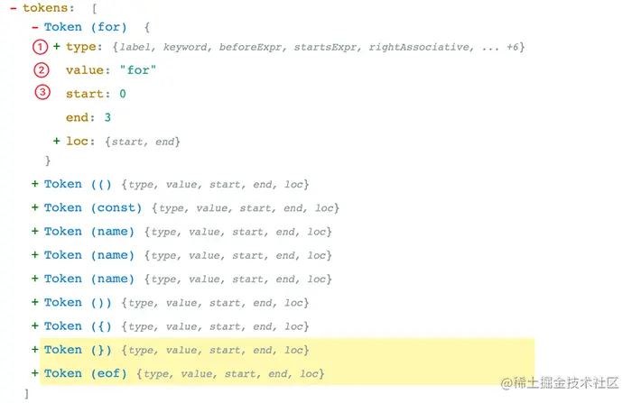

从上图可以看，每个 Token 中包含了语法片段、位置信息、以及一些类型信息. 这些信息有助于后续的语法分析。

2. 语法解析(Syntactic Analysis)：这个阶段语法解析器(Parser)会把Tokens转换为抽象语法树(Abstract Syntax Tree，AST)
什么是AST?

它就是一棵'对象树'，用来表示代码的语法结构，例如console.log('hello world')会解析成为:

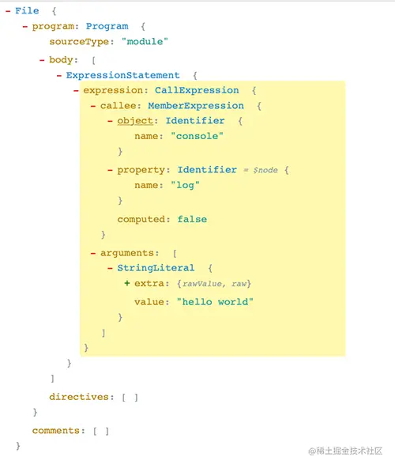

Program、CallExpression、Identifier 这些都是节点的类型，每个节点都是一个有意义的语法单元。 这些节点类型定义了一些属性来描述节点的信息。
JavaScript的语法越来越复杂，而且 Babel 除了支持最新的JavaScript规范语法, 还支持 JSX、Flow、现在还有Typescript。想象一下 AST 的节点类型有多少，其实我们不需要去记住这么多类型、也记不住. 插件开发者会利用 ASTExplorer 来审查解析后的AST树, 非常强大。
AST 是 Babel 转译的核心数据结构，后续的操作都依赖于 AST。

接着就是**转换**(Transform)了，转换阶段会对 AST 进行遍历，在这个过程中对节点进行增删查改。Babel 所有插件都是在这个阶段工作, 比如语法转换、代码压缩。

Javascript In Javascript Out, 最后阶段还是要把 AST 转换回字符串形式的Javascript，同时这个阶段还会生成Source Map。

[Source Map 是一种 .map 结尾的文件类型，主要的作用是记录和源码有关的位置信息。
Sourcemap（源代码映射）用于将生产环境中的压缩代码映射回原始的源代码。在前端开发过程中，JavaScript、CSS 和其他文件通常会被压缩和混淆，以减小文件大小和提高网站加载速度。然而，这会让调试和错误定位变得困难，因为生产环境中的代码难以阅读和理解。
Sourcemap 的作用是在开发和生产环境之间建立一个桥梁，使开发人员能够在浏览器中查看、调试和分析原始代码，而不是压缩后的代码。这对于错误追踪、性能分析和调试非常有帮助。
Sourcemap 通常以一个单独的文件形式存在，它包含了压缩文件和原始文件之间的映射信息。这些映射信息包括每个源代码文件的位置和行列号。浏览器的开发者工具可以读取这些映射文件，从而在调试过程中显示原始的、未压缩的代码。]

### Babel 的架构

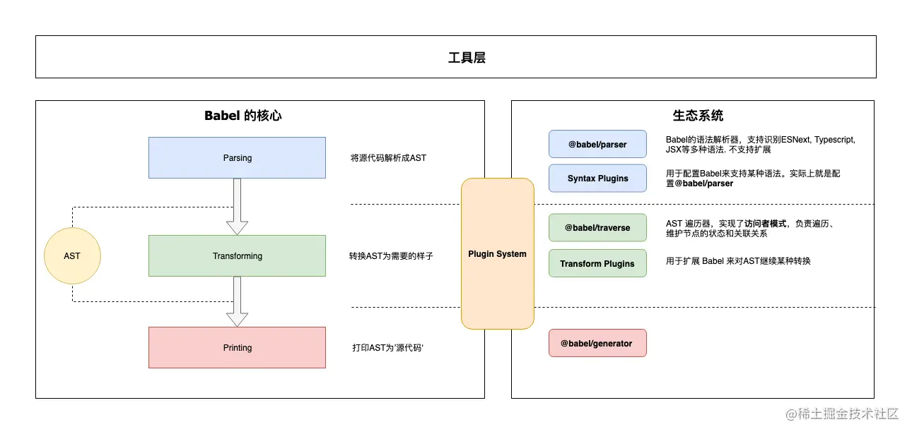

1. 核心:
    @babel/core 这也是上面说的‘微内核’架构中的‘内核’。对于Babel来说，这个内核主要干这些事情：

    加载和处理配置(config)
    加载插件
    调用 Parser 进行语法解析，生成 AST
    调用 Traverser 遍历AST，并使用访问者模式应用'插件'对 AST 进行转换
    生成代码，包括SourceMap转换和源代码生成

2. 核心周边支撑

    - Parser(@babel/parser)： 将源代码解析为 AST 就靠它了。 它已经内置支持很多语法. 例如 JSX、Typescript、Flow、以及最新的ECMAScript规范。目前为了执行效率，parser是不支持扩展的，由官方进行维护。如果你要支持自定义语法，可以 fork 它，不过这种场景非常少。

    - Traverser(@babel/traverse)：  实现了访问者模式，对 AST 进行遍历，转换插件会通过它获取感兴趣的AST节点，对节点继续操作, 下文会详细介绍访问器模式。

    - Generator(@babel/generator)： 将 AST 转换为源代码，支持 SourceMap

3. 插件
打开 Babel 的源代码，会发现有好几种类型的‘插件’。

    - 语法插件(@babel/plugin-syntax-*)：上面说了 @babel/parser 已经支持了很多 JavaScript 语法特性，Parser也不支持扩展. 因此plugin-syntax-*实际上只是用于开启或者配置Parser的某个功能特性。
    一般用户不需要关心这个，Transform 插件里面已经包含了相关的plugin-syntax-*插件了。用户也可以通过parserOpts配置项来直接配置 Parser

    - 转换插件： 用于对 AST 进行转换, 实现转换为ES5代码、压缩、功能增强等目的. Babel仓库将转换插件划分为两种(只是命名上的区别)：
        - @babel/plugin-transform-*： 普通的转换插件
        - @babel/plugin-proposal-*： 还在'提议阶段'(非正式)的语言特性, 目前有这些

    - 预定义集合(@babel/presets-*)： 插件集合或者分组，主要方便用户对插件进行管理和使用。比如preset-env含括所有的标准的最新特性; 再比如preset-react含括所有react相关的插件.

4. 插件开发辅助
    - @babel/template： 某些场景直接操作AST太麻烦，就比如我们直接操作DOM一样，所以Babel实现了这么一个简单的模板引擎，可以将字符串代码转换为AST。比如在生成一些辅助代码(helper)时会用到这个库
    - @babel/types： AST 节点构造器和断言. 插件开发时使用很频繁
    - @babel/helper-*： 一些辅助器，用于辅助插件开发，例如简化AST操作
    - @babel/helper： 辅助代码，单纯的语法转换可能无法让代码运行起来，比如低版本浏览器无法识别class关键字，这时候需要添加辅助代码，对class进行模拟。

5️. 工具
    - @babel/node： Node.js CLI, 通过它直接运行需要 Babel 处理的JavaScript文件
    - @babel/register： Patch NodeJs 的require方法，支持导入需要Babel处理的JavaScript模块
    - @babel/cli： CLI工具

## 设计模式

<https://juejin.cn/post/6844904138707337229#heading-9>

### 策略模式

定义 : 要实现某一个功能，有多种方案可以选择。我们定义策略，把它们一个个封装起来，并且使它们可以相互转换。
当你负责的模块，基本满足以下情况时

- 各判断条件下的策略相互独立且可复用
- 策略内部逻辑相对复杂
- 策略需要灵活组合
  
### 观察者模式

 当对象之间存在一对多的依赖关系时，其中一个对象的状态发生改变，所有依赖它的对象都会收到通知，这就是观察者模式。
在观察者模式中，只有两种主体：目标对象 (Object) 和 观察者 (Observer)。

目标对象 Subject:

- 维护观察者列表 observerList ———— 维护拥有订阅权限的观察者列表
- 定义添加观察者的方法 ———— 提供观察者拥有订阅权限的功能
- 当自身发生变化后，通过调用自己的 notify 方法依次通知每个观察者执行 update 方法———— 发布对应任务后通知有订阅权限的对象

观察者 Observer

- 需要实现 update 方法，供目标对象调用。update方法中可以执行自定义的业务逻辑 ———— 弟子们需要定义接收任务通知后的方法，例如去抢任务或任务不适合，继续等待下一个任务

### 发布-订阅模式

发布-订阅是一种消息范式，消息的发布者，不会将消息直接发送给特定的订阅者，而是通过消息通道广播出去，然后呢，订阅者通过订阅获取到想要的消息。

因此发布订阅模式与观察者模式相比，发布订阅模式中有三个角色，发布者 Publisher ，事件调度中心 Event Channel ，订阅者 Subscriber 。

```js
const EventEmit = function() {
  this.events = {};
  this.on = function(name, cb) {
    if (this.events[name]) {
      this.events[name].push(cb);
    } else {
      this.events[name] = [cb];
    }
  };
  this.trigger = function(name, ...arg) {
    if (this.events[name]) {
      this.events[name].forEach(eventListener => {
        eventListener(...arg);
      });
    }
  };
};
```

当你负责的模块，基本满足以下情况时

- 各模块相互独立
- 存在一对多的依赖关系
- 依赖模块不稳定、依赖关系不稳定
- 各模块由不同的人员、团队开发

**观察者模式和发布订阅模式的区别**
是否存在第三方
发布者是否可以直接与订阅者通信

### 装饰器模式

适配器模式
**代理模式**
责任链模式

## Cookie、Session、Token、JWT

<https://juejin.cn/post/6844904034181070861>

### 认证/授权/凭证

1. **认证（Authentication）**

- 通俗地讲就是验证当前用户的身份，证明“你是你自己”（比如：你每天上下班打卡，都需要通过指纹打卡，当你的指纹和系统里录入的指纹相匹配时，就打卡成功）
- 互联网中的认证：
  - 用户名密码登录
  - 邮箱发送登录链接
  - 手机号接收验证码
  - 只要你能收到邮箱/验证码，就默认你是账号的主人

2. **授权（Authorization）**

- 用户授予第三方应用访问该用户某些资源的权限
  - 你在安装手机应用的时候，APP 会询问是否允许授予权限（访问相册、地理位置等权限）
  - 你在访问微信小程序时，当登录时，小程序会询问是否允许授予权限（获取昵称、头像、地区、性别等个人信息）
- 实现授权的方式有：cookie、session、token、OAuth

3. **凭证（Credentials）**

- 实现认证和授权的前提是需要一种媒介（证书） 来标记访问者的身份
  - 在现实生活中，每个人都会有一张专属的居民身份证，是用于证明持有人身份的一种法定证件。通过身份证，我们可以办理手机卡/银行卡/个人贷款/交通出行等等，这就是认证的凭证。
  - 在互联网应用中，一般网站会有两种模式，游客模式和登录模式。游客模式下，可以正常浏览网站上面的文章，一旦想要点赞/收藏/分享文章，就需要登录或者注册账号。当用户登录成功后，服务器会给该用户使用的浏览器颁发一个令牌（token），这个令牌用来表明你的身份，每次浏览器发送请求时会带上这个令牌，就可以使用游客模式下无法使用的功能。

### Cookie

- HTTP 是无状态的协议（对于事务处理没有记忆能力，每次客户端和服务端会话完成时，服务端不会保存任何会话信息）：每个请求都是完全独立的，服务端无法确认当前访问者的身份信息，无法分辨上一次的请求发送者和这一次的发送者是不是同一个人。所以服务器与浏览器为了进行会话跟踪（知道是谁在访问我），就必须主动的去维护一个状态，这个状态用于告知服务端前后两个请求是否来自同一浏览器。而这个状态需要通过 cookie 或者 session 去实现。
- cookie 存储在客户端： cookie 是服务器发送到用户浏览器并保存在本地的一小块数据，它会在浏览器下次向同一服务器再发起请求时被携带并发送到服务器上。
- cookie 是不可跨域的： 每个 cookie 都会绑定单一的域名，无法在别的域名下获取使用，一级域名和二级域名之间是允许共享使用的（靠的是 domain）。

**maxAge**
cookie 失效的时间，单位秒。如果为整数，则该 cookie 在 maxAge 秒后失效。如果为负数，该 cookie 为临时 cookie ，关闭浏览器即失效，浏览器也不会以任何形式保存该 cookie 。如果为 0，表示删除该 cookie 。默认为 -1。- 比 expires 好用。

**expires**
过期时间，在设置的某个时间点后该 cookie 就会失效。
一般浏览器的 cookie 都是默认储存的，当关闭浏览器结束这个会话的时候，这个 cookie 也就会被删除

**secure**
该 cookie 是否仅被使用安全协议传输。安全协议有 HTTPS，SSL等，在网络上传输数据之前先将数据加密。默认为false。
当 secure 值为 true 时，cookie 在 HTTP 中是无效，在 HTTPS 中才有效。

**httpOnly**
如果给某个 cookie 设置了 httpOnly 属性，则无法通过 JS 脚本 读取到该 cookie 的信息，但还是能通过 Application 中手动修改 cookie，所以只是在一定程度上可以防止 XSS 攻击，不是绝对的安全

### Session

- session 是另一种记录服务器和客户端会话状态的机制
- session 是基于 cookie 实现的，session 存储在服务器端，sessionId 会被存储到客户端的cookie 中
- session 认证流程：
  - 用户第一次请求服务器的时候，服务器根据用户提交的相关信息，创建对应的 Session
  - 请求返回时将此 Session 的唯一标识信息 SessionID 返回给浏览器
  - 浏览器接收到服务器返回的 SessionID 信息后，会将此信息存入到 Cookie 中，同时 Cookie 记录此 SessionID 属于哪个域名
  - 当用户第二次访问服务器的时候，请求会自动判断此域名下是否存在 Cookie 信息，如果存在自动将 Cookie 信息也发送给服务端，服务端会从 Cookie 中获取 SessionID，再根据 SessionID 查找对应的 Session 信息，如果没有找到说明用户没有登录或者登录失效，如果找到 Session 证明用户已经登录可执行后面操作。

**SessionID 是连接 Cookie 和 Session 的一道桥梁，大部分系统也是根据此原理来验证用户登录状态。**

### Cookie 和 Session 的区别

- 安全性： Session 比 Cookie 安全，Session 是存储在服务器端的，Cookie 是存储在客户端的。
- 存取值的类型不同：Cookie 只支持存字符串数据，想要设置其他类型的数据，需要将其转换成字符串，Session 可以存任意数据类型。
- 有效期不同： Cookie 可设置为长时间保持，比如我们经常使用的默认登录功能，Session 一般失效时间较短，客户端关闭（默认情况下）或者 Session 超时都会失效。
- 存储大小不同： 单个 Cookie 保存的数据不能超过 4K，Session 可存储数据远高于 Cookie，但是当访问量过多，会占用过多的服务器资源。

### Token

#### Acesss Token

- 访问资源接口（API）时所需要的资源凭证
- 简单 token 的组成： uid(用户唯一的身份标识)、time(当前时间的时间戳)、sign（签名，token 的前几位以哈希算法压缩成的一定长度的十六进制字符串）
- 特点：
  - 服务端无状态化、可扩展性好
  - 支持移动端设备
  - 安全
  - 支持跨程序调用

token 的身份验证流程：


1. 客户端使用用户名跟密码请求登录
2. 服务端收到请求，去验证用户名与密码
3. 验证成功后，服务端会签发一个 token 并把这个 token 发送给客户端
4. 客户端收到 token 以后，会把它存储起来，比如放在 cookie 里或者 localStorage 里
5. 客户端每次向服务端请求资源的时候需要带着服务端签发的 token
6. 服务端收到请求，然后去验证客户端请求里面带着的 token ，如果验证成功，就向客户端返回请求的数据

- 每一次请求都需要携带 token，需要把 token 放到 HTTP 的 Header 里
- 基于 token 的用户认证是一种服务端无状态的认证方式，服务端不用存放 token 数据。用解析 token 的计算时间换取 session 的存储空间，从而减轻服务器的压力，减少频繁的查询数据库
- token 完全由应用管理，所以它可以避开同源策略

#### Refresh Token(TOKEN过期)

refresh token 是专用于刷新 access token 的 token。如果没有 refresh token，也可以刷新 access token，但每次刷新都要用户输入登录用户名与密码，会很麻烦。有了 refresh token，可以减少这个麻烦，客户端直接用 refresh token 去更新 access token，无需用户进行额外的操作。


- Access Token 的有效期比较短，当 Acesss Token 由于过期而失效时，使用 Refresh Token 就可以获取到新的 Token，如果 Refresh Token 也失效了，用户就只能重新登录了。
- Refresh Token 及过期时间是存储在服务器的数据库中，只有在申请新的 Acesss Token 时才会验证，不会对业务接口响应时间造成影响，也不需要向 Session 一样一直保持在内存中以应对大量的请求。

### Token 和 Session 的区别

- Session 是一种记录服务器和客户端会话状态的机制，使服务端有状态化，可以记录会话信息。而 Token 是令牌，访问资源接口（API）时所需要的资源凭证。Token 使服务端无状态化，不会存储会话信息。
- Session 和 Token 并不矛盾，作为身份认证 Token 安全性比 Session 好，因为每一个请求都有签名还能防止监听以及重放攻击，而 Session 就必须依赖链路层来保障通讯安全了。如果你需要实现有状态的会话，仍然可以增加 Session 来在服务器端保存一些状态。
- 所谓 Session 认证只是简单的把 User 信息存储到 Session 里，因为 SessionID 的不可预测性，暂且认为是安全的。而 Token ，如果指的是 OAuth Token 或类似的机制的话，提供的是 认证 和 授权 ，认证是针对用户，授权是针对 App 。其目的是让某 App 有权利访问某用户的信息。这里的 Token 是唯一的。不可以转移到其它 App上，也不可以转到其它用户上。Session 只提供一种简单的认证，即只要有此 SessionID ，即认为有此 User 的全部权利。是需要严格保密的，这个数据应该只保存在站方，不应该共享给其它网站或者第三方 App。所以简单来说：如果你的用户数据可能需要和第三方共享，或者允许第三方调用 API 接口，用 Token 。如果永远只是自己的网站，自己的 App，用什么就无所谓了。
- 通过js代码写入Local Storage，通过js获取，并不会像cookie一样自动携带

### JWT

- JSON Web Token（简称 JWT）是目前最流行的跨域认证解决方案。
- 是一种认证授权机制。
- JWT 是为了在网络应用环境间传递声明而执行的一种基于 JSON 的开放标准（RFC 7519）。JWT 的声明一般被用来在身份提供者和服务提供者间传递被认证的用户身份信息，以便于从资源服务器获取资源。比如用在用户登录上。
- 可以使用 HMAC 算法或者是 RSA 的公/私秘钥对 JWT 进行签名。因为数字签名的存在，这些传递的信息是可信的。

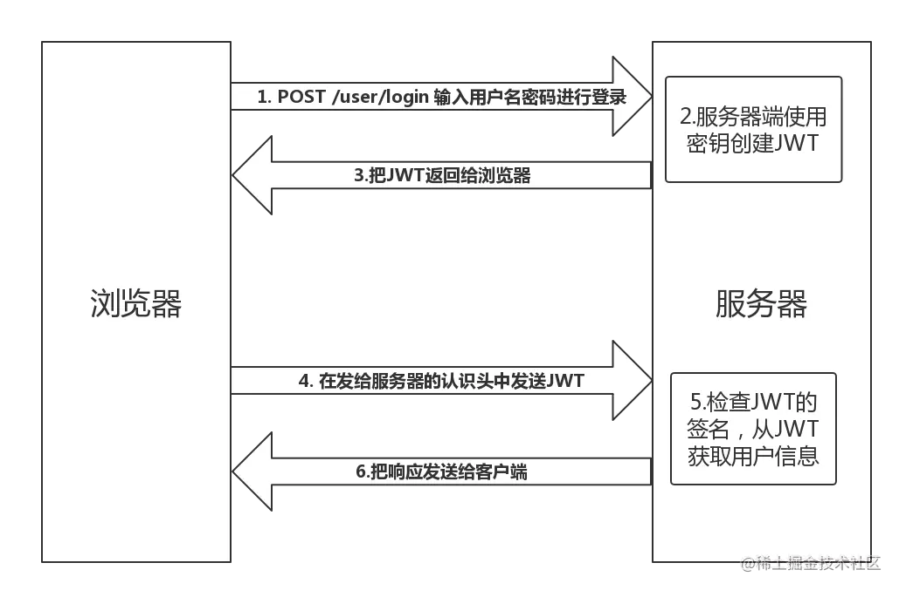

JWT 认证流程：

- 用户输入用户名/密码登录，服务端认证成功后，会返回给客户端一个 JWT
- 客户端将 token 保存到本地（通常使用 localstorage，也可以使用 cookie）
- 当用户希望访问一个受保护的路由或者资源的时候，需要请求头的 Authorization 字段中使用Bearer 模式添加 JWT，其内容看起来是下面这样

```js
Authorization: Bearer <token>
```

- 服务端的保护路由将会检查请求头 Authorization 中的 JWT 信息，如果合法，则允许用户的行为
- 因为 JWT 是自包含的（内部包含了一些会话信息），因此减少了需要查询数据库的需要
- 因为 JWT 并不使用 Cookie 的，所以你可以使用任何域名提供你的 API 服务而不需要担心跨域资源共享问题（CORS）
- 因为用户的状态不再存储在服务端的内存中，所以这是一种无状态的认证机制

#### JWT 的使用方式

客户端收到服务器返回的 JWT，可以储存在 Cookie 里面，也可以储存在 localStorage。

1. 当用户希望访问一个受保护的路由或者资源的时候，可以把它放在 Cookie 里面自动发送，但是这样不能跨域，所以更好的做法是放在 HTTP 请求头信息的 Authorization 字段里，使用 Bearer 模式添加 JWT。

```js
GET /calendar/v1/events
Host: api.example.com
Authorization: Bearer <token>
```

- 用户的状态不会存储在服务端的内存中，这是一种 **无状态的认证机制**
- 服务端的保护路由将会检查请求头 Authorization 中的 JWT 信息，如果合法，则允许用户的行为。
- 由于 JWT 是自包含的，因此减少了需要查询数据库的需要
- JWT 的这些特性使得我们可以完全依赖其无状态的特性提供数据 API 服务，甚至是创建一个下载流服务。
- 因为 JWT 并不使用 Cookie ，所以你可以使用任何域名提供你的 API 服务而**不需要担心跨域资源共享问题（CORS）**

2. 跨域的时候，可以把 JWT 放在 POST 请求的数据体里。
3. 通过 URL 传输

```js
http://www.example.com/user?token=xxx
```

### Token 和 JWT 的区别

相同：

- 都是访问资源的令牌
- 都可以记录用户的信息
- 都是使服务端无状态化
- 都是只有验证成功后，客户端才能访问服务端上受保护的资源

区别：

- Token：服务端验证客户端发送过来的 Token 时，还需要查询数据库获取用户信息，然后验证 Token 是否有效。
- JWT： 将 Token 和 Payload 加密后存储于客户端，服务端只需要使用密钥解密进行校验（校验也是 JWT 自己实现的）即可，不需要查询或者减少查询数据库，因为 JWT 自包含了用户信息和加密的数据。

## Cookie、LocalStorage、sessionStorage与IndexedDB

### sessionStorage

- 会话级别的浏览器存储
- 大小为5M左右
- 仅在客户端使用，不和服务端进行通信
- 接口封装较好

sessionStorage保存的数据用于浏览器的一次会话，当会话结束（通常是该窗口关闭），数据被清空；sessionStorage 特别的一点在于，即便是相同域名下的两个页面，只要它们不在同一个浏览器窗口中打开，那么它们的 sessionStorage 内容便无法共享；localStorage 在所有同源窗口中都是共享的；cookie也是在所有同源窗口中都是共享的。除了保存期限的长短不同，SessionStorage的属性和方法与LocalStorage完全一样。

### LocalStorage

- 保存的数据长期存在，下一次访问该网站的时候，网页可以直接读取以前保存的数据。
- 大小为5M左右
- 仅在客户端使用，不和服务端进行通信
- 接口封装较好
- localStorage保存的数据，以“键值对”的形式存在。也就是说，每一项数据都有一个键名和对应的值。所有的数据都是以文本格式保存。

基于上面的特点，LocalStorage可以作为浏览器本地缓存方案，用来提升网页首屏渲染速度(根据第一请求返回时，将一些不变信息直接存储在本地)。
存入数据使用setItem方法。它接受两个参数，第一个是键名，第二个是保存的数据。
读取数据使用getItem方法。它只有一个参数，就是键名。

```js
localStorage.setItem("key","value");
var valueLocal = localStorage.getItem("key");
```

### sessionStorage 、localStorage 和 cookie 之间的区别

共同点：都是保存在浏览器端，且都遵循同源策略。
不同点：在于生命周期与作用域的不同

作用域：localStorage只要在相同的协议、相同的主机名、相同的端口下，就能读取/修改到同一份localStorage数据。sessionStorage比localStorage更严苛一点，除了协议、主机名、端口外，还要求在同一窗口（也就是浏览器的标签页）下
生命周期：localStorage 是持久化的本地存储，存储在其中的数据是永远不会过期的，使其消失的唯一办法是手动删除；而 sessionStorage 是临时性的本地存储，它是会话级别的存储，当会话结束（页面被关闭）时，存储内容也随之被释放。

Web Storage 是一个从定义到使用都非常简单的东西。它使用键值对的形式进行存储，这种模式有点类似于对象，却甚至连对象都不是——它只能存储字符串，要想得到对象，我们还需要先对字符串进行一轮解析。
说到底，Web Storage 是对 Cookie 的拓展，它只能用于存储少量的简单数据。当遇到大规模的、结构复杂的数据时，Web Storage 也爱莫能助了。这时候我们就需要IndexedDB

### IndexedDB

IndexedDB 是一种低级API，用于客户端存储大量结构化数据(包括文件和blobs)。该API使用索引来实现对该数据的高性能搜索。IndexedDB 是一个运行在浏览器上的非关系型数据库。理论上来说，IndexedDB 是没有存储上限的（一般来说不会小于 250M）。它不仅可以存储字符串，还可以存储二进制数据。

#### IndexedDB的特点

- 键值对储存
- 异步
  - IndexedDB 操作时不会锁死浏览器，用户依然可以进行其他操作，这与 LocalStorage 形成对比，后者的操作是同步的。异步设计是为了防止大量数据的读写，拖慢网页的表现。
- 支持事务
  - IndexedDB 支持事务（transaction），这意味着一系列操作步骤之中，只要有一步失败，整个事务就都取消，数据库回滚到事务发生之前的状态，不存在只改写一部分数据的情况。
- 同源限制
  - IndexedDB 受到同源限制，每一个数据库对应创建它的域名。网页只能访问自身域名下的数据库，而不能访问跨域的数据库。
- 储存空间大
  - IndexedDB 的储存空间比 LocalStorage 大得多，一般来说不少于 250MB，甚至没有上限。
- 支持二进制储存
  IndexedDB 不仅可以储存字符串，还可以储存二进制数据

#### IndexedDB的常见操作

在IndexedDB大部分操作并不是我们常用的调用方法，返回结果的模式，而是请求——响应的模式。

1. 建立打开IndexedDB ----window.indexedDB.open("testDB")
这条指令并不会返回一个DB对象的句柄，我们得到的是一个IDBOpenDBRequest对象，而我们希望得到的DB对象在其result属性中
除了result，IDBOpenDBRequest接口定义了几个重要属性:
onerror: 请求失败的回调函数句柄
onsuccess:请求成功的回调函数句柄
onupgradeneeded:请求数据库版本变化句柄

```js
<script>
    function openDB(name) {
        var request = window.indexedDB.open(name); //建立打开IndexedDB
        request.onerror = function(e) {
            console.log("open indexdb error");
        };
        request.onsuccess = function(e) {
            myDB.db = e.target.result; //这是一个 IDBDatabase对象，这就是IndexedDB对象
            console.log(myDB.db); //此处就可以获取到db实例
        };
    }
    var myDB = {
        name: "testDB",
        version: "1",
        db: null
    };
    openDB(myDB.name);
</script>
```

2. 关闭IndexedDB----indexdb.close()
3. 删除IndexedDB----window.indexedDB.deleteDatabase(indexdb)

## http http2 http3

### HTTP的基本优化

影响一个 HTTP 网络请求的因素主要有两个：带宽和延迟。

- 带宽：如果说我们还停留在拨号上网的阶段，带宽可能会成为一个比较严重影响请求的问题，但是现网络基础建设已经使得带宽得到极大的提升，我们不再会担心由带宽而影响网速，那么就只剩下延了。

- 延迟：
  - 浏览器阻塞（HOL blocking）：浏览器会因为一些原因阻塞请求。浏览器对于同一个域名，同时只能有 4 个连接（这个根据浏览器内核不同可能会有所差异），超过浏览器最大连接数限制，后续请求就会被阻塞。
  - DNS 查询（DNS Lookup）：浏览器需要知道目标服务器的 IP 才能建立连接。将域名解析为 IP 的这个系统就是 DNS。这个通常可以利用DNS缓存结果来达到减少这个时间的目的。
  - 建立连接（Initial connection）：HTTP 是基于 TCP 协议的，浏览器最快也要在第三次握手时才能捎带 HTTP 请求报文，达到真正的建立连接，但是这些连接无法复用会导致每次请求都经历三次握手和慢启动。三次握手在高延迟的场景下影响较明显，慢启动则对文件类大请求影响较大。

### HTTP1.0和HTTP1.1的一些区别

- **缓存处理**，在HTTP1.0中主要使用header里的If-Modified-Since,Expires来做为缓存判断的标准，HTTP1.1则引入了更多的缓存控制策略例如Entity tag，If-Unmodified-Since, If-Match, If-None-Match等更多可供选择的缓存头来控制缓存策略。

- **带宽优化及网络连接的使用**，HTTP1.0中，存在一些浪费带宽的现象，例如客户端只是需要某个对象的一部分，而服务器却将整个对象送过来了，并且不支持断点续传功能，HTTP1.1则在请求头引入了range头域，它允许只请求资源的某个部分，即返回码是206（Partial Content），这样就方便了开发者自由的选择以便于充分利用带宽和连接。

- **错误通知的管理**，在HTTP1.1中新增了24个错误状态响应码，如409（Conflict）表示请求的资源与资源的当前状态发生冲突；410（Gone）表示服务器上的某个资源被永久性的删除。

- **Host头处理**，在HTTP1.0中认为每台服务器都绑定一个唯一的IP地址，因此，请求消息中的URL并没有传递主机名（hostname）。但随着虚拟主机技术的发展，在一台物理服务器上可以存在多个虚拟主机（Multi-homed Web Servers），并且它们共享一个IP地址。HTTP1.1的请求消息和响应消息都应支持Host头域，且请求消息中如果没有Host头域会报告一个错误（400 Bad Request）。
  
- **长连接**，HTTP 1.1支持长连接（PersistentConnection）和请求的流水线（Pipelining）处理，在一个TCP连接上可以传送多个HTTP请求和响应，减少了建立和关闭连接的消耗和延迟，在HTTP1.1中默认开启Connection： keep-alive，一定程度上弥补了HTTP1.0每次请求都要创建连接的缺点。

### HTTPS与HTTP的一些区别

- HTTPS协议需要到CA申请证书，一般免费证书很少，需要交费。
- HTTP协议运行在TCP之上，所有传输的内容都是明文，HTTPS运行在SSL/TLS之上，SSL/TLS运行在TCP之上，所有传输的内容都经过加密的。
- HTTP和HTTPS使用的是完全不同的连接方式，用的端口也不一样，前者是80，后者是443。
- HTTPS可以有效的防止运营商劫持，解决了防劫持的一个大问题。

#### HTTP发展到1.1存在有哪些问题

- 线头阻塞：TCP连接上只能发送一个请求，前面的请求未完成前，后续的请求都在排队等待。
多个TCP连接
- 虽然HTTP/1.1管线化可以支持请求并发，但是浏览器很难实现，chrome、firefox等都禁用了管线化。所以1.1版本请求并发依赖于多个TCP连接，建立TCP连接成本很高，还会存在慢启动的问题。
- 头部冗余，采用文本格式
- HTTP/1.X版本是采用文本格式，首部未压缩，而且每一个请求都会带上cookie、user-agent等完全相同的首部。
客户端需要主动请求

### HTTP2.0和HTTP1.X相比的新特性

- **新的二进制格式（Binary Format）**，HTTP1.x的解析是基于文本。基于文本协议的格式解析存在天然缺陷，文本的表现形式有多样性，要做到健壮性考虑的场景必然很多，二进制则不同，只认0和1的组合。基于这种考虑HTTP2.0的协议解析决定采用二进制格式，实现方便且健壮。

- **多路复用（MultiPlexing）**，即连接共享，即每一个request都是是用作连接共享机制的。在HTTP1.1中，浏览器客户端在同一时间，针对同一域名下的请求有一定数量的限制。超过限制数目的请求会被阻塞。而HTTP2.0中的多路复用优化了这一性能。一个request对应一个id，这样一个连接上可以有多个request，每个连接的request可以随机的混杂在一起，接收方可以根据request的 id将request再归属到各自不同的服务端请求里面。
  - 多路复用对性能优化工作的贡献
    - 可以并行交错的发送请求和响应，这些请求和响应之间互不影响
    - 只使用一个链接即可并行发送多个请求和响应
    - 消除不必要的延迟，从而减少页面加载的时间
    - 不必再为绕过HTTP1.x限制而多做很多工作

- **头部压缩**，如上文中所言，对前面提到过HTTP1.x的header带有大量信息，而且每次都要重复发送，HTTP2.0使用encoder来减少需要传输的header大小，通讯双方各自cache一份header fields表，既避免了重复header的传输，又减小了需要传输的大小。

- **服务端推送**（server push），同SPDY一样，HTTP2.0也具有server push功能。

### HTTP3

虽然 HTTP/2 解决了很多之前旧版本的问题，但是它还是存在一个巨大的问题，主要是底层支撑的 TCP 协议造成的。HTTP/2的缺点主要有以下几点：

- TCP 以及 TCP+TLS建立连接的延时

  HTTP/2使用TCP协议来传输的，而如果使用HTTPS的话，还需要使用TLS协议进行安全传输，而使用TLS也需要一个握手过程，这样就需要有两个握手延迟过程：

  1. 在建立TCP连接的时候，需要和服务器进行三次握手来确认连接成功，也就是说需要在消耗完1.5个RTT之后才能进行数据传输。
  2. 进行TLS连接，TLS有两个版本——TLS1.2和TLS1.3，每个版本建立连接所花的时间不同，大致是需要1~2个RTT。
总之，在传输数据之前，我们需要花掉 3～4 个 RTT。

- TCP的队头阻塞并没有彻底解决
  上文我们提到在HTTP/2中，多个请求是跑在一个TCP管道中的。但当出现了丢包时，HTTP/2 的表现反倒不如 HTTP/1 了。因为TCP为了保证可靠传输，有个特别的“丢包重传”机制，丢失的包必须要等待重新传输确认，HTTP/2出现丢包时，整个 TCP 都要开始等待重传，那么就会阻塞该TCP连接中的所有请求

Google 在推SPDY的时候就已经意识到了这些问题，于是就另起炉灶搞了一个基于 UDP 协议的“QUIC”协议，让HTTP跑在QUIC上而不是TCP上。
而这个“HTTP over QUIC”就是HTTP协议的下一个大版本，HTTP/3。它在HTTP/2的基础上又实现了质的飞跃，真正“完美”地解决了“队头阻塞”问题。
QUIC 虽然基于 UDP，但是在原本的基础上新增了很多功能，接下来我们重点介绍几个QUIC新功能。不过HTTP/3目前还处于草案阶段，正式发布前可能会有变动，所以本文尽量不涉及那些不稳定的细节。

#### QUIC新功能

上面我们提到QUIC基于UDP，而UDP是“无连接”的，根本就不需要“握手”和“挥手”，所以就比TCP来得快。此外QUIC也实现了可靠传输，保证数据一定能够抵达目的地。它还引入了类似HTTP/2的“流”和“多路复用”，单个“流"是有序的，可能会因为丢包而阻塞，但其他“流”不会受到影响。具体来说QUIC协议有以下特点：

- 实现了类似TCP的流量控制、传输可靠性的功能。
  虽然UDP不提供可靠性的传输，但QUIC在UDP的基础之上增加了一层来保证数据可靠性传输。它提供了数据包重传、拥塞控制以及其他一些TCP中存在的特性。

- 实现了快速握手功能。
  由于QUIC是基于UDP的，所以QUIC可以实现使用0-RTT或者1-RTT来建立连接，这意味着QUIC可以用最快的速度来发送和接收数据，这样可以大大提升首次打开页面的速度。0RTT 建连可以说是 QUIC 相比 HTTP2 最大的性能优势。

- 集成了TLS加密功能。
  目前QUIC使用的是TLS1.3，相较于早期版本TLS1.3有更多的优点，其中最重要的一点是减少了握手所花费的RTT个数。

- 多路复用，彻底解决TCP中队头阻塞的问题
  和TCP不同，QUIC实现了在同一物理连接上可以有多个独立的逻辑数据流（如下图）。实现了数据流的单独传输，就解决了TCP中队头阻塞的问题。
  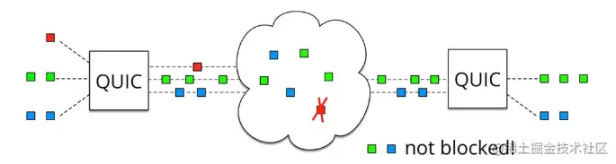

### 总结

- HTTP/1.1有两个主要的缺点：安全不足和性能不高。
- HTTP/2完全兼容HTTP/1，是“更安全的HTTP、更快的HTTPS"，头部压缩、多路复用等技术可以充分利用带宽，降低延迟，从而大幅度提高上网体验；
- QUIC 基于 UDP 实现，是 HTTP/3 中的底层支撑协议，该协议基于 UDP，又取了 TCP 中的精华，实现了即快又可靠的协议

## npm/pnpm/yarn

<https://juejin.cn/post/7127295203177676837#heading-0>
<https://juejin.cn/post/7060844948316225572>

### npm

其实在最早期的npm版本(npm v2)，npm的设计可以说是非常的简单,在安装依赖的时候会将依赖放到 node_modules文件中; 同时,如果某个直接依赖A依赖于其他的依赖包B,那么依赖B会作为间接依赖,安装到依赖A的文件夹node_modules中,然后可能多个包之间也会有出现同样的依赖递归的,如果项目一旦过大,那么必然会形成一棵巨大的依赖树，依赖包会出现重复,形成嵌套地狱。

那么这样的重复问题会带来什么后果呢？

首先,会使得安装的结果占据了大量的空间资源,造成了资源的浪费
同时,因为安装的依赖重复,会造成在安装依赖时,安装时间过长
甚至是,因为目录层级过深,导致文件路径过长,会在windows系统下删除node_modules文件,出现删除不掉的情况
 windows 的文件路径最长是 260 多个字符，这样嵌套是会超过 windows 路径的长度限制的。

#### npm的安装机制

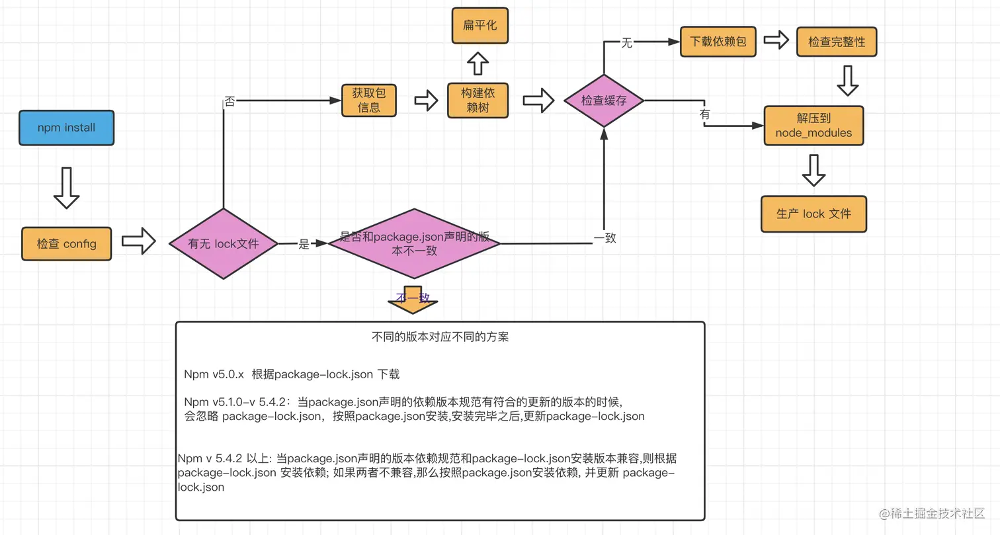
npm install执行之后, 首先会检查和获取 npm的配置,这里的优先级为:
项目级的.npmrc文件 > 用户级的 .npmrc文件 > 全局级的 .npmrc > npm内置的 .npmrc 文件
然后检查项目中是否有 package-lock.json文件

- 如果有, 检查 package-lock.json和 package.json声明的依赖是否一致：
  - 一致, 直接使用package-lock.json中的信息,从网络或者缓存中加载依赖
  - 不一致, 根据上述流程中的不同版本进行处理

- 如果没有, 那么会根据package.json递归构建依赖树,然后就会根据构建好的依赖去下载完整的依赖资源,在下载的时候,会检查有没有相关的资源缓存:
  - 存在, 直接解压到node_modules文件中
  - 不存在, 从npm远端仓库下载包,校验包的完整性,同时添加到缓存中,解压到 node_modules中

最后, 生成 package-lock.json 文件

### yarn

yarn 是一个由Facebook、Google、Exponent和Tilde构建的新的JavaScript包管理器。它的出现是为了解决历史上npm的某些不足(比如npm对于依赖的完整性和一致性的保证,以及npm安装过程中速度很慢的问题)

当npm还处于v3时期的时候,一个叫yarn的包管理工具横空出世.在2016年, npm还没有package-lock.json文件,安装的时候速度很慢,稳定性很差,yarn的出现很好的解决了一下的一些问题:

- 确定性: 通过yarn.lock等机制,即使是不同的安装顺序,相同的依赖关系在任何的环境和容器中,都可以以相同的方式安装。(那么,此时的npm v5之前,并没有package-lock.json机制,只有默认并不会使用 npm-shrinkwrap.json)

- 采用模块扁平化的安装模式: 将不同版本的依赖包,按照一定的策略，归结为单个版本;以避免创建多个版本造成工程的冗余(目前版本的npm也有相同的优化)

- 网络性能更好: yarn采用了请求排队的理念,类似于并发池连接,能够更好的利用网络资源;同时也引入了一种安装失败的重试机制

- 采用缓存机制,实现了离线模式 (目前的npm也有类似的实现)

#### yarn的安装机制

Yarn的安装大致分为5个步骤:

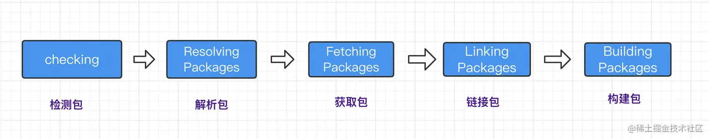

**解决依赖重复很多次，嵌套路径过长的问题**
铺平。所有的依赖不再一层层嵌套了，而是全部在同一层，这样也就没有依赖重复多次的问题了，也就没有路径过长的问题了。
npm 后来升级到 3 之后，也是采用这种铺平的方案了

**扁平化的方案也有相应的问题。**

最主要的一个问题是幽灵依赖，也就是你明明没有声明在 dependencies 里的依赖，但在代码里却可以 require 进来。
这个也很容易理解，因为都铺平了嘛，那依赖的依赖也是可以找到的。
但是这样是有隐患的，因为没有显式依赖，万一有一天别的包不依赖这个包了，那你的代码也就不能跑了，因为你依赖这个包，但是现在不会被安装了。
这就是幽灵依赖的问题。
而且还有一个问题，就是上面提到的依赖包有多个版本的时候，只会提升一个，那其余版本的包不还是复制了很多次么，依然有浪费磁盘空间的问题。
那社区有没有解决这俩问题的思路呢？
当然有，这不是 pnpm 就出来了嘛。
那 pnpm 是怎么解决这俩问题的呢？

### pnpm

回想下 npm3 和 yarn 为什么要做 node_modules 扁平化？不就是因为同样的依赖会复制多次，并且路径过长在 windows 下有问题么？
那如果不复制呢，比如通过 link。
首先介绍下 link，也就是软硬连接，这是操作系统提供的机制，硬连接就是同一个文件的不同引用，而软链接是新建一个文件，文件内容指向另一个路径。当然，这俩链接使用起来是差不多的。
如果不复制文件，只在全局仓库保存一份 npm 包的内容，其余的地方都 link 过去呢？
这样不会有复制多次的磁盘空间浪费，而且也不会有路径过长的问题。因为路径过长的限制本质上是不能有太深的目录层级，现在都是各个位置的目录的 link，并不是同一个目录，所以也不会有长度限制。
没错，pnpm 就是通过这种思路来实现的。

优点：

最大的优点是节省磁盘空间呀，一个包全局只保存一份，剩下的都是软硬连接，这得节省多少磁盘空间呀。

其次就是快，因为通过链接的方式而不是复制，自然会快。

## Git

### git reset 和 git revert

举例

```css
develop ----1      3-----
             \   /
branch a       a
```

#### git reset

develop将a分支合并后，想要不留痕迹的撤回合并。这个时候用git reset就是很好的选择了
具体的操作步骤如下：

切换分支到develop
git log 查看当前分支日志

例如我的日志是这样的

```sql
commit 3
Merge 1 2
Author: admin <admin@163.com>
Date: Wed May 30 15:00:00 2018 +0800

    Merge branch 'feature/a' into 'develop'

    close a

    See merge request !20

commit 2
Author: admin <admin@163.com>
Date: Wed May 30 14:00:00 2018 +0800

    close a

commit 1
Author: admin <admin@163.com>
Date: Wed May 30 13:00:00 2018 +0800
    init project
```

我要将develop回退到合并之前的状态，那就是退到 commit 1这了，将commit号复制下来。退出编辑界面。

**参数定义**

    - soft 回退后a分支修改的代码被保留并标记为add的状态（git status 是绿色的状态）
    - mixed 重置索引，但不重置工作树，更改后的文件标记为未提交（add）的状态。默认操作。
    - hard 重置索引和工作树，并且a分支修改的所有文件和中间的提交，没提交的代码都被丢弃了。
    - merge 和--hard类似，只不过如果在执行reset命令之前你有改动一些文件并且未提交，merge会保留你的这些修改，hard则不会。【注：如果你的这些修改add过或commit过，merge和hard都将删除你的提交】
    - keep 和--hard类似，执行reset之前改动文件如果是a分支修改了的，会提示你修改了相同的文件，不能合并。如果不是a分支修改的文件，会移除缓存区。git status还是可以看到保持了这些修改。

a分支的代码我不需要了，以后应该也不需要了。因此：
假设commit号为123456

> git reset 123456 --hard

a分支代码我还是想要的，只是这个提交我不想要了：

> git reset 123456

git log查看一下：

```sql
commit 1
Author: admin <admin@163.com>
Date: Wed May 30 13:00:00 2018 +0800
    init project
```

#### git revert

还是之前的需求，不想要合并a，只想要没合并a时的样子。
git log日志如上
这次和git reset 不同的是我不能复制 commit 1这个commit号了，我需要复制的是commit 2的commit号。因为revert后面跟的是具体需要哪个已经合并了的分支，而并不是需要回退到哪的commit号。

> git revert 2(commit号)

这是相当于又新增了一个commit，把a分支上的所有修改又改了回去。

git log

```sql
commit 4
Author: admin <admin@163.com>
Date: Wed May 30 17:00:00 2018 +0800
    Revert "close a"
    This reverts commit 2
commit 3
Merge 1 2
Author: admin <admin@163.com>
Date: Wed May 30 15:00:00 2018 +0800

    Merge branch 'feature/a' into 'develop'

    close a

    See merge request !20

commit 2
....
```

新增加了一个commit，查看代码发现a分支的修改都不存在了

#### 区别

1. git revert是用一次新的commit来回滚之前的commit，git reset是直接删除指定的commit。
   这个很好理解，在刚才的操作中我们看日志已经可以看到这个现象。
   git reset操作之后，我们查看上面例子的network已经可以看到network中只有commit 1,分支a和合并分支后的commit 3都消失了；
   git revert操作之后，network中还是可以看到a分支和合并a分支的操作，只不过在其基础上又增加了一个revert的commit而已。

2. git reset 是把HEAD向后移动了一下，而git revert是HEAD继续前进，只是新的commit的内容和要revert的内容正好相反，能够抵消要被revert的内容。

3. 在回滚这一操作上看，效果差不多。但是在日后继续merge以前的老版本时有区别。因为git revert是用一次逆向的commit“中和”之前的提交，因此日后合并老的branch时，导致这部分改变不会再次出现，但是git reset是直接把某些commit在某个branch上删除，因而和老的branch再次merge时，这些被回滚的commit应该还会被引入。

exp:

需求是之前已经把a分支revert了，但是现在又需要a分支的代码

   假设把a分支再merge到develop,结果会报错Already up-to-d，因为我们之前提交合并的a分支的代码还在，因此我们并不能在重新合并a分支。

解决办法：使用revert之前revert的commit号。在上面的例子中就是git revert 4。于是又新增了一个commit，把之前revert的代码又重新revert回来了

#### 应用场景

1. 如果回退分支的代码以后还需要的话用，git revert；
2. 如果分支提错了没用了还不想让别人发现我错的代码，那就git reset

例如：develop分支已经合并了a、b、c、d四个分支，我忽然发现b分支没用啊，代码也没必要，这个时候就不能用reset了，因为使用reset之后c和d的分支也同样消失了。这时候只能用git revert b分支commit号，这样c和d的代码依然还在。

### git merge和git rebase

#### git rebase

rebase 翻译为变基，他的作用和 merge 很相似，用于把一个分支的修改合并到当前分支上。
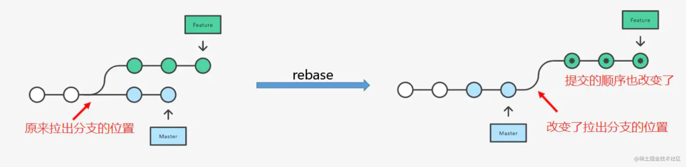

现在我们来用一个例子来解释一下上面的过程。
假设我们现在有2条分支，一个为 master，一个为 feature/1，他们都基于初始的一个提交 add readme 进行检出分支，之后，master 分支增加了 3.js 和 4.js 的文件，分别进行了2次提交，feature/1 也增加了 1.js 和 2.js 的文件，分别对应以下2条提交记录。

此时，对应分支的提交记录如下。

master 分支如下图：


feature/1 分支如下图


结合起来看是这样的

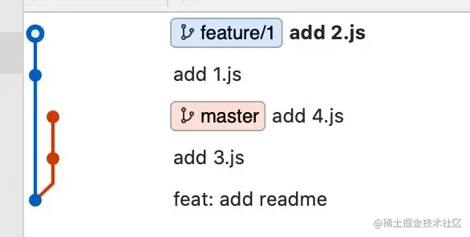

此时，切换到 feature/1 分支下，执行 git rebase master，成功之后，通过 git log 查看记录。
如下图所示：可以看到先是逐个应用了 mater 分支的更改，然后以 master 分支最后的提交作为基点，再逐个应用 feature/1 的每个更改。

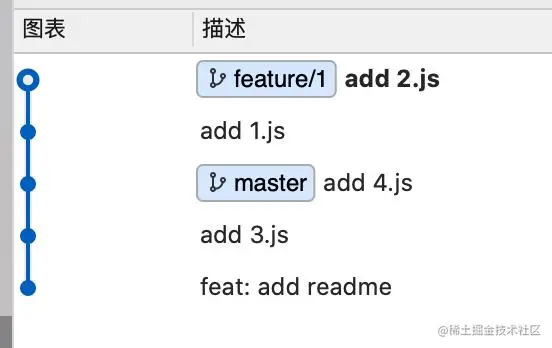

所以，我们的提交记录就会非常清晰，没有分叉，上面演示的是比较顺利的情况，但是大部分情况下，rebase 的过程中会产生冲突的，此时，就需要手动解决冲突，然后使用依次 git add  、git rebase --continue  的方式来处理冲突，完成 rebase 的过程，如果不想要某次 rebase 的结果，那么需要使用 git rebase --skip  来跳过这次 rebase 操作。

#### git merge

不同于 git rebase 的是，git merge 在不是 fast-forward（快速合并）的情况下，会产生一条额外的合并记录，类似 Merge branch 'xxx' into 'xxx' 的一条提交信息。

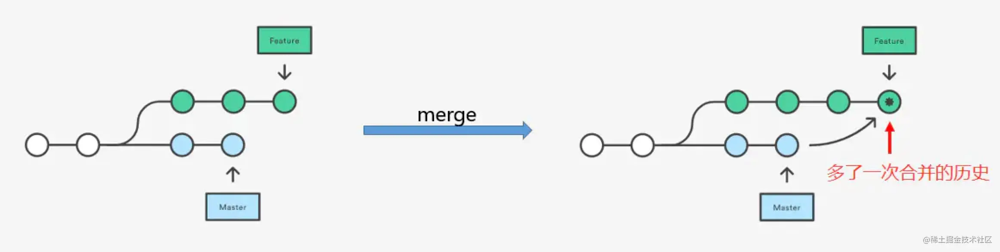

另外，在解决冲突的时候，用 merge 只需要解决一次冲突即可，简单粗暴，而用 rebase 的时候 ，需要依次解决每次的冲突，才可以提交。

#### git rebase 交互模式

在开发中，常会遇到在一个分支上产生了很多的无效的提交，这种情况下使用 rebase 的交互式模式可以把已经发生的多次提交压缩成一次提交，得到了一个干净的提交历史，例如某个分支的提交历史情况如下：


进入交互式模式的方式是执行：

git rebase -i `<base-commit>`

参数 base-commit 就是指明操作的基点提交对象，基于这个基点进行 rebase 的操作，对于上述提交历史的例子，我们要把最后的一个提交对象（ ac18084 ）之前的提交压缩成一次提交，我们需要执行的命令格式是

git rebase -i ac18084

此时会进入一个 vim 的交互式页面,想要合并这一堆更改，我们要使用 Squash 策略进行合并，即把当前的 commit 和它的上一个 commit 内容进行合并， 大概可以表示为下面这样，在交互模式的 rebase 下，至少保留一个 pick，否则命令会执行失败。

```bash
pick  ... ...
s     ... ... 
s     ... ... 
s     ... ... 
```

修改文件后 按下 : 然后 wq 保存退出，此时又会弹出一个编辑页面，这个页面是用来编辑提交的信息，修改为 feat: 更正，最后保存一下，接着使用 git branch 查看提交的 commit 信息，rebase 后的提交记录如下图所示，是不是清爽了很多？rebase 操作可以让我们的提交历史变得更加清晰。

**特别注意，只能在自己使用的 feature 分支上进行 rebase 操作，不允许在集成分支上进行 rebase，因为这种操作会修改集成分支的历史记录。**

### git pull和git fetch

#### git pull

**git pull = git fetch + git merge**

```bash
# 从远程仓库拉取代码并合并到本地，可简写为 git pull 等同于 git fetch && git merge 
git pull <远程主机名> <远程分支名>:<本地分支名>
# 使用rebase的模式进行合并
git pull --rebase <远程主机名> <远程分支名>:<本地分支名>

```

#### git fetch

与 git pull 不同的是 git fetch 操作仅仅只会拉取远程的更改，不会自动进行 merge 操作。对你当前的代码没有影响

```bash
# 获取远程仓库特定分支的更新
git fetch <远程主机名> <分支名>
# 获取远程仓库所有分支的更新
git fetch --all
```

## 单向/双向数据流、单向/双向绑定

### 单向/双向绑定

- react采取单向绑定
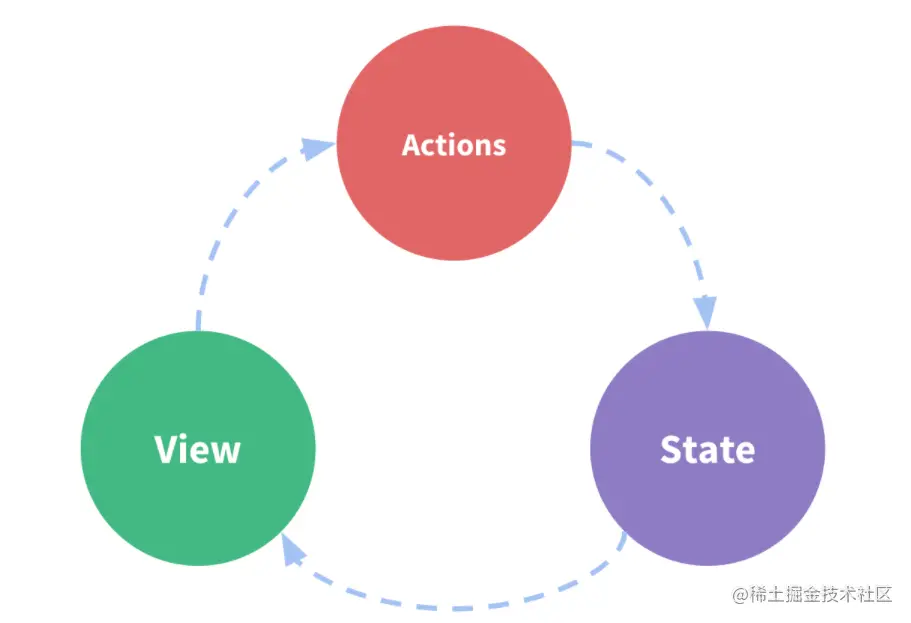
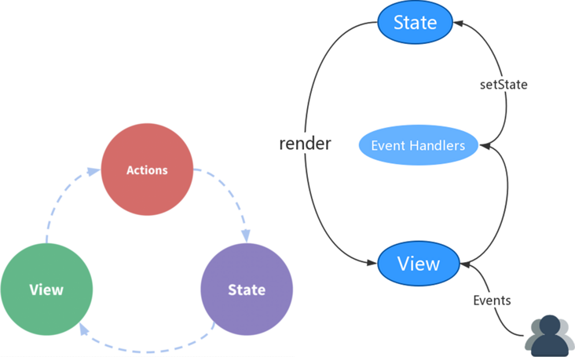
用户访问View，用户发出交互到Actions中进行处理，Actions中通过setState对State进行更新，State更新后触发View更新。可以看出，View层不能直接修改State，必须要通过Actions来进行操作，这样更加清晰可控

- vue支持单向绑定和双向绑定
  - 单向绑定：插值形式`{{data}}`，v-bind也是单向绑定
  - 双向绑定：表单的v-model，用户对View层的更改会直接同步到Model层

实际上v-model只是v-bind:value 和 v-on:input的语法糖，我们也可以采取类似react的单向绑定。
vue的v-model在操作表单是，显得很简单，我们不用去写繁琐的onChange事件去处理每个表单数据的变化，但是双向绑定也会导致数据变化不透明，不清晰可控。优点和缺点共存，有时候一个人的优点也是一个人的缺点，道理都是相通的。

### 单向/双向数据流

**数据流，表明的是数据流向或数据传递。**
**vue和react仅支持单向数据流**
angularJs可以双向数据流

#### 单向数据流

单向数据流方式使用一个上传数据流和一个下传数据流进行双向数据通信，两个数据流之间相互独立。单向数据流指只能从一个方向来修改状态。

虽然vue有双向绑定v-model，但是vue和react父子组件之间数据传递，仍然还是遵循单向数据流的，父组件可以向子组件传递props，但是子组件不能修改父组件传递来的props，子组件只能通过事件通知父组件进行数据更改。

vue组件之间的数据传递具有单向数据流这样的特性。

- 父组件总是通过 props 向子组件传递数据；
- 所有的 prop 都使得其父子 prop 之间形成了一个单向下行绑定；
- 父级 prop 的更新会向下流动到子组件中，但是反过来则不行；
- 这样会防止从子组件意外改变父级组件的状态，从而导致你的应用的数据流向难以理解；
- 每次父级组件发生更新时，子组件中所有的 prop 都将会刷新为最新的值；
- 这意味着不应该在一个子组件内部改变 prop。如果这样做，Vue 会在浏览器的控制台中发出警告。

#### 优点

- 所有状态的改变可记录、可跟踪，源头易追溯；
- 所有的数据，具有唯一出口和入口，使得数据操作更直观更容易理解，可维护性强；
- 当数据变化时，页面会自动变化
- 当你需要修改状态，完全重新开始走一个修改的流程。这限制了状态修改的方式，让状态变得可预测，容易调试。

#### 缺点

- 页面渲染完成后，有新数据不能自动更新，需要手动整合新数据和模板重新渲染
- 代码量上升，数据流转过程变长，代码重复性变大
- 由于对应用状态独立管理的严格要求(单一的全局 store，如：Vuex)，在处理局部状态较多的场景时(如用户输入交互较多的“富表单型”应用)，会显得啰嗦及繁琐。

### 双向数据流

在双向数据流中，Model（可以理解为状态的集合） 中可以修改自己或其他Model的状态， 用户的操作（如在输入框中输入内容）也可以修改状态。

当我们在前端开发中采用 MV* 的模式时，M - model，指的是模型，也就是数据，V - view，指的是视图，也就是页面展现的部分。
将从服务器获取的数据进行“渲染”，展现到视图上。每当数据有变更时，我们会再次进行渲染，从而更新视图，使得视图与数据保持一致
页面也会通过用户的交互，产生状态、数据的变化，这个时候，我们则编写代码，将视图对数据的更新同步到数据

#### 优点

- 数据模型变化与更新，会自动同步到页面上，用户在页面的数据操作，也会自动同步到数据模型
- 无需进行和单向数据绑定的那些相关操作；
- 在表单交互较多的场景下，会简化大量业务无关的代码。

#### 缺点

- 无法追踪局部状态的变化；
- “暗箱操作”，增加了出错时 debug 的难度；
- 由于组件数据变化来源入口变得可能不止一个，数据流转方向易紊乱。
- 改变一个状态有可能会触发一连串的状态的变化，最后很难预测最终的状态是什么样的。使得代码变得很难调试

数据流与绑定，准确来说两者并不是一回事。单向数据流也可有双向绑定，双向数据流也可以有双向绑定

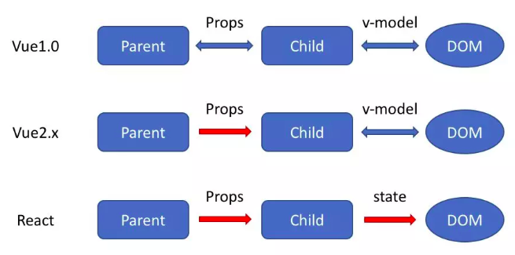

## TCP和UDP

### TCP

TCP是一个面向连接的、可靠的、基于字节流的传输层协议。

UDP是一个面向无连接的传输层协议。

具体来分析，和 UDP 相比，TCP 有三大核心特性:

- **面向连接**。所谓的连接，指的是客户端和服务器的连接，在双方互相通信之前，TCP 需要三次握手建立连接，而 UDP 没有相应建立连接的过程。

- **可靠性**。TCP 花了非常多的功夫保证连接的可靠，这个可靠性体现在哪些方面呢？一个是有状态，另一个是可控制。
  TCP 会精准记录哪些数据发送了，哪些数据被对方接收了，哪些没有被接收到，而且保证数据包按序到达，不允许半点差错。这是有状态。
  当意识到丢包了或者网络环境不佳，TCP 会根据具体情况调整自己的行为，控制自己的发送速度或者重发。这是可控制。
  相应的，UDP 就是无状态, 不可控的。

- **面向字节流**。UDP 的数据传输是基于数据报的，这是因为仅仅只是继承了 IP 层的特性，而 TCP 为了维护状态，将一个个 IP 包变成了字节流。

## 前端安全问题

### XSS攻击

Cross-Site Scripting（跨站脚本攻击）简称 XSS，是一种代码注入攻击。攻击者通过在目标网站上注入恶意脚本，使之在用户的浏览器上运行。利用这些恶意脚本，攻击者可获取用户的敏感信息如 Cookie、SessionID 等，进而危害数据安全。

#### 常见注入方法

- 在 HTML 中内嵌的文本中，恶意内容以 script 标签形成注入。
- 在内联的 JavaScript 中，拼接的数据突破了原本的限制（字符串，变量，方法名等）。
- 在标签属性中，恶意内容包含引号，从而突破属性值的限制，注入其他属性或者标签。
- 在标签的 href、src 等属性中，包含 javascript: (伪协议)等可执行代码。
- 在 onload、onerror、onclick 等事件中，注入不受控制代码。
- 在 style 属性和标签中，包含类似 background-image:url("javascript:..."); 的代码（新版本浏览器已经可以防范）。
- 在 style 属性和标签中，包含类似 expression(...) 的 CSS 表达式代码（新版本浏览器已经可以防范）。

#### XSS 攻击的分类

根据攻击的来源，XSS 攻击可分为存储型、反射型和 DOM 型三种。

- 存储型 XSS
  存储型 XSS 的攻击步骤：
  - 攻击者将恶意代码提交到目标网站的数据库中。
  - 用户打开目标网站时，网站服务端将恶意代码从数据库取出，拼接在 HTML 中返回给浏览器。
  - 用户浏览器接收到响应后解析执行，混在其中的恶意代码也被执行。
  - 恶意代码窃取用户数据并发送到攻击者的网站，或者冒充用户的行为，调用目标网站接口执行攻击者指定的操作。

  存储型 XSS(又被称为持久性XSS)攻击常见于带有用户保存数据的网站功能，如论坛发帖、商品评论、用户私信等。
  它是最危险的一种跨站脚本，相比反射型XSS和DOM型XSS具有更高的隐蔽性，所以危害更大，因为它不需要用户手动触发。任何允许用户存储数据的web程序都可能存在存储型XSS漏洞，当攻击者提交一段XSS代码后，被服务器端接收并存储，当所有浏览者访问某个页面时都会被XSS。

- 反射型 XSS
  反射型 XSS 的攻击步骤：

  - 攻击者构造出特殊的 URL，其中包含恶意代码。
  - 用户打开带有恶意代码的 URL 时，网站服务端将恶意代码从 URL 中取出，拼接在 HTML 中返回给浏览器。
  - 用户浏览器接收到响应后解析执行，混在其中的恶意代码也被执行。
  - 恶意代码窃取用户数据并发送到攻击者的网站，或者冒充用户的行为，调用目标网站接口执行攻击者指定的操作。

  反射型 XSS 跟存储型 XSS 的区别是：存储型 XSS 的恶意代码存在数据库里，反射型 XSS 的恶意代码存在 URL 里。
  反射型 XSS (也被称为非持久性XSS)漏洞常见于通过 URL 传递参数的功能，如网站搜索、跳转等。
  由于需要用户主动打开恶意的 URL 才能生效，攻击者往往会结合多种手段诱导用户点击。
  POST 的内容也可以触发反射型 XSS，只不过其触发条件比较苛刻（需要构造表单提交页面，并引导用户点击），所以非常少见。

- DOM 型 XSS
  DOM 型 XSS 的攻击步骤：

  - 攻击者构造出特殊的 URL，其中包含恶意代码。
  - 用户打开带有恶意代码的 URL。
  - 用户浏览器接收到响应后解析执行，前端 JavaScript 取出 URL 中的恶意代码并执行。
  - 恶意代码窃取用户数据并发送到攻击者的网站，或者冒充用户的行为，调用目标网站接口执行攻击者指定的操作。

  DOM 型 XSS 跟前两种 XSS 的区别：DOM 型 XSS 攻击中，取出和执行恶意代码由浏览器端完成，属于前端 JavaScript 自身的安全漏洞，而其他两种 XSS 都属于服务端的安全漏洞。
  **注意:**
  DOM通常代表在html、xhtml和xml中的对象，使用DOM可以允许程序和脚本动态的访问和更新文档的内容、结构和样式。它不需要服务器解析响应的直接参与，触发XSS靠的是**浏览器端的DOM解析**，所以防范DOM型XSS完全就是前端的责任,必须注意!!!。

|类型| 存储区| 插入点|
|---|---|
|存储型 XSS| 后端数据库| HTML|
|反射型 XSS| URL| HTML|
|DOM 型 XSS| 后端数据库/前端存储/URL| 前端 JavaScript|

#### 防御XSS

只要有输入数据的地方，就可能存在 XSS 危险。

- httpOnly: 在 cookie 中设置 HttpOnly 属性后，js脚本将无法读取到 cookie 信息。

- 输入过滤: 一般是用于对于输入格式的检查，例如：邮箱，电话号码，用户名，密码……等，按照规定的格式输入。不仅仅是前端负责，后端也要做相同的过滤检查。因为攻击者完全可以绕过正常的输入流程，直接利用相关接口向服务器发送设置。

- 转义 HTML: 如果拼接 HTML 是必要的，就需要对于引号，尖括号，斜杠进行转义,但这还不是很完善.想对 HTML 模板各处插入点进行充分的转义,就需要采用合适的转义库.(可以看下这个库,还是中文的)

```js
function escape(str) {
  str = str.replace(/&/g, '&amp;')
  str = str.replace(/</g, '&lt;')
  str = str.replace(/>/g, '&gt;')
  str = str.replace(/"/g, '&quto;')
  str = str.replace(/'/g, '&#39;')
  str = str.replace(/`/g, '&#96;')
  str = str.replace(/\//g, '&#x2F;')
  return str
}
```

- 白名单: 对于显示富文本来说，不能通过上面的办法来转义所有字符，因为这样会把需要的格式也过滤掉。这种情况通常采用白名单过滤的办法，当然也可以通过黑名单过滤，但是考虑到需要过滤的标签和标签属性实在太多，更加推荐使用白名单的方式。

**预防存储型和反射型 XSS 攻击**

存储型和反射型 XSS 都是在服务端取出恶意代码后，插入到响应 HTML 里的，攻击者刻意编写的“数据”被内嵌到“代码”中，被浏览器所执行。
预防这两种漏洞，有两种常见做法：

- 改成纯前端渲染，把代码和数据分隔开。
- 对 HTML 做充分转义。

HTML转义前面已经说过,这里仅仅谈谈纯前端渲染
纯前端渲染的过程：

- 浏览器先加载一个静态 HTML，此 HTML 中不包含任何跟业务相关的数据。
- 然后浏览器执行 HTML 中的 JavaScript。
- JavaScript 通过 Ajax 加载业务数据，调用 DOM API 更新到页面上。

在纯前端渲染中，我们会明确的告诉浏览器：下面要设置的内容是文本（.innerText），还是属性（.setAttribute），还是样式（.style）等等。浏览器不会被轻易的被欺骗，执行预期外的代码了。
但纯前端渲染还需注意避免 DOM 型 XSS 漏洞（例如 onload 事件和 href 中的 javascript:xxx 等，请参考下文”预防 DOM 型 XSS 攻击“部分）。
在很多内部、管理系统中，采用纯前端渲染是非常合适的。但对于性能要求高，或有 SEO 需求的页面，我们仍然要面对拼接 HTML 的问题,这时就需要对HTML进行充分的转义。

**预防 DOM 型 XSS 攻击**

DOM 型 XSS 攻击，实际上就是网站前端 JavaScript代码本身不够严谨，把不可信的数据当作代码执行了。
在使用 .innerHTML、.outerHTML、document.write() 时要特别小心，不要把不可信的数据作为 HTML 插到页面上，而应尽量使用 .textContent、.setAttribute() 等。

如果用 Vue/React 技术栈，并且不使用 v-html/dangerouslySetInnerHTML 功能，就在前端 render 阶段避免 innerHTML、outerHTML 的 XSS 隐患。

DOM 中的内联事件监听器，如 location、onclick、onerror、onload、onmouseover 等，`<a>` 标签的 href 属性，JavaScript 的 eval()、setTimeout()、setInterval() 等，都能把字符串作为代码运行。如果不可信的数据拼接到字符串中传递给这些 API，很容易产生安全隐患，请务必避免。

### CSRF 跨站点请求伪造

跨站请求伪造（英语：Cross-site request forgery），也被称为 one-click attack 或者 session riding，通常缩写为 CSRF 或者 XSRF， 是一种挟制用户在当前已登录的 Web 应用程序上执行非本意的操作的攻击方法。如:攻击者诱导受害者进入第三方网站，在第三方网站中，向被攻击网站发送跨站请求。利用受害者在被攻击网站已经获取的注册凭证，绕过后台的用户验证，达到冒充用户对被攻击的网站执行某项操作的目的

#### CSRF攻击流程


从上图可以看出，要完成一次CSRF攻击，受害者必须依次完成两个步骤：

1. 登录受信任网站A，并在本地生成Cookie。
2. 在不登出A的情况下，访问危险网站B。

看到这里，你也许会说：“如果我不满足以上两个条件中的一个，我就不会受到CSRF的攻击”。是的，确实如此，但你不能保证以下情况不会发生：

1.你不能保证你登录了一个网站后，不再打开一个tab页面并访问另外的网站。
2.你不能保证你关闭浏览器了后，你本地的Cookie立刻过期，你上次的会话已经结束。（事实上，关闭浏览器不能结束一个会话，但大多数人都会错误的认为关闭浏览器就等于退出登录/结束会话了......）
3.上图中所谓的攻击网站，可能是一个存在其他漏洞的可信任的经常被人访问的网站。

#### 常见的CSRF攻击类型

- **GET类型的CSRF**
GET类型的CSRF利用非常简单，只需要一个HTTP请求，一般会这样利用：

``

在受害者访问含有这个img的页面后，浏览器会自动向<http://bank.example/withdraw?account=xiaoming&amount=10000&for=hacker>发出一次HTTP请求。bank.example就会收到包含受害者登录信息的一次跨域请求。

- **POST类型的CSRF**
这种类型的CSRF利用起来通常使用的是一个自动提交的表单，如：

```html
 <form action="http://bank.example/withdraw" method=POST>
    <input type="hidden" name="account" value="xiaoming" />
    <input type="hidden" name="amount" value="10000" />
    <input type="hidden" name="for" value="hacker" />
</form>
<script> document.forms[0].submit(); </script> 
```

访问该页面后，表单会自动提交，相当于模拟用户完成了一次POST操作。

POST类型的攻击通常比GET要求更加严格一点，但仍并不复杂。任何个人网站、博客，被黑客上传页面的网站都有可能是发起攻击的来源，后端接口不能将安全寄托在仅允许POST上面。

- **链接类型的CSRF**

链接类型的CSRF并不常见，比起其他两种用户打开页面就中招的情况，这种需要用户点击链接才会触发。这种类型通常是在论坛中发布的图片中嵌入恶意链接，或者以广告的形式诱导用户中招，攻击者通常会以比较夸张的词语诱骗用户点击。

#### CSRF的特点

- 攻击一般发起在第三方网站，而不是被攻击的网站。被攻击的网站无法防止攻击发生。
- 攻击利用受害者在被攻击网站的登录凭证，冒充受害者提交操作；而不是直接窃取数据。
- 整个过程攻击者并不能获取到受害者的登录凭证，仅仅是“冒用”。
- 跨站请求可以用各种方式：图片URL、超链接、CORS、Form提交等等。部分请求方式可以直接嵌入在第三方论坛、文章中，难以进行追踪。

CSRF通常是跨域的，因为外域通常更容易被攻击者掌控。但是如果本域下有容易被利用的功能，比如可以发图和链接的论坛和评论区，攻击可以直接在本域下进行，而且这种攻击更加危险。

#### 防御

- **验证码**；强制用户必须与应用进行交互，才能完成最终请求。此种方式能很好的遏制 csrf，但是用户体验比较差。

- **Referer check**；请求来源限制，此种方法成本最低，但是并不能保证 100% 有效，因为服务器并不是什么时候都能取到 Referer，而且低版本的浏览器存在伪造 Referer 的风险。

- **token**；token 验证的 CSRF 防御机制是公认最合适的方案。(具体可以查看本系列前端鉴权中对token有详细描述)若网站同时存在 XSS 漏洞的时候，这个方法也是空谈。

- **同源检测**：在HTTP协议中，每一个异步请求都会携带两个Header，用于标记来源域名，这两个Header在浏览器发起请求时，大多数情况会自动带上，并且不能由前端自定义内容。 服务器可以通过解析这两个Header中的域名，确定请求的来源域。
- **Samesite Cookie属性**
  - Samesite=Strict：严格模式，表明这个 Cookie 在任何情况下都不可能作为第三方 Cookie
  - Samesite=Lax：宽松模式，比 Strict 放宽了点限制：假如这个请求是这种请求（改变了当前页面或者打开了新页面）且同时是个GET请求，则这个Cookie可以作为第三方Cookie。

### CSRF与 XSS 区别

- CSRF是通过伪造http请求，来达到自己的攻击目的。但是XSS是通过盗取用户的敏感信息而达到攻击的目的。比如本地存储、用户密码、cookie等等。
- 通常来说 CSRF 是由 XSS 实现的，CSRF 时常也被称为 XSRF（CSRF 实现的方式还可以是直接通过命令行发起请求等）。
- 本质上讲，XSS 是代码注入问题，**CSRF 是 HTTP 问题**。 XSS 是内容没有过滤导致浏览器将攻击者的输入当代码执行。CSRF 则是因为浏览器在发送 HTTP 请求时候自动带上 cookie，而一般网站的 session 都存在 cookie里面(Token验证可以避免)。

### SQL注入

主要是通过往输入框里面输入 SQL语句，利用 SQL的语法识别机制，从而修改数据库实际上运行的SQL语句，以达到攻击者的目的

例如：（假设前端没有做用户名和密码的校验）
用户输入的用户名：Kite OR '1 = 1'--
用户输入的密码：123456

预想执行的SQL语句：`SELECT *FROM user WHERE username='Kite' AND psw='123456'`
实际执行的SQL语句：`SELECT* FROM user WHERE username='Kite' OR 1 = 1 --' AND psw='xxxx'`

"--":是SQL的注释代码。也就是说 1 = 1 后面的代码无效。 结果就变成无论输入的用户名和密码是否正确，都可以登录。因为 1 = 1 肯定是为 true 。

防御：

- 通过正则验证用户输入的内容是否包含引起隐患的字符
- 一般由后端来处理。

### 流量劫持

#### DNS 劫持

建过站点的朋友应该都知道，需要域名解析，不然无法通过自己购买的域名访问自己的服务器。域名解析，也就是通过 DNS 服务器实现域名和服务器IP的映射，例如 kite1874.com 对应的 IP 为 127.0.0.1。你访问 kite1874.com 的时候，实际访问的是 127.0.0.1 这个IP地址对应的服务器。实际上输入 127.0.0.1 也可以正常访问站点。之所以需要使用域名进行访问，是为了方便记忆和SEO

DNS劫持，也就是通过篡改域名映射的IP，导致用户访问的网站，变成攻击者准备的恶意网站。

例如：

- 电脑中毒，被恶意篡改了路由器的 DNS 配置，基本上做为开发者或站长却是很难察觉的，除非有用户反馈
- 网络运营商搞的鬼，一般小的网络运营商与黑产勾结会劫持 DNS。

#### HTTP 劫持

HTTP 劫持主要是当用户访问某个站点的时候会经过运营商网络，而不法运营商和黑产勾结能够截获 HTTP 请求返回内容，并且能够篡改内容，然后再返回给用户，从而实现劫持页面。

轻则插入小广告，重则直接篡改成钓鱼网站页面骗用户隐私。

能够实施流量劫持的根本原因，是 HTTP 协议没有办法对通信对方的身份进行校验以及对数据完整性进行校验。如果能解决这个问题，则流量劫持将无法轻易发生。

所以防止 HTTP 劫持的方法只有将内容加密，让劫持者无法破解篡改，这样就可以防止 HTTP 劫持了。

HTTPS 是基于 SSL 协议的安全加密网络应用层协议，相当于 HTTP + SSL，可以很好地防止 HTTP 劫持。

### 相关问题

#### 页面跳转中的安全问题

从A页面跳转到b页面如何保证安全
csrf?
---设置cookie的samesite属性，提示用户跳转网站的信息，防止钓鱼网站恶意诱导用户点击

### 中间人攻击

在 http 数据提交给 TCP 层之后，会经过用户电脑、路由器、运营商、服务器，这中间每一个环节，都不是安全的

一句话就是：**在 http 传输过程中容易被中间人窃取、伪造、篡改，这种攻击方式称为中间人攻击。**

那怎么让数据可以更安全的传输呢？

就是使用 https ，利用 https 安全层对数据进行加解密操作，以保证数据安全。

对称加密算法，不对称加密算法，混合加密
