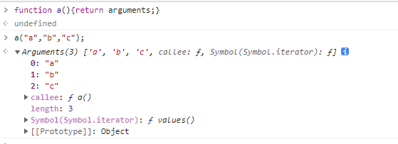

#

## 1. 深拷贝（循环引用）

<https://juejin.cn/post/6844903998823088141#heading-0>

```js
//使用Map函数
function deepCopy(obj, map = new Map()) {
  if (typeof obj !== 'object') return;
  const newObj = Array.isArray(obj) ? [] : {};
  if (map.get(obj)) {
    return map.get(obj);
  }
  map.set(obj, newObj);
  for (const key in obj) {
    if (obj.hasOwnProperty(key)) {
      if (typeof obj[key] === 'object') {
        newObj[key] = deepCopy(obj[key], map);
      } else {
        newObj[key] = obj[key];
      }
    }
  }
  return newObj;
}
const obj1 = {
  x: 1,
  y: 2,
  d: {
    a: 3,
    b: 4
  }
};
obj1.z = obj1;
const obj2 = deepCopy(obj1);
console.log(obj2);
            
//node 输出{ x: 1, y: 2, d: { a: 3, b: 4 }, z: [Circular] }
//控制台输出{x: 1, y: 2, d: {…}, z: {…}}

```

- return map.get(obj); 返回这个和返回res是一样的。因为在map中保存的数据，是key和value一模一样的键值对, 包括拷贝的目标对象。
- Map是如何解决循环引用的？

  >是通过存储键值对一样的对象。包括你深拷贝最终返回的对象。就是说你Map中有一个键值对就是key是目标对象，value也是目标对象。当有循环引用，递归调用时，就会加一个条件，如果map中有这个对象的话，直接返回这个对象。前提是，每一次递归的时候，我们保存了这个对象为key，value也为这个对象的键值对在Map中。

## 2. 实现一个promiseall，并限制并发数量

```js
function delay(text,time){
    return new Promise((resolve,reject) => {
        setTimeout(() => {
            resolve(text)
        },time)
    })
}
```

**promise的实现**

```js
function myPromiseAll(arr){
    return new Promise((resolve,reject) => {
        let count = 0 
        const n = arr.length 
        const res = new Array(n)
        for(let i = 0; i < n; i++){
            const p = arr[i]
            Promise.resolve(p()).then(result => {
                res[i] = result 
                count++ 
                if(count === n){
                    resolve(res)
                }
            })
        }
    })
}

const p1 = () => delay('1',1000)
const p2 = () => delay('2',1500)
const p3 = () => delay('3',500)

const p = [p1,p2,p3]

myPromiseAll(p).then(res => console.log(res))
```

**实现一个可以限制并发数的Primise.all**

```js
function myPromiseAll(arr,limit){
    return new Promise((resolve,reject) => {
        let count = 0 
        const n = arr.length 
        const res = new Array(n)
        let index = 0
        function step(i){
            if(count === n) {
                resolve(res)
                return 
            }
            if(arr[index]){
                arr[index]().then(result => {
                    res[i] = result 
                    count++
                    step(index)
                }) 
            }
            index++
        }
        for(let i = 0; i < limit; i++){
            step(i)
        }
    })
}

const p1 = () => delay('1',5000)
const p2 = () => delay('2',2000)
const p3 = () => delay('3',3000)
const p4 = () => delay('4',2000)
const p5 = () => delay('5',3000)

const p = [p1,p2,p3,p4,p5]

myPromiseAll(p,3).then(res => console.log(res))
```

## 3. 实现`Promise.retry`,成功后resolve结果，失败后重试，尝试超过一定次数才真正的`reject`

```js
const myPromeRetry=(fn,times=3)=>{
  if(!fn || typeof fn !== 'function'){
      return;
  }
  let res;
  return new Promise(async (resolve,reject)=>{
    while(times--){
      try{
        res = await fn();
        resolve(res);
        break;
      }catch (error){
        if(!times){
            reject(error);
        }
      }
    }
  });
};
```

## 4. this指向

```js
function Person() {
  getName = function () {
    console.log(1);
  };
  return this;
}
Person.getName = function () {
  console.log(2);
};
Person.prototype.getName = function () {
  console.log(3);
};
var getName = function () {
  console.log(4);
};
function getName() {
  console.log(5);
}
// question: 
Person.getName(); 
getName();
Person().getName();
getName();
new Person.getName();
new Person().getName();
new new Person().getName();
```

答案：

==========
<https://juejin.cn/post/6994420985021595662>

2411233
nodejs 第3个报错

主要来看后面三个：

```js
new Person.getName()
// 这里将Person上的静态方法getName函数作为构造函数执行，所以得出结果为：2
// 注意：这里是先Foo.getName,然后再new

new Person().getName()

// 这里是先计算new Person()，即调用的是Persono.prototype上的getName()，即得出结果为：3


new new Person().getName()

// 以上代码相当于new((new Person()).getName)();答案输出：3
// 这题除了明白new的内部原理之外，得注意js运算符的优先级；
// 以 new new Foo().getName()为例，小结一下上述new的优先级顺序：

// 先new Foo()
// 然后new Foo().getName
// 最后new new Foo().getName()
```

## 5. 数组扁平化

非递归数组拉平
数组拉平，将数组转换为一维数组，顺序不变

```js
const arr = [1, [2, 3], [4], [5, [6, 7, [8, [9, 10]]]]] 
```

### toString

```js
 function flatten(input) {
  return input.toString().split(',').map(item => +item);
  // return input.join().split(',').map(item => +item);
  // return input.join(',').split(',').map(item => +item);
}
flatten(arr); //[1, 2, 3, 1, 2, 3, 4, 2, 3, 4]
// 先把数组转换成字符串，这个过程会吧[]去掉，然后再调用split()方法转换成数组,最后不能忘了，把每一项转换为数字，即调用map()方法。
```

> 但是输入也可能是字符串，该方法不通用

### reduce

```js
// convert to one dimension array
const flatten = (arr) =>
arr.reduce((flattened, item) => Array.isArray(item) ? flattened.concat(flatten(item)) : [...flattened, item], [])

console.log(flatten(arr)) 
// [1, 2, 3, 4, 5, 6, 7, 8, 9, 10]
```

### 非递归的方式

```js
const flatten=(arr)=>{
  const stack=[...arr];
  const res=[];
  while(stack.length){
    const temp=stack.shift();
    if(Array.isArray(temp)){
      stack.unshift(...temp);
    }else{
      res.push(temp);
    }
  }
  return res;
}
```

## 6. 路径寻找

输入一个对象和对象上的一个节点或子节点的值（值唯一），输出该值对象在该对象的key的路径

```js
const obj = {
  a: {
    a_1: {
      a_1_1: 'abc', a_1_2: 'efg'
    }
  },
  b: {
    b_1: 'xyz', b_2: '111'
  },
  c: '000'
}
const result = findPath(obj, 'xyz') // ['b', 'b_1']


function findPath(obj, value) {
  const result = []
  function dfs(obj) {
    if (obj === value) {
      return true
    }
    if (typeof obj === 'object') {
      const keys = Object.keys(obj)
      if (!keys.length) {
        return false
      }
      for (let i = 0; i < keys.length; i++) {
        result.push(keys[i])
        if (dfs(obj[keys[i]])) {
          return true
        }
        result.pop()
      }
    }
    return false
  }
  dfs(obj);
  return result
}
```

## 7. 函数柯里化

<https://juejin.cn/post/6864378349512065038>
> 在数学和计算机科学中，柯里化是一种将使用多个参数的一个函数转换成一系列使用一个参数的函数的技术。

举例来说，一个接收3个参数的普通函数，在进行柯里化后，
  柯里化版本的函数接收一个参数并返回接收下一个参数的函数，
  该函数返回一个接收第三个参数的函数。
  最后一个函数在接收第三个参数后，
  将之前接收到的三个参数应用于原普通函数中，并返回最终结果。

```js
// 数学和计算科学中的柯里化：

//一个接收三个参数的普通函数
function sum(a,b,c) {
    console.log(a+b+c)
}

//用于将普通函数转化为柯里化版本的工具函数
function curry(fn) {
  //...内部实现省略，返回一个新函数
}

//获取一个柯里化后的函数
let _sum = curry(sum);

//返回一个接收第二个参数的函数
let A = _sum(1);
//返回一个接收第三个参数的函数
let B = A(2);
//接收到最后一个参数，将之前所有的参数应用到原函数中，并运行
B(3)    // print : 6
```

**累加器**
完成一个 sum 函数，实现如下功能，注意需要再执行count的时候才真正求和

```js
* 编写函数sum
* sum(1)(2).count() // 3
* sum(1)(2)(3).count() // 6*
* sum(1)(2)(3)(4,5).count() // 15 */
function sum(...args) {
  const counter = function (...args1) {
    args.push(...args1)
    return counter
  }
  counter.count = function () {
    return args.reduce((pre, cur) => {
      return pre + cur
    }, 0)
  }
  return counter
}
```

## 8. call、appaly、bind及bind的实现

<https://github.com/lin-xin/blog/issues/7>

### call和apply的区别

ECMAScript 规范给所有函数都定义了 call 与 apply 两个方法，它们的应用非常广泛，它们的作用也是一模一样，只是传参的形式有区别而已。

#### apply( )

apply 方法传入两个参数：一个是作为函数上下文的对象，另外一个是作为**函数参数所组成的数组**。

```js
const obj = {
  name: 'yiyaya'
};
function func(firstName, lastName) {
  console.log(`${firstName} ${this.name} ${lastName}`);
}
func.apply(obj, ['A', 'B']); // A yiyaya B
```

可以看到，obj 是作为函数上下文的对象，函数 func 中 this 指向了 obj 这个对象。参数 A 和 B 是放在数组中传入 func 函数，分别对应 func 参数的列表元素。

### call()

call 方法第一个参数也是作为函数上下文的对象，但是后面传入的是一个**参数列表**。

```js
const obj = {
  name: 'yiyaya'
};
function func(firstName, lastName) {
  console.log(`${firstName} ${this.name} ${lastName}`);
}
func.call(obj, 'C', 'D'); // C yiyaya D
```

对比 apply 我们可以看到区别，C 和 D 是作为单独的参数传给 func 函数，而不是放到数组中。对于什么时候该用什么方法，其实不用纠结。如果你的参数本来就存在一个数组中，那自然就用apply，如果参数比较散乱相互之间没什么关联，就用 call。

### apply 和 call 的用法

#### 1.改变 this 指向

```js
const obj = {
  name: 'thea'
};
function func() {
  console.log(this.name);
}
func.call(obj); // thea
```

我们知道，call 方法的第一个参数是作为函数上下文的对象，这里把 obj 作为参数传给了 func，此时函数里的 this 便指向了 obj 对象。此处 func 函数里其实相当于

```js
function func() {
  console.log(obj.name);
}
```

#### 2.借用别的对象的方法

```js
const Person1 = function () {
  this.name = 'thea';
};
const Person2 = function () {
  this.getname = function () {
    console.log(this.name);
  };
  Person1.call(this);
};
const person = new Person2();
person.getname(); // thea
```

从上面我们看到，Person2 实例化出来的对象 person 通过 getname 方法拿到了 Person1 中的name。因为在 Person2 中，Person1.call(this) 的作用就是使用 Person1 对象代替 this 对象，那么Person2 就有了 Person1 中的所有属性和方法了，相当于 Person2 继承了 Person1 的属性和方法。

#### 3.调用函数

apply、call 方法都会使函数立即执行，因此它们也可以用来调用函数.

```js
function func() {
  console.log('thea');
}
func.call(); // thea
```

### call 和 bind 的区别

在 EcmaScript5 中扩展了叫 bind 的方法，在低版本的 IE 中不兼容。它和 call 很相似，接受的参数有两部分，第一个参数是是作为函数上下文的对象，第二部分参数是个列表，可以接受多个参数。
它们之间的区别有以下两点。

#### 1.bind 返回值是函数

```js
const obj = {
  name: 'thea'
};
function func() {
  console.log(this.name);
}
const func1 = func.bind(obj);
func1(); // thea
```

bind 方法不会立即执行，而是返回一个改变了上下文 this 后的函数。而原函数 func 中的 this 并没有被改变，依旧指向全局对象 window。

#### 2.参数的使用

```js
function func(a, b, c) {
  console.log(a, b, c);
}
const func1 = func.bind(null, 'thea');
func('A', 'B', 'C'); // A B C
func1('A', 'B', 'C'); // thea A B
func1('B', 'C'); // thea B C
func.call(null, 'thea'); // thea undefined undefined
```

call 是把第二个及以后的参数作为 func 方法的实参传进去，而 func1 方法的实参实则是在 bind 中参数的基础上再往后排。

### 自己实现bind

在低版本浏览器没有 bind 方法，我们也可以自己实现一个。

```js
if (!Function.prototype.bind) {
  Function.prototype.bind = function () {
    const self = this; // 保存原函数
    const context = [].shift.call(arguments); // 保存需要绑定的this上下文
    const args = [].slice.call(arguments); // 剩余的参数转为数组
    return function () { // 返回一个新函数
      self.apply(context, [].concat.call(args, [].slice.call(arguments)));
    };
  };
}
```

**[].shift.call(arguments) 的含义**

- arguments 的含义
  arguments 是一个对应于传递给函数的参数的类数组对象。
  
  上面是我在 chrome 浏览器控制台进行的一个小测试，可以看到，arguments 是一个类数组对象，它的值中包含了我们在调用函数时候，朝里面传入的参数。
  而我们知道，对于对象的调用，我们一般采用点号—— obj.key 的调用方式或者括号加对象的key的方
  式—— `obj[key]` ，这两种方式是完全等同的。
  因此我们在创建函数的时候，其实并不需要朝里面传入变量，直接用 arguments 的方式来获取变量岂不是更好？虽然这种方式接收参数很灵活，但是也存在弊端，函数的参数阅读不方便。
- [].shift
  其实它就等同于 Array.prototype.shift ，不信你打开你的 chrome 浏览器控制台，试着输入
  Array.prototype.shift === [].shift ，然后你看看是不是能够得到 true。也就是说，两者其实是同一个函数，只是调用的方式存在差异，一个是通过原型的方式直接在类上调用；一个是通过实例化，继承过来，然后再调用。
了解了上面以后，我们就能理解了 [].shift.call(arguments) 的含义了。arguments 是类数组对象，它没有 shift 等数组独有的方法，怎么办？现在，我想要拿出传入的参数中的第一个参数，怎么操作，就只有用这种方式了

我们来试验一下

```js
function a() { return arguments; }
const temp = a('a', 'b');
temp.slice(); // Uncaught TypeError: temp.slice is not a function
```

我们可以看到，如果你想直接对 temp 用 slice() 函数，做不到,因为 arguments 是类数组对象，并非真正的对象，并没有 slice 方法。
但是如果你用下面方法

`[].slice.call(temp); //["a", "b"]`

我们可以看到的是，用上面的方式，就神奇般的得到了想要的结果。
我们在类数组对象上面，成功的运用了数组的 slice 方法。也就是说，相当于，先将 temp 转为数组，然后再对其运用了 slice 方法，然后返回了我们想要的结果。
当然，这种写法，在 es6 面前，已经成为了过去式，es6 为数组新增了一个 from 方法，这个函数的使用方式如下：

```js
Array.from(temp).slice(); //["a", "b"]
```

因此，我们可以总结下，原来 context = [].shift.call(arguments) 这一句就是把参数中的第一个剪切出来，赋给 context，那么也就相当于起到了将 参数中的 this 保存的目的。

```args = [].slice.call(arguments);```
这一句，将除了 this 上下文的所有参数，传给了 args ，以备后来使用

- bind的理解
要读懂返回值，必须得理解，bind 的作用是什么。

简单点理解，bind 就是用来绑定上下文的，强制将函数的执行环境绑定到目标作用域中去。与 call 和apply 其实有点类似，但是不同点在于，它不会立即执行，而是返回一个函数。因此我们要想自己实现一个 bind 函数，就必须要返回一个函数，而且这个函数会接收绑定的参数的上下文。

- 返回函数

```js
return function () { // 返回一个新函数
  self.apply(context,[].concat.call(args, [].slice.call(arguments)));
}
```

这一段其实很好理解，因为bind 绑定了上下文，因此 self.apply 的第一个参数，是之前我们保存的context。接下来，我们将 bind 的其余参数和调用bind后返回的函数在执行的过程中接收的参数进行拼接，作为一个数组传入apply的第二个参数中去。这就完美的实现了 bind 函数的功能。

## 9. 节流防抖

### 防抖 debounce

函数防抖就是在函数需要频繁触发的情况下，只有足够的空闲时间，才执行一次。 就是指触发事件后在 n 秒内函数只能执行一次，如果在 n 秒内又触发了事件，则会重新计算函数执行时间。直到**n秒内没有被再次点击，才执行事件**。

典型应用

- 百度搜索框在输入稍有停顿时才更新推荐热词。
- 拖拽

```js
function debounce(handler, delay) {
  delay = delay || 300;
  let timer = null;
  return function (...args) {
    const _self = this;
    const _args = args;
    clearTimeout(timer);
    timer = setTimeout(() => {
      handler.apply(_self, _args);
    }, delay);
  };
}
```

### 节流 throttle

一个函数只有在大于执行周期时才执行，周期内调用不执行。好像水滴积攒到一定程度才会触发一次下落一样。就是**不论点击多少次，n秒内只执行一次**。

典型应用：

- 抢券时疯狂点击，既要限制次数，又要保证先点先发出请求
- 窗口调整
- 页面滚动

```js
function throttle(handler, wait) {
  wait = wait || 300;
  let lastTime = 0;
  return function () {
    const _self = this;
    const _args = arguments;
    const nowTime = new Date().getTime();
    if ((nowTime - lastTime) > wait) {
      handler.apply(_self, _args);
      lastTime = nowTime;
    }
  };
}

function throttle(fun, delay) {
  let last; 
  let deferTimer;
  return function (args) {
    const that = this;
    const _args = arguments;
    const now = +new Date();
    clearTimeout(deferTimer); // 这里的计时器应该只是确保最后一次调用的时候也可以触发？
    if (last && now < last + delay) {
      deferTimer = setTimeout(() => {
        last = now;
        fun.apply(that, _args);
      }, delay);
    } else {
      last = now;
      fun.apply(that, _args);
    }
  };
}

```

复杂但好用版：

```js
function throttle(fn, interval, context, firstTime) {
  let timer;
  firstTime = typeof firstTime !== 'undefined' ? firstTime : true;
  return function () {
    const args = arguments;
    let __me = this;
    if (typeof context !== 'undefined') {
      __me = context;
    }
    if (firstTime) {
      fn.apply(__me, args);
      return (firstTime = false);
    }
    if (timer) {
      return false;
    }
    timer = setTimeout(() => {
      clearTimeout(timer);
      timer = null;
      fn.apply(__me, args);
    }, interval);
  };
}
```

节流与防抖的本质:

- 以闭包的形式存在，通过对事件对应的回调函数进行包裹、以自由变量的形式缓存时间信息，最后用定时器或时间差来控制事件的触发频率

## 10. 作用域

```js
  const a = 1
  function foo() {
    const a = 2
    return function () {
      console.log(a)
    }
  }
  function bar() {
    const a = 3
    const func = foo()
    return func
  }
  const run = bar()
  run();
```

答案：2
注释掉 const a = 2后答案为1

```js
  const a = 1
  function foo() {
    return function () {
      console.log(a)
    }
  }
  function bar() {
    const a = 3
    const func = foo();
    func();
  }
  bar();
```

答案：1

## 11. 对象扁平化

```js
// 实现一个 flatten 函数，实现如下的转换功能
const obj = {
  a: 1,
  b: [1, 2, { c: true }],
  c: { e: 2, f: 3 },
  g: null,
};
// 转换为
let objRes = {
  a: 1,
  "b[0]": 1,
  "b[1]": 2,
  "b[2].c": true,
  "c.e": 2,
  "c.f": 3,
  g: null,
};
```

```js
  flatten = (obj) => {
    let result = {};
    const innerCopy = (key, value) => {
      if (Object(value) !== value) {
        if (key) {
          result[key] = value;
        }
      } else if (value instanceof Array) {
        for (let i = 0; i < value.length; i++) {
          innerCopy(`${key}[${i}]`, value[i]);
        }
      } else {
        const keysArr = Object.keys(value);
        keysArr.forEach((item) => {
          innerCopy(key ? `${key}.${item}` : item, value[item]);
        });
      }
    }
    innerCopy('', obj);
    return result;
  }
```

### 数组转树形结构

```js
const arr = [
  {id: 1, name: '部门1', pid: 0},
  {id: 2, name: '部门2', pid: 1},
  {id: 3, name: '部门3', pid: 1},
  {id: 4, name: '部门4', pid: 3},
  {id: 5, name: '部门5', pid: 4},
]

const obj = {
  id: 1,
  name: "部门1",
  pid: 0,
  children: [
    {
      id: 2,
      name: "部门2",
      pid: 1,
      children: []
    },
    {
      id: 3,
      name: "部门3",
      pid: 1,
      children: [
        {
          id: 4,
          name: "部门4",
          pid: 3,
          children: [
            {
              id: 5,
              name: "部门5",
              pid:4,
              children: []
            }
          ]
        }
      ]
    }
  ]
}
```

```js
// 递归
function objToTree(arr, id) {
  const res = [];
  for (let i = 0; i < arr.length; i++) {
    if (arr[i].pid === id) {
      res.push({
        ...arr[i], children: objToTree(arr, arr[i].id)
      });
    }
  }
  return res;
}

// 循环
function objToTree(arr, pid) {
  const resMap = new Map();
  for (const item of arr) {
    if (!resMap.has(item.id)) {
      resMap.set(item.id, { ...item, children: [] });
    } else {
      resMap.set(item.id, { ...resMap.get(item.id), ...item });
    }
    if (resMap.has(item.pid)) {
      resMap.get(item.pid).children.push(resMap.get(item.id));
    } else {
      resMap.set(item.pid, { children: [resMap.get(item.id)] });
    }
  }
  return resMap.get(pid);
}
```
