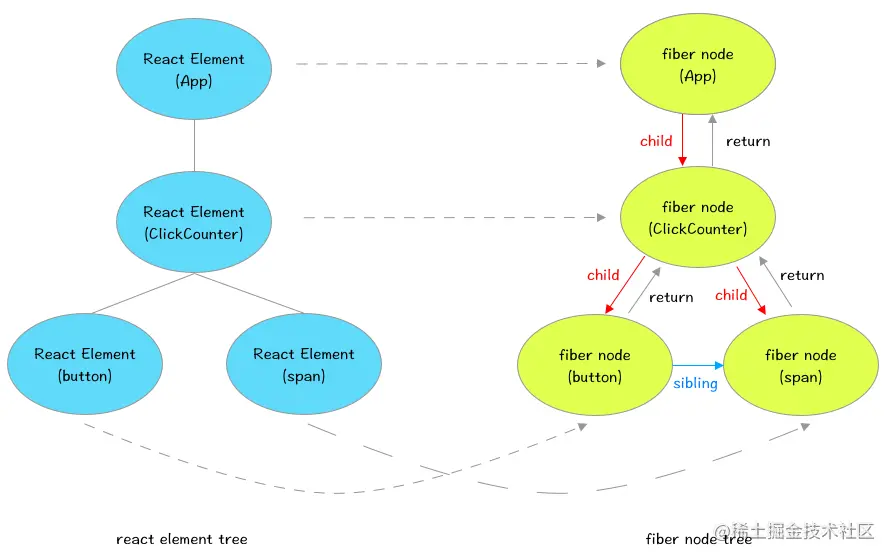

# react

## react和vue的区别

### 相同点

1. 组件化开发</br>
Vue 3和React都采用了组件化开发的方式，使得代码具有更好的可维护性和重用性。在Vue 3中，组件可以被定义为一个对象，并且包含一个template、script和style标签。在React中，组件可以被定义为一个类或者函数，并且采用JSX语法来描述组件的结构和行为。
2. 响应式数据绑定</br>
Vue 3和React都支持响应式数据绑定，这意味着当数据变化时，UI界面会自动更新。在Vue 3中，数据变化会触发视图的重新渲染，而在React中则会调用组件的render方法重新生成虚拟DOM树。
3. 虚拟DOM机制</br>
Vue 3和React都采用了虚拟DOM机制来进行高效的页面更新。虚拟DOM是一个轻量级的JavaScript对象，它描述了UI界面的状态和结构，当数据发生变化时，框架会通过比较前后两个虚拟DOM树的差异来进行页面更新。
4. 组件之间的通信</br>
Vue 3和React都支持父子组件之间的通信。在Vue 3中，通过props和$emit方法可以实现父子组件之间的数据传递和事件监听；在React中，则通过props和回调函数来实现同样的功能。

### 不同点

1. 响应式数据绑定的实现方式不同</br>
Vue 3使用了Proxy API来实现响应式数据绑定，这使得代码更加简洁易懂，并且能够支持动态添加和删除属性。而React则需要使用setState方法来触发视图的重新渲染，这使得代码相对复杂一些。
Vue 3的响应式API还允许开发者在模板中直接使用响应式数据，而React则需要手动将数据传递给组件。
2. 组件状态管理的实现方式不同</br>
Vue 3引入了Composition API，使得组件状态管理更加灵活和可维护。开发者可以将逻辑相关的代码封装为单独的函数，从而实现更好的代码复用和组织。</br>
React则通过生命周期方法和hooks来管理组件状态，虽然也能够实现相同的功能，但是代码相对较为冗长。
3. 组件渲染方式不同</br>
Vue 3采用了template语法来描述组件的结构和行为，这使得代码可读性更高，并且能够更好地与设计师协作。在模板中可以使用if、for等语句来实现复杂的逻辑控制。</br>
React则采用JSX语法来描述组件的结构和行为，这使得代码更加灵活，并且能够更好地与JavaScript集成。但是，由于JSX需要手动添加标签，因此代码可读性相对较差。
4. API设计风格不同</br>
Vue 3的API设计倾向于提供语法糖和便捷方法，使得开发者能够更加高效地编写代码。例如，Vue 3中提供了v-model指令来实现双向数据绑定，在处理表单等情况下非常方便。</br>
React则倾向于提供一些基础API，并且鼓励开发者自行封装复杂的功能。这样做可以让代码更加灵活和可扩展，但是需要花费更多的时间和精力。

Vue 3和React都是非常优秀的前端框架，它们各自具有自己的优点和适用场景。Vue 3在易学易用、模板语法、响应式数据绑定等方面具有优势，适合开发小型和中型应用程序；而React在虚拟DOM机制、状态管理、可扩展性等方面具有优势，适合开发大型和复杂的Web应用程序。因此，在选择框架时，需要根据项目需求和团队技术能力来进行判断和选择。同时，尽管两者存在一些不同之处，但它们都采用了组件化思想，这为开发者提供了更好的代码组织方式和可维护性。

## 函数组件和类组件

<https://github.com/jappp/Blog/issues/12>

在 React 中，类组件就是基于ES6语法，通过继承 React.component 得到的组件。
函数组件也称无状态组件，顾名思义就是以函数形态存在的 React 组件。

### 函数组件和类组件的区别

- 类组件有生命周期，函数组件没有
- 类组件需要继承 Class，函数组件不需要
- 类组件可以获取实例化的 this，并且基于 this 做各种操作，函数组件不可以
- 类组件内部可以定义并维护 state， 函数组件都称为无状态了，不可以。
- 函数组件相比较类组件，优点是更轻量与灵活，便于逻辑的拆分复用。

那么难道 React 内部就是基于此大力推广 Hooks 和函数组件吗？肯定有这些方面的因素，但最重要的一点，我引用一下 React 团队核心成员和 Redux 作者 Dan 的一篇文章，[函数式组件与类组件有何不同](https://overreacted.io/zh-hans/how-are-function-components-different-from-classes/)？
**函数式组件捕获了渲染时所使用的值，这是两类组件最大的不同**

怎么理解这句话呢？
我们都知道，React 框架有一个经典的公式是 UI = f(data)，React框架做的本质工作就是吃入数据，吐出UI，把声明式的代码转换为命令式的 DOM 操作，把数据层面的描述映射到用户可见的 UI 变化中去。这也就是说React的数据应该紧紧的和渲染绑定在一起，但是问题的关键就在于类组件是做不到这一点的。

我们采用 Dan 文章中的例子:

```js
class ProfilePage extends React.Component {
  showMessage = () => {
    alert('Followed ' + this.props.user);
  };
  handleClick = () => {
    setTimeout(this.showMessage, 3000);
  };
  render() {
    return <button onClick={this.handleClick}>Follow</button>;
  }
}
```

这个组件返回的是一个按钮，点击之后延迟三秒，页面弹出 ‘Followed XXX‘的文案。
看上去好像是没有什么问题，但是在sandBox例子中，如果你在dan用户下点击 follow按钮，并且在三秒内把用户切换到 Sophie， 最终弹出的提示框会变成 ‘Followed Sophie’，这明显很不合理。


这个现象有点奇怪，user 是通过 props 下发的，props不可改变，那么造成数据改变的原因就一定是 this 指向改变了。
真正的原因也确实如此，虽然props不可改变，但是this是可变的，this.props 的每次调用都会去获取最新的 this 值，这也是React保证数据实时性的重要手段。

那么就很清晰了，当showMessage最终执行时，此时的 this 绑定的是 Sophie 对应的上下文，所以输出为 ‘Followed Sophie’；

如果我们把上面的类组件改造成函数组件:

```js
function ProfilePage(props) {
  const showMessage = () => {
    alert('Followed ' + props.user);
  };
  const handleClick = () => {
    setTimeout(showMessage, 3000);
  };
  return (
    <button onClick={handleClick}>Follow</button>
  );
}
```

最终的输出值明显为 ‘Followed Dan’，props 会在函数执行的瞬间就被捕获，而 props 本身又是不可变值，所以我们可以确保从当前开始读取到的 props 都是最初捕获到的。当父组件传入新的 props 尝试重新渲染函数时，本质是基于新的 props 入参重新调用了一次函数，并不会影响上一次调用。这就是 Dan 所说的函数式组件捕获了渲染所使用的值，并且我们还能进一步意识到：函数组件真正将数据和渲染紧紧的绑定到一起了。

> 这里有个小Tips，很多人认为在函数组件中延迟输出的 state 是调用时的 state，而不是最新的 state 是一个Bug，恰恰相反，这是一个函数式组件的特性，是真正践行了React设计理念的正确方式。
> Hooks也给出了获取最新的props和state的方法，就是 useRef，详细用法我不再赘叙，大家有兴趣可以自己去查阅。

那么显而易见的是，函数组件更符合 React 团队的设计理念，并且代码易于拆分和复用，所以React 团队推出 Hooks 来扩展函数组件的功能，并且倡导大家使用函数组件了。

## 高阶组件

<https://juejin.cn/post/6940422320427106335>
<https://juejin.cn/post/6844904050236850184>

### 概念

- 高阶组件（HOC，Higher-Order Components）不是组件，而是一个函数，它会接收一个组件作为参数并返回一个经过改造的新组件。简单理解：**输入是个组件输出也是个组件**

- 需要区分的是，组件是将 props 转换为 UI，而高阶组件是将组件转换为另一个组件。

- 我们更应该注意的是，经过包装后的组件，获得了那些强化,节省多少逻辑，或是解决了原有组件的那些缺陷，这就是高阶组件的意义。

```js
const EnhancedComponent = higherOrderComponent(WrappedComponent);
```

- 复用逻辑：高阶组件更像是一个加工react组件的工厂，批量对原有组件进行加工，包装处理。我们可以根据业务需求定制化专属的HOC,这样可以解决复用逻辑。**抽取重复代码，实现组件复用**
- 强化props：这个是HOC最常用的用法之一，高阶组件返回的组件，可以劫持上一层传过来的props,然后混入新的props,来增强组件的功能。代表作react-router中的withRouter。
- 赋能组件：HOC有一项独特的特性，就是可以给被HOC包裹的业务组件，提供一些拓展功能，比如说额外的生命周期，额外的事件，但是这种HOC，可能需要和业务组件紧密结合。典型案例react-keepalive-router中的 keepaliveLifeCycle就是通过HOC方式，给业务组件增加了额外的生命周期。
- 控制渲染：劫持渲染是hoc一个特性，在wrapComponent包装组件中，可以对原来的组件，进行条件渲染，节流渲染，懒加载等功能。典型代表做react-redux中connect和 dva中 dynamic 组件懒加载。**条件渲染，控制组件的渲染逻辑（渲染劫持），常见场景：权限控制。**
- 捕获/劫持被处理组件的生命周期，常见场景：组件渲染性能追踪、日志打点。

### 高阶组件实现

- 属性代理(Props Proxy)
  - 返回一个无状态（stateless）的函数组件
  - 返回一个 class 组件
- 反向继承(Inheritance Inversion)

#### 属性代理

属性代理是最常见的实现方式，它本质上是使用组合的方式，通过将组件包装在容器组件中实现功能。

属性代理方式实现的高阶组件和原组件的生命周期关系完全是React父子组件的生命周期关系，所以该方式实现的高阶组件会影响原组件某些生命周期等方法。

##### 操作 props

最简单的属性代理实现代码如下：

```js
// 返回一个无状态的函数组件
function HOC(WrappedComponent) {
  const newProps = { type: 'HOC' };
  return props => <WrappedComponent {...props} {...newProps}/>;
}

// 返回一个有状态的 class 组件
function HOC(WrappedComponent) {
  return class extends React.Component {
    render() {
      const newProps = { type: 'HOC' };
      return <WrappedComponent {...this.props} {...newProps}/>;
    }
  };
}
```

从上面代码可以看到，通过属性代理方式实现的高阶组件包装后的组件可以拦截到父组件传递过来的 props，提前对 props 进行一些操作，比如增加一个 type 属性。

##### 抽象 state

需要注意的是，通过属性代理方式实现的高阶组件无法直接操作原组件的 state，但是可以通过 props 和回调函数对 state 进行抽象。️

常见的例子是实现非受控组件到受控组件的转变：

```js
// 高阶组件
function HOC(WrappedComponent) {
  return class extends React.Component {
    constructor(props) {
      super(props);
      this.state = {
        name: '',
      };
      this.onChange = this.onChange.bind(this);
    }
    
    onChange = (event) => {
      this.setState({
        name: event.target.value,
      })
    }
    
    render() {
      const newProps = {
        name: {
          value: this.state.name,
          onChange: this.onChange,
        },
      };
      return <WrappedComponent {...this.props} {...newProps} />;
    }
  };
}

// 使用
@HOC
class Example extends Component {
  render() {
    return <input name="name" {...this.props.name} />;
  }
}
```

##### 获取 refs 引用

- 为了访问 DOM element （focus事件、动画、使用第三方 DOM 操作库），有时我们会用到组件的 ref 属性。
- ref 属性只能声明在 class 类型的组件上，而无法声明在函数类型的组件上（因为无状态组件没有实例）。
- 通过属性代理方式实现的高阶组件无法直接获取原组件的 refs 引用，但是可以通过在原组件的ref回调函数中调用父组件传入的 ref 回调函数来获取原组件的refs 引用。
  
假设有一个 User 组件（原组件），它的代码如下：

```js
import * as React from 'react';
import * as styles from './index.module.less';

interface IProps {
  name: string;
  age: number;
  inputRef?: any;
}
class User extends React.Component<IProps> {
  private inputElement: any ;

  static sayHello () {
    console.error('hello world'); // tslint:disable-line
  }

  constructor (props: IProps) {
    super(props);
    this.focus = this.focus.bind(this);
    this.onChange = this.onChange.bind(this);
  }

  state = {
    name: '',
    age: 0,
  };

  componentDidMount () {
    this.setState({
      name: this.props.name,
      age: this.props.age,
    });
  }

  onChange = (e: any) => {
    this.setState({
      age: e.target.value,
    });
  }

  focus () {
    this.inputElement.focus();
  }

  render () {
    return (
      <div className={styles.wrapper}>
        <div className={styles.nameWrapper}>姓名：{this.state.name}</div>
        <div className={styles.ageWrapper}>
          年龄:
            <input
              className={styles.input}
              value={this.state.age}
              onChange={this.onChange}
              type="number"
              ref={input => {
                if (this.props.inputRef) {
                  this.props.inputRef(input); // 调用父组件传入的ref回调函数
                }
                this.inputElement = input;
              }}
            />
        </div>
        <div>
          <button
            className={styles.button}
            onClick={this.focus}
          >
            获取输入框焦点
          </button>
        </div>
      </div>
    );
  }
}

export default User;

```

通过属性代理方式实现的能获取原组件 refs 引用的高阶组件代码如下：

```js
import * as React from 'react';
import * as styles from './index.module.less';

function HOC (WrappedComponent: any) {
    let inputElement: any = null;

    function handleClick () {
      inputElement.focus();
    }

    function wrappedComponentStaic () {
      WrappedComponent.sayHello();
    }

    return (props: any) => (
      <div className={styles.hocWrapper}>
        <WrappedComponent
          inputRef={(el: any) => { inputElement = el; }}
          {...props}
        />
        <input
          type="button"
          value="获取子组件输入框焦点"
          onClick={handleClick}
          className={styles.focusButton}
        />
        <input
          type="button"
          value="调用子组件static"
          onClick={wrappedComponentStaic}
          className={styles.callButton}
        />
      </div>
    );
}

export default HOC;
```

使用：

```js
import React from 'react';
import HOC from '../../components/OperateRefsHOC';
import User from '../../components/User';

const EnhanceUser = HOC(User);

class OperateRefs extends React.Component<any> {
  render () {
    return <EnhanceUser name="小明" age={12} />;
  }
}

export default OperateRefs;
```

通过高阶组件包装以后的 EnhanceUser 组件可以可以访问到 User 组件中的 input 元素：


##### 获取原组件的 static 方法

当待处理组件为 class 组件时，通过属性代理实现的高阶组件（无论是返回一个函数组件 还是返回一个 class 组件，均）可以获取到原组件的 static 方法，如上面给出的高阶组件的代码，

```js
import * as React from 'react';
import * as styles from './index.module.less';

function HOC (WrappedComponent: any) {
    /* 省略无关代码... */

    function wrappedComponentStaic () {
      WrappedComponent.sayHello();
    }

    return (props: any) => (
      <div className={styles.hocWrapper}>
        <WrappedComponent
          inputRef={(el: any) => { inputElement = el; }}
          {...props}
        />
        /* 省略无关代码... */
        <input
          type="button"
          value="调用子组件static"
          onClick={wrappedComponentStaic}
          className={styles.callButton}
        />
      </div>
    );
}

export default HOC;
```

##### 通过 props 实现条件渲染

通过属性代理方式实现的高阶组件无法直接实现对原组件进行渲染劫持（即对原组件内部 render 的控制并不是很强），但可以通过 props 来控制是否渲染及传入数据：

```js
import * as React from 'react';
import * as styles from './index.module.less';

function HOC (WrappedComponent: any) {
    /* 省略无关代码... */

    function wrappedComponentStaic () {
      WrappedComponent.sayHello();
    }

    return (props: any) => (
      <div className={styles.hocWrapper}>
        {
          props.isShow ? (
            <WrappedComponent
              {...props}
            />
          ) : <div>暂无数据</div>
        }
      </div>
    );
}

export default HOC;
```

##### 用其他元素包裹传入的组件

我们可以通过类似下面的方式将原组件包裹起来，从而实现布局或者是样式的目的

```jsx
function withBackgroundColor(WrappedComponent) {
    return class extends React.Component {
        render() {
            return (
                <div style=''>
                    <WrappedComponent {...this.props} {...newProps} />
                </div>
            );
        }
    };
}
```

#### 反向继承

反向继承指的是使用一个函数接受一个组件作为参数传入，并返回一个继承了该传入组件的类组件，且在返回组件的 render() 方法中返回 super.render() 方法，最简单的实现如下：

```js
const HOC = (WrappedComponent) => {
  return class extends WrappedComponent {
    render() {
      return super.render();
    }
  }
}
```

- 相较于属性代理方式，使用反向继承方式实现的高阶组件的特点是允许高阶组件通过 this 访问到原组件，所以可以直接读取和操作原组件的 state/ref/生命周期方法。
- 反向继承方式实现的高阶组件可以通过 super.render() 方法获取到传入组件实例的 render 结果，所以可对传入组件进行渲染劫持（最大特点），如：
  - 有条件地展示元素树（element tree）
  - 操作由 render() 输出的 React 元素树
  - 在任何由 render() 输出的 React 元素中操作 props
  - 用其他元素包裹传入组件的渲染结果

##### 劫持原组件生命周期方法

因为反向继承方式实现的高阶组件返回的新组件是继承于传入组件，所以当新组件定义了同样的方法时，将会会覆盖父类（传入组件）的实例方法，如下面代码所示：

```js
function HOC(WrappedComponent){
  // 继承了传入组件
  return class HOC extends WrappedComponent {
    // 注意：这里将重写 componentDidMount 方法
    componentDidMount(){
      ...
    }

    render(){
      //使用 super 调用传入组件的 render 方法
      return super.render();
    }
  }
}
```

虽然生命周期重写会被覆盖，但我们可以通过其他方式来劫持生命周期：

```js
function HOC(WrappedComponent){
  const didMount = WrappedComponent.prototype.componentDidMount;
  
  // 继承了传入组件
  return class HOC extends WrappedComponent {
    componentDidMount(){
      // 劫持 WrappedComponent 组件的生命周期
      if (didMount) {
        didMount.apply(this);
      }
      ...
    }

    render(){
      //使用 super 调用传入组件的 render 方法
      return super.render();
    }
  }
}
```

##### 读取/操作原组件的 state

反向继承方式实现的高阶组件中可以读取、编辑和删除传入组件实例中的 state

```js
function HOC(WrappedComponent){
  const didMount = WrappedComponent.prototype.componentDidMount;
  // 继承了传入组件
  return class HOC extends WrappedComponent {
    async componentDidMount(){
      if (didMount) {
        await didMount.apply(this);
      }
      // 将 state 中的 number 值修改成 2
      this.setState({ number: 2 });
    }

    render(){
      //使用 super 调用传入组件的 render 方法
      return super.render();
    }
  }
}

```

##### 渲染劫持

条件渲染

条件渲染指的是我们可以根据部分参数去决定是否渲染组件（与属性代理方式类似）

```js
const HOC = (WrappedComponent) =>
  class extends WrappedComponent {
    render() {
      if (this.props.isRender) {
        return super.render();
      } else {
        return <div>暂无数据</div>;
      }
    }
  }
```

修改 React 元素树

我们还可以通过 React.cloneElement 方法修改由 render 方法输出的 React 组件树：

```js
// 例子来源于《深入React技术栈》
function HigherOrderComponent(WrappedComponent) {
  return class extends WrappedComponent {
    render() {
      const tree = super.render();
      const newProps = {};
      if (tree && tree.type === 'input') {
        newProps.value = 'something here';
      }
      const props = {
        ...tree.props,
        ...newProps,
      };
      const newTree = React.cloneElement(tree, props, tree.props.children);
      return newTree;
    }
  };
}
```

### 属性代理和反向继承的对比

- 属性代理是从“组合”的角度出发，这样有利于从外部去操作 WrappedComponent，可以操作的对象是 props，或者在 WrappedComponent 外面加一些拦截器，控制器等。
- 反向继承则是从“继承”的角度出发，是从内部去操作 WrappedComponent，也就是可以操作组件内部的 state ，生命周期，render函数等等。

对两种方式实现的高阶组件所具有的功能列表如下

| 功能列表 | 属性代理 | 反向继承 |
|  ----  | ----  |----  |
|原组件能否被包裹|√|√|
|原组件是否被继承|×|√|
|能否读取/操作原组件的 props|√|√|
|能否读取/操作原组件的 state|乄|√|
|能否通过 ref 访问到原组件的 dom 元素|乄|√|
|是否影响原组件某些生命周期等方法|√|√|
|是否取到原组件 static 方法|√|√|
|能否劫持原组件生命周期方法|×|√|
|能否渲染劫持|乄|√|

可以看到，通过反向继承方法实现的高阶组件相较于属性代理实现的高阶组件，功能更强大，个性化程度更高，因此能适应更多的场景。

### 具体实践

#### 页面复用

前面提到，属性代理是最常见的高阶组件实现方式，它本质上是使用组合的方式，通过将组件包装在容器组件中实现组件逻辑复用的功能。 因此，如果想实现页面复用，可以使用属性代理方式实现的高阶组件。

#### 权限控制

#### 组件渲染性能追踪

### hook和高阶组件

- 高阶组件可以做到很轻松地外部协议化注入功能到一个基础 Component 中，所以可以用来做插件，如 react-swipeable-views中的 autoPlay 高阶组件，通过注入状态化的 props 的方式对组件进行功能扩展，而不是直接将代码写在主库中。对于  Hook 来说，其中间处理过程一定会与目标组件强依赖（不是 Hook 的缺陷，只是 Hook 显然并不是设计来解决插件注入的问题的）。
- Hook 更多可以看作是对高阶组件方案的补充，填补了高阶组件不擅长的部分。Hook 的写法可以让代码更加紧凑，更适合做 Controller 或者需要内聚的相关逻辑。
- 目前 Hook 还处于早期阶段（React 16.8.0 才正式发布Hook 稳定版本），一些第三方的库可能还暂时无法兼容 Hook。

## hooks

### 优点

- Hook 可以使你在非 class 的情况下可以使用更多的 React 特性。
- 在组件之间复用状态逻辑很难、大型组件很难拆分和重构，也很难测试。Hook 使你在无需修改组件结构的情况下复用状态逻辑。
- 复杂组件变得难以理解、业务逻辑分散在组件的各个方法之中，导致重复逻辑或关联逻辑。Hook 将组件中相互关联的部分拆分成更小的函数（比如设置订阅或请求数据）

- **更容易复用代码，它通过自定义hooks来复用状态，从而解决了类组件有些时候难以复用逻辑的问题。**
  
  > 每调用useHook一次都会生成一份独立的状态，函数每次调用都会开辟一份独立的内存空间。
  > 虽然状态(from useState)和副作用(useEffect)的存在依赖于组件，但它们可以在组件外部进行定义。这点是class component做不到的，你无法在外部声明state和副作用（如componentDidMount）
  > 组件树层级变浅。使用 HOC/render props 等方式来复用组件的状态，增强功能等无疑增加了组件树层数及渲染，在 React DevTools 中观察过 React 应用，你会发现由 providers，consumers，高阶组件，render props 等其他抽象层组成的组件会形成“嵌套地狱”。而在 React Hooks 中，这些功能都可以通过强大的自定义的 Hooks 来实现。
  > 不用再去考虑 this 的指向问题。在类组件中，你必须去理解 JavaScript 中 this 的工作方式。

上面这两点，高阶组件也能做到。但高阶组件的缺点是：
  > 来源不清晰：高阶组件是通过增强组件的props（赋予一个新的属性或者方法到组件的props属性）， 实现起来比较隐式。你难以区分这个props是来自哪个高阶组件。

  > 高阶组件需要实例化一个父组件来实现，不管是在代码量还是性能上，都不如hooks。

  > 依赖不清晰：高阶组件对入参的依赖是隐式的，入参发生在看不到的上层的高阶组件里面。

  > 命名冲突：高阶组件太多时，容易发生命名冲突。

### 缺点

**状态不同步**

- 函数的运行是独立的，每个函数都有一份父级作用域。当我们处理复杂逻辑的时候，经常会碰到状态不同步的问题
- 副作用代码从主动式变成响应式
  
  - 写函数组件时，必须把深入理解useEffect和useCallback这些api的第二个参数的作用。
  其次，还有下面几点：
  - useEffect的依赖参数并不好写，你需要花时间去判断该把什么变量加入到依赖数组，幸运的是eslint-plugin-react-hooks很多场景可以帮你解决这点，但有时得靠你自己加以判断。
  - useEffect很容易出错，它是响应式的，当某个依赖项变化时它才会被调用。你必须去理解它的调用时机、调用时的状态老旧问题，这不直观，也难以维护。有时，useEffect会发生比你预期更多的调用次数
- 怎么避免react hooks的常见问题
不要在useEffect里面写太多的依赖项，划分这些依赖项成多个useEffect，这样更好维护。

  有时候，你的useEffect依赖某个函数的不可变性，这个函数的不可变性又依赖于另一个函数的不可变性，这样便形成了一条依赖链。一旦这条依赖链的某个节点意外地被改变了，你的useEffect就被意外地触发了，如果你的useEffect是幂等的操作，可能带来的是性能层次的问题，如果是非幂等，那就糟糕了。
所以，对比componentDidmount和componentDidUpdate，useEffect带来的心智负担更大。

**避免react hooks的常见问题**

1. 不要在useEffect里面写太多的依赖项，划分这些依赖项成多个单一功能的useEffect。其实这点是遵循了软件设计的“单一职责模式”。
2. 如果你碰到状态不同步的问题，可以考虑下手动传递参数到函数。如：

  ```js
     // showCount的count来自父级作用域 
   const [count,setCount] = useState(xxx); 
   function showCount(){ console.log(count) } 
   
   // showCount的count来自参数 
   const [count,setCount] = useState(xxx); 
   function showCount(c){ console.log(c) }
   ```

3. 拆分组件，细化组件的粒度。复杂业务场景中使用hooks，应尽可能地细分组件，使得组件的功能尽可能单一，这样的hooks组件更好维护。
4. hooks很好用很强大，但它不擅长异步。但在有太多异步逻辑的代码时，class比它更适合、更稳、更好维护。
5. 一定要加入eslint-plugin-react-hooks这个插件，并且重视它的警告！

### Hook API

| 名称                | 描述                                                                                                                            |
| ------------------- | ------------------------------------------------------------------------------------------------------------------------------- |
| useState            | 在函数组件中维护自己的状态                                                                                                      |
| useEffect           | 在函数组件中实现生命周期钩子函数                                                                                                |
| useContext          | 用来处理多层级传递数据的方式，减少组件嵌套                                                                                      |
| useReducer          | 跟react-redux的使用方式一样，算是提供一个 mini 的 Redux 版本                                                                    |
| useCallback         | 获得一个记忆函数，避免在某些情况下重新渲染子组件，用来做性能优化                                                                |
| useMemo             | 获得一个记忆组件，和useCallback非常类似，它适用于返回确定的值useRef生成对 DOM 对象的引用， 它是一个真正的引用，而不是把值拷过去 |
| useImperativeHandle | 透传ref，用于让父组件获取子组件内的引用                                                                                         |
| useLayoutEffect     | 同步执行副作用，在页面完全渲染完成后，操作DOM                                                                                   |

#### useState

在 useState()中，它接受状态的初始值作为参数，返回一个数组，其中数组第一项为一个变量，指向状态的当前值。类似 this.state,第二项是一个函数，用来更新状态,类似 setState。

#### useContext 共享状态钩子

如果需要在深层次组件之间共享状态，可以使用 useContext()。context 提供了一种在组件之间共享 props 的方式，而不必显示地通过组件树的逐层传递 props； useContext 钩子比原始 class 组件中使用 context 更为方便；

假设现在有俩个组件 Navbar 和 Messages，我们希望它们之间共享状态

```js
<div className="test">
  <Navbar />
  <Messages />
</div>
```

使用方法如下: 第一步在它们的父组件上使用 React 的 Context API，在组件外部建立一个 Context。

```js
import React, { useContext } from 'react';

const TestContext = React.createContext({});

const Navbar = () => {
  const { username } = useContext(TestContext);

  return (
    <div className="navbar">
      <p>{username}</p>
    </div>
  );
};

const Messages = () => {
  const { messageDetail } = useContext(TestContext);

  return (
    <div className="messages">
      <p>1 message for {messageDetail}</p>
    </div>
  );
};

const App = () => {
  return (
    <TestContext.Provider
      value={{
        username: 'superawesome',
        messageDetail: 'hello world',
      }}
    >
      <div className="test">
        <Navbar />
        <Messages />
      </div>
    </TestContext.Provider>
  );
};
export default App;
```

等价的 class 用例

```js
import React from 'react';

const TestContext = React.createContext({});

const Navbar = () => (
  <TestContext.Consumer>
    {({ username }) => (
      <div className="messages">
        <p>1 message for {username}</p>
      </div>
    )}
  </TestContext.Consumer>
);

const Messages = () => {
  return (
    <TestContext.Consumer>
      {({ messageDetail }) => (
        <div className="messages">
          <p>1 message for {messageDetail}</p>
        </div>
      )}
    </TestContext.Consumer>
  );
};

class App extends React.Component {
  render() {
    return (
      <TestContext.Provider
        value={{
          username: 'superawesome',
          messageDetail: 'hello world',
        }}
      >
        <div className="test">
          <Navbar />
          <Messages />
        </div>
      </TestContext.Provider>
    );
  }
}
export default App;

```

#### useEffect 副作用钩子

它可以用来更好的处理副作用，如异步请求等；可以把 useEffect Hook 看做 componentDidMount，componentDidUpdate 和 componentWillUnmount 这三个函数的组合。

useEffect()接受两个参数，第一个参数是你要进行的异步操作，第二个参数是一个数组，用来给出 Effect 的依赖项。只要这个数组发生变化，useEffect()就会执行。当第二项省略不填时，useEffect()会在每次组件渲染时执行。这一点类似于类组件的 componentDidMount。

```js
useEffect(() => {}, [array]);
```

#### useMemo和useCallback

<https://juejin.cn/post/7165338403465068552>
<https://juejin.cn/post/7209292509867507749>
<https://juejin.cn/post/7090820276547485709>
<https://juejin.cn/post/7010278471473594404>

本质上，useMemo 和 useCallback 都是用来帮助我们优化 重新渲染 的工具 Hook。它们通过以下两种方式实现优化的效果。

- 减少在一次渲染中需要完成的工作量。
- 减少一个组件需要重新渲染的次数

##### useMemo

useMemo 接受两个参数：

**参数**

- fn：用户返回想要缓存的数值，可以传递参数（需要执行的一些计算处理工作，包裹在一个函数中）
- 依赖项：缓存更新的条件,一个依赖数组

**响应式返回值**

- 初始化时，执行一次 computeFn，返回一次 fn 的返回值, 把函数返回值缓存起来
- 依赖项没有变化（Object.is 判断），返回上次缓存的值，否则返回最新的计算值，并再次缓存（浅比较）

**注意事项**

- 只能在函数式组件顶部使用
- 在严格模式下，React会调用计算函数两次，以帮助您查找意外杂质。这只是开发行为，不影响生产。如果您的计算函数是纯的，这不会影响组件的逻辑。其中一个调用的结果将被忽略。
- 缓存被丢弃的情况：在开发中，当编辑组件文件时，React会丢弃缓存。在开发和生产环境中，在 suspends 加载前的组件，不会缓存函数，React将丢弃缓存。

> useMemo 不只是缓存了函数的返回值，同时保证了返回值的引用地址不变。这个非常重要。

```js
// 计算小于selectedNum的数里面有多少个数满足isPrime的条件
const allPrimes = React.useMemo(() => {
  const result = [];
  for (let counter = 2; counter < selectedNum; counter++) {
    if (isPrime(counter)) {
      result.push(counter);
    }
  }
  return result;
}, [selectedNum]);
```

React 会判断你传入的依赖数组，这个数组中的每个变量是否在两次渲染间 值是否改变了 ，如果发生了改变，就重新执行计算的逻辑去获取一个新的值，否则不重新计算，直接返回上一次计算的值。

**使用场景**

- 跳过没必要的值重计算

```js
import { useMemo } from 'react';

function TodoList({ todos, tab, theme }) {
  const visibleTodos = useMemo(() => filterTodos(todos, tab), [todos, tab]);
  // ...
}
```

这里的计算函数，可简单可复杂。如果计算函数很简单，那么不缓存不是问题，因为计算会很快。然而，如果要过滤或转换大型数组或者复杂的数据结构时，或进行一些耗时的计算（console.time来测试）时，缓存就很有必要了

##### useCallback

useCallback 与 useMemo 有些许不同，缓存的是函数本身以及它的引用地址，而不是返回值。

函数是与数组和对象类似，都是通过引用而不是通过值进行比较的,这意味着如果我们在组件中定义一个函数，它将在每个渲染中重新生成，每次生成一个相同但是唯一的函数。

```js
const cachedFn = useCallback(fn, dependencies);
```

**参数**

- fn：想要缓存的函数
- 依赖项：缓存更新的条件

**返回值**

- 初始化时，返回缓存的原始函数
- 依赖项没有变化（Object.is 判断），返回上次缓存的函数，否则返回最新的函数

**注意事项**

- 组件文件修改后，缓存会失效
- 初始化后，suspends 加载前的组件，不会缓存函数

用 useMemo 模拟一个 useCallback 出来。

```js
useCallback(callBackFn, deps)
useMemo(() => callBackFn, deps)
```

如果能够把组件的渲染结果缓存，并有效复用，就能够减少主线程的阻塞。这就是 React.memo，React 自带的高阶组件。

React.memo 的思想是，当 props 没有改变时，组件就不需要重新渲染。

```js
const MemoComponent = React.memo(Component)
const MemoComponent = React.memo(Component, areEqual)
```

与 Hooks 的依赖数组相同，检查 props 是否相同，是通过浅比较实现的。除了默认情况，如果有复杂的对象类型，也可以自己写一个比较函数 areEqual，需要作为第二个参数传入。

**useCallback应用场景**
在组件 re-render 时跳过重渲染

```js
// 假设没有使用 useCallback 的 ProductPage
export default function ProductPage({ productId, referrer, theme }) {
  const handleSubmit = (orderDetails) => {
    post('/product/' + productId + '/buy', {
      referrer,
      orderDetails,
    });
  }

  return (
    <div className={theme}>
      <ShippingForm onSubmit={handleSubmit} />
    </div>
  );
}
```

当 theme 变化时，ShippingForm 会被重新渲染，页面难免造成阻塞。接下来优化 ShippingForm。
为了规避由 props 变化造成的不必要的渲染，可以使用 memo：

```js
const ShippingFormMemo = memo(function ShippingForm({ onSubmit }) {
  // ...
});
```

上面这种情况下，当 props 检测出变化前后一样时，被 memo 包裹的组件不做重新渲染。此时，useCallback 就能起到作用了。上面的例子，如果你不使用 useCallback，组件渲染前后，js 会创建两次 handleSubmit，他们在内存中地址不一样，自然是不同的数据，此时 memo 就失效了！
所以为了 memo 能够起作用，被他包裹的 组件中的props的属性应该使用 useCallback。

#### useReducer

reducer的概念是伴随着Redux的出现逐渐在JavaScript中流行起来。但我们并不需要学习Redux去了解Reducer。简单来说 reducer是一个函数(state, action) => newState：接收当前应用的state和触发的动作action，计算并返回最新的state。下面是一段伪代码：

```js
    // 举个栗子 计算器reducer，根据state（当前状态）和action（触发的动作加、减）参数，计算返回newState
    function countReducer(state, action) {
        switch(action.type) {
            case 'add':
                return state + 1;
            case 'sub':
                return state - 1;
            default: 
                return state;
        }
    }
```

上面例子：state是一个number类型的数值，reducer根据action的类型（加、减）对应的修改state，并返回最终的state。

**reducer 的幂等性**
从上面的示例可以看到reducer本质是一个纯函数，没有任何UI和副作用。这意味着相同的输入（state、action），reducer函数无论执行多少遍始终会返回相同的输出（newState）。因此通过reducer函数很容易推测state的变化，并且也更加容易单元测试。

**state 和 newState 的理解**
state是当前应用状态对象，可以理解就是我们熟知的React里面的state。
在上面的例子中state是一个基础数据类型，但很多时候state可能会是一个复杂的JavaScript对象，如上例中count有可能只是 state中的一个属性。针对这种场景我们可以使用ES6的结构赋值：

```js
    // 返回一个 newState (newObject)
    function countReducer(state, action) {
        switch(action.type) {
            case 'add':
                return { ...state, count: state.count + 1; }
            case 'sub':
                return { ...state, count: state.count - 1; }
            default: 
                return count;
        }
    }
```

关于上面这段代码有两个重要的点需要我们记住：

reducer处理的state对象必须是immutable，这意味着永远不要直接修改参数中的state对象，reducer函数应该每次都返回一个新的state object
既然reducer要求每次都返回一个新的对象，我们可以使用ES6中的解构赋值方式去创建一个新对象，并复写我们需要改变的state属性，如上例。
看上去很完美，但如果我们的state是多层嵌套，解构赋值实现就非常复杂：
对于这种复杂state的场景推荐使用immer等immutable库解决。

state为什么需要immutable？

reducer的幂等性

我们上文提到过reducer需要保持幂等性，更加可预测、可测试。如果每次返回同一个state，就无法保证无论执行多少次都是相同的结果

React中的state比较方案

React在比较oldState和newState的时候是使用Object.is函数，如果是同一个对象则不会出发组件的rerender。

**总结**

- 语法：(state, action) => newState
- Immutable：每次都返回一个newState， 永远不要直接修改state对象
- Action：一个常规的Action对象通常有type和payload（可选）组成
  - type： 本次操作的类型，也是 reducer 条件判断的依据
  - payload： 提供操作附带的数据信息

#### useImperativeHandle

这个hook能够使我们更好的操作子组件的一些方法。
在使用ref时可以自定义暴露给父组件的实例值，这样可能不太好理解，其实简单解释就是：有一个父组件和子组件，父组件想要直接操作子组件内部的DOM元素或者想要直接使用子组件实例的某些属性或方法时，就可以通过useImperativeHandle这个Hook来实现。。

```js
useImperativeHandle(ref, createHandle, [deps])
```

其中ref为父组件传入的ref值，createHandle是一个函数，返回一个对象，即这个ref的current值，deps为依赖数组，当依赖项发生改变时，会重新执行useImperativeHandle钩子，返回新的对象。

 **React.forwardRef()转发Ref**
但在讲useImperativeHandle如何使用之前，我们再来回顾一下React.forwardRef()透传Ref，也就是转发Ref，它会创建一个React组件，这个组件能够将其接受的ref属性转发到其组件树下的另一个组件中。它常用的场景为：转发ref到DOM组件。

```js
React.forwardRef((props, ref) => (<></>))
```

其中React.forwardRef 接受一个渲染函数作为参数，该函数接受两个参数，分别是props和ref，props代表父组件传入的属性，ref表示父组件传入的ref。

以下为一个简单的示例，定义父组件Father和子组件Child，在子组件Child内部定义了一个input输入框，并传入ref，想实现点击父组件中的按钮能够使子组件内部的输入框自动聚焦，利用React.forward实现代码如下：

```js
import React, { useRef } from "react";

const Child = React.forwardRef((props: any, ref: any) => {
    return (
        <>
        <input ref={ref} />
        {props.children}
        </>
    )
})
const Father = () => {
    const fatherRef = useRef<any>(null);
    const handleClick = () => {
        fatherRef && fatherRef?.current && fatherRef.current.focus();
    };
  return (
    <div>
      <Child ref={fatherRef} />
      <button onClick={handleClick}>点击我操作子组件中的input元素</button>
    </div>
  );
}
```

从上述代码可知，通过React.forwardRef()将父组件Father的FatherRef转发到了子组件的input DOM元素上，从而能够通过FatherRef直接操作input元素，使其聚焦。

但是React官方说应当避免使用ref这样的命令式代码，所以推荐useImperativeHandle应当与React.forwardRef一起使用。所以将上述代码改为如下形式，能够实现一样的功能：

```js
const Child = React.forwardRef((props: any, ref: any) => {
    const childRef = useRef<any>(null);
    // 设置父组件ref的current
    useImperativeHandle(ref, () => ({
        focus: () => {
            childRef && childRef.current.focus()
        }
    }))
    return (
        <>
        <input ref={childRef} />
        {props.children}
        </>
    )
})
const Father = () => {
    const fatherRef = useRef<any>(null);
    const handleClick = () => {
        // 此处可以直接使用父组件的ref调用子组件暴露出来的focus方法了
        fatherRef.current.focus();
    }
  return (
    <div >
    <Child ref={fatherRef} />
    <button onClick={handleClick}>点击我操作子组件中的input元素</button>
    </div>
  );
}
```

上述代码利用useImperativeHandle和React.forwardRef将子组件实例的属性或方法暴露给了父组件，所以父组件能够直接操作子组件中的属性或方法，并且子组件的ref和父组件的ref不再使用同一个ref，这也使开发者更加清晰的区分不同组件的ref了。

#### useLayoutEffect

- useLayoutEffect 的使用方法和 useEffect 相同，唯一的区别就是执行时机不一样,useLayoutEffect 的执行时机要早于 useEffect
- 即useLayoutEffect跟useEffect函数签名一致，但是在DOM修改后同步触发，这是和useEffect唯一的区别
- useEffect 会在渲染的内容更新到DOM上后执行,不会阻塞DOM的更新
useLayoutEffect 会在渲染的内容更新到DOM上之前进行,会阻塞DOM的更新
- useLayoutEffect 和 componentDidUpdate触发时机一致（都在在DOM修改后且浏览器渲染之前）；

### 常见问题

**不能在循环/条件/嵌套函数中调用**
<https://juejin.cn/post/6939766434159394830#comment>

> 不要在循环，条件或嵌套函数中调用 Hook， 确保总是在你的 React 函数的最顶层以及任何 return 之前调用他们。遵守这条规则，你就能确保 Hook 在每一次渲染中都按照同样的顺序被调用。这让 React 能够在多次的 useState 和 useEffect 调用之间保持 hook 状态的正确。

在使用 useState 和一些其他钩子时、它们彼此的对应关系、是依靠 Hook 调用的顺序、所以我们不要在循环、条件、或嵌套函数中使用 hook、确保总是在你的 React 函数的最顶层调用他们，这让 React 能够在多次的 useState 和 useEffect 调用之间保持 hook 状态的正确；

比如函数组件中出现 if 语句提前 return 了，后面又出现 Hook 调用的话，React 官方推的 eslint 规则也会给出警告。
报错信息：

```js
function App(){
  if (xxx) {
    return null;
  }

  // ❌ React Hook "useState" is called conditionally. 
  // React Hooks must be called in the exact same order in every component render.
  useState();
  
  return 'Hello'
}
```

原因：

如何在循环列表里使用 useCallback
不可以直接使用，会破坏 hook 的链表结构。推荐的做法是将公共组件提取出来，在提取的公共组件中使用。

优点
<https://juejin.cn/post/7106809972129792037>
<https://blog.csdn.net/xuewenjie0217/article/details/119112122>

#### hook和class组件的优缺点

## 组件通信

<https://juejin.cn/post/6844903828945387528#comment>

### 父组件向子组件通信

react的数据流是单向的，最常见的就是通过props由父组件向子组件传值。

### 子组件向父组件通信

子组件向父组件通信的基本思路是，父组件向子组件传一个函数，然后通过这个函数的回调，拿到子组件传过来的值。

### 发布者与订阅者模式（context）

React 的props都是由父组件传递给子组件的，一旦遇到孙组件，就需要一层层的传递下去。而context提供了一种组件之间通讯的新的方式（16.3版本之后），可以共享一些数据，其它的组件都能从context中读取数据（类似于有个数据源，组件可以订阅这个数据源）。

使用方法

React.createContext()方法

> context是一个全局变量,像是一个大容器,在任何地方都可以访问到,我们可以把要通信的信息放在context上,然后在其他组件中可以随意取到;

但是React官方不建议使用大量context,尽管他可以减少逐层传递,但是当组件结构复杂的时候,我们并不知道context是从哪里传过来的;而且context是一个全局变量,全局变量正是导致应用走向混乱的罪魁祸首.

我们可以使用createContext来创建一个context,它可以接收一个变量或者对象做为参数（当对象为参数的时候，react使用object.is()去比较，有些影响性能）。这个传入的值做为context的默认值

``` js
 const PriceContext = React.createContext('price')
```

### Provider组件

Provider就是用来创建数据源的。它是给所有的子组件提供数据源的跟组件。它接受一个value作为props，用来传递值，它会改变context的默认值。一个provider可以包含多个Consumer组件。如果Provider组件嵌套的话，

Consumer组件

Consumer表示接受数据的组件，它接受一个函数做为子元素。这个函数会接收context传递的值，返回一个react的组件。Consumer组件必须包含在Provider里面。

```js
<PriceContext.Consumer>
    { /*这里是一个函数*/ }
    {
        price => <div>price：{price}</div>
    }
</PriceContext.Consumer>
```

示例

在这部分我们尝试一下从父组件直接传递到孙组件，不通过子组件（直接从A组件传值到C组件，不经过B组件）。


```js
// 创建Context
const PriceContext = React.createContext('price')
// A组件中
class ClassA extends Component {
  constructor(){
    super()
    this.state={
      price:0
    }
  }
  // 点击按钮事件
  clickGoods(e) {
    this.setState({
      price:e
    })
  }
  render(){
    const { price } = this.state
    return(
      // Provider
      // 把state里price转到Provider的value中
    <PriceContext.Provider value={price}>
        <button onClick={this.clickGoods.bind(this, 100)}>goods1</button>
        <button onClick={this.clickGoods.bind(this, 1000)}>goods2</button>
        <ClassB />
    </PriceContext.Provider>  
    )
  }
}
// 组件B
class ClassB extends Component {
  // 组件B中只是引用了ClassC，没有进行传值的操作
  render(){
    return(
      <div><span>price:</span><span><ClassC /></span></div>
    )
  }
}
// 组件C
class ClassC extends Component {
  render(){    
    return(
      // Consumer,注意Consumer的下面要包含一个函数
      <PriceContext.Consumer>
        {
          price=><span>{price}</span>
        }
      </PriceContext.Consumer>
    )
  }
}
```

context的总结与理解

一个react app是由很多react组件组成的，有的组件之间是有嵌套关系的，可以形成一条“组件链”。Context可以当做组件的“作用域”[3]。一个根组件，它定义了一个context，它的组件链上的组件都可以访问到provider中定义的变量或对象，如下图所示，这就比较像‘作用域’的概念。context在一些简单的场景下可以替代部分redux的功能。


## react fiber

<https://juejin.cn/post/6891242214324699143>

> react在进行组件渲染时，从setState开始到渲染完成整个过程是同步的。如果需要渲染的组件比较庞大，js执行会占据主线程时间较长，会导致页面响应度变差，使得react在动画、手势等应用中效果比较差。

为了解决这个问题，react重写了react中核心算法——reconciliation。并在v16版本中发布了这个新的特性。为了区别之前和之后的reconciler，通常将之前的reconciler称为stack reconciler，重写后的称为fiber reconciler，简称为Fiber。

Stack reconciler的工作流程很像函数的调用过程。父组件里调子组件，可以类比为函数的递归（这也是为什么被称为stack reconciler的原因）。在setState后，react会立即开始reconciliation过程，从父节点（Virtual DOM）开始遍历，以找出不同。将所有的Virtual DOM遍历完成后，reconciler才能给出当前需要修改真实DOM的信息，并传递给renderer，进行渲染，然后屏幕上才会显示此次更新内容。对于特别庞大的vDOM树来说，reconciliation过程会很长(x00ms)，在这期间，主线程是被js占用的，因此任何交互、布局、渲染都会停止，给用户的感觉就是页面被卡住了。

如果有大量节点需要更新，JS线程的运行时间可能会比较长，在这段时间浏览器是不会响应其他事件的，因为JS线程和GUI线程是互斥的，JS运行时页面就不会响应，这个时间太长了，用户就可能看到卡顿，特别是动画的卡顿会很明显。在React的官方演讲中有个例子，可以很明显的看到这种同步计算造成的卡顿：


而Fiber就是用来解决这个问题的，Fiber可以将长时间的同步任务拆分成多个小任务，从而让浏览器能够抽身去响应其他事件，等他空了再回来继续计算，这样整个计算流程就显得平滑很多。下面是使用Fiber后的效果：


### 从 DOM 到 fiber 对象

#### DOM

文档对象模型，实际上就是一个树，树中的每一个节点就是 HTML 元素（Element），每个节点实际上是一个 JS 对象，这个对象除了包含了该元素的一些属性，还提供了一些接口（方法），以便编程语言可以插入和操作 DOM。但是 DOM 本身并没有针对动态 UI 的 Web 应用程序进行优化。因此，当一个页面有很多元素需要更新时，更新相对应的 DOM 会使得程序变得很慢。因为浏览器需要重新渲染所有的样式和 HTML 元素。这其实在页面没有任何变化的情况下也时常发生。

#### Virtual 虚拟DOM

为了优化“真实” DOM 的更新，衍生出了 「Virtual DOM」的概念。本质来说，Virtual DOM 是真实 DOM 的模拟，它实际上也是一棵树。真实的 DOM 树由真实的 DOM 元素组成，而 Virtual DOM 树是由 Virtual DOM 元素组成。
当 React 组件的状态发生变化时，会产生一棵新的 Virtual DOM 树，然后 React 会使用 diff 算法去比较新、旧两棵 Virtual DOM 树，得到其中的差异，然后将「差异」更新到真实的 DOM 树中，从而完成 UI 的更新。
要说明一点是：这里并不是说使用了 Virtual DOM 就可以加快 DOM  的操作速度，而是说 React 让页面在不同状态之间变化时，使用了次数尽量少的 DOM 操作来完成。

#### React 元素（React Element）

在 React 的世界中，React 给 Virtual DOM 元素取名为 React 元素（React Element）。也就是说，在 React 中的 Virtual DOM 树是由 React 元素组成的，树中每一个节点就是一个 React 元素。
我们从源码中（/package/shared/ReactElementType.js）来看看 React 元素的类型定义：

```ts
export type Source = {|
  fileName: string,
  lineNumber: number,
|};

export type ReactElement = {|
  $$typeof: any,
  type: any,
  key: any,
  ref: any,
  props: any,
  // ReactFiber
  _owner: any,
  ...
|};
```

- $$typeof：React 元素的标志，是一个 Symbol 类型；
- type：React 元素的类型。如果是自定义组件（composite component），那么 type 字段的值就是一个 class 或 function - component；如果是原生 HTML （host component），如果 div、span 等，那么 type 的值就是一个字符串（'div'、'span'）；
- key：React 元素的 key，在执行 diff 算法时会用到；
- ref：React 元素的 ref 属性，当 React 元素变为真实 DOM 后，返回真实 DOM 的引用；
- props：React 元素的属性，是一个对象；
- _owner：负责创建这个 React 元素的组件，另外从代码中的注释 “// ReactFiber” 可以知道，它里面包含了 React 元素关联的 - fiber 对象实例；

当我们写 React 组件时，无论是 class 组件还是函数组件，return 的 JSX 会经过 JSX 编译器（JSX Complier）编译，在编译的过程中，会调用 React.createElement() 这个方法。
当调用 React.createElement() 的时候实际上调用的是 ReactElement.js（/packages/react/src/ReactElement.js） 中的 createElement() 方法。调用这个方法后，会创建一个 React 元素。


在上面 ClickCounter 组件这个例子中， `<button>` 和 `<span>` 是 `<ClickCounter>` 的子组件。而 `<ClickCounter>` 组件其实它本身其实也是一个组件。它是 `<App>` 组件的子组件：

```js
class App extends React.Component {
    ...
    render() {
        return [
            <ClickCounter />
        ]
    }
}
```

所以在调用 `<App>` 的 render() 时，会创建 `<ClickCounter>` 组件对应的 react element：


当执行 ReactDOM.render() 后，创建的整棵 react rlement 树大致如下：


#### Fiber 对象

每当我们创建一个 react element 时，还会创建一个与这个 react element 相关联的 fiber node。fiber node 为 Fiber 对象的实例。
Fiber 对象是一个用于保存「组件状态」、「组件对应的 DOM 的信息」、以及「工作任务 (work)」的数据结构，负责管理组件实例的更新、渲染任务、以及与其他 fiber node 的关系。每个组件（react element）都有一个与之对应关联的 Fiber 对象实例（fiber node），和 react element 不一样的是，fiber node 不需要再每一次界面更新的时候都重新创建一遍。
在执行 Reconciliation 这个算法的期间，组件 render 方法所返回的 react element 的信息（属性）都会被合并到对应的 fiber node 中。这些 fiber node 因此也组成了一棵与 react element tree 相对应的 fiber node tree。（我们要牢牢记住的是：每个 react element 都会有一个与之对应的 fiber node）。
Fiber 对象类型定义（/package/react-reconciler/src/ReactInternalTypes.js）：

```ts
export type Fiber = {|
    tag: WorkTag;
    key: null | string;
    type: any;
    stateNode: any;
    updateQueue: mixed;
    memoizedState: any;
    memoizedProps: any,
    pendingProps: any;
    nextEffect: Fiber | null,
    firstEffect: Fiber | null,
    lastEffect: Fiber | null,
    return: Fiber | null;
    child: Fiber | null;
    sibling: Fiber | null;
    ...
|};
```

- tag：这字段定义了 fiber node 的类型。在 Reconciliation 算法中，它被用于决定一个 fiber node 所需要完成的 work 是什么 ;
- key：这个字段和 react element 的 key 的含义和内容有一样（因为这个 key 是从 react element 的key 那里直接拷贝赋值过来的），作为 children 列表中每一个 item 的唯一标识。它被用于帮助 React 去计算出哪个 item 被修改了，哪个 item 是新增的，哪个 item 被删除了。官方文档中有对 key 更详细的讲解;
- type：这个字段表示与这个 fiber node 相关联的 react element 的类型。这个字段的值和 react element 的 type 字段值是一样的（因为这个 type 是从 react element 的 type 那里直接拷贝赋值过来的）。如果是自定义组件（composite component），- 那么 type 字段的值就是一个 class 或 function component；如果是原生 HTML （host component），如 div、span 等，那- 么 type 的值就是一个字符串（'div'、'span'）;
- updateQueue：这个字段用来存储组件状态更新、回调和 DOM 更新任务的队列，fiber node 正是通过这个字段，来管理 fiber  node 所对应的 react element 的渲染、更新任务;（如果老铁们看过烧烤哥的那篇《烤透 React Hook》，就会知道，其实 - updateQueue 存储的就是一个这个 fiber node 需要处理的 effect 链表）；
- memoizedState：已经被更新到真实 DOM 的 state（已经渲染到 UI 界面上的 state）;
- memoizedProps: 已经被更新到真实 DOM 的 props（已经渲染到 UI 界面上的 props）,
- pendingProps：等待被更新到真实 DOM 的 props;
- return：这个字段相当于一个指针，指向父 fiber node;
- child：这个字段相当于一个指针，指向子 fiber node;
- sibling：这个字段相当于一个指针，指向兄弟 fiber node;
- nextEffect：指向下一个带有 side-effect 的 fiber node；
- firstEffect：指向第一个带有 side-effect 的 fiber node
- lastEffect：指向最后一个带有 side-effect 的fiber node；

下面我们来看看上面例子中的 `<ClickCounter>` 组件的 fiber node 长什么样吧：

```js
{
    stateNode: new ClickCounter,
    type: ClickCounter,
    alternate: null,
    key: null,
    updateQueue: null,
    memoizedState: {count: 0},
    pendingProps: {},
    memoizedProps: {},
    tag: 1,
    effectTag: 0,
    nextEffect: null
}
```

由于每个组件的 react element 都会有一个与之对应的 fiber node，因此我们会得到一棵 fiber node tree：


#### Side-effects

在 fiber node 的类型定义中，有三个属性：firstEffect、lastEffect 和 nextEffect，他们指向的是带有“side-effects”的 fiber node。那 "side-effect" 到底是什么东西呢？写过 React 组件的老铁都知道，React 组件实际上就是一个函数，这个函数接收 props 和 state 作为输入，然后通过计算，最终返回 react element。在这个过程中，会进行一些操作，例如更改 DOM 结构、调用组件的生命周期等等，React 把这些“操作”统称为「side-effect」，简称 「effect」，也就是常说的“副作用”。官方文档中有对 effect 进行介绍。
大部分组件的 state 和 props 的更新都会导致 side-effect 的产生。此外，我们还可以通过 useEffect 这个 React Hook 来自定义一些 effect。在烧烤哥之前写的 《烤透 React Hook》一文中曾提到过，fiber node 的 effect 会以「循环链表」的形式存储，然后 fiber node 的 updateQueue 会指向这个 effect 循环链表。


#### Effects list

在一个 fiber node tree 中，有一些 fiber node 是有 effect 需要处理的，而有一些 fiber node 是没有 effect 需要处理的。为了加快整棵 fiber node tree 的 effect 的处理速度，React 为那些带有 effect 需要处理的 fiber node 构建了一个链表，这个链表叫做 「effects list」。这个链表存储这那些带有 effect 的 fiber node。维护这个链表的原因是：因为遍历一个链表比遍历一整棵 fiber node tree 的速度要快得多，对于那些没有 effect 需要处理的 fiber node，我们没有必要花时间去迭代它。这个链表通过前面说过的 fiber node 的 firstEffect、lastEffect 和 nextEffect 三个属性来维护：firstEffect 指向第一个带有 effect 的 fiber node，lastEffect 指向最后一个带有 effect 的fiber node，nextEffect 指向下一个带有 effect 的 fiber node。
举个例子，下面有一个 fiber node tree，其中颜色高亮的节点时带有 effect 需要处理的 fiber node。假设我们的更新流程将会导致 H 被插入到 DOM 中，C 和 D 将会改变自身的属性（attribute），G将会调用自身的生命周期方法等等。


那么，这个 fiber node tree 的 effect list 将会把这些节点连接到一起，这样，React 在遍历 fiber node tree 的时候可以跳过其他没有任何任务需要处理的 fiber node 了。


小结：
我们再来回顾一下，React 对于页面上 UI 的一步步抽象转化：


### React 架构


#### 1、任务调度器 Scheduler

决定渲染（更新）任务优先级，将高优的更新任务优先交给 Reconciler；当 class 组件调用 render() 方法（或者 function 组件 return）时，实际上并不会马上就开始这个组件的渲染工作，此时只是会返回「渲染信息」（该渲染什么的描述），该描述包含了用户自己写的 React 组件（如 `<MyComponent>`），还有平台特定的组件（如浏览器的 `<div>`）。然后 React 会通过 Scheduler 来决定在未来的某个时间点再来执行这个组件渲染任务。

#### 2、协调器 Reconciler

负责找出前后两个 Virtual DOM（React Element）树的「差异」，并把「差异」告诉 Renderer。关于 协调器是怎么运作的，我们后面再来详细研究；

#### 3、渲染器 Renderer

负责将「差异」更新到真实的 DOM 上，从而更新 UI；不同的平台配会有不同的 renderer。DOM 只是 React 能够适配的的渲染平台之一。其他主要的渲染平台还有 IOS 和安卓的视图层（通过 React Native 这个 renderer 来完成）。这种分离的设计意味着 React DOM 和 React Native 能使用独立的 renderer 的同时公用相同的，由 React core 提供的 reconciler。React Fiber 重写了 reconciler，但这事大致跟 rendering 无关。不过，无论怎么，众多 renderer 肯定是需要作出一些调整来整合新的架构。
 -->

### Reconciliation

React 是一个用于构建用户界面的 JavaScript 类库。React 的核心机制是跟踪组件状态变化，然后将更新的状态映射到用户界面上。
使用 React 时，组件中 render() 函数的作用就是创建一棵 react element tree（React 元素树）。当调用 setState()，即下一个 state 或 props 更新时，render() 函数将会返回一棵不同的 react element tree。接下来，React 将会使用 Diff 算法去高效地更新 UI，来匹配最近时刻的 React 元素树。这个 Diff 算法就是 Reconciliation 算法。
Reconciliation 算法主要做了两件事情：

- 找出两棵 react element tree 的差异；
- 将差异更新到真实 DOM，从而完成 UI 的更新；

#### Stack Reconciler

在 React 15.x 版本以及之前的版本，Reconciliation 算法采用了栈调和器（ Stack Reconciler ）来实现，但是这个时期的栈调和器存在一些缺陷：不能暂停渲染任务，不能切分任务，无法有效平衡组件更新渲染与动画相关任务的执行顺序，即不能划分任务的优先级（这样有可能导致重要任务卡顿、动画掉帧等问题）。[Stack Reconciler](https://legacy.reactjs.org/docs/implementation-notes.html) 的实现。

#### Fiber Reconciler

为了解决 Stack Reconciler 中固有的问题，以及一些历史遗留问题，在 React 16 版本推出了新的 Reconciliation 算法的调和器—— Fiber 调和器（Fiber Reconciler）来替代栈调和器。Fiber Reconciler 将会利用调度器（Scheduler）来帮忙处理组件渲染/更新的工作。此外，引入 fiber 这个概念后，原来的 react element tree 有了一棵对应的 fiber node tree。在 diff 两棵 react element tree 的差异时，Fiber Reconciler 会基于 fiber node tree 来使用 diff 算法，通过 fiber node 的 return、child、sibling 属性能更方便的遍历 fiber node tree，从而更高效地完成 diff 算法。

**Fiber Reconciler 功能(优点)**

- 能够把可中断的任务切片处理;
- 能够调整任务优先级，重置并复用任务；
- 可以在父子组件任务间前进后退切换任务；
- render 方法可以返回多个元素（即可以返回数组）；
- 支持异常边界处理异常；

### Reconciliation 工作流程

#### 三个策略

在对比两棵 react element tree 的时，React 制定了 3 个策略：

- 只对同级的 react element 进行对比。如果一个 DOM 节点在前后两次更新中跨越了层级，那么 React 不会尝试复用它；
- 两个不同类型（type 字段不一样）的 react element 会产生不同的 react element tree。例如元素 div 变为 p，React 会销毁 div 及其子孙节点，并新建 p 及其子孙节点；
- 开发者可以通过 key 属性来暗示哪些子元素在不同的渲染下能保持稳定。下面用一个例子说明一下 key 的作用：

```js
// 更新前
<div>
    <p key="qianduan">前端</p>
    <h3 key="shaokaotan">烧烤摊</h3>
</div>
// 更新后
<div>
    <h3 key="shaokaotan">烧烤摊</h3>
    <p key="qianduan">前端</p>
</div>
```

假如没有 key，React 会认为 div 的第一个节点由 p 变为 h3，第二个子节点由 h3 变为 p。这符合第 2 个原则，因此会销毁并新建相应的 DOM 节点。
但当我们加上了 key 属性后，便指明了节点前后的对应关系，React 知道 key 为 “shaokao” 的 p 在更新后还存在，所以 DOM 节点可以复用，只是需要交换一下顺序而已。

#### Diff 具体过程

详见<https://juejin.cn/post/6891242214324699143#heading-16>

**总结**

1. 直属于同一父节点的那些节点即为同级节点。
2. 新旧节点对比类型（type）或 key（如果没有 key，则看 index），有其中一个不相同，则 DOM 不会被复用，直接销毁；
3. 不相同时 ，React 会销毁原来的节点及其子孙节点，然后重新创建一个新的节点及其子孙节点。
4. 当同级有多个节点时，需要处理 3 种情况：节点更新（类型、属性更新），节点新增或删除，节点移动位置。
5. 针对同级的多个节点，我们可以将其看做是一个链表（因为实际上同级的 react element 它们各自对应的 fiber node 会通过 sibling 字段来连接成一个单向链表）。Diff 算法将会对「**新同级节点链表**」进行 2 次遍历：
   1. 第一轮遍历：处理更新的节点（节点对应的 DOM 可复用，只需更新其中的一些属性就可以了）；

```js
// newNodeList 为 新同级节点链表
// oldNodeList 为 旧同级节点链表
for (let i = 0; i < newNodeList.length; i++) {
    if (!oldNodeList[i]) break;  // 如果「旧同级节点链表」已经遍历完了，则结束遍历
    if (newNodeList[i].key=== oldNodeList[i].key && 
        newNodeList[i].type === oldNodeList[i].type) {
        continue;  // 对应的 DOM 可复用，则继续遍历
    } else {
        break; // 对应的 DOM 不可复用，则结束遍历
    }
}
```

   2. 第二轮遍历：处理新增、删除、移动的节点；
      1. 有节点新增，即将要新增的这个节点将会被打上一个 Placement 的标记 （newFiber.flags = Placement)。
      2. 有节点需要被删除，这个即将要被删除的节点将会被打上一个 Deletion 的标记（returnFiber.flags |= Deletion）。
      3. 为了能快速在「旧同级节点链表」中找到对应的旧节点，React 会将「旧同级节点链表」中还没被处理过的节点以 map 的形式存放起来，其中 key 属性为 key，fiber node 为 value，这个 map 叫做 existingChildren ：
         1. map中找到了相同的 key ，判断它们的 type 是否相同（根据是否为同一节点判断是否销毁新建还是复用）
         2. 找不到，那就说明 A 是一个新增节点
      4. **lastPlacedIndex**表示当前最后一个可复用的节点，对应在「旧同级节点链表」中的索引。
         1. 在遍历剩下的「新同级节点链表」时，每一个新节点会通过 existingChildren 找到对应的旧节点，然后就可以得到旧节点的索引 oldIndex（即在「旧同级节点链表」中的位置）。
         2. 接下来会进行以下判断：
            1. 假如 oldIndex >= lastPlacedIndex，代表该复用节点不需要移动位置，并将 lastPlacedIndex = oldIndex；
            2. 假如 oldIndex < lastPlacedIndex，代表该节点需要向右移动，并且该节点需要移动到上一个遍历到的新节点的后面；

```js
const existingChildren = mapRemainingChildren(returnFiber, oldFiber);
```

#### Fiber可中断数据结构

Fiber之前的数据结构是一棵树，父节点的children指向了子节点，但是只有这一个指针是不能实现中断继续的。比如我现在有一个父节点A，A有三个子节点B,C,D，当我遍历到C的时候中断了，重新开始的时候，其实我是不知道C下面该执行哪个的，因为只知道C，并没有指针指向他的父节点，也没有指针指向他的兄弟。Fiber就是改造了这样一个结构，加上了指向父节点和兄弟节点的指针：


上面的图片还是来自于官方的演讲，可以看到和之前父节点指向所有子节点不同，这里有三个指针：

- child: 父节点指向第一个子元素的指针。
- sibling：从第一个子元素往后，指向下一个兄弟元素。
- return：所有子元素都有的指向父元素的指针。

有了这几个指针后，我们可以在任意一个元素中断遍历并恢复，比如在上图List处中断了，恢复的时候可以通过child找到他的子元素，也可以通过return找到他的父元素，如果他还有兄弟节点也可以用sibling找到。Fiber这个结构外形看着还是棵树，但是没有了指向所有子元素的指针，父节点只指向第一个子节点，然后子节点有指向其他子节点的指针，这其实是个链表。

fiber-conciler下，操作是可以分成很多小部分，并且可以被中断的，所以同步操作DOM可能会导致fiber-tree与实际DOM的不同步。对于每个节点来说，其不光存储了对应元素的基本信息，还要保存一些用于任务调度的信息。因此，fiber仅仅是一个对象，表征reconciliation阶段所能拆分的最小工作单元，和上图中的react instance一一对应。通过stateNode属性管理Instance自身的特性。通过child和sibling表征当前工作单元的下一个工作单元，return表示处理完成后返回结果所要合并的目标，通常指向父节点。整个结构是一个链表树。每个工作单元（fiber）执行完成后，都会查看是否还继续拥有主线程时间片，如果有继续下一个，如果没有则先处理其他高优先级事务，等主线程空闲下来继续执行。

[任务拆分 fiber-tree & fiber](https://juejin.cn/post/6844903582622285831)

<https://juejin.cn/post/6844903975112671239#comment>

## setState

### props和state

一句话概括，**props 是组件对外的接口，state 是组件对内的接口**。组件内可以引用其他组件，组件之间的引用形成了一个树状结构（组件树），如果下层组件需要使用上层组件的数据或方法，上层组件就可以通过下层组件的props属性进行传递，因此props是组件对外的接口。组件除了使用上层组件传递的数据外，自身也可能需要维护管理数据，这就是组件对内的接口state。根据对外接口props 和对内接口state，组件计算出对应界面的UI。

组件的props 和 state都和组件最终渲染出的UI直接相关。两者的主要区别是：**state是可变的，是组件内部维护的一组用于反映组件UI变化的状态集合；而props是组件的只读属性，组件内部不能直接修改props，要想修改props，只能在该组件的上层组件中修改**。在组件状态上移的场景中，父组件正是通过子组件的props，传递给子组件其所需要的状态。

#### state 和 props 之间的区别

props（“properties” 的缩写）和 state 都是普通的 JavaScript 对象。它们都是用来保存信息的，这些信息可以控制组件的渲染输出，而它们的几个重要的不同点就是：

- props 是传递给组件的（类似于函数的形参），而 state 是在组件内被组件自己管理的（类似于在一个函数内声明的变量）。
- props 是不可修改的，所有 React 组件都必须像纯函数一样保护它们的 props 不被更改。 由于 props 是传入的，并且它们不能更改，因此我们可以将任何仅使用 props 的 React 组件视为 pureComponent，也就是说，在相同的输入下，它将始终呈现相同的输出。
- state 是在组件中创建的，一般在 constructor中初始化 state
- state 是多变的、可以修改，每次setState都更新的。
- state可以使用setstate操控组件的渲染

### 16.8

在React16.8之前，React通过this.state来访问state，通过this.setState()方法来更新state。当this.setState()被调用的时候，React会重新调用render方法来重新渲染UI。

1. 合成事件中setState

```js
class App extends Component {
  state = { val: 0 }
  increment = () => {
    this.setState({ val: this.state.val + 1 })
     // 输出的是更新之前的val
    console.log(this.state.val) // 0
  }
  render() {
    return (
      <div onClick={this.increment}>
        {`Counter is: ${this.state.val}`}
      </div>
    )
  }
}
```

当你在 increment 中调用 setState 之后去console.log的时候，是属于try代码块中的执行，但是由于是合成事件，try代码块执行完state并没有更新，所以你输入的结果是更新前的 state 值，这就导致了所谓的"异步"，但是当你的try代码块执行完的时候（也就是你的increment合成事件），这个时候会去执行 finally 里的代码，在 finally 中执行了 performSyncWork 方法，这个时候才会去更新你的 state 并且渲染到UI上。

2. 生命周期函数中的setState

```js
class App extends Component {

  state = { val: 0 }

 componentDidMount() {
    this.setState({ val: this.state.val + 1 })
    // 输出的还是更新之前的值
   console.log(this.state.val) // 0
 }
  render() {
    return (
      <div>
        {`Counter is: ${this.state.val}`}
      </div>
    )
  }
}
```

其实还是和合成事件一样，当 componentDidmount 执行的时候，react内部并没有更新，执行完componentDidmount  后才去 commitUpdateQueue 更新。这就导致你在 componentDidmount 中 setState 完去console.log拿的结果还是更新前的值。

3. 原生事件中的setState

```js
class App extends Component {

  state = { val: 0 }

  changeValue = () => {
    this.setState({ val: this.state.val + 1 })
    // 输出的是更新后的值！！！
    console.log(this.state.val) // 1
  }

 componentDidMount() {
    document.body.addEventListener('click', this.changeValue, false)
 }
 
  render() {
    return (
      <div>
        {`Counter is: ${this.state.val}`}
      </div>
    )
  }
}
```

**原生事件是指非react合成事件，原生自带的事件监听 addEventListener ，或者也可以用原生js、jq直接 document.querySelector().onclick 这种绑定事件的形式都属于原生事件**。
原生事件的调用栈就比较简单了，因为没有走合成事件的那一大堆，直接触发click事件，到 requestWork ,在requestWork里由于 expirationTime === Sync 的原因，直接走了 performSyncWork 去更新，并不像合成事件或钩子函数中被return，所以当你在原生事件中setState后，能**同步**拿到更新后的state值。

4. setTimeout中的setState

```js
class App extends Component {
  state = { val: 0 }
  componentDidMount() {
      setTimeout(_ => {
        this.setState({ val: this.state.val + 1 })
        // 输出更新后的值
        console.log(this.state.val) // 1
      }, 0)
  }
  render() {
    return (
      <div>
        {`Counter is: ${this.state.val}`}
      </div>
    )
  }
}
```

在 setTimeout 中去 setState 并不算是一个单独的场景，它是随着你外层去决定的，因为你可以在合成事件中 setTimeout ，可以在钩子函数中 setTimeout ，也可以在原生事件setTimeout，但是不管是哪个场景下，基于event loop的模型下， setTimeout 中里去 setState 总能拿到最新的state值。**同步**

5. setState中的批量更新

```js
class App extends Component {
  state = { val: 0 }
  batchUpdates = () => {
    this.setState({ val: this.state.val + 1 })
    this.setState({ val: this.state.val + 1 })
    this.setState({ val: this.state.val + 1 })
 }
  render() {
    return (
      <div onClick={this.batchUpdates}>
        {`Counter is ${this.state.val}`} // 1
      </div>
    )
  }
}
```

在 setState 的时候react内部会创建一个 updateQueue ，通过 firstUpdate 、 lastUpdate 、 lastUpdate.next 去维护一个更新的队列，在最终的 performWork 中，相同的key会被覆盖，只会对最后一次的 setState 进行更新。

```js
class App extends React.Component {
  state = { val: 0 }

  componentDidMount() {
    this.setState({ val: this.state.val + 1 })
    console.log(this.state.val)

    this.setState({ val: this.state.val + 1 })
    console.log(this.state.val)

    setTimeout(_ => {
      this.setState({ val: this.state.val + 1 })
      console.log(this.state.val);

      this.setState({ val: this.state.val + 1 })
      console.log(this.state.val)
    }, 0)
  }

  render() {
    return <div>{this.state.val}</div>
  }
}
```

结合上面分析的，钩子函数中的 setState 无法立马拿到更新后的值，所以前两次都是输出0，当执行到 setTimeout 里的时候，前面两个state的值已经被更新，由于 setState 批量更新的策略， this.state.val 只对最后一次的生效，为1，而在 setTimmout 中 setState 是可以同步拿到更新结果，所以 setTimeout 中的两次输出2，3，最终结果就为 0, 0, 2, 3 。

**总结**

1. setState只在合成事件和钩子函数中是“异步”的，在原生事件和 setTimeout 中都是同步的。
2. setState的“异步”并不是说内部由异步代码实现，其实本身执行的过程和代码都是同步的，只是合成事件和钩子函数的调用顺序在更新之前，导致在合成事件和钩子函数中没法立马拿到更新后的值，形式了所谓的“异步”，当然可以通过第二个参数 setState(partialState, callback) 中的callback拿到更新后的结果。
3. setState 的批量更新优化也是建立在“异步”（合成事件、钩子函数）之上的，在原生事件和setTimeout 中不会批量更新，在“异步”中如果对同一个值进行多次 setState ， setState 的批量更新策略会对其进行覆盖，取最后一次的执行，如果是同时 setState 多个不同的值，在更新时会对其进行合并批量更新。
4. （react管得到的就是异步 管不到的就是同步>_<）

### 18

- 在React18之后，默认所有的操作都被放到了批处理中（异步处理）
- 希望代码可以同步会拿到，则需要执行特殊的flushSync操作：

```js
 changeText() {
    setTimeout(() => {
      // 在react18之前, setTimeout中setState操作, 是同步操作
      // 在react18之后, setTimeout中setState异步操作(批处理)
      flushSync(() => {
        this.setState({ message: "你好啊, 李银河" })
      })
      console.log(this.state.message)
    }, 0);
  }
```

**总结**

- 在 React 中，可变状态通常保存在组件的 state 属性中，并且只能通过使用 setState()来更新
- React的setState是异步的 -- 不要指望在调用 setState 之后，this.state 会立即映射为新的值
- 在react18之前, 在setTimeout,Promise等中操作setState, 是同步操作
- 在react18之后, 在setTimeout,Promise等中操作setState,是异步操作(批处理)
  - 如果需要同步的处理怎么办呢? 需要执行特殊的flushSync操作
- 为什么要将setState设计成异步的
  - 首先,若是将setState设计成同步的,在componentDidMount中请求多个网络请求时,会堵塞后面的网络请求

```js
componentDidMount() {
  // 网络请求一 : this.setState
  // 网络请求二 : this.setState
  // 网络请求三 : this.setState
  // 如果this.setState设计成同步的,会堵塞后面的网络请求
}
```

- 一. setState设计为异步，可以显著的提升性能
  - 如果每次调用 setState都进行一次更新，那么意味着render函数会被频繁调用，界面重新渲染，这样效率是很低的
  - 最好的办法应该是获取到多个更新，之后进行批量更新

```js
    // 在一个函数中有多个setState时,
this.setState({}) ---——> 先不会更新,而是会加入到队列(queue)中 (先进先出)
this.setState({}) --——> 也加入到队列中
this.setState({}) --——> 也加入到队列中
// 这里的三个setState会被合并到队列中去
// 在源码内部是通过do...while从队列中取出依次执行的
```

- 二: 如果同步更新了state，但是还没有执行render函数，那么state和props不能保持同步

## diff

<https://juejin.cn/post/7116326409961734152>
<https://juejin.cn/post/6925342156135596046>

## react事件机制

<https://juejin.cn/post/7068649069610024974#heading-9>
<https://juejin.cn/post/6844903988794671117>

### 原生事件


1. 事件捕获
当某个元素触发某个事件（如 onclick ），顶层对象 document 就会发出一个事件流，随着 DOM 树的节点向目标元素节点流去，直到到达事件真正发生的目标元素。在这个过程中，事件相应的监听函数是不会被触发的。
2. 事件目标
当到达目标元素之后，执行目标元素该事件相应的处理函数。如果没有绑定监听函数，那就不执行。
3. 事件冒泡
从目标元素开始，往顶层元素传播。途中如果有节点绑定了相应的事件处理函数，这些函数都会被触发一次。如果想阻止事件起泡，可以使用 e.stopPropagation() 或者 e.cancelBubble=true（IE）来阻止事件的冒泡传播。
4. 事件委托/事件代理
简单理解就是将一个响应事件委托到另一个元素。
当子节点被点击时，click 事件向上冒泡，父节点捕获到事件后，我们判断是否为所需的节点，然后进行处理。其优点在于减少内存消耗和动态绑定事件。

### React事件机制

react 事件机制基本理解：react自身实现了一套自己的事件机制，包括事件注册、事件的合成、事件冒泡、事件派发等，虽然和原生的是两码事，但也是基于浏览器的事件机制下完成的。
我们都知道react 的所有事件并没有绑定到具体的dom节点上而是绑定在了document 上，然后由统一的事件处理程序来处理，同时也是基于浏览器的事件机制（冒泡），所有节点的事件都会在 document 上触发。

**合成事件**
React 合成事件（SyntheticEvent）是 React 模拟原生 DOM 事件所有能力的一个事件对象，即浏览器原生事件的跨浏览器包装器。它根据 W3C 规范 来定义合成事件，兼容所有浏览器，拥有与浏览器原生事件相同的接口。
即在react中，我们绑定的事件onClick等，并不是原生事件，而是由原生事件合成的React事件，比如 click事件合成为onClick事件。比如blur , change , input , keydown , keyup等 , 合成为onChange。

1. 我们写在JSX事件终将变成什么？

```js
class Index extends React.Component{
    handerClick= (value) => console.log(value) 
    render(){
        return <div>
            <button onClick={ this.handerClick } > 按钮点击 </button>
        </div>
    }
}
```

经过babel转换成React.createElement形式，如下：

事件被存储在React.createElement的props中, 最终转成fiber对象形式如下：
fiber对象上的memoizedProps 和 pendingProps保存了我们的事件。


1. 事件会绑定到哪里
在demo项目中加上一个input输入框，并绑定一个onChange事件。看看会发生什么

```js
class Index extends React.Component{
    componentDidMount(){
        console.log(this)
    }
    handerClick= (value) => console.log(value) 
    handerChange=(value) => console.log(value)
    render(){
        return (<div style={{ marginTop:'50px' }} >
            <button onClick={ this.handerClick } > 按钮点击 </button>
            <input  placeholder="请输入内容" onChange={ this.handerChange }  />
        </div>)
    }
}
```

先看一下input dom元素上绑定的事件

然后看一下document上绑定的事件


我们发现，我们给`<input>`绑定的onChange，并没有直接绑定在input上，而是统一绑定在了document上，然后我们onChange被处理成很多事件监听器，比如blur , change , input , keydown , keyup 等。
综上我们可以得出结论：

1. 我们在 jsx 中绑定的事件(demo中的handerClick，handerChange),根本就没有注册到真实的dom上。是绑定在document上统一管理的。
2. 真实的dom上的click事件被单独处理,已经被react底层替换成空函数。
3. 我们在react绑定的事件,比如onChange，在document上，可能有多个事件与之对应。
4. react并不是一开始，把所有的事件都绑定在document上，而是采取了一种按需绑定，比如发现了onClick事件,再去绑定document click事件。

### React 事件与原生事件执行顺序

浏览器事件的执行需要经过三个阶段，捕获阶段-目标元素阶段-冒泡阶段。
节点上的原生事件的执行是在目标阶段，然而合成事件的执行是在冒泡阶段，所以原生事件会先于合成事件执行，然后再往父节点冒泡。
既然原生都阻止冒泡了，则合成事件无法执行了。
轮到合成的被阻止冒泡了，那原生会执行吗？当然会了。
因为原生的事件先于合成的执行，所以合成事件内阻止的只是合成的事件冒泡。
所以得出**结论**：

- 原生事件（阻止冒泡）会阻止合成事件的执行
- 合成事件（阻止冒泡）不会阻止原生事件的执行
两者最好不要混合使用，避免出现一些奇怪的问题
**在 React 中，“合成事件”会以事件委托的方式绑定在组件最上层，并在组件卸载（unmount）阶段自动销毁绑定的事件。**
[具体举例详见](https://juejin.cn/post/7068649069610024974#heading-9)

#### React 为什么使用合成事件

1. 进行浏览器兼容，实现更好的跨平台
React 采用的是顶层事件代理机制，能够保证冒泡一致性，可以跨浏览器执行。React 提供的合成事件用来抹平不同浏览器事件对象之间的差异，将不同平台事件模拟合成事件。

2. 避免垃圾回收
事件对象可能会被频繁创建和回收，因此 React 引入事件池，在事件池中获取或释放事件对象。即 React 事件对象不会被释放掉，而是存放进一个数组中，当事件触发，就从这个数组中弹出，避免频繁地去创建和销毁(垃圾回收) 。

3. 方便事件统一管理和事务机制

#### 合成事件与原生事件区别

1. 事件名称命名方式不同
原生事件命名为纯小写（onclick, onblur），而 React 事件命名采用小驼峰式（camelCase），如 onClick 等：

2. 事件处理函数写法不同
原生事件中事件处理函数为字符串，在 React JSX 语法中，传入一个函数作为事件处理函数。

```js
// 原生事件 事件处理函数写法
<button onclick="handleClick()">Leo 按钮命名</button>
      
// React 合成事件 事件处理函数写法
const button = <button onClick={handleClick}>Leo 按钮命名</button>
```

3. 阻止默认行为方式不同
在原生事件中，可以通过返回 false 方式来阻止默认行为，但是在 React 中，需要显式使用 preventDefault() 方法来阻止。
这里以阻止 `<a>` 标签默认打开新页面为例，介绍两种事件区别：

```js
// 原生事件阻止默认行为方式
<a href="https://www.pingan8787.com" 
  onclick="console.log('Leo 阻止原生事件~'); return false"
>
  Leo 阻止原生事件
</a>

// React 事件阻止默认行为方式
const handleClick = e => {
  e.preventDefault();
  console.log('Leo 阻止原生事件~');
}
const clickElement = <a href="https://www.pingan8787.com" onClick={handleClick}>
  Leo 阻止原生事件
</a>
```

#### 合成事件的事件池

合成事件对象池，是 React 事件系统提供的一种性能优化方式。合成事件对象在事件池统一管理，不同类型的合成事件具有不同的事件池。

- 当事件池未满时，React 创建新的事件对象，派发给组件。
- 当事件池装满时，React 从事件池中复用事件对象，派发给组件。
**React 事件池仅支持在 React 16 及更早版本中，在 React 17 已经不使用事件池**

##### v17事件系统的改版

1. 事件统一绑定container上，ReactDOM.render(app， container);
   而不是document上，这样好处是有利于微前端的，微前端一个前端系统中可能有多个应用，如果继续采取全部绑定在document上，那么可能多应用下会出现问题。


2. 对齐原生浏览器事件
   React 17 中终于支持了原生捕获事件的支持， 对齐了浏览器原生标准。同时 onScroll 事件不再进行事件冒泡。onFocus 和 onBlur 使用原生 focusin， focusout 合成。

3. 取消事件池
   React 17 取消事件池复用，也就解决了上述在setTimeout打印，找不到e.target的问题。

### React中获取DOM节点的两种方法

React提供的获取DOM元素的方法有两种，一是react-dom中的findDOMNode()，二是refs。

#### findDOMNode

findDOMNode通常用于React组件的引用，其语法如下：

```js
import ReactDOM from 'react-dom';
ReactDOM.findDOMNode(ReactComponent);

// 当组件被渲染到DOM中后，findDOMNode会返回该组件实例对应的DOM节点。
componentDidMount(){
    const dom = ReactDOM.findDOMNode(this);
    // this为当前组件的实例
}

render() {}

// 注：如果render()中返回null，那么findDOMNode()也返回null。findDOMNode只对已经挂载的组件有效。
```

#### refs

refs多用于React组件内子组件的引用。使用ref获取DOM节点有两种情况：

1. 子组件为原生DOM组件：获取到的就是这个DOM节点。如下例，this.input就获取到了当前`<input />`节点。通过this.myInput，我就可以对`<input />`进行一系列操作，比如让输入框聚焦：

    ```js
    <input ref={(ref)=>{this.myInput = ref}} />

    this.myInput.focus();

    // 注：refs也支持字符串格式，通过this.refs.myInput获取到节点。
    <input ref='myInput' />

    ```

2. 子组件为React组件，比如`<MyInput/>`：获得的就是`<MyInput/>`的实例，因此就可以调用`<MyInput/>`的实例方法。

    ```js
    componentDidMount(){
    const myComp = this.refs.myComp;  // 获取到的是<Comp />的实例myComp
    const dom = ReactDOM.findDOMNode(myComp);  // 获取到实例对应的DOM节点

    }

    render(){
        return (
            <div>
                <Comp ref='myComp' />
            </div>
        );
    }
    // 注：调用<Comp />实例方法的方式：this.refs.myComp.method()，但并不建议这种调用方式。
    ```

## immutable

<https://juejin.cn/post/6844903482206470152#heading-0>
<https://juejin.cn/post/6844903587458334733>
> 在js中，引用类型的数据，优点在于频繁的操作数据都是在原对象的基础上修改，不会创建新对象，从而可以有效的利用内存，不会浪费内存，这种特性称为mutable（可变），但恰恰它的优点也是它的缺点，太过于灵活多变在复杂数据的场景下也造成了它的不可控性，假设一个对象在多处用到，在某一处不小心修改了数据，其他地方很难预见到数据是如何改变的，针对这种问题的解决方法，一般就像刚才的例子，会想复制一个新对象，再在新对象上做修改，这无疑会造成更多的性能问题以及内存浪费。  为了解决这种问题，出现了immutable对象，每次修改immutable对象都会创建一个新的不可变对象，而老的对象不会改变。

> Immutable Data 就是一旦创建，就不能再被更改的数据。对 Immutable 对象的任何修改或添加删除操作都会返回一个新的 Immutable 对象。Immutable 实现的原理是 Persistent Data Structure（持久化数据结构），也就是使用旧数据创建新数据时，要保证旧数据同时可用且不变。同时为了避免 deepCopy 把所有节点都复制一遍带来的性能损耗，Immutable 使用了Structural Sharing（结构共享），即如果对象树中一个节点发生变化，只修改这个节点和受它影响的父节点，其它节点则进行共享。请看下面动画：


### 优缺点

**优点**

1. 降低 Mutable 带来的复杂度
   共享的可变状态是万恶之源，举个简单的例子就是js中的引用赋值：

```js
var obj = { a: 1 };
var copy_obj = obj;
copy_obj.a = 2;
console.log(obj.a); // 2
```

  引用赋值虽然可以节省内存，但当应用复杂之后，可变状态往往会变成噩梦，通常一般的做法是使用shallowCopy或者deepCopy来避免被修改，但这样造成了CPU和内存的消耗，不过Immulate可以很好地解决这些问题。

1. 节省内存空间
  上面提到了结构共享，Immutable.js 使用这种方式会尽量复用内存，甚至以前使用的对象也可以再次被复用。没有被引用的对象会被垃圾回收。

  ```js
  import { Map } from 'immutable';
  let a = Map({
    select: 'users',
    filter: Map({ name: 'Cam' })
  })
  let b = a.set('select', 'people');

  a === b; // false
  a.get('filter') === b.get('filter'); // true
  ```

  上面 a 和 b 共享了没有变化的 filter 节点。
  
3. Undo/Redo，Copy/Paste，随意穿越！
  因为每次数据都是不一样的，只要把这些数据放到一个数组里储存起来，想回退到哪里就拿出对应数据即可，很容易开发出撤销重做这种功能。

4. 拥抱函数式编程
Immutable（持久化数据结构）本身就是函数式编程中的概念。函数式编程关心数据的映射，命令式编程关心解决问题的步骤，纯函数式编程比面向对象更适用于前端开发。因为只要输入一致，输出必然一致，这样开发的组件更易于调试和组装。

**缺点**

1. 资源包大小增加（源码5000行左右）
2. 容易与原生对象混淆
主要是Immutable的API设计的和原生对象类似，容易混淆操作。例如其中Map和List的操作：

```js
// Immutable
const map = Map({ a: 1, b: 2 });
const list = List([1,2,3]);

// 原生js
const obj = { a: 1, b: 2 };
const arry = [1,2,3];

// 取值方式对比
console.log(map.get('a'));
console.log(list.get(0));
console.log(obj.a);
console.log(arry[0]);
```

### immutable.js

> 现今，实现了immutable数据结构的js类库有好多，immutable.js就是其中比较主流的类库之一。
> Immutable.js出自Facebook，是最流行的不可变数据结构的实现之一。它从头开始实现了完全的持久化数据结构，通过使用像tries这样的先进技术来实现结构共享。所有的更新操作都会返回新的值，但是在内部结构是共享的，来减少内存占用(和垃圾回收的失效)。

**immutable.js主要有三大特性**

- Persistent data structure （持久化数据结构）
  一般听到持久化，在编程中第一反应应该是，数据存在某个地方，需要用到的时候就能从这个地方拿出来直接使用  但这里说的持久化是另一个意思，用来描述一种数据结构，一般函数式编程中非常常见，指一个数据，在被修改时，仍然能够保持修改前的状态，从本质来说，这种数据类型就是不可变类型，也就是immutable  immutable.js提供了十余种不可变的类型（List，Map，Set，Seq，Collection，Range等）

- structural sharing （结构共享）
- support lazy operation （惰性操作）
  惰性操作 Seq
  特征1：Immutable (不可变)
  特征2：lazy（惰性，延迟）

  
  这段代码的意思就是，数组先取奇数，然后再对基数进行平方操作，然后在console.log第2个数，同样的代码，用immutable的seq对象来实现，filter只执行了3次，但原生执行了8次。  其实原理就是，用seq创建的对象，其实代码块没有被执行，只是被声明了，代码在get(1)的时候才会实际被执行，取到index=1的数之后，后面的就不会再执行了，所以在filter时，第三次就取到了要的数，从4-8都不会再执行  想想，如果在实际业务中，数据量非常大，如在我们点餐业务中，商户的菜单列表可能有几百道菜，一个array的长度是几百，要操作这样一个array，如果应用惰性操作的特性，会节省非常多的性能
