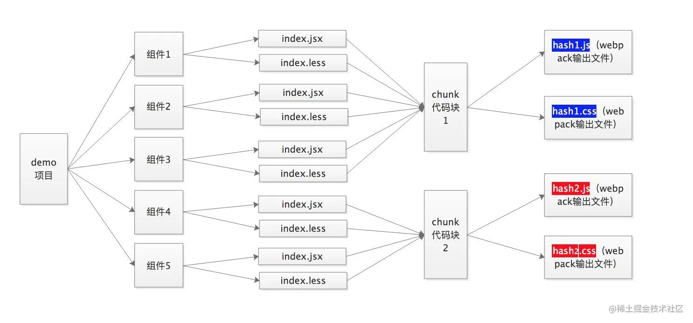
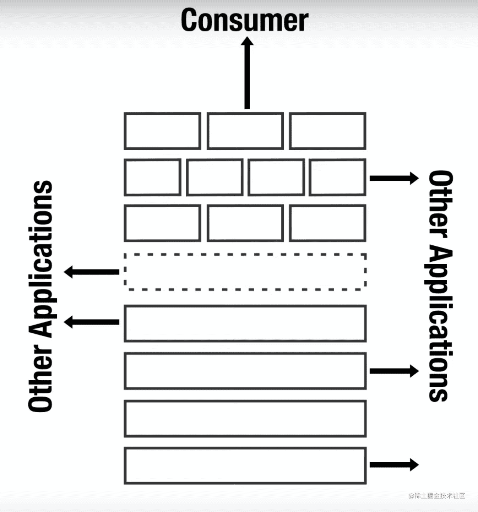

# webpack

## webpack

## 前端模块化

<https://juejin.cn/post/7193887403570888765#heading-9>

> 把复杂代码按功能的不同划分成不同的模块单独维护，提高开发效率，降低维护成本, 模块化只是思想、理论，不包含具体实现；最终的目标，就是拆分模块，分工开发，每个人做好一个模块之后，暴露一些参数、方法给到调用者，演进的道路无非是秉行如何更加优雅，高解耦，高兼容等方向优化

### 模块化的演进

- 第一阶段：仅仅基于文件的划分模块的方式

具体做法就是将每个功能及其相关状态数据各自单独放到不同的文件中，约定每个文件就是一个独立的模块，使用某个模块就是将这个模块引入到页面中，然后直接调用模块中的成员（变量 / 函数）
缺点：所有模块都直接在全局工作，没有私有空间，所有成员都可以在模块外部被访问或者修改，而且模块一段多了过后，容易产生命名冲突，另外无法管理模块与模块之间的依赖关系

- 第二阶段：每个模块暴露一个全局对象，所有模块成员都挂载到这个对象中

具体做法就是在第一阶段的基础上，通过将每个模块「包裹」为一个全局对象的形式实现，有点类似于为模块内的成员添加了「命名空间」的感觉。
通过「命名空间」减小了命名冲突的可能，但是同样没有私有空间，所有模块成员也可以在模块外部被访问或者修改，而且也无法管理模块之间的依赖关系。

- 第三阶段：使用立即执行函数表达式（IIFE：Immediately-Invoked Function Expression）为模块提供私有空间

具体做法就是将每个模块成员都放在一个函数提供的私有作用域中，对于需要暴露给外部的成员，通过挂在到全局对象上的方式实现
有了私有成员的概念，私有成员只能在模块成员内通过闭包的形式访问。

- 第四阶段： 利用 IIFE 参数作为依赖声明使用

具体做法就是在第三阶段的基础上，利用立即执行函数的参数传递模块依赖项。
这使得每一个模块之间的关系变得更加明显。

- 第五阶段： **模块化规范**

Require.js 提供了 AMD 模块化规范，以及一个自动化模块加载器---模块化规范的出现，再之后便有了其他更多标准紧接而来，CommonJS、CMD。。。

### 模块化规范

需：模块化标准+模块加载器

- **CommonJS规范(nodejs提出的一套标准)**

标准：一个文件就是一个模块，每个模块都有单独的作用域，通过 module.exports 导出成员，通过 require 函数载入模块。

缺点：CommonJS是以同步模式加载模块，node执行机制是启动时加载模块，执行过程中不需要加载只需使用，在node中不会有问题；但是在浏览器端页面加载会导致大量同步请求出现，而效率低

- **Sea.js(淘宝推出) + CMD(通用模块定义规范)**

CMD规范类似CommonJS规范 后期也被Require.js兼容了

- **AMD(Asynchronous Module Definition) --- 异步模块定义规范**

模块通过define函数定义

优势：目前绝大多数第三方库都支持AMD规范

缺点： 使用复杂，模块划分细致，模块JS文件会出现请求频繁的情况

- **Require.js**

提供了 AMD 模块化规范，以及一个自动化模块加载器 提供require函数加载模块

#### 模块化默认规范

浏览器环境使用ES Modules

nodejs使用CommonJS

### ES Modules

通过给 script 添加 type = module 的属性使用 ES Modules

1. ESM 自动采用严格模式，忽略 'use strict'
2. 每个 ES Module 都是运行在单独的私有作用域中
3. ESM 是通过 CORS 的方式请求外部 JS 模块的
4. ESM 的 script 标签会延迟执行脚本

- ES Modules in Node.js
  ES Modules in Node.js - 与 CommonJS 交互

  ES Module 中可以导入 CommonJS 模块

  Node v12 之后的版本，可以通过package.json 中添加type字段为module，
  将默认模块系统修改为 ES Module
  此时就不需要修改文件扩展名为 .mjs 了

  如果需要在type=module的情况下继续使用CommonJS，
  需要将文件扩展名修改为 .cjs

ES Modules in Node.js - Babel 兼容方案

安装babel:yarn add @babel/node @babel/core @babel/preset-env --dev
运行babel-node测试:yarn babel-node index.js --presets=@babel/preset-env

CommonJS 模块始终只会导出一个默认成员

```js
module.exports = {
    foo: 'commonjs exports value'
}
exports.foo = 'commonjs exports value'
```

不能在 CommonJS 模块中通过 require 载入 ES Module

### 总结

**前端模块化**
> 模块化的开发方式可以提高代码复用率，方便进行代码的管理。通常一个文件就是一个模块，有自己的作用域，只向外暴露特定的变量和函数。

**模块化有哪几种标准**
> 目前流行的js模块化规范有CommonJS、AMD、CMD以及ES6的模块系统

**ES Modules 和 CommonJS的一些区别**

  1. 使用语法层面，CommonJs是通过module.exports，exports导出，require导入；ESModule则是export导出，import导入
  2. CommonJs是运行时加载模块，ESModule是在静态编译期间就确定模块的依赖
  3. ESModule在编译期间会将所有import提升到顶部，CommonJs不会提升require
  4. CommonJs导出的是一个值拷贝，会对加载结果进行缓存，一旦内部再修改这个值，则不会同步到外部。ESModule是导出的一个引用，内部修改可以同步到外部
  5. CommonJs中顶层的this指向这个模块本身，而ESModule中顶层this指向undefined
  6. CommonJS加载的是整个模块，将所有的接口全部加载进来，ESModule可以单独加载其中的某个接口

## webpack作用

<https://juejin.cn/post/6943468761575849992>

- 模块打包。可以将不同模块的文件打包整合在一起，并且保证它们之间的引用正确，执行有序。利用打包我们就可以在开发的时候根据我们自己的业务自由划分文件模块，保证项目结构的清晰和可读性。

- 编译兼容。在前端的“上古时期”，手写一堆浏览器兼容代码一直是令前端工程师头皮发麻的事情，而在今天这个问题被大大的弱化了，通过webpack的Loader机制，不仅仅可以帮助我们对代码做polyfill，还可以编译转换诸如.less, .vue, .jsx这类在浏览器无法识别的格式文件，让我们在开发的时候可以使用新特性和新语法做开发，提高开发效率。

- 能力扩展。通过webpack的Plugin机制，我们在实现模块化打包和编译兼容的基础上，可以进一步实现诸如按需加载，代码压缩等一系列功能，帮助我们进一步提高自动化程度，工程效率以及打包输出的质量。

## 模块打包运行原理

### webpack打包流程

1. 读取webpack的配置参数；
2. 启动webpack，创建Compiler对象并开始解析项目；
3. 从入口文件（entry）开始解析，并且找到其导入的依赖模块，递归遍历分析，形成依赖关系树；
4. 对不同文件类型的依赖模块文件使用对应的Loader进行编译，最终转为Javascript文件；
5. 整个过程中webpack会通过发布订阅模式，向外抛出一些hooks，而webpack的插件即可通过监听这些关键的事件节点，执行插件任务进而达到干预输出结果的目的。

其中文件的解析与构建是一个比较复杂的过程，在webpack源码中主要依赖于compiler和compilation两个核心对象实现。

compiler对象是一个全局单例，他负责把控整个webpack打包的构建流程。

compilation对象是每一次构建的上下文对象，它包含了当次构建所需要的所有信息，每次热更新和重新构建，compiler都会重新生成一个新的compilation对象，负责此次更新的构建过程。

而每个模块间的依赖关系，则依赖于AST语法树。每个模块文件在通过Loader解析完成之后，会通过acorn库生成模块代码的AST语法树，通过语法树就可以分析这个模块是否还有依赖的模块，进而继续循环执行下一个模块的编译解析。

最终Webpack打包出来的bundle文件是一个IIFE的执行函数。

```js
// webpack 5 打包的bundle文件内容

(() => { // webpackBootstrap
    var __webpack_modules__ = ({
        'file-A-path': ((modules) => { // ... })
        'index-file-path': ((__unused_webpack_module, __unused_webpack_exports, __webpack_require__) => { // ... })
    })
    
    // The module cache
    var __webpack_module_cache__ = {};
    
    // The require function
    function __webpack_require__(moduleId) {
        // Check if module is in cache
        var cachedModule = __webpack_module_cache__[moduleId];
        if (cachedModule !== undefined) {
                return cachedModule.exports;
        }
        // Create a new module (and put it into the cache)
        var module = __webpack_module_cache__[moduleId] = {
                // no module.id needed
                // no module.loaded needed
                exports: {}
        };

        // Execute the module function
        __webpack_modules__[moduleId](module, module.exports, __webpack_require__);

        // Return the exports of the module
        return module.exports;
    }
    
    // startup
    // Load entry module and return exports
    // This entry module can't be inlined because the eval devtool is used.
    var __webpack_exports__ = __webpack_require__("./src/index.js");
})
```

和webpack4相比，webpack5打包出来的bundle做了相当的精简。在上面的打包demo中，整个立即执行函数里边只有三个变量和一个函数方法，__webpack_modules__存放了编译后的各个文件模块的JS内容，**webpack_module_cache** 用来做模块缓存，__webpack_require__是Webpack内部实现的一套依赖引入函数。最后一句则是代码运行的起点，从入口文件开始，启动整个项目。
其中值得一提的是__webpack_require__模块引入函数，我们在模块化开发的时候，通常会使用ES Module或者CommonJS规范导出/引入依赖模块，webpack打包编译的时候，会统一替换成自己的__webpack_require__来实现模块的引入和导出，从而实现模块缓存机制，以及抹平不同模块规范之间的一些差异性。

### sourceMap

sourceMap是一项将编译、打包、压缩后的代码映射回源代码的技术，由于打包压缩后的代码并没有阅读性可言，一旦在开发中报错或者遇到问题，直接在混淆代码中debug问题会带来非常糟糕的体验，sourceMap可以帮助我们快速定位到源代码的位置，提高我们的开发效率。sourceMap其实并不是Webpack特有的功能，而是Webpack支持sourceMap，像JQuery也支持souceMap。

既然是一种源码的映射，那必然就需要有一份映射的文件，来标记混淆代码里对应的源码的位置，通常这份映射文件以.map结尾，里边的数据结构大概长这样：

```js
{
  "version" : 3,                          // Source Map版本
  "file": "out.js",                       // 输出文件（可选）
  "sourceRoot": "",                       // 源文件根目录（可选）
  "sources": ["foo.js", "bar.js"],        // 源文件列表
  "sourcesContent": [null, null],         // 源内容列表（可选，和源文件列表顺序一致）
  "names": ["src", "maps", "are", "fun"], // mappings使用的符号名称列表
  "mappings": "A,AAAB;;ABCDE;"            // 带有编码映射数据的字符串
}
```

其中mappings数据有如下规则：

生成文件中的一行的每个组用“;”分隔；
每一段用“,”分隔；
每个段由1、4或5个可变长度字段组成；

有了这份映射文件，我们只需要在我们的压缩代码的最末端加上这句注释，即可让sourceMap生效：

```js
//# sourceURL=/path/to/file.js.map
```

有了这段注释后，浏览器就会通过sourceURL去获取这份映射文件，通过解释器解析后，实现源码和混淆代码之间的映射。因此sourceMap其实也是一项需要浏览器支持的技术。
如果我们仔细查看webpack打包出来的bundle文件，就可以发现在默认的development开发模式下，每个_webpack_modules__文件模块的代码最末端，都会加上//# sourceURL=webpack://file-path?，从而实现对sourceMap的支持。

## Loader

从上面的打包代码我们其实可以知道，Webpack最后打包出来的成果是一份Javascript代码，实际上在Webpack内部默认也只能够处理JS模块代码，在打包过程中，会默认把所有遇到的文件都当作 JavaScript代码进行解析，因此当项目存在非JS类型文件时，我们需要先对其进行必要的转换，才能继续执行打包任务，这也是Loader机制存在的意义。

### 分类

- pre： 前置 loader
- normal： 普通 loader
- inline： 内联 loader
- post： 后置 loader

执行顺序：

pre > normal > inline > post
相同优先级的 loader 执行顺序为：从右到左，从下到上

```js
// 此时loader执行顺序：loader3 - loader2 - loader1
module: {
  rules: [
    {
      test: /\.js$/,
      loader: "loader1",
    },
    {
      test: /\.js$/,
      loader: "loader2",
    },
    {
      test: /\.js$/,
      loader: "loader3",
    },
  ],
},

// 此时loader执行顺序：loader1 - loader2 - loader3
module: {
  rules: [
    {
      enforce: "pre",
      test: /\.js$/,
      loader: "loader1",
    },
    {
      // 没有enforce就是normal
      test: /\.js$/,
      loader: "loader2",
    },
    {
      enforce: "post",
      test: /\.js$/,
      loader: "loader3",
    },
  ],
},
```

### Loader的配置使用

#### 内联方式：在每个 import 语句中显式指定 loader。（inline loader）

```js
import Styles from 'style-loader!css-loader?modules!./styles.css';
```

含义：

使用 css-loader 和 style-loader 处理 styles.css 文件
通过 ! 将资源中的 loader 分开

inline loader 可以通过添加不同前缀，跳过其他类型 loader

```js
// ! 跳过 normal loader
import Styles from '!style-loader!css-loader?modules!./styles.css';

// -! 跳过 pre 和 normal loader
import Styles from '-!style-loader!css-loader?modules!./styles.css';

// !! 跳过 pre、 normal 和 post loader
import Styles from '!!style-loader!css-loader?modules!./styles.css';
```

#### 配置方式：在 webpack.config.js 文件中指定 loader。（pre、normal、post loader）

```js
// webpack.config.js
module.exports = {
  // ...other config
  module: {
    rules: [
      {
        test: /^your-regExp$/,
        use: [
          {
             loader: 'loader-name-A',
          }, 
          {
             loader: 'loader-name-B',
          }
        ]
      },
    ]
  }
}
```

通过配置可以看出，针对每个文件类型，loader是支持以数组的形式配置多个的，因此当Webpack在转换该文件类型的时候，会按顺序链式调用每一个loader，前一个loader返回的内容会作为下一个loader的入参。因此loader的开发需要遵循一些规范，比如返回值必须是标准的JS代码字符串，以保证下一个loader能够正常工作，同时在开发上需要严格遵循“单一职责”，只关心loader的输出以及对应的输出。

loader函数中的this上下文由webpack提供，可以通过this对象提供的相关属性，获取当前loader需要的各种信息数据，事实上，这个this指向了一个叫loaderContext的loader-runner特有对象。

**当链式调用多个 loader 的时候，请记住它们会以相反的顺序执行。取决于数组写法格式，从右向左或者从下向上执行。像流水线一样，挨个处理每个loader，前一个loader的结果会传递给下一个loader，最后的 Loader 将处理后的结果以 String 或 Buffer 的形式返回给 compiler。**

```js
module.exports = function(source) {
    const content = doSomeThing2JsString(source);
    
    // 如果 loader 配置了 options 对象，那么this.query将指向 options
    const options = this.query;
    
    // 可以用作解析其他模块路径的上下文
    console.log('this.context');
    
    /*
     * this.callback 参数：
     * error：Error | null，当 loader 出错时向外抛出一个 error
     * content：String | Buffer，经过 loader 编译后需要导出的内容
     * sourceMap：为方便调试生成的编译后内容的 source map
     * ast：本次编译生成的 AST 静态语法树，之后执行的 loader 可以直接使用这个 AST，进而省去重复生成 AST 的过程
     */
    this.callback(null, content);
    // or return content;
}
```

### loader的开发

- 创建 loader 的目录及模块文件
- 在 webpack 中配置 rule 及 loader 的解析路径，并且要注意 loader 的顺序，这样在 require 指定类型文件时，我们能让处理流经过指定 laoder。
- 遵循原则设计和开发 loader。

<https://juejin.cn/post/6844903555673882632#heading-8>
<https://juejin.cn/post/6844904146827476999>

```js
// syncLoader.js 同步
const loaderUtils = require('loader-utils')
module.exports = function (source) {
    const options = loaderUtils.getOptions(this)
    console.log(options)
    source += options.message
    // 可以传递更详细的信息
    this.callback(null, source)
}
```

```js
// 异步
const loaderUtils = require('loader-utils')
module.exports = function (source) {
    const options = loaderUtils.getOptions(this)
    const asyncfunc = this.async()
    setTimeout(() => {
        source += '走上人生巅峰'
        asyncfunc(null, res)
    }, 200)
}
```

### 常用loader

1. babel-loader

babel-loader基于babel，用于解析JavaScript文件。babel有丰富的预设和插件，babel的配置可以直接写到options里或者单独写道配置文件里。
Babel是一个Javscript编译器，可以将高级语法(主要是ECMAScript 2015+ )编译成浏览器支持的低版本语法，它可以帮助你用最新版本的Javascript写代码，提高开发效率。

webpack通过babel-loader使用Babel。

2. ts-loader

为webpack提供的 TypeScript loader，打包编译Typescript

3. markdown-loader

markdown编译器和解析器

4. raw-loader

可将文件作为字符串导入

5. file-loader

用于处理文件类型资源，如mp3,jpg/png等图片。返回值为publicPath为准

```js
// file.js
import img from './webpack.png';
console.log(img); // 编译后：https://www.tencent.com/webpack_605dc7bf.png
// webpack.config.js
module.exports = {
  module: {
    rules: [
      {
        test: /\.(png|jpe?g|gif)$/i,
        loader: 'file-loader',
        options: {
          name: '[name]_[hash:8].[ext]',
          publicPath: "https://www.tencent.com",
        },
      },
    ],
  },
};
```

css文件里的图片路径变成如下：

```css
/* index.less */
.tag {
  background-color: red;
  background-image: url(./webpack.png);
}
/* 编译后：*/
background-image: url(https://www.tencent.com/webpack_605dc7bf.png);
```

6. url-loader:

它与file-loader作用相似，也是处理图片的，只不过url-loader可以设置一个根据图片大小进行不同的操作，如果该图片大小大于指定的大小，则将图片进行打包资源，否则将图片转换为base64字符串合并到js文件里。

```js
module.exports = {
  module: {
    rules: [
      {
        test: /\.(png|jpg|jpeg)$/,
        use: [
          {
            loader: 'url-loader',
            options: {
              name: '[name]_[hash:8].[ext]',
              // 这里单位为(b) 10240 => 10kb
              // 这里如果小于10kb则转换为base64打包进js文件，如果大于10kb则打包到对应目录
              limit: 10240,
            }
          }
        ]
      }
    ]
  }
}
```

7. svg-sprite-loader

会把引用的 svg文件 塞到一个个 symbol 中，合并成一个大的SVG sprite，使用时则通过 SVG 的 `<use>` 传入图标 id 后渲染出图标。最后将这个大的 svg 放入 body 中。symbol的id如果不特别指定，就是你的文件名。

8. style-loader

通过注入`<style>`标签将CSS插入到DOM中

9. css-loader

仅处理css的各种加载语法(@import和url()函数等),就像 js 解析 import/require() 一样

10. postcss-loader

PostCSS 是一个允许使用 JS 插件转换样式的工具。 这些插件可以检查（lint）你的 CSS，支持 CSS Variables 和 Mixins， 编译尚未被浏览器广泛支持的先进的 CSS 语法，内联图片，以及其它很多优秀的功能。

11. less-loader

解析less，转换为css

## Plugin

> Webpack 就像一条生产线，要经过一系列处理流程后才能将源文件转换成输出结果。 这条生产线上的每个处理流程的职责都是单一的，多个流程之间有存在依赖关系，只有完成当前处理后才能交给下一个流程去处理。 插件就像是一个插入到生产线中的一个功能，在特定的时机对生产线上的资源做处理。

> Webpack 通过 Tapable 来组织这条复杂的生产线。 Webpack 在运行过程中会广播事件，插件只需要监听它所关心的事件，就能加入到这条生产线中，去改变生产线的运作。 Webpack 的事件流机制保证了插件的有序性，使得整个系统扩展性很好。

如果说Loader负责文件转换，那么Plugin便是负责功能扩展。Loader和Plugin作为Webpack的两个重要组成部分，承担着两部分不同的职责。

上文已经说过，webpack基于发布订阅模式，在运行的生命周期中会广播出许多事件，插件通过监听这些事件，就可以在特定的阶段执行自己的插件任务，从而实现自己想要的功能。

既然基于发布订阅模式，那么知道Webpack到底提供了哪些事件钩子供插件开发者使用是非常重要的，上文提到过compiler和compilation是Webpack两个非常核心的对象，其中compiler暴露了和 Webpack整个生命周期相关的钩子（compiler-hooks），而compilation则暴露了与模块和依赖有关的粒度更小的事件钩子（Compilation Hooks）。

Webpack的事件机制基于webpack自己实现的一套Tapable事件流方案

```js
// Tapable的简单使用
const { SyncHook } = require("tapable");

class Car {
    constructor() {
        // 在this.hooks中定义所有的钩子事件
        this.hooks = {
            accelerate: new SyncHook(["newSpeed"]),
            brake: new SyncHook(),
            calculateRoutes: new AsyncParallelHook(["source", "target", "routesList"])
        };
    }

    /* ... */
}


const myCar = new Car();
// 通过调用tap方法即可增加一个消费者，订阅对应的钩子事件了
myCar.hooks.brake.tap("WarningLampPlugin", () => warningLamp.on());
```

### 开发plugin

Plugin的开发和开发Loader一样，需要遵循一些开发上的规范和原则：

- 插件必须是一个函数或者是一个包含 apply 方法的对象，这样才能访问compiler实例；
- 传给每个插件的 compiler 和 compilation 对象都是同一个引用，若在一个插件中修改了它们身上的属性，会影响后面的插件;
- 异步的事件需要在插件处理完任务时调用回调函数通知 Webpack 进入下一个流程，不然会卡住;

plugin通常是在webpack在打包的某个时间节点做一些操作，我们使用plugin的时候，一般都是new Plugin()这种形式使用，所以，首先应该明确的是，plugin应该是一个类；

plugin的核心在于，apply方法执行时，可以操作webpack本次打包的各个时间节点（hooks，也就是生命周期勾子），在不同的时间节点做一些操作

plugin类里面需要实现一个apply方法，webpack打包时候，会调用plugin的aplly方法来执行plugin的逻辑，这个方法接受一个compiler作为参数，这个compiler是webpack实例

```js
class MyPlugin {
  apply (compiler) {
    // 找到合适的事件钩子，实现自己的插件功能
    compiler.hooks.emit.tap('MyPlugin', compilation => {
        // compilation: 当前打包构建流程的上下文
        console.log(compilation);
        
        // do something...
    })
  }
}
```

### 常用plugin

- html-webpack-plugin
  
基本作用是生成html文件

单页应用可以生成一个html入口，多页应用可以配置多个html-webpack-plugin实例来生成多个页面入口

为html引入外部资源如script、link，将entry配置的相关入口chunk以及mini-css-extract-plugin抽取的css文件插入到基于该插件设置的template文件生成的html文件里面，具体的方式是link插入到head中，script插入到head或body中。

```js
const HtmlWebpackPlugin = require('html-webpack-plugin')

module.exports = {
  entry: 'index.js',
  output: {
    path: __dirname + '/dist',
    filename: 'index_bundle.js'
  },
  plugins: [
    new HtmlWebpackPlugin()
  ]
}
```

html-webpack-plugin 默认将会在 output.path 的目录下创建一个 index.html 文件， 并在这个文件中插入一个 script 标签，标签的 src 为 output.filename。
生成的文件如下：

```html
<!DOCTYPE html>
<html>
  <head>
    <meta charset="utf-8">
    <title>Webpack App</title>
  </head>
  <body>
    <script src="bundle.js"></script>
  </body>
</html>
```

> 当配置多个入口文件 entry 时， 生成的将都会使用 script 引入。
> 如果 webpack 的输出中有任何CSS资源 (例如，使用 mini-css-extract-plugin 提取的 CSS)，那么这些资源将包含在 HTML 头部的 link 标记中。

- clean-webpack-plugin
  
默认情况下，这个插件会删除webpack的output.path中的所有文件，以及每次成功重新构建后所有未使用的资源。
这个插件在生产环境用的频率非常高，因为生产环境经常会通过 hash 生成很多 bundle 文件，如果不进行清理的话每次都会生成新的，导致文件夹非常庞大

- mini-css-extract-plugin
  
本插件会将 CSS 提取到单独的文件中，为每个包含 CSS 的 JS 文件创建一个 CSS 文件。

- webpack.HotModuleReplacementPlugin

- webpack-bundle-analyzer

## webpack优化

<https://juejin.cn/post/7083519723484708878#heading-1>

### 构建时间优化

#### thread-loader

多进程打包，可以大大提高构建的速度，使用方法是将thread-loader放在比较费时间的loader之前，比如babel-loader

由于启动项目和打包项目都需要加速，所以配置在webpack.base.js

```js
npm i thread-loader -D
```

```js
// webpack.base.js
{
        test: /\.js$/,
        use: [
          'thread-loader',
          'babel-loader'
        ],
      }
}
```

#### cache-loader

缓存资源，提高二次构建的速度，使用方法是将cache-loader放在比较费时间的loader之前，比如babel-loader

由于启动项目和打包项目都需要加速，所以配置在webpack.base.js

```js
npm i cache-loader -D
```

```js
// webpack.base.js

{
        test: /\.js$/,
        use: [
          'cache-loader',
          'thread-loader',
          'babel-loader'
        ],
},
```

#### 开启热更新

比如你修改了项目中某一个文件，会导致整个项目刷新，这非常耗时间。如果只刷新修改的这个模块，其他保持原状，那将大大提高修改代码的重新构建时间

只用于开发中，所以配置在webpack.dev.js

```js
// webpack.dev.js

//引入webpack
const webpack = require('webpack');
//使用webpack提供的热更新插件
   plugins: [
   new webpack.HotModuleReplacementPlugin()
    ],
    //最后需要在我们的devserver中配置
     devServer: {
+     hot: true
    },
```

#### exclude & include

exclude：不需要处理的文件

include：需要处理的文件

合理设置这两个属性，可以大大提高构建速度
> 在webpack.base.js中配置

```js
// webpack.base.js
  {
    test: /\.js$/,
    //使用include来指定编译文件夹
    include: path.resolve(__dirname, '../src'),
    //使用exclude排除指定文件夹
    exclude: /node_modules/,
    use: [
      'babel-loader'
    ]
  },
```

#### 构建区分环境

区分环境构建是非常重要的，我们要明确知道，开发环境时我们需要哪些配置，不需要哪些配置；而最终打包生产环境时又需要哪些配置，不需要哪些配置：

开发环境：去除代码压缩、gzip、体积分析等优化的配置，大大提高构建速度

生产环境：需要代码压缩、gzip、体积分析等优化的配置，大大降低最终项目打包体积

#### 提升webpack版本

### 打包体积优化

主要是打包后项目整体体积的优化，有利于项目上线后的页面加载速度提升

#### CSS代码压缩

CSS代码压缩使用css-minimizer-webpack-plugin，效果包括压缩、去重
> 代码的压缩比较耗时间，所以只用在打包项目时，所以只需要在webpack.prod.js中配置
> npm i css-minimizer-webpack-plugin -D

```js
// webpack.prod.js

const CssMinimizerPlugin = require('css-minimizer-webpack-plugin')

  optimization: {
    minimizer: [
      new CssMinimizerPlugin(), // 去重压缩css
    ],
  }
```

#### JS代码压缩

JS代码压缩使用terser-webpack-plugin，实现打包后JS代码的压缩
> 代码的压缩比较耗时间，所以只用在打包项目时，所以只需要在webpack.prod.js中配置
> npm i terser-webpack-plugin -D

```js
// webpack.prod.js

const TerserPlugin = require('terser-webpack-plugin')

  optimization: {
    minimizer: [
      new CssMinimizerPlugin(), // 去重压缩css
      new TerserPlugin({ // 压缩JS代码
        terserOptions: {
          compress: {
            drop_console: true, // 去除console
          },
        },
      }), // 压缩JavaScript
    ],
  }
```

#### tree-shaking

tree-shaking简单说作用就是：只打包用到的代码，没用到的代码不打包，而webpack5默认开启tree-shaking，当打包的mode为production时，自动开启tree-shaking进行优化

```js
module.exports = {
  mode: 'production'
}
```

#### source-map类型

source-map的作用是：方便你报错的时候能定位到错误代码的位置。它的体积不容小觑，所以对于不同环境设置不同的类型是很有必要的。

开发环境的时候我们需要能精准定位错误代码的位置

```js
// webpack.dev.js

module.exports = {
  mode: 'development',
  devtool: 'eval-cheap-module-source-map'
}
```

生产环境，我们想开启source-map，但是又不想体积太大，那么可以换一种类型

```js
// webpack.prod.js

module.exports = {
  mode: 'production',
  devtool: 'nosources-source-map'
}
```

#### 打包体积分析

使用webpack-bundle-analyzer可以审查打包后的体积分布，进而进行相应的体积优化
> 只需要打包时看体积，所以只需在webpack.prod.js中配置
> npm i webpack-bundle-analyzer -D

```js
// webpack.prod.js

const {
  BundleAnalyzerPlugin
} = require('webpack-bundle-analyzer')

  plugins: [
    new BundleAnalyzerPlugin(),
]
```

### 用户体验优化

#### 模块懒加载

如果不进行模块懒加载的话，最后整个项目代码都会被打包到一个js文件里，单个js文件体积非常大，那么当用户网页请求的时候，首屏加载时间会比较长，使用模块懒加载之后，大js文件会分成多个小js文件，网页加载时会按需加载，大大提升首屏加载速度

```js
// src/router/index.js

const routes = [
  {
    path: '/login',
    name: 'login',
    component: login
  },
  {
    path: '/home',
    name: 'home',
    // 懒加载
    component: () => import('../views/home/home.vue'),
  },
]
```

#### Gzip

开启Gzip后，大大提高用户的页面加载速度，因为gzip的体积比原文件小很多，当然需要后端的配合，使用compression-webpack-plugin
> 只需要打包时优化体积，所以只需在webpack.prod.js中配置
> npm i compression-webpack-plugin -D

```js
// webpack.prod.js

const CompressionPlugin = require('compression-webpack-plugin')

  plugins: [
    // 之前的代码...
    
    // gzip
    new CompressionPlugin({
      algorithm: 'gzip',
      threshold: 10240,
      minRatio: 0.8
    })
  ]
```

#### 小图片转base64

对于一些小图片，可以转base64，这样可以减少用户的http网络请求次数，提高用户的体验。webpack5中url-loader已被废弃，改用asset-module
> 在webpack.base.js中配置

```js
// webpack.base.js

{
   test: /\.(png|jpe?g|gif|svg|webp)$/,
   type: 'asset',
   parser: {
     // 转base64的条件
     dataUrlCondition: {
        maxSize: 25 * 1024, // 25kb
     }
   },
   generator: {
     // 打包到 image 文件下
    filename: 'images/[contenthash][ext][query]',
   },
},
```

#### 合理配置hash

我们要保证，改过的文件需要更新hash值，而没改过的文件依然保持原本的hash值，这样才能保证在上线后，浏览器访问时没有改变的文件会命中缓存，从而达到性能优化的目的
> 在webpack.base.js中配置

```js
// webpack.base.js

  output: {
    path: path.resolve(__dirname, '../dist'),
    // 给js文件加上 contenthash
    filename: 'js/chunk-[contenthash].js',
    clean: true,
  },
```

## webpack hash

<https://juejin.cn/post/6921682416465608711>
<https://juejin.cn/post/6844903942384517127>

### Webpack hash分类

#### hash

使用webpack构建时hash是使用最多的一种，webpack构建后整个项目的js和css输出文件的hash都相同；例如一个项目有6个组件，需要把组件1、2、3作为代码块（chunk）输出一组js和css文件，组件4、5作为代码块（chunk）输出一组js和css文件，webpack如下配置：

```js
output: {
    path: path.resolve(__dirname, OUTPUT_PATH),
    filename: '[name].[hash].js',// 使用hash
    publicPath: '/dist/webpack/'
  }
```

通过webpack构建完后输出的第一组js、css文件的hash相同，并且第二组和第一组的hash也相同，下图是hash在项目中的效果：


输出全部使用hash的情况

- 每个文件都具有相同的哈希值，因为它hash是基于我们使用的所有源文件生成的。
- 如果我们重新运行该构建而不更改任何内容，则生成的hash将保持不变。
- 如果我们仅编辑一个文件，则hash值将发生变化，并且所有生成捆绑的名称中都会包含此新hash。

#### chunkhash

chunkhash相对hash影响范围比较小，使用chunkhash时，每一个代码块（chunk）输出文件对应一个hash，某源文件被修改后，只有该源文件所在代码块（chunk）的输出文件的hash会变化；例如一个项目有6个组件，需要把组件1、2、3作为代码块（chunk）输出一组js和css文件，组件4、5作为代码块（chunk）输出一组js和css文件，webpack如下配置：

```js
output: {
    path: path.resolve(__dirname, OUTPUT_PATH),
    filename: '[name].[chunkhash].js', // 使用chunkhash
    publicPath: '/dist/webpack/'
  }
```

通过webpack打包构建完后输出的两组hash不同，但是每一组内部js和css的hash相同，下图是chunkhash在项目中的效果：



输出的结果全部使用chunkhash的情况

- chunkhash是根绝不同的入口进行依赖文件解析，构建对应的chunk（模块），生成对应的hash值。
- 在使用上来说：我们可以把一些公共库和程序入口文件区分开来，单独打包构建，接着可以采用chunkhash方式来生成hash值，那么只要我们不改动公共库的代码，就可以保证其hash值不受影响，这样也能起到缓存的作用。

#### contenthash

当使用mini-css-extract-plugin插件时还可以使用contenthash来获取文件的hash，contenthash相对于chunkhash影响范围更小；每一个代码块（chunk）中的js和css输出文件都会独立生成一个hash，当某一个代码块（chunk）中的js源文件被修改时，只有该代码块（chunk）输出的js文件的hash会发生变化；例如一个项目有6个组件，需要把组件1、2、3作为代码块（chunk）输出一组js和css文件，组件4、5作为代码块（chunk）输出一组js和css文件，webpack如下配置：

```js
output: {
    path: path.resolve(__dirname, OUTPUT_PATH),
    filename: '[name].[contenthash].js', // 使用contenthash
    publicPath: '/dist/webpack/'
  }
```

通过webpack打包构建完后输出的两组hash不同，而且每一组内部js和css的hash也不同，下图是contenthash在项目中的效果：


输出的结果全部使用contenthash的情况

- 每个生成的文件都名称都有一个唯一的hash值，该哈希值是根据该文件的内容计算得出的。
- 当要构建的文件内容发生改变时，就会生成新的hash值，且该文件的改变并不会影响和它同一个模块下的其他文件。

#### 总结

所以如果使用了hash，并不是每次都会重新生成新的hash，需要看具体使用的哪种hash策略。

- hash是跟整个项目的构建相关，只要项目里有文件更改，整个项目构建的hash值都会更改，并且全部文件都共用相同的hash值。（粒度整个项目）
- chunkhash 是根据不同的入口进行依赖文件解析，构建对应的chunk（模块），生成对应的hash值。只有被修改的chunk（模块）在重新构建之后才会生成新的hash值，不会影响其他的chunk。（粒度entry的每个入口文件）。
- contenthash是跟每个生成的文件有关，每个文件都有一个唯一的hash值。当要构建的文件内容发生改变时，就会生成新的hash值，且该文件的改变并不会影响和它同一个模块下的其他文件。（粒度每个文件的内容）。

**Webpack如果使用了hash命名，是否每次都会重新生成hash？简单说一下Webpack的几种hash策略？**
综上所以，这道题如何回答呢～那就是 Webpack 中如果使用了hash命名，并不是每次都会重新生成新的hash，需要看具体使用的是哪种hash策略了。

### Webpack的hash原理
>
> webpack的hash是通过crypto加密和哈希算法实现的，webpack提供了hashDigest（在生成 hash 时使用的编码方式，默认为 'hex'）、hashDigestLength（散列摘要的前缀长度，默认为 20）、hashFunction（散列算法，默认为 'md5'）、hashSalt（一个可选的加盐值）等参数来实现自定义hash；下面依次讲述三种hash生成策略。

webpack的三种hash生成策略都是根据源码内容来生成，只是该源码已经被webpack封装成能在webpack环境中运行的代码了，包含每一个源文件的绝对路径；webpack会在build阶段根据源码给对应的模块（module）生成一个_buildHash（后续根据该值生成模块的hash）.
可以看到源码中包含绝对路径。

webpack 在seal阶段生成三种hash，最后根据output的配置决定使用哪种hash，webpack通过执行。

#### hash 和chunkhash的生成过程

下面主要讲一下 hash的生成过程， 其中 chunkhash 的生成过程包含在其中。
webpack生成hash的步骤：

- 第一步：是获取 Compilation下面的所有modules，把所有的module在build阶段生成的_buildHash作为内容生产一个新的hash值；

- 第二步：获取到所有的代码块（chunks），分别把代码块（chunk）中包含的module的hash作为内容生成 代码块（chunk）的hash，该hash就是配置 chunkhash 时需要使用的hash值；

- 第三步（最后）：把所有代码块（chunks）的hash作为内容生产一个hash就是最终的hash

#### contenthash生成过程

contenthash 生成与前两种hash生成方式不一样，它是通过mini-css-extract-plugin 和 JavascriptModulesPlugin 插件生成的hash;

- mini-css-extract-plugin是webpack打包构建时把css类型的module单独分类出来的插件，使用该插件时会为css类型的文件单独生成hash；它会把代码块（chunk）中所有类型为css/mini-extract 的module的hash作为内容生成chunkhash。

```js
// mini-css-extract-plugin插件的css文件hash生成的钩子函数
compilation.hooks.contentHash.tap(pluginName, chunk =>{
    const { outputOptions } = compilation;
    const { hashFunction, hashDigest, hashDigestLength } = outputOptions;
    const hash = createHash(hashFuntion);
    //把chunk中所有类型为 css/mini-extract的module的hash作为内容生成hash
    for(const m of chunk.modulesIterable){
        if(m.type === MODULE_TYPE){
            m.updateHash(hash);
        }
    }
    const { contentHash } = chunk;
    // 把生成的内容放入chunk对象的contentHash中
    contentHash[MODULE_TYPE] = hash.digest(hashDigest).substring(0,hashDigestLength);
});
```

- contentHash钩子触发时会调用JavascriptModulesPlugin插件注册的contentHash事件，把代码块（chunk）中所有类型为函数的module的hash作为内容生成hash。

```js
// JavascriptModulesPlugin插件为js生成contentHash的钩子函数
compilation.hooks.contentHash.tap("JavascriptModulesPlugin",chunk =>{
    //...此处有删减
    for( const m of chunk.modulesIterable){
        if(typeof m.source ==="function"){
            hash.update(m.hash);
        }
    }
    chunk.contentHash.javascript = hash.digest(hashDigest).substr(0.hashDigestLength);
});
```

## webpack拆包

<https://juejin.cn/post/7118953143475372039>

Webpack 默认是将依赖打包成一个文件，这样优点是减少资源请求数，但当依赖增多，体积增大，一个资源的加载速度就会减慢

为什么需要 splitChunks？
先来举个简单的栗子，wepack 设置中有 3 个入口文件：a.js、b.js 和 c.js，每个入口文件都同步 import 了 m1.js，不设置 splitChunks，配置下 webpack-bundle-analyzer 插件用来查看输出文件的内容，打包输出是这样的：


从分析图中可以比较直观的看出，三个输出 bundle 文件中都包含了 m1.js 文件，这说明有重复的模块代码。splitChunks 的目的就是用来把重复的模块代码分离到单独的文件，以异步加载的方式来节省输出文件的体积。splitChunks 的配置项很多而且感觉官方文档的一些描述不是很清楚，下面通过一些重点配置属性和场景解释来帮助大家理解和弄懂如何配置 splitChunks。为方便理解和简单演示，webpack 和 splitChunks 的初始设置如下：

```js
const path = require('path');
const BundleAnalyzerPlugin =
  require('webpack-bundle-analyzer').BundleAnalyzerPlugin;

module.exports = {
  mode: 'development',
  entry: {
    a: './src/a.js',
    b: './src/b.js',
    c: './src/c.js',
  },
  output: {
    path: path.resolve(__dirname, 'dist'),
    filename: '[name].bundle.js',
    clean: true,
  },
  optimization: {
    splitChunks: {
      chunks: 'async',
      
      // 生成 chunk 的最小体积（以 bytes 为单位）。
      // 因为演示的模块比较小，需要设置这个。
      minSize: 0,
    },
  },
  plugins: [new BundleAnalyzerPlugin()],
};
```

## webpack5新特性

### 内置清除输出目录

在4.x版本时我们经常用的一个插件就是clean-webpack-plugin用来每次打包的时候清空dist目录。在5.x版本中，我们只需要一个配置项即可开启此功能。在package.json中添加scripts脚本build: webpack，接着配置webpack.config.js。直接运行npm run build就可以看到效果了。

```js
//webpack.config.js
module.exports = {
    mode: "production",
    output: {
        filename: "[name].[hash:5].js",
        clean: true,  //开启每次打包自动清除输出目录
    }
}
```

### 更优雅的处理资源模块

在4.x版本时我们处理资源文件通常要装很多个loader来处理不同的文件。在5.x版本中webpack为我们内置了处理资源的模块，我们只需要按照它的写法就可以达到跟之前一样的效果不需要额外安装任何加载器。在根目录下新建assets，里面存放四个文件，分别是gif、png、jpg、txt。我们想针对这四个文件做不同处理，我们只需要配置output.assetModuleFilename和module.rules就能达到想要的效果。

```js
//index.js
import gif from "../assets/123.gif";
import png from "../assets/456.png";
import txt from "../assets/789.txt";
import jpg from "../assets/91011.jpg";

console.log("gif", gif); //期望输出结果根据文件大小决定是否是路径还是base64
console.log("png", png); //期望输出结果是路径
console.log("txt", txt); //期望输出结果是原始内容
console.log("jpg", jpg); //期望输出结果是base64
```

```js
//webpack.config.js
const HtmlWebpackPlugin = require("html-webpack-plugin");

module.exports = {
    mode: "development",
    output: {
        filename: "[name].[hash:5].js",
        clean: true,
        assetModuleFilename: "assets/[hash:6][ext]", //用来配置资源模块输出的位置以及文件名
    },
    plugins: [
        new HtmlWebpackPlugin({
            template: "./index.html"
        }),
    ],
    module: {
        rules: [
 
            {
                test: /\.png/,          //相当于4.x版本使用的file-loader
                type: "asset/resource", //将png图片使用文件的方式打包
            },
            {
                test: /\.txt/,
                type: "asset/source",   //将文件内容原封不动的放到asset中
            },
            {
                test: /\.jpg/,          //相当于4.x版本的url-loader
                type: "asset/inline",   //jpg文件都处理成base64方式存储
            },
            {
                test: /\.gif/,
                type: "asset",                  
                generator: {
                    filename: "gif/[hash:6][ext]",   //如果处理出来的是文件存放位置命名规则是什么，会覆盖上面assetModuleFilename配置项
                },
                parser: {
                    dataUrlCondition: {
                        maxSize: 4 * 1024,  //如果文件尺寸小于4kb那么使用base64的方式，大于使用文件
                    }
                }
            },
        ]
    }
}
```

注意：rules中的每一项的type都要按照固定格式书写来处理不同的模块。

### 打包体积优化
  
5.x版本内置的优化做的非常多，对模块的合并、tree shaking、作用域的提升更加智能。举个例子，现有两个不同版本项目一个4.x一个5.x。两个项目中都有两个模块：入口模块index.js和handler.js。其中index依赖handler中的某个方法。所以他们会被构建为一个chunk打包到一个文件中。

```js
//index.js
import { handler1 } from "./handler"

const init = () => {
    const result = handler1();
    console.log("init" + result);
}

init();
```

```js
//handler.js
export const handler1 = () => {
    return handler2();
}

export const handler2 = () => {
    return "handler2";
}
```

其实最终逻辑只是为了打印init + handler2。只是绕了好几个弯，来看一下两个版本的项目在生产环境下同样的代码打包出来的结果有啥不一样。

4.x版本打包结果


5.x版本打包结果


可以看到4.x版本的打包结果里有非常多的代码。5.x版本竟然可以将优化做到如此极致。它发现我们的目的就是打印一句话，直接帮我们运算好了最终的结果。这里有个小细节，为什么可以如此智能？如果有深入了解过tree shaking的同学应该知道，使用按需导出和按需导入可以更好的让tree shaking发挥作用，如果我这里改用默认导出和默认导入的话就webpack就没有那么智能了，所以在书写模块时，尽量使用按需导出和按需导入。

### 打包缓存

在4.x版本中需要使用cache-loader来对打包结果进行缓存。在5.x版本中，无需再次安装cache-loader，如果没有做任何配置，默认就开启了打包缓存，不过是缓存到内存(memory)中，内存的空间多么宝贵啊，有些时候内存可能还不够用，我们就可以对cache配置，将缓存结果缓存到硬盘(filesystem)中。同时也可以指定缓存文件被保存的位置。

```js
// webpack.config.js
const path = require("path");

module.exports = {
    mode: "production",
    cache: {
        type: "filesystem", //缓存到内存还是硬盘中 默认为内存memory
        cacheDirectory: path.resolve(__dirname, '.temp_cache'), //缓存保存的位置
    },
}
```

### 模块联邦

见微前端部分

## 微前端

微前端就是可以一个页面跑多个 vue、react 甚至 jquery 等不同项目，它之间的 JS、CSS 相互隔离运行，不会相互影响，但也有通信机制可以通信。

### 特性

- 技术栈无关
主框架不限制接入应用的技术栈，微应用具备完全自主权
- 独立开发、独立部署
微应用仓库独立，前后端可独立开发，部署完成后主框架自动完成同步更新
- 增量升级
在面对各种复杂场景时，我们通常很难对一个已经存在的系统做全量的技术栈升级或重构，而微前端是一种非常好的实施渐进式重构的手段和策略
- 独立运行时
每个微应用之间状态隔离，运行时状态不共享

### NPM 方式共享模块

如下图所示，正常的代码共享需要将依赖作为 Lib 安装到项目，进行 Webpack 打包构建再上线，如下图：


对于项目 Home 与 Search，需要共享一个模块时，最常见的办法就是将其抽成通用依赖并分别安装在各自项目中。

虽然 Monorepo 可以一定程度解决重复安装和修改困难的问题，但依然需要走本地编译。

### UMD  方式共享模块

真正 Runtime 的方式可能是 UMD 方式共享代码模块，即将模块用 Webpack UMD 模式打包，并输出到其他项目中。这是非常普遍的模块共享方式：


对于项目 Home 与 Search，直接利用 UMD 包复用一个模块。但这种技术方案问题也很明显，就是包体积无法达到本地编译时的优化效果，且库之间容易冲突。

### 微前端方案

micro-frontends (MFE) 也是最近比较火的模块共享管理方式，微前端就是要解决多项目并存问题，多项目并存的最大问题就是模块共享，不能有冲突。

由于微前端还要考虑样式冲突、生命周期管理，所以本文只聚焦在资源加载方式上。微前端一般有两种打包方式：

子应用独立打包，模块更解耦，但无法抽取公共依赖等。
整体应用一起打包，很好解决上面的问题，但打包速度实在是太慢了，不具备水平扩展能力。

#### iframe

- 特点
  - 接入比较简单
  - 隔离非常稳完美
  - 不足

- 缺点
  - dom割裂感严重，弹框只能在iframe，而且有滚动条
  - 通讯非常麻烦，而且刷新iframe url状态丢失
  - 前进后退按钮无效

#### qiankun

qiankun 方案是基于 single-spa(微前端框架) 的微前端方案。

- 特点
  - html entry 的方式引入子应用，相比 js entry 极大的降低了应用改造的成本；
  - 完备的沙箱方案，js 沙箱做了 SnapshotSandbox、LegacySandbox、ProxySandbox 三套渐进增强方案，css 沙箱做了 strictStyleIsolation、experimentalStyleIsolation 两套适用不同场景的方案；
  - 做了静态资源预加载能力；
  
- 不足
  - 适配成本比较高，工程化、生命周期、静态资源路径、路由等都要做一系列的适配工作；
  - css 沙箱采用严格隔离会有各种问题，js 沙箱在某些场景下执行性能下降严重；
  - 无法同时激活多个子应用，也不支持子应用保活；
  - 无法支持 vite 等 esmodule 脚本运行；

#### micro-app

micro-app 是基于 webcomponent + qiankun sandbox 的微前端方案。

- 特点
  - 使用 webcomponet 加载子应用相比 single-spa 这种注册监听方案更加优雅；
  - 复用经过大量项目验证过 qiankun 的沙箱机制也使得框架更加可靠；
  - 组件式的 api 更加符合使用习惯，支持子应用保活；
  - 降低子应用改造的成本，提供静态资源预加载能力；

- 不足
  - 接入成本较 qiankun 有所降低，但是路由依然存在依赖； （虚拟路由已解决）
  - 多应用激活后无法保持各子应用的路由状态，刷新后全部丢失； （虚拟路由已解决）
  - css 沙箱依然无法绝对的隔离，js 沙箱做全局变量查找缓存，性能有所优化；
  - 支持 vite 运行，但必须使用 plugin 改造子应用，且 js 代码没办法做沙箱隔离；
  - 对于不支持 webcompnent 的浏览器没有做降级处理；

底层原理 js隔离跟qiankun类似也是使用proxy + with，css隔离自定义前缀类似于scoped

#### EMP Module Federation 模块联邦

EMP 方案是基于 webpack 5 module federation 的微前端方案。


从图中可以看到，这个方案是直接将一个应用的包应用于另一个应用，同时具备整体应用一起打包的公共依赖抽取能力。

让应用具备模块化输出能力，其实开辟了一种新的应用形态，即 “中心应用”，这个中心应用用于在线动态分发 Runtime 子模块，并不直接提供给用户使用：



对微前端而言，这张图就是一个完美的主应用，因为所有子应用都可以利用 Runtime 方式复用主应用的 Npm 包和模块，更好的集成到主应用中。

- 特点
  - webpack 联邦编译可以保证所有子应用依赖解耦；
  - 应用间去中心化的调用、共享模块；
  - 模块远程 ts 支持；

- 不足
  - 对 webpack 强依赖，老旧项目不友好；
  - 没有有效的 css 沙箱和 js 沙箱，需要靠用户自觉；
  - 子应用保活、多应用激活无法实现；
  - 主、子应用的路由可能发生冲突；

底层原理 这个东西有点类似于拆包，也可以叫模块共享，例如React有个模块可以共享给Vue项目用Vue2的组件可以共享给Vue3用。

模块联邦本身是一个普通的 Webpack 插件 ModuleFederationPlugin，插件有几个重要参数：

Webpack5 模块联邦让 Webpack 达到了线上 Runtime 的效果，让代码直接在项目间利用 CDN 直接共享，不再需要本地安装 Npm 包、构建再发布了。

微前端它的简要目的就是为了将一个大型项目拆分成一个个的小项目。

如何暴露和导入

- 暴露模块

在webpack.config.js中增加模块联邦配置。其实就是一个plugins插件，它的位置在webpack/lib/container/ModuleFederationPlugin，我们只需要引入即可。

```js
// paas项目的 webpack.config.js
const ModuleFederationPlugin = require("webpack/lib/container/ModuleFederationPlugin");

module.exports = {
    mode: "development",
    plugins: [
        new ModuleFederationPlugin({
            name: "paas",
            filename: "paas-file-entry.js",
            remotes: {
              app_two: "app_two_remote",
              app_three: "app_three_remote"
            },
            exposes: {
                "./paasComp": "./src/paasComp.js"
            }
        })
    ],
}
```

- name表示的是当前模块联邦的名称，它会生成一个全局变量，必须唯一，通过该变量可以获取当前模块联邦所有暴露的模块。比如当前微前端的项目有十个项目，这十个项目的模块联邦名字必须是唯一的。一般来说跟项目名称相统一。

- filename表示通过模块联邦暴露出去文件的文件名。有了name和filename，到时候需要导入的项目远程请求的文件名字就是name/filename。注意：不要跟下面设置具体某个模块的路径搞混了，一个是请求所有暴露出去文件的文件名，一个是具体引入哪个模块的路径。

- remotes 可以将其他项目的 name 映射到当前项目中。

- exposes表示到底需要暴露出去哪些模块，里面的每一项的key代表的是相对于模块联邦的路径，决定了该模块到时候的访问路径是name/key，value代表的是具体文件的路径，这里有点绕，如果按照我们上面写的配置项的话，到时候引入路径就是paas/paasComp就可以找到paasComp.js文件了。注意：同样的，不要搞混了，这里跟filename无关。

- 引入模块

```js
// saas项目的 webpack.config.js
const ModuleFederationPlugin = require("webpack/lib/container/ModuleFederationPlugin");

module.exports = {
    mode: "development",
    plugins: [
        new ModuleFederationPlugin({
            remotes: {
                paas: "paas@http://localhost:8080/paas-file-entry.js"
            }
        })
    ],
}
```

remotes表示引入其他项目导出的模块联邦，一个属性代表引入一个其他项目的模块联邦，key值代表名称，可修改，到时候引入就是import paas from key/前面设置暴露出来模块的名称。属性值代表的意思是暴露出来文件的name@服务器地址/暴露出来的filename。


- 处理共享模块


如果saas业务和paas业务都使用了第三方模块jquery，那么两个项目都会引入一次，如何通过模块联邦处理共享模块呢？我们只需要在原有的基础上配置shared即可。配置过后，两个项目谁先启动，另一个就会引入对方服务器地址的jquery了。

```js
//给两个项目都配置上shared
const ModuleFederationPlugin = require("webpack/lib/container/ModuleFederationPlugin");
module.exports = {
    plugins: [
        new ModuleFederationPlugin({
            shared: {
                jquery: {
                     singleton: true,//整个微前端项目全局唯一
                }
            }
        })
    ],
}
```

#### 无界微前端

- 特点
  - 接入简单只需要四五行代码
  - 不需要针对vite额外处理
  - 预加载
  - 应用保活机制

- 不足
  - 隔离js使用一个空的iframe进行隔离
  - 子应用axios需要自行适配
  - iframe沙箱的src设置了主应用的host，初始化iframe的时候需要等待iframe的location.orign从 'about:blank'- 初始化为主应用的host，这个采用的计时器去等待的不是很悠亚。

底层原理 使用shadowDom 隔离css，js使用空的iframe隔离，通讯使用的是proxy

### 总结

**微前端就是在路由变化的时候，加载对应应用的代码，并在容器内跑起来。**
qiankun、wujie、micro-app 的区别主要还是实现容器（或者叫沙箱）上有区别，比如 qiankun 是 function + proxy + with，micro-app 是 web components，而 wujie 是 web components 和 iframe。
流程都是差不多的。
(类似于后台的微服务，其实就是把一个前端应用拆分成多个可以独立的小功能应用，支持独立运行、开发和部署。

我理解和目前的模块拆分的区别就是类似于npm包这种不能独立发布到线上运行，必须依附到一个独立应用才能运行其功能。

微前端是一个架构体系的概念，并不是和一个具体的框架和工具。)

## 受控组件和非受控组件

**对某个组件状态的掌控，它的值是否只能由用户设置，而不能通过代码控制。**

我们知道，在React中定义了一个input输入框的话，它并没有类似于Vue里v-model的这种双向绑定功能。也就是说，我们并没有一个指令能够将数据和输入框结合起来，用户在输入框中输入内容，然后数据同步更新。

```js
class TestComponent extends React.Component {
  render () {
    return <input name="username" />
  }
}
```

用户在界面上的输入框输入内容时，它是自己维护了一个"state"，这样的话就能根据用户的输入自己进行UI上的更新。(这个state并不是我们平常看见的this.state，而是每个表单元素上抽象的state)
 想想此时如果我们想要控制输入框的内容可以怎样做呢？输入框的内容取决的是input中的value属性，那么我们可以在this.state中定义一个名为username的属性，并将input上的value指定为这个属性：

```js
class TestComponent extends React.Component {
  constructor (props) {
    super(props);
    this.state = { username: 'lindaidai' };
  }
  render () {
    return <input name="username" value={this.state.username} />
  }
}
```

但是这时候你会发现input的内容是只读的，因为value会被我们的this.state.username所控制，当用户输入新的内容时，this.state.username并不会自动更新，这样的话input内的内容也就不会变了。
此时我们可以用一个onChange事件来监听输入内容的改变并使用setState更新this.state.username：

```jsx
class TestComponent extends React.Component {
  constructor (props) {
    super(props);
    this.state = {
      username: "lindaidai"
    }
  }
  onChange (e) {
    console.log(e.target.value);
    this.setState({
      username: e.target.value
    })
  }
  render () {
    return <input name="username" value={this.state.username} onChange={(e) => this.onChange(e)} />
  }
}
```

现在不论用户输入什么内容state与UI都会跟着更新了，并且我们可以在组件中的其它地方使用this.state.username来获取到input里的内容，也可以通过this.setState()来修改input里的内容。

在HTML的表单元素中，它们通常自己维护一套state，并随着用户的输入自己进行UI上的更新，这种行为是不被我们程序所管控的。而如果将React里的state属性和表单元素的值建立依赖关系，再通过onChange事件与setState()结合更新state属性，就能达到控制用户输入过程中表单发生的操作。**被React以这种方式控制取值的表单输入元素就叫做受控组件。**

### select受控组件

对于其它的表单元素,受控组件使用起来也差不多，可能就是属性名和事件不同而已；

例如input类型为text的表单元素中使用的是`value`和`onChange`;

对于textarea标签也和它一样是使用`value`和`onChange`;

对于select表单元素来说，React中将其转化为受控组件可能和原生HTML中有一些区别。
在原生中，我们默认一个select选项选中使用的是selected，比如下面这样：

#### 单选select

```html
<select>
  <option value="sunshine">阳光</option>
  <option value="handsome">帅气</option>
  <option selected value="cute">可爱</option>
  <option value="reserved">高冷</option>
</select>
```

给"可爱"的选项设置了selected，默认选中的就是它了。
但是如果是使用React受控组件来写的话就不用那么麻烦了，因为它允许在根select标签上使用value属性，去控制选中了哪个。这样的话，对于我们也更加便捷，在用户每次重选之后我们只需要在根标签中更新它。

```js
class SelectComponent extends React.Component {
  constructor(props) {
    super(props);
    this.state = { value: 'cute' };
  }
  handleChange(event) {
    this.setState({value: event.target.value});
  }
  handleSubmit(event) {
    alert(this.state.value);
    event.preventDefault();
  }
  render() {
    return (
      <form onSubmit={(e) => this.handleSubmit(e)}>
        <label>
          <select value={this.state.value} onChange={(e) => this.handleChange(e)}>
            <option value="sunshine">阳光</option>
            <option value="handsome">帅气</option>
            <option value="cute">可爱</option>
            <option value="reserved">高冷</option>
          </select>
        </label>
        <input type="submit" value="提交" />
      </form>
    );
  }
}
export default SelectComponent;
```

#### 多选select

多选select的话，对比单选来说，只有这两处改动：

- 给select标签设置multiple属性为true
- select标签value绑定的值为一个数组

Mac，Chrome 测试这个多选好像是有问题的？

#### 动态表单受控组件案例

实现一个组件，传入以下数组，自动渲染出表单：

(CInput代表一个输入框，CSelect代表一个选择框)

```js
// 决定表单的结构
const formConfig = [
  {
    Component: CInput,
    label: '姓名',
    field: 'name',
  },
  {
    Component: CSelect,
    label: '性别',
    field: 'sex',
    options: [{ label: '男', value: 'man' }, { label: '女', value: 'woman' }]
  }
]
// 决定表单的内容
this.state = {
  name: 'dudu',
  sex: 'man'
}
```

也就是来实现一个简单的动态表单，看看受控组件在其中的应用。

formConfig决定了表单的结构，也就是定义表单中会有哪些项

this.state中定义了表单中各项的值是什么，它与formConfig是靠formConfig中各项的field字段来建立链接的。

```jsx
import React, { Component } from 'react';
import { CInput, CSelect } from './components'
export default class FormComponent extends Component {
 constructor (props) {
    super(props);
    this.state = {
      name: '霖呆呆',
      sex: 'man'
    }
  }
  formConfig = [
    {
      Component: CInput,
      label: '姓名',
      field: 'name',
    },
    {
      Component: CSelect,
      label: '性别',
      field: 'sex',
      options: [{ label: '男', value: 'man' }, { label: '女', value: 'woman' }]
    }
  ]
  render () { // 重点在这
    return (
      <form>
        {
          this.formConfig.map((item) => { // 枚举formConfig
            const { Type, field, name } = item;
            const ControlComponent = item.Component; // 提取Component
            return (
              <ControlComponent key={field} />
            )
          })
        }
      </form>
    )
  }
}
```

可以看到，render部分我们做了这么几件事：

- 枚举formConfig数组
- 提取出每一项里的Component，赋值给ControlComponent
- 渲染出每一项Component

ControlComponent变量的意义在于告诉React，需要渲染出哪一个组件，如果item.Component是CInput，那么最终渲染出的就是`<CInput />`。
这样就保证了能把formConfig数组中的每一个表单项都渲染出来，但是这些表单项现在还是不受我们控制的，我们需要用前面学到的value和onChange和每个ControlComponent建立联系，就像是这样：

```js
<ControlComponent
  key={field}
  name={field}
  value={this.state[field]}
  onChange={this.onChange}
  {...item}
/>
```

### 非受控组件

对于受控组件，我们需要为每个状态更新(例如this.state.username)编写一个事件处理程序(例如this.setState({ username: e.target.value }))。
那么还有一种场景是：我们仅仅是想要获取某个表单元素的值，而不关心它是如何改变的。对于这种场景，我们有什么应对的方法吗？
input标签它实际也是一个DOM元素，那么我们是不是可以用获取DOM元素信息的方式来获取表单元素的值呢？也就是使用ref。

```js
import React, { Component } from 'react';

export class UnControll extends Component {
  constructor (props) {
    super(props);
    this.inputRef = React.createRef();
  }
  handleSubmit = (e) => {
    console.log('我们可以获得input内的值为', this.inputRef.current.value);
    e.preventDefault();
  }
  render () {
    return (
      <form onSubmit={e => this.handleSubmit(e)}>
        <input defaultValue="lindaidai" ref={this.inputRef} />
        <input type="submit" value="提交" />
      </form>
    )
  }
}
```

在输入框输入内容后，点击提交按钮，我们可以通过this.inputRef成功拿到input的DOM属性信息，包括用户输入的值，这样我们就不需要像受控组件一样，单独的为每个表单元素维护一个状态。

#### 特殊的文件file标签

另外在input中还有一个比较特殊的情况，那就是file类型的表单控件。

**对于file类型的表单控件它始终是一个不受控制的组件，因为它的值只能由用户设置，而不是以编程方式设置。**

我们应当使用非受控组件的方式来获取它的值

```jsx
import React, { Component } from 'react';

export default class FileComponent extends Component {
  constructor (props) {
    super(props);
    this.fileRef = React.createRef();
  }
  handleSubmit = (e) => {
    console.log('我们可以获得file的值为', this.fileRef.current.files);
    e.preventDefault();
  }
  render () {
    return (
      <form onSubmit={e => this.handleSubmit(e)}>
        <input type="file" ref={this.fileRef} />
        <input type="submit" value="提交" />
      </form>
    )
  }
}
```

**绝大部分时候推荐使用受控组件来实现表单，因为在受控组件中，表单数据由React组件负责处理；当然如果选择非受控组件的话，表单数据就由DOM本身处理。**
