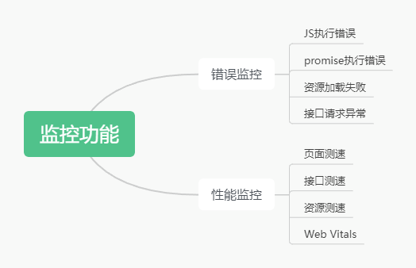
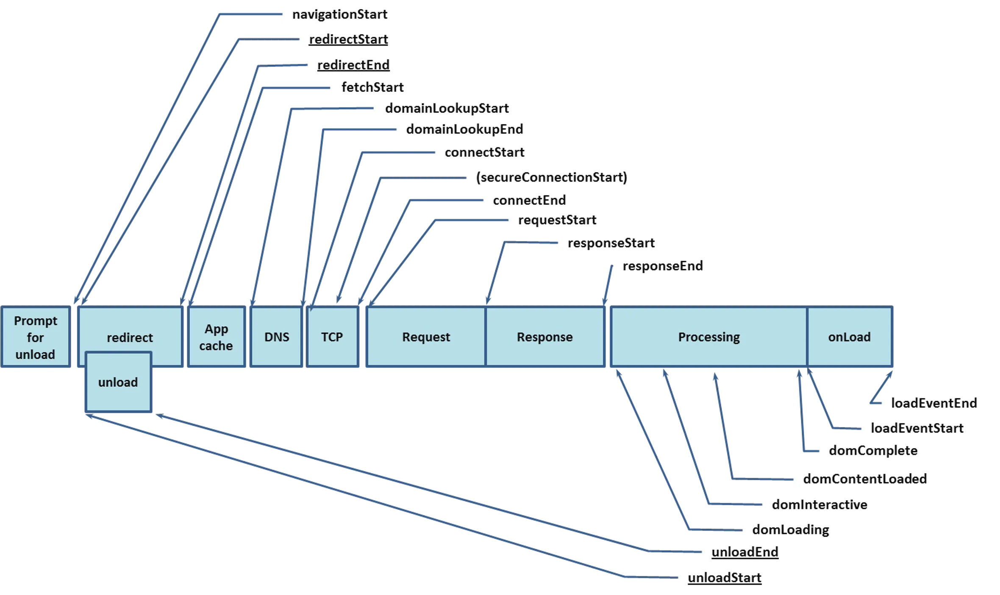
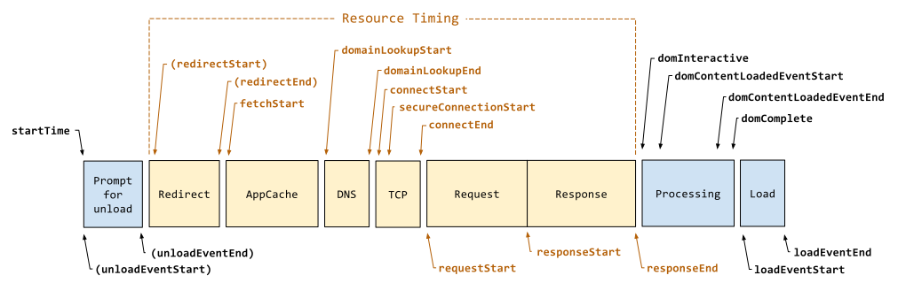
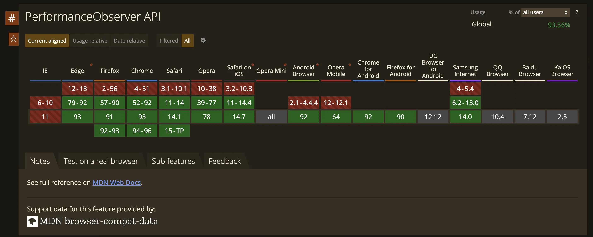
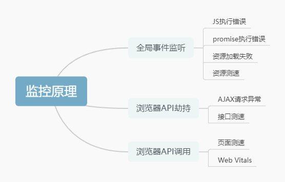
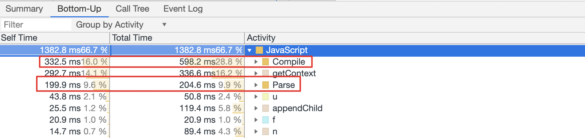
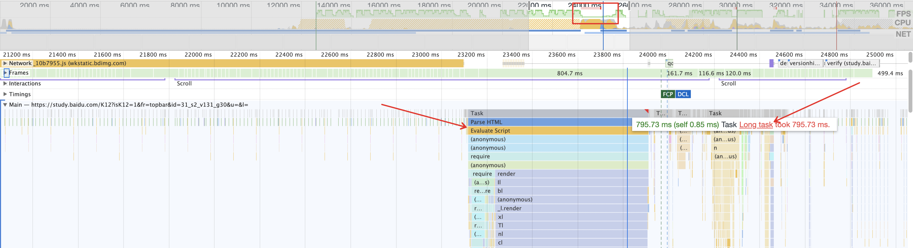

## 参考文档

<https://alienzhou.github.io/fe-performance-journey/5-subresources/javascript.html>
<https://zhuanlan.zhihu.com/p/445160306>
<https://mp.weixin.qq.com/s?__biz=MjM5Mzc0MDAwNw==&mid=212340809&idx=1&sn=6d1b294f7f3c03907e68227d05920416#wechat_redirect>
<https://zhuanlan.zhihu.com/p/445160306>
<https://cloud.tencent.com/developer/article/1505471>

## 页面性能指标

> 白屏时间，首屏时间、FCP、FMP、LCP、FID、TTFB... 这些名词太多，水太深，一般人把握不住。我们从中抽取一些最常见，最实用的规范跟大家一一解释。

**网络连接瀑布图(TL;DR)**

### Web监控原理实现

揭秘 TAM SDK 的实现原理与设计思想
<https://km.woa.com/group/42893/articles/show/514467>

实现无侵入式监控，主要有3种思路：

- 全局事件监听

- 浏览器 API 劫持

- 浏览器 API 调用



#### 错误监控

错误监控包含JS执行错误、promise执行错误、资源加载失败和接口请求异常4个部分

**JS执行错误**

要捕获JS的运行时错误，只需要监听onerror事件。

```js
window.onerror = (...args) => {
  this.publishErrorLog({
    msg: `${stringifyPlus(args[0]) || ''} @ (${stringifyPlus(args[1]) || ''}:${args[2] || 0
    }:${args[3] || 0})
    \n${stringifyPlus(args[4] || '')}`,
    level: LogType.ERROR,
  });
  orgError?.call(window, ...args);
};
```

将错误的文件和行号列号一起上报，结合sourcemap定位错误在源码的位置。

**promise执行错误**

捕获没有被catch的promise错误，可以通过监听 unhandledrejection 事件实现。

```js
window.addEventListener('unhandledrejection', (event: PromiseRejectionEvent) => {
  const reason = event && stringifyPlus(event.reason);
  this.publishErrorLog({
    msg: `PROMISE_ERROR: ${reason}`,
    level: LogType.PROMISE_ERROR,
  });
};);
```

**资源加载失败**
只要监听error事件就能获取到资源加载失败的信息。

```js
window.document.addEventListener('error', (event: Event) => {
  const target = event?.target || event?.srcElement;
  const url = target.src || target.href;
  const { tagName } = target;

  if (typeof url === 'string' && tagName) {
    const log: NormalLog = {
      msg: `${tagName} load fail: ${url}`,
      level: LogType.INFO,
    };
    // 先根据文件后缀简单判断
    if (/\.js$/.test(url)) {
      log.level = LogType.SCRIPT_ERROR;
    } else if (/\.css$/.test(url)) {
      log.level = LogType.CSS_ERROR;
    } else {
      // 再根据文件类型判断
      switch (tagName.toLowerCase()) {
        case 'script':
          log.level = LogType.SCRIPT_ERROR;
          break;
        case 'link':
          log.level = LogType.CSS_ERROR;
          break;
        case 'img':
          log.level = LogType.IMAGE_ERROR;
          break;
        case 'audio':
        case 'video':
          log.level = LogType.MEDIA_ERROR;
          break;
        default:
          return;
      }
    }
    this.publishErrorLog(log);
  }
}, true);
```

**接口请求异常**
要获取接口请求的异常，需要劫持 XMLHttpRequest 和 fetch 这 2 个浏览器 API，在请求返回的时候判断是否有错误.

```js
/**
 * XMLHttpRequest 劫持
 */
xhr.addEventListener('timeout', () => {
  xhr.failType = 'timeout';
});
xhr.addEventListener('error', () => {
  xhr.failType = 'error';
});
xhr.addEventListener('abort', () => {
  xhr.failType = 'abort';
});

xhr.addEventListener('loadend', function aegisXhrLoadendHandler() {
  let type = '';
  if (this.failType) {
    type = this.failType;
  } else if (!this.status) { // status 为 0 或者 undefined
    type = 'failed';
  } else if (this.status >= 400) {
    type = 'error';
  }

  if (type) {
    const url = xhr.aegisUrl;
    const { code } = tryToGetRetCode(xhr.response, aegis.config.api, { url, ctx: xhr });
    self.publishErrorLog({
      msg: `AJAX_ERROR: request ${type}
            \nreq url: ${this.aegisUrl}
            \nres status: ${this.status || 0}
            \nres retcode: ${code}
            \nres duration: ${Date.now() - xhr.aegisXhrStartTime}ms
            \nreq method: ${this.aegisMethod}
            \nreq param: ${apiDetail ? stringifyObj(body) : ''}
            \nres data: ${apiDetail ? readBody(xhr)?.slice(0, 1000) : ''}`,
      level: LogType.AJAX_ERROR,
      ctx: xhr,
    });
  }
});

/**
 * fetch 劫持
 */
then: (res, duration, url, option) => {
  const isAjaxError = res.status <= 0 || res.status >= 400;
  const apiDetail = config.api?.apiDetail;

  const { code, isErr } = tryToGetRetCode(data, config.api, { url, ctx: res });
  const apiDesc = `${isAjaxError ? `FETCH_ERROR: ${data} \n\n` : ''}req url: ${url} 
                  \nreq method: ${option?.method || 'get'} 
                  \nreq param: ${apiDetail ? stringifyObj(option?.body) : ''} 
                  \nres duration: ${duration}ms 
                  \nres status: ${res.status || 0} 
                  \nres retcode: ${code}
                  \nres data: ${apiDetail ? data : ''}`;
  // 上报retcode错误日志
  this.publishNormalLog({
    msg: apiDesc,
    // eslint-disable-next-line no-nested-ternary
    level: isAjaxError ? LogType.AJAX_ERROR : (isErr ? LogType.RET_ERROR : LogType.API_RESPONSE),
    code,
    ctx: res,
  });
},
catch: (err, duration, url, option) => {
  const apiDetail = config.api?.apiDetail;
  // 发生错误：跨域、链接有错
  const apiDesc = `AJAX_ERROR: ${err}
                  \nres status: 0
                  \nres duration: ${duration}ms
                  \nreq url: ${url}
                  \nreq method: ${option?.method || 'get'}
                  \nreq param: ${apiDetail ? stringifyObj(option?.body) : ''}`;
  // 上报接口错误数据
  this.publishNormalLog({
    msg: apiDesc,
    level: LogType.AJAX_ERROR,
    code: -400,
    ctx: err,
  });
  // 原封不动继续抛出err
  throw err;
}
```

## 性能监控

性能监控包含页面测速、接口测速、资源测速和Web Vitals 4个部分。

**页面测速**
页面测速我们提供了9大性能指标。

- DNS查询
- TCP连接
- SSL建联
- 请求响应
- 内容传输
- DOM解析
- 资源加载
- 首屏耗时
- 页面完全加载时间

其中前面7个指标可以直接调用Performance API计算，涉及到下面这些指标的计算。

**网络连接瀑布图**




与这张图一一对应的，是浏览器里面的 `performance.timing` 属性，我们同时打印出来，做一个数据的对比说明。

- navigationStart: 表示从上一个文档卸载结束时的 unix 时间戳，如果没有上一个文档，这个值将- 和 fetchStart 相等。
- unloadEventStart: 表示前一个网页（与当前页面同域）unload 的时间戳，如果无前一个网页 - unload 或者前一个网页与当前页面不同域，则值为 0。
- unloadEventEnd: 返回前一个页面 unload 时间绑定的回调函数执行完毕的时间戳。
- redirectStart: 第一个 HTTP 重定向发生时的时间。有跳转且是同域名内的重定向才算，否则值为 - 0。
- redirectEnd: 最后一个 HTTP 重定向完成时的时间。有跳转且是同域名内部的重定向才算，否则值为 - 0。
- fetchStart: 浏览器准备好使用 HTTP 请求抓取文档的时间，这发生在检查本地缓存之前。
- domainLookupStart/domainLookupEnd: DNS 域名查询开始/结束的时间，如果使用了本地缓存（即- 无 DNS 查询）或持久连接，则与 fetchStart 值相等
- connectStart: HTTP（TCP）开始/重新 建立连接的时间，如果是持久连接，则与 fetchStart 值相- 等。
- connectEnd: HTTP（TCP） 完成建立连接的时间（完成握手），如果是持久连接，则与 fetchStart - 值相等。
- secureConnectionStart: HTTPS 连接开始的时间，如果不是安全连接，则值为 0。
- requestStart: HTTP 请求读取真实文档开始的时间（完成建立连接），包括从本地读取缓存。
- responseStart: HTTP 开始接收响应的时间（获取到第一个字节），包括从本地读取缓存。
- responseEnd: HTTP 响应全部接收完成的时间（获取到最后一个字节），包括从本地读取缓存。
- domLoading: 开始解析渲染 DOM 树的时间，此时 Document.readyState 变为 loading，并将抛出 - readystatechange 相关事件。
- domInteractive: 完成解析 DOM 树的时间，Document.readyState 变为 interactive，并将抛出 - readystatechange 相关事件，注意只是 DOM 树解析完成，这时候并没有开始加载网页内的资源。
- domContentLoadedEventStart: DOM 解析完成后，网页内资源加载开始的时间，在 - DOMContentLoaded 事件抛出前发生。
- domContentLoadedEventEnd: DOM 解析完成后，网页内资源加载完成的时间（如 JS 脚本加载执行完- 毕）。
- domComplete: DOM 树解析完成，且资源也准备就绪的时间，Document.readyState 变为 - complete，并将抛出 readystatechange 相关事件。
- loadEventStart: load 事件发送给文档，也即 load 回调函数开始执行的时间。
- loadEventEnd: load 事件的回调函数执行完毕的时间。

根据上述的定义，我们总结出来常见的页面指标的计算公式

```javascript
getPerformanceTiming() {
  const t = performance.timing;
  const times = {};
  // 页面加载完成的时间，用户等待页面可用的时间
  times.loadPage = t.loadEventEnd - t.navigationStart;
  // 解析 DOM 树结构的时间
  times.domReady = t.domComplete - t.responseEnd;
  // 重定向的时间
  times.redirect = t.redirectEnd - t.redirectStart;
  // DNS 查询时间
  times.lookupDomain = t.domainLookupEnd - t.domainLookupStart;
  // 读取页面第一个字节的时间
  times.ttfb = t.responseStart - t.navigationStart;
  // 资源请求加载完成的时间
  times.request = t.responseEnd - t.requestStart;
  // 执行 onload 回调函数的时间
  times.loadEvent = t.loadEventEnd - t.loadEventStart;
  // DNS 缓存时间
  times.appcache = t.domainLookupStart - t.fetchStart;
  // 卸载页面的时间
  times.unloadEvent = t.unloadEventEnd - t.unloadEventStart;
  // TCP 建立连接完成握手的时间
  times.connect = t.connectEnd - t.connectStart;
  return times;
}
```

### 首屏耗时

首屏耗时的算法相对会复杂一些，默认的算法是在 3 秒内监听首屏区域内元素的变化，记录元素的变化时间和包含的子节点数量，取子节点数最多的元素的变化时间为首屏时间。假设发生了 2 次变化，并且变化的元素都在首屏区域内：

```js
const change1 = {
  roots: [e1, e2],
  rootsDomNum: [8, 5],
  time: 2566 // 通过 performance.now() 获取
};
 
const change2 = {
  roots: [e3, e4],
  rootsDomNum: [2, 5,],
  time: 2998 // 通过 performance.now() 获取
};
```

子节点数量最多的是 e1，对应的时间是 2.566 秒，我们就以这个时间来作为首屏时间。 监听元素的变化使用了 MutationObserver：

```js
const observeDom = new MutationObserver((mutations) => {
  const change = {
    roots: [],
    rootsDomNum: [],
    time: performance.now(),
  };
  mutations.forEach((mutation) => {
    mutation.addedNodes.forEach((ele) => {
      // 标识了首屏关键元素，只记录关键元素的变化时间
      if (ele.nodeType === 1 && ele.hasAttribute('AEGIS-FIRST-SCREEN-TIMING')) {
        if (!Object.prototype.hasOwnProperty.apply(markDoms, [change.time])) {
          markDoms[change.time] = [];
        }
        markDoms[change.time].push(ele);
      } 
      // 默认首屏算法
      else if (ele.nodeType === 1 && !ele.hasAttribute('AEGIS-IGNORE-FIRST-SCREEN-TIMING')) {
        change.roots.push(ele);
        change.rootsDomNum.push(self.walkAndCount(ele) || 0);
      }
    });
  });
  change.roots.length && changeList.push(change);
});

observeDom.observe(document, { childList: true, subtree: true });
```

从示例代码中，我们发现计算首屏时间还有另外一种算法。当用户给元素添加 aegis-first-screen-timing 属性的时候，我们会记录这个元素的变化时间，3 秒后取变化时间的最大值作为首屏时间。 在使用默认算法的时候，可以为元素添加属性 aegis-ignore-first-screen-timing 来忽略节点的变化统计。

### 接口测速

要对接口进行测速，同样需要劫持 XMLHttpRequest 和 fetch 这 2 个浏览器 API，记录接口发起调用和返回数据的时间差。

```js
/**
 * 劫持 XMLHttpRequest 的 send 方法
 */
 send: (xhr, body) => {
  const sendTime = Date.now();
  xhr.addEventListener('loadend', () => {
    const url = xhr.aegisUrl;
    const duration = Date.now() - sendTime;
    const speedLog = {
      url,
      isHttps: urlIsHttps(url),
      status: xhr.status || 0,
      method: xhr.aegisMethod || 'get',
      type: 'fetch',
      duration,
      payload: new PayloadXHR(xhr),
    };
    this.publishSpeed(speedLog);
  });
}

/**
 * fetch 劫持
 */
const originFetch = window.fetch;

window.fetch = function aegisFakeFetch(url: RequestInfo, fetchOption = {}) {
  const sendTime = Date.now();
  return originFetch(url, fetchOption)
    .then((res) => {
      const duration = Date.now() - sendTime;
      const speedLog = {
        url: res.url,
        isHttps: urlIsHttps(res.url),
        method: option?.method || 'get',
        duration,
        type: 'fetch',
        status: res.status || 0,
      };
      this.publishSpeed(speedLog);
    })
};
```

### 资源测速

资源测速是使用 PerformanceObserver 来实现的。

```js
const observer = new window.PerformanceObserver((list) => {
  const entries = list.getEntries();
  for (let i = 0, l = entries.length; i < l; i++) {
    const entry = entries[i];
    const duration = entry.duration.toFixed(2);
    ...
  }
});

observer.observe({ entryTypes: ['resource'] });
```

### 相关性能指标

#### TAM相关指标

1. 默认通过 MutationObserver 这个 API 来监控浏览器 document 对象的 DOM 变化，只计算在首屏内的 DOM 元素，把 DOM 变化时间作为 x 轴，单位时间内 DOM 变化的数量作为 y 轴，绘制曲线后，我们找到 DOM 变化最高点，认为是首屏完成。

2. 如果开发者觉得该算法不准确，希望自己标记 DOM 元素，可以添加属性 div  AEGIS-FIRST-SCREEN-TIMING > `</div>`，把某个元素识别为首屏关键元素，SDK 认为只要用户首屏出现此元素就是首屏完成。也可以添加属性 div AEGIS-IGNORE-FIRST-SCREEN-TIMING></ div>，把该 DOM 列入黑名单。

除了上述的数据外，RUM & TAM 还根据上报的数据计算了以上几个页面性能相关的指标。

1. 首字节(TTFB) = DNS + SSL +TCP + TTFB

2. DOM Ready = DNS + SSL +TCP + TTFB + ContentDownload + DomParse

3. 页面完全加载 =DNS + SSL +TCP + TTFB + ContentDownload + DomParse + ResourceDownload

#### 其它性能指标

过去通常会使用 FP、FCP、FMP、TTI 等指标来衡量前端的性能;
但是随着前端的发展，现在越来越多地使用 LCP、FID、CLS 等来作为指标衡量前端的性能。

FP: First Paint 首次绘制，指浏览器从开始请求网站内容（导航阶段）到首次向屏幕绘制像素点的时间，刚到 Painting 阶段，所以 FP 也可以理解为是白屏时间。

```js
// 此方法如果执行时机过早可能会报错
window.performance.getEntriesByType('paint')[0].startTime

// 更推荐使用 Promise 封装获取
const observerWithPromise = new Promise<PerformanceObserverEntryList>((resolve, reject) => {
  new PerformanceObserver(resolve).observe({
    entryTypes: ['paint'],
  });
});
    
observerWithPromise
  .then(entryList => {
    return entryList.getEntries().filter(entry => {
      return entry.name === 'first-paint';
    })[0];
  })
  .then(entry => console.log(entry.startTime));
```

TTI：Time to Interactive，可交互时间，该指标用于测量页面从开始加载到主要子资源完成渲染，并能够快速、可靠地响应用户输入所需的时间。简单的讲，TTI 是安静窗口之前最后一个长任务（超过 50 毫秒的任务）的结束时间（如果没有找到长任务，则与 FCP 值相同）。

虽然 TTI 可以在实际情况下进行测量，但我们不建议这样做，因为用户交互会影响您网页的 TTI，从而导致您的报告中出现大量差异。如需了解页面在实际情况中的交互性，您应该测量 FID。
TTI 时间如果在 0-3.8 秒之间就是一个比较优秀的指标；3.9-7.3 秒之间就比较中等了，稍微有点儿慢；超过 7.3 秒就是非常慢了。

### Web Vitals

Web Vitals 的获取方式比较简单，直接使用 google 提供的 npm 包就能获取到，我们就简单归类为浏览器 API 的直接调用。

Web Vitals是一个良好网站的基本指标 (Essential metrics for a healthy site)，为什么还要再定义一个新的指标集，原因是过去要衡量一个好的网站，需要使用的指标太多，推出 Web Vitals 是简化这个学习的曲线，站主只要关注 Web Vitals 指标表现即可

目前 Google 的 web-vitals 源码 中提供了5个指标，分别为

1. CLS（Cumulative Layout Shift - 累积布局移位）: CLS 会衡量在网页的整个生命周期内发生的所有意外布局偏移的得分总和。得分是零到任意正数，其中 0 表示无偏移，且数字越大，网页的布局偏移越大。

2. FCP（First Contentful Paint - 首次内容绘制）：FCP 度量从页面开始加载到页面内容的任何部分呈现在屏幕上的时间，页面内容包括文本、图像（包括背景图像）、`<svg.>`元素或非白色的`<canvas.>`元素。

3. FID（First Input Delay - 首次输入延迟）：从用户首次与您的网页互动（点击链接、点按按钮，等等）到浏览器响应此次互动之间的用时。这种衡量方案的对象是被用户首次点击的任何互动式元素。

4. LCP（Largest Contentful Paint - 最大内容绘制）：LCP 度量从用户请求网址到在视口中渲染最大可见内容元素所需的时间。最大的元素通常是图片或视频，也可能是大型块级文本元素。

5. TTFB (Time To First Byte - 从服务器接收到第一个字节耗时) TTFB 是发出页面请求到接收到应答数据第一个字节的时间总和，它包含了 DNS 解析时间、 TCP 连接时间、发送 HTTP 请求时间和获得响应消息第一个字节的时间。

```js
import {getFCP, getLCP, getFID, getCLS} from 'web-vitals/base'
```

由于 LCP 底层使用的是 PerformanceObserver ，还存在兼容性问题，因此短期内还无法完全替代所有场景。



### 小结



## 性能优化

### 一、加载性能优化（静态资源）

Web 页面通常由 HTML、CSS、JavaScript 和其他多媒体资源组成，充斥着各种同步资源和一部资源。页面加载时，必须从服务器获取这些资源。

#### 资源缓存

  浏览器等各类缓存机制
  
#### 调整资源加载顺序

通过调整资源加载优先级，保证主体内容能够较快的被加载完成，通过预加载、懒加载等多种方式，调整资源加载的行为，优化网页加载性能。

### 二、发送请求时

#### 1.避免多余重定向

   重定向是一个比较常用的技术手段。在一些情况下，你可能进行了服务迁移，修改了原有的 uri。这时候就可以使用重定向，把访问原网址的用户重定向到新的 uri。还有是在一些登录场景下，会使用到重定向技术。
   重定向分为 301 的永久重定向和 302 的临时重定向。建议贴合语义，例如服务迁移的情况下，使用 301 重定向。对 SEO 也会更友好。
   同时也不要滥用重定向。曾今也见过有业务在访问后重定向 3 次的情况，其实里面有些是不必要的。每次重定向都是有请求耗时的，建议避免过多的重定向。

#### 2.DNS预解析

  基本我们访问远程服务的时候，不会直接使用服务的出口 IP，而是使用域名。所以请求的一个重要环节就是域名解析。
  
  DNS 服务本身是一个树状层级结构，其解析是一个递归与迭代的过程。例如 github.com 的大致解析流程如下：
  先检查本地 hosts 文件中是否有映射，有则使用；
  查找本地 DNS 缓存，有则返回；
  根据配置在 TCP/IP 参数中设置 DNS 查询服务器，并向其进行查询，这里先称为本地 DNS；
  如果该服务器无法解析域名（没有缓存），且不需要转发，则会向根服务器请求；
  根服务器根据域名类型判断对应的顶级域名服务器（.com），返回给本地 DNS，然后重复该过程，直到找到该域名；
  当然，如果设置了转发，本地 DNS 会将请求逐级转发，直到转发服务器返回或者也不能解析。

  DNS解析流程可能会很长，很耗时，所以整个 DNS 服务，包括客户端都会有缓存机制，这个作为前端不好涉入，但在 DNS 解析上，前端可以通过其他手段来加速。

  >DNS Prefetch 就是浏览器提供给我们的一个 API。它是 Resource Hint 的一部分。它可以告诉浏览器：过会我就可能要去 yourwebsite.com 上下载一个资源，帮我先解析一下域名吧。这样之后用户点击某个按钮，触发了 yourwebsite.com 域名下的远程请求时，就略去了 DNS 解析的步骤。使用方式很简单：

- 第一步：打开DNS预解析

  ```js
  <meta heep-equiv="x-dns-prefetch-control" content="on">
  ```

- 手动添加解析

  ```js
  <link rel="dns-prefetch" href="//www.img.com">
  ```

  这样之后用户触发www.img.com域名下的远程请求时，就避免了DNS预解析的步骤
  使用场景：

- 静态资源域名（CDN）
- 未来即将发生跳转的域名
- 会重定向的域名
  注意事项：
- 浏览器并不保证一定会去解析域名，可能会更与当前的网络、负载等状况决定
- Chrome会使用了8个异步线程来处理DNS预解析，所以过多的prefetch并不一定能提高网页加载效率。

#### 3.预连接
  >
  > 建立连接不仅需要 DNS 查询，还需要进行 TCP 协议握手，有些还会有 TLS/SSL 协议，这些都会导致连接的耗时。使用 Preconnect 可以帮助你告诉浏览器：“我有一些资源会用到某个源（origin），你可以帮我预先建立连接。”

  根据规范，当你使用 Preconnect 时，浏览器大致做了如下处理：

  1. 解析 Preconnect 的 url；
  2. 根据当前 link 元素中的属性进行 cors 的设置；
  3. 默认先将 credential 设为 true，如果 cors 为 Anonymous 并且存在跨域，则将 credential 置为 false；
  4. 进行连接。

  ```js
  <link rel="preconnect" href="//example.com">
  <link rel="preconnect" href="// cdn.example.com" crossorigin>
  ```

  > 需要注意的是，标准并没有硬性规定浏览器一定要（而是 SHOULD）完成整个连接过程，与 DNS Prefetch 类似，浏览器可以视情况完成部分工作。

#### 4.使用CDN

   当我们实际把网络包发向我们的目标地址时，肯定希望越快到达目的地越好（对应的，也会希望越快获得响应）。而网络传输是有极限的，同样一个北京的用户，访问北京的服务器显然要比广州快很多。同时，服务的负载也会影响响应的速度。
  
  对于静态资源，我们可以考虑通过 CDN 来降低时延。

- 预加载：
  - prefetch
  使用prefetch指定境界
react懒加载时借助webpack指定prefetch
preload
prerender

### 三、预加载

#### 1.预加载技术

##### 1.1.Resource Hints

Resource Hints[1] 是一种预加载相关的标准，它告诉浏览器哪些源下的资源我们的 Web 应用需要获取，哪些资源在之后的操作或浏览时需要被使用，从而让浏览器能够进行一些预先连接或预先加载操作。Resource Hints 标准包括 DNS Prefetch、Preconnect、Prefetch 与 Prerender。此外，还有一个与 Resource Hints 类似的 Preload

1.1.1. Prefetch
你可以把 Prefetch 理解为资源预获取。一般来说，可以用 Prefetch 来指定在紧接着之后的操作或浏览中需要使用到的资源，让浏览器提前获取。由于仅仅是提前获取资源，因此浏览器不会对资源进行预处理，并且像 CSS 样式表、JavaScript 脚本这样的资源是不会自动执行并应用于当前文档的。其中 as 属性用于指定资源的类型，与 Preload 规范一致，基本涵盖了所有资源类型。

```js
<link rel="prefetch" href="/prefetch.js" as="script">
```

1.1.2. Prerender
Prerender 比 Prefetch 更进一步，可以粗略地理解不仅会预获取，还会预执行。
如果你指定 Prerender 一个页面，那么它依赖的其他资源，像`<script>`、`<link>` 等页面所需资源也可能会被下载与处理。但是预处理会基于当前机器、网络情况的不同而被不同程度地推迟。例如，会根据 CPU、GPU 和内存的使用情况，以及请求操作的幂等性而选择不同的策略或阻止该操作。

```js
<link rel="prerender" href="//sample.com/nextpage.html">
```

1.1.3. Preload
在遇到需要 Preload 的资源时，浏览器会 立刻 进行预获取，并将结果放在内存中，资源的获取不会影响页面 parse 与 load 事件的触发。直到再次遇到该资源的使用标签时，才会执行。由于我们会将 `<script>`标签置于`<body>` 底部来保证性能，因此可以考虑在 `<head>` 标签中适当添加这些资源的 Preload 来加速页面的加载与渲染。

```js
<link rel="preload" href="./nextpage.js" as="script">
```

与 Prefetch 相比，Preload 会强制浏览器立即获取资源，并且该请求具有较高的优先级（mandatory and high-priority），因此建议对一些当前页面会马上用到资源使用 Preload；相对的，Prefetch 的资源获取则是可选与较低优先级的，其是否获取完全取决于浏览器的决定，适用于预获取将来可能会用到的资源。

1.1.4. webpack 中的使用方式
预加载可以配合 code split 来使用，可以在降低初始加载量的情况下，尽量保证按需加载时的体验。在 webpack 中应用预加载非常简单，只需要在 dynamic import 中添加相应注释，webpack 就会知道你需要对这个 chunk 进行预加载

```js
// prefetch
import(/* webpackPrefetch: true */ './sub1.js');

// preload
import(/* webpackPreload: true */ './sub2.js')
```

##### 1.2.基于 JavaScript 的预加载

上面提到了基于 Resource Hints 的预加载技术，它其实像是一种声明式技术：你提出你的预加载需求，浏览器根据自身状态，选择合适的时候预加载。

如果你在不兼容 Resource Hints 的浏览器上进行预加载，或者希望有“更强硬的”预加载控制，你可能会希望使用一些 JavaScript 中的功能来“巧妙”地进行预加载。

例如对于图片

```js
let img = new Image();
img.src = '/static/img/prefetch.jpg';
```

上面的方法会触发浏览器加载图片，然后等到用户需要浏览时，再将其插入到页面即可。

对于 JavaScript 和 CSS 可以动态添加 `<script>` 和 `<link>` 标签，不过要注意它们只有在添加到页面时浏览器才会加载（少数老式浏览器上这块表现会不太一样），由于添加到页面后加载完会执行该资源，所以要避免产生不需要的副作用（否则就不是预加载了）。

如果你希望通过 JavaScript 来进行预加载，可以使用 PreloadJS 这个库，它提供了包括脚本、样式、图片、字体、SVG等各类资源的预加载器。

#### 2.视频预加载

##### 2.1. 为视频添加 preload 属性

使用 preload 属性可以让浏览器预加载相应的内容。其取值与作用如下表所示：

值 -  作用
none 不载入视频（即不预加载）
meta 载入元数据（时长、尺寸、文字轨道）
auto 加载整个视频
此外，你还可以设置 poster 属性，它规定视频下载时或用户点击播放按钮前播放器上显示的图像。一种推荐的方式是设置 poster 与 preload: meta，为用户提供一定的播放预览信息的同时避免过多的预加载流量。

##### 2.2.使用 Preload Link

这一点已经在第一部分提到了，可以使用

```js
<link rel="preload" as="video" href="/static/sample.mp4">
```

进行资源的预加载。

##### 2.3.使用 JavaScript 进行自定义的 Buffer 操作

可以通过 HTTP Range 请求头来获取开始的一小段视频数据，然后使用 MediaSource API 来进行视频媒体数据的暂存与播放。

下面这段示例代码摘自 [Fast Playback with Video Preload - Manual buffering](https://web.dev/fast-playback-with-preload/#manual_buffering)，它可以实现视频数据的预加载，更多相关实现可以参见其中内容。

```js
<video id="video" controls></video>

<script>
    const mediaSource = new MediaSource();
    video.src = URL.createObjectURL(mediaSource);
    mediaSource.addEventListener('sourceopen', sourceOpen, { once: true });

    function sourceOpen() {
        URL.revokeObjectURL(video.src);
        const sourceBuffer = mediaSource.addSourceBuffer('video/webm; codecs="vp09.00.10.08"');

        // Fetch beginning of the video by setting the Range HTTP request header.
        fetch('file.webm', { headers: { range: 'bytes=0-567139' } })
            .then(response => response.arrayBuffer())
            .then(data => {
                sourceBuffer.appendBuffer(data);
                sourceBuffer.addEventListener('updateend', updateEnd, { once: true });
            });
    }

    function updateEnd() {
        // Video is now ready to play!
        var bufferedSeconds = video.buffered.end(0) - video.buffered.start(0);
        console.log(bufferedSeconds + ' seconds of video are ready to play!');

        // Fetch the next segment of video when user starts playing the video.
        video.addEventListener('playing', fetchNextSegment, { once: true });
    }

    function fetchNextSegment() {
        fetch('file.webm', { headers: { range: 'bytes=567140-1196488' } })
            .then(response => response.arrayBuffer())
            .then(data => {
                const sourceBuffer = mediaSource.sourceBuffers[0];
                sourceBuffer.appendBuffer(data);
                // TODO: Fetch further segment and append it.
            });
    }
</script>
```

#### 3.预加载的策略

预加载一般都会面临一些矛盾：

预加载资源过多，可能导致流量消耗过大，占用正常请求的通道；
预加载资源过少，可能导致覆盖率太低，对于大部分资源用户无法享受到预加载效果。
设计一个高效的预加载策略是一个很复杂的问题 ，这里只简单介绍一些工具。

3.1. quicklink
quicklink 是 GoogleChromeLabs 推出的轻量级库，使用 Resource Hints 进行预加载，对于不支持的浏览器会回退到 XHR 模式。它的策略其实非常直接，核心就是当链接进入到视口后，会对其进行预加载。

当然我们还可以加一些其他策略，例如设定一个 200ms 的停留阈值。总体而言，它的策略还是比较简单的，更像是为前端预加载提供一个思路。

3.2. Guess.js
Guess.js 则是一个更为完备的工具包。它会结合前端访问与打点的数据进行统计，甚至应用一些机器学习的模型，来提供一个更精细化、更准确的预加载策略。同时，在预加载之外，它还可以帮助实现最优的打包方式、加载路径等。核心就是通过大量的实际用户数据，来帮助前端性能优化做决策与预测。

### 四、页面解析与处理

#### 注意资源在页面文档中的位置

JavaScript 脚本和 CSS 样式表在关于 DOM 元素的属性，尤其是样式属性上都有操作的权利。这就像是一个多线程问题。服务端多线程编程中经常通过锁来保证线程间的互斥。回到咱们的前端，现在也是两方在竞争同一个资源，显然也是会有互斥的问题。这就带来了 DOM 解析、JavaScript 加载与执行、CSS 加载与使用之间的一些互斥关系。

仅仅看 DOM 与 CSS 的关系，则如下图所示：


HTML 解析为 DOM Tree，CSS 解析为 CSSOM，两者再合成 Render Tree，并行执行，非常完美。然而，当 JavaScript 入场之后，局面就变了


根据标准规范，在 JavaScript 中可以访问 DOM。因此当遇到 JavaScript 后会阻塞 DOM 的解析。于此同时，为避免 CSS 与 JavaScript 之间的竞态，CSSOM 的构建会阻塞 JavaScript 的脚本执行。总结起来就是

> JavaScript 会阻塞 DOM 构建，而 CSSOM 的构建又会阻塞 JavaScript 的执行。

所以这就是为什么在优化的最佳实践中，我们基本都推荐把 CSS 样式表放在 `<head >` 之中（即页面的头部），把 JavaScript 脚本放在 `<body>` 的最后（即页面的尾部）。

#### 使用defer和async

上面提到了，当 DOM 解析遇到 JavaScript 脚本时，会停止解析，开始下载脚本并执行，再恢复解析，相当于是阻塞了 DOM 构建。

那除了将脚本放在 body 的最后，还有什么优化方法么？是有的。

可以使用 defer 或 async 属性。两者都会防止 JavaScript 脚本的下载阻塞 DOM 构建。但是两者也有区别，最直观的表现如下：


defer 会在 HTML 解析完成后，按照脚本出现的次序再顺序执行；而 async 则是下载完成就立即开始执行，同时阻塞页面解析，不保证脚本间的执行顺序。

根据它们的特点，推荐在一些与主业务无关的 JavaScript 脚本上使用 async。例如统计脚本、监控脚本、广告脚本等。这些脚本一般都是一份独立的文件，没有外部依赖，不需要访问 DOM，也不需要有严格的执行时机限制。在这些脚本上使用 async 可以有效避免这些非核心功能的加载影响页面解析速度。

#### 非阻塞 JavaScript

用户对于不流畅的滚动或动画十分敏感，一般要求页面帧率应达到每秒 60 帧。由于 JavaScript 一般是单线程执行的，长时间执行的任务会阻塞浏览器的主线程，使页面失去响应，出现卡顿和假死的现象。

- 页面滚动
- requestAnimationFrame 任务在浏览器渲染下一帧之前执行
- requestIdleCallback 将任务安排在浏览器空闲时执行
- Web Workers

当我们监听 touchstart、touchmove 等事件时，由于合成线程并不知道我们是否会通过 event.preventDefault() 来阻止默认的滚动行为，从而在每次事件触发时，都会等待事件处理函数执行完毕后再进行页面滚动。这通常会导致较明显的延迟，影响页面滚动的流畅性。通过在addEventListener()时声明{passive: true}，来表明事件处理函数不会阻止页面滚动，使得用户的操作更快得到响应。

我们可以将一些耗性能的逻辑放在 worker 线程中进行处理，这样主线程就能继续响应用户操作和渲染页面了。

#### 页面文档压缩

HTML 的文档大小也会极大影响响应体下载的时间。一般会进行 HTML 内容压缩（uglify）的同时，使用文本压缩算法（例如 gzip）进行文本的压缩。关于资源压缩这一块，在下一节的内容中还会再详细进行介绍。

### 五、页面静态资源

#### 总体原则

- 减少不必要的请求
- 减少包体大小
- 降低应用资源时的消耗
- 利用缓存

1 减少不必要的请求
核心是希望能够减少请求的数量，因为浏览器对同源请求有并发上限的限制（例如 Chrome 是6），所以在 HTTP/1.1 下，请求过多可能会导致请求被排队了。一个典型场景就是一些图库类型的网站，页面加载后可能需要请求十数张图片。

同时，TCP/IP 的拥塞控制也使其传输有慢启动（slow start）的特点，连接刚建立时包体传输速率较低，后续会渐渐提速。因此，发送过多的“小”请求可能也不是一个很好的做法。

减少不必要的请求主要分为几个维度：

- 对于可以延迟加载的内容，不必要现在就立刻加载，最好就在需要使用之前再加载；
- 对于可以合并的资源，进行资源合并也是一种方法。

2. 减少包体大小

包体大小对性能也是有直接影响的。显然同样速率下，包体越小，传输耗时越低，整体页面加载与渲染的性能也会更好。

减少包体大小常用的方式包括了：

- 使用适合当前资源的压缩技术；
- 避免再响应包体里“塞入”一些不需要的内容。

3.降低应用资源时的消耗
以上主要的关注点都在页面资源加载的效率，其实有些时候，浏览器去执行或使用资源的也是有消耗的。例如在 JavaScript 执行了一段 CPU 密集的计算，或者进行频繁的 DOM 操作，这些都会让 JavaScript 的执行变成影响性能的一大问题。虽然今天的像 V8 这样的引擎已经很快了，但是一些不当的操作仍然会带来性能的损耗。

此外，像是 CSS 选择器匹配、图片的解析与处理等，都是要消耗 CPU 和内存的。也许这些不太常成为性能杀手，但是某些特性场合下，了解它们也许会对你有所帮助。

4.利用缓存
这些静态子资源也是网络请求，它们仍然可以利用之前介绍的完整缓存流程。缓存在很多时候会是一个帮你解决性能问题的非常有效的手段。

#### 针对各类资源的性能优化

#### Javascript

##### 1.减少不必要的请求

1.1. 代码拆分（code split）与按需加载
虽然整体应用的代码非常多，但是很多时候，我们在访问一个页面时，并不需要把其他页面的组件也全部加载过来，完全可以等到访问其他页面时，再按需去动态加载。核心思路如下所示：

```js
document.getElementById('btn').addEventListener('click', e => {
    // 在这里加载 chat 组件相关资源 chat.js
    const script = document.createElement('script');
    script.src = '/static/js/chat.js';
    document.getElementsByTagName('head')[0].appendChild(script);
});
```

在按钮点击的监听函数中，动态添加了` <script> `元素。这样就可以实现在点击按钮时，才加载对应的 JavaScript 脚本。

代码拆分一般会配合构建工具一起使用。以 webpack 为例，在日常使用时，最常见的方式就是通过 dynamic import来告诉 webpack 去做代码拆分。webpack 编译时会进行语法分析，之后遇到 dynamic import 就会认为这个模块是需要动态加载的。相应的，其子资源也会被如此处理（除非被其他非动态模块也引用了）。

在 webpack 中使用代码拆分最常见的一个场景是基于路由的代码拆分。目前很多前端应用都在使用 SPA（单页面应用）形式，或者 SPA 与 MPA（多页面应用）的结合体，这就会涉及到前端路由。而页面间的业务差异也让基于路由的代码拆分成为一个最佳实践。想了解如何在 react-router v4 中实现路由级别的代码拆分，可以看[这篇文章](https://www.jianshu.com/p/547aa7b92d8c)。

当然，如果你不使用 webpack 之类的构建工具，你也可以选择一个 AMD 模块加载器（例如 RequireJS）来实现前端运行时上的异步依赖加载。

1.2代码合并
我们在总体思路里有提到，减少请求的一个方法就是合并资源。试想一个极端情况：我们现在不对 node_modules 中的代码进行打包合并，那么当我们请求一个脚本之前将可能会并发请求数十甚至上百个依赖的脚本库。同域名下的并发请求数过高会导致请求排队，同时还可能受到 TCP/IP 慢启动的影响。

当然，在很多流行的构建工具中（webpack/Rollup/Parcel），是默认会帮你把依赖打包到一起的。不过当你使用其他一些工具时，就要注意了。例如使用 FIS3 时，就需要通过配置声明，将一些 common 库或 npm 依赖进行打包合并。又或者使用 Gulp 这样的工具，也需要注意进行打包。

总之，千万不要让你的碎文件散落一地。

##### 2.减少包体大小

2.1. 代码压缩
JavaScript 代码压缩比较常见的做法就是使用 UglifyJS 做源码级别的压缩。它会通过将变量替换为短命名、去掉多余的换行符等方式，在尽量不改变源码逻辑的情况下，做到代码体积的压缩。基本已经成为了前端开发的标配。在 webpack 的 production 模式下是默认开启的；而在 Gulp 这样的任务流管理工具上也有 gulp-uglify 这样的功能插件。

另一个代码压缩的常用手段是使用一些文本压缩算法，gzip 就是常用的一种方式。

上图中响应头的 Content-Encoding 表示其使用了 gzip。

深色的数字表示压缩后的大小为 22.0KB，浅色部分表示压缩前的大小为 91.9KB，压缩比还是挺大的，很有效果。一般服务器都会内置相应模块来进行 gzip 处理，不需要我们单独编写压缩算法模块。例如在 Nginx 中就包含了 ngx_http_gzip_module[3] 模块，通过简单的配置就可以开启。

```
gzip            on;
gzip_min_length 1000;
gzip_comp_level 6;
gzip_types      application/javascript application/x-javascript text/javascript;
```

2.2. Tree Shaking

Tree Shaking 最早进入到前端的视线主要是因为 Rollup。后来在 webpack 中也被实现了。其本质是通过检测源码中不会被使用到的部分，将其删除，从而减小代码的体积。例如：

```js
// 模块 A
export function add(a, b) {
    return a + b;
}

export function minus(a, b) {
    return a - b;
}

// 模块 B
import {add} from 'module.A.js';
console.log(add(1, 2));
```

可以看到，模块 B 引用了模块 A，但是只使用了 add 方法。因此 minus 方法相当于成为了 Dead Code，将它打包进去没有意义，该方法是永远不会被使用到的。

注意，我在上面的代码中使用了 ESM 规范的模块语法，而没有使用 CommonJS。这主要是由于 Tree Shaking 算是一种静态分析，而 ESM 本身是一种的静态的模块化规范，所有依赖可以在编译期确定。如果想要更好得在 webpack 中使用，可以在查看其[官网上的这部分内容](https://webpack.js.org/guides/tree-shaking/)。关于 Tree Shaking 的介绍也可以从[这里了解下](https://juejin.cn/post/6844903544756109319)。

注意，刚才说了 Tree Shaking 非常依赖于 ESM。像是前端流行的工具库 lodash 一般直接安装的版本是非 ESM 的，为了支持 Tree Shaking，我们需要去安装它的 ESM 版本 —— lodash-es 来实现 Tree Shaking[6]。

此外，Chrome DevTools 也可以帮助你查看加载的 JavaScript 代码的使用覆盖率

2.3.优化 polyfill 的使用
前端技术的一大特点就是需要考虑兼容性。为了让大家能顺畅地使用浏览器的新特性，一些程序员们开发了新特性对应的 polyfill，用于在非兼容浏览器上也能使用新特性的 API。后续升级不用改动业务代码，只需要删除相应的 polyfill 即可。

这种舒适的开发体验也让 polyfill 成为了很多项目中不可或缺的一份子。然而 polyfill 也是有代价的，它增加了代码的体积。毕竟 polyfill 也是 JavaScript 写的，不是内置在浏览器中，引入的越多，代码体积也越大。所以，只加载真正所需的 polyfill 将会帮助你减小代码体积。

首先，不是每个业务的兼容性要求都一样。因此，按你业务的场景来确定引入哪些 polyfill 是最合适的。然而，特性千千万，手动 import 或者添加 Babel Transformer 显然是一件成本极高的事。针对这点，我们可以通过 browserslist 来帮忙，许多前端工具（babel-preset-env/autoprefixer/eslint-plugin-compat）都依赖于它。

其次，在 Chrome Dev Summit 2018 上还介绍了一种 Differential Serving的技术，通过浏览器原生模块化 API 来尽量避免加载无用 polyfill。

```js
<script type="module" src="main.mjs"></script>
<script nomodule src="legacy.js"></script>
```

这样，在能够处理 module 属性的浏览器（具有很多新特性）上就只需加载 main.mjs（不包含 polyfill），而在老式浏览器下，则会加载 legacy.js（包含 polyfill）。

最后，其实在理想上，polyfill 最优的使用方式应该是根据浏览器特性来分发，同一个项目在不同的浏览器，会加载不同的 polyfill 文件。例如 Polyfill.io 就会根据请求头中的客户端特性与所需的 API 特性来按实际情况返回必须的 polyfill 集合。

2.4 webpack
webpack 现在已经成为很多前端应用的构建工具，因此这里单独将其列了出来。我们可以通过 webpack-bundle-analyzer 这个工具来查看打包代码里面各个模块的占用大小。

很多时候，打包体积过大主要是因为引入了不合适的包，对于如何优化依赖包的引入，这里有一些[建议](https://github.com/GoogleChromeLabs/webpack-libs-optimizations)可以帮助你减小 bundle 的体积。

##### 3.解析与执行

除了 JavaScript 下载需要耗时外，脚本的解析与执行也是会消耗时间的。

3.1. JavaScript 的解析耗时

很多情况下，我们会忽略 JavaScript 文件的解析。一个 JavaScript 文件，即使内部没有所谓的“立即执行函数”，JavaScript 引擎也是需要对其进行解析和编译的。

从上图可以看出，解析与编译消耗了好几百毫秒。所以换一个角度来说，删除不必要的代码，对于降低 Parse 与 Compile 的负载也是很有帮助的。

同时，我们从前一节已经知道，JavaScript 的解析、编译和执行会阻塞页面解析，延迟用户交互。所以有时候，加载同样字节数的 JavaScript 对性能的影响可能会高于图片，因为图片的处理可以放在其他线程中并行执行。

3.2. 避免 Long Task

对于一些单页应用，在加载完核心的 JavaScript 资源后，可能会需要执行大量的逻辑。如果处理不好，可能会出现 JavaScript 线程长时间执行而阻塞主线程的情况。

例如在上图中，帧率下降明显的地方出现了 Long Task，伴随着的是有一段超过 700 ms 的脚本执行时间。而性能指标 FCP 与 DCL 处于其后，一定程度上可以认为，这个 Long Task 阻塞了主线程并拖慢了页面的加载时间，严重影响了前端性能与体验。

##### 4.缓存

4.1. 发布与部署
这里简单提一下：大多数情况下，我们对于 JavaScript 与 CSS 这样的静态资源，都会启动 HTTP 缓存。当然，可能使用强缓存，也可能使用协商缓存。当我们在强缓存机制上发布了更新的时候，如何让浏览器弃用缓存，请求新的资源呢？

一般会有一套配合的方式：首先在文件名中包含文件内容的 Hash，内容修改后，文件名就会变化；同时，设置不对页面进行强缓存，这样对于内容更新的静态资源，由于 uri 变了，肯定不会再走缓存，而没有变动的资源则仍然可以使用缓存。

上面说的主要涉及前端资源的发布和部署，详细可以看[这篇内容](https://www.zhihu.com/question/20790576/answer/32602154)

4.2. 将基础库代码打包合并

为了更好利用缓存，我们一般会把不容易变化的部分单独抽取出来。例如一个 React 技术栈的项目，可能会将 React、Redux、React-Router 这类基础库单独打包出一个文件。

这样做的优点在于，由于基础库被单独打包在一起了，即使业务代码经常变动，也不会导致整个缓存失效。基础框架/库、项目中的 common、util 仍然可以利用缓存，不会每次发布新版都会让用户花费不必要的带宽重新下载基础库。

所以一种常见的策略就是将基础库这种 Cache 周期较长的内容单独打包在一起，利用缓存减少新版本发布后用户的访问速度。这种方法本质上是将缓存周期不同的内容分离了，隔离了变化。

**[[性能优化实践]优化打包策略提升页面加载速度](https://juejin.cn/post/6844903602134188046)**

webpack 在 v3.x 以及之前，可以通过 CommonChunkPlugin 来分离一些公共库。而升级到 v4.x 之后有了一个新的配置项 optimization.splitChunks:

```js
// webpack.config.js
module.exports = {
    //...
    optimization: {
        splitChunks: {
            chunks: 'all',
            minChunks: 1,
            cacheGroups: {
                commons: {
                    minChunks: 1,
                    automaticNamePrefix: 'commons',
                    test: /[\\/]node_modules[\\/]react|redux|react-redux/,
                    chunks: 'all'
                }
            }
        }
    }
}
```

4.3. 减少 webpack 编译不当带来的缓存失效
由于 webpack 已经成为前端主流的构建工具，因此这里再特别提一下使用 webpack 时的一些注意点，减少一些不必要的缓存失效。

我们知道，对于每个模块 webpack 都会分配一个唯一的模块 ID，一般情况下 webpack 会使用自增 ID。这就可能导致一个问题：一些模块虽然它们的代码没有变化，但由于增/删了新的其他模块，导致后续所有的模块 ID 都变更了，文件 MD5 也就变化了。另一个问题在于，webpack 的入口文件除了包含它的 runtime、业务模块代码，同时还有一个用于异步加载的小型 manifest，任何一个模块的变化，最后必然会传导到入口文件。这些都会使得网站发布后，没有改动源码的资源也会缓存失效。

规避这些问题有一些常用的方式。

4.3.1. 使用 Hash 来替代自增 ID
你可以使用 HashedModuleIdsPlugin 插件，它会根据模块的相对路径来计算 Hash 值。当然，你也可以使用 webpack 提供的 optimization.moduleIds，将其设置为 hash，或者选择其他合适的方式。

4.3.2. 将 runtime chunk 单独拆分出来
通过 optimization.runtimeChunk 配置可以让 webpack 把包含 manifest 的 runtime 部分单独分离出来，这样就可以尽可能限制变动影响的文件范围。

```js
// webpack.config.js
module.exports = {
    //...
    optimization: {
        runtimeChunk: {
            name: 'runtime'
        }
    },
}
```

> 如果你对 webpack 模块化 runtime 运行的原理不太了解，可以看看这篇文章[前端运行时的模块化设计与实现](https://juejin.cn/post/6844903665803722759)。

4.3.3. 使用 records

你可以通过 recordsPath 配置来让 webpack 产出一个包含模块信息记录的 JSON 文件，其中包含了一些模块标识的信息，可以用于之后的编译。这样在后续的打包编译时，对于被拆分出来的 Bundle，webpack 就可以根据 records 中的信息来尽量避免破坏缓存。

```js
// webpack.config.js
module.exports = {
  //...
  recordsPath: path.join(__dirname, 'records.json')
};
```

#### CSS

##### 1.关键 CSS

在性能优化上，其实我们会更关注关键渲染路径（Critical Rendering Path，即 CRP），而不一定是最快加载完整个页面。

CRP 是指优先显示与当前用户操作有关的内容。由于 CSS 会“间接”阻塞页面的解析，所以在这个过程中的 CSS 也被称为关键 CSS。识别出当前业务中的关键 CSS，优先下载与解析它，将会帮助我们更好降低延迟。

所以我们首先还是需要先建立好概念：很多时候，我们并不是在追求整体页面的最快加载，而是最核心最关键的那部分。例如在视频网站上可能是播放器，在文档站点可能是阅读器。

由于很多时候，关键 CSS 不会太大，因此有一种常见的优化措施是，将关键 CSS 的内容通过 `<style>` 标签内联到 `<head>` 中，然后异步加载其他非关键 CSS。这样对于关键路径的渲染可以减少一次 RTT (Round-Trip Time)。用户可以更快看到一些页面初始的渲染结果。

经典的骨架屏[1]可以算是这种思路的一个延展。我们会生成一个不包含实际功能的静态页面，将必要的脚本、样式、甚至图片（base64）资源都内联到其中，当用户访问时直接先返回该页面，就可以很快让用户看到页面结果，之后在异步渐进加载预渲染，就会让用户感觉“很快”。

##### 2.优化资源请求

2.1. 按需加载
与 JavaScript 类似，我们的 CSS 也是可以按需加载的。尤其在当下组件化盛行的潮流里，组件的按需加载就可能会包括了 JavaScript 脚本、CSS 样式表、图标图片。在上一部分介绍的 webpack code split 也会包含这一部分。

除了使用一些构建工具以及对应的插件外，你也可以使用 loadCSS 这样的库来实现 CSS 文件的按需异步加载。

2.2. 合并文件
同样的，参照 JavaScript，我们也可以把一些 CSS 文件进行合并来减少请求数。

2.3. 请求的优先级排序
浏览器中的各类请求是有优先级排序的。低优请求会被排在高优之后再发送。
不过可惜的是，浏览器没有将优先级排序的能力给我们直接开放出来。但在一些场景下，我们可以通过更合理的使用媒体类型和媒体查询来实现资源加载的优先级。下面会介绍一下这种方法。

一些网站为了达到不同屏幕之间的兼容，可能会使用媒体查询的方式来构建它的样式系统。一般而言，我们都会把样式代码写在一起，例如导航的在各类屏幕下的样式都会放在 navigator.css 下，列表都会放在 list.css 下。

这里带来的一个问题就是，在宽度小于 400px 的场景下，其实并不需要应用宽度 400px 以上的 CSS 样式。针对这个问题，link 标签上其实有一个 media 属性来处理媒体查询下的加载优先级。浏览器会优先下载匹配当前环境的样式资源，相对的，其他非匹配的优先级会下降。

```js
<link rel="stylesheet" href="navigator.css" media="all" />
<link rel="stylesheet" href="list.css" media="all" />
<link rel="stylesheet" href="navigator.small.css" media="(max-width: 500px)" />
<link rel="stylesheet" href="list.small.css" media="(max-width: 500px)" />
```

这样拆分后，当页面大于 500 px 时，navigator.small.css 和 list.small.css 的优先级会降低，同时，它们也不再会阻塞页面的渲染。需要注意的是，优先级降低代表可能会后加载，并非不加载。

2.4. 慎用 @import

CSS 提供了一个 @import 语法来加载外部的样式文件。然而，这会把你的请求变得串行化。

```js
// 考虑 index.css 这个资源，页面上是这么引用的：
<link rel="stylesheet" href="index.css" />
// 而在 index.css 中引用了 other.css
/* index.css */
@import url(other.css);
```

这样浏览器只有当下载了 index.css 并解析到其中 @import 时，才会再去请求 other.css。这是一个串行过程。

而如果我们把它改造为

```js
<link rel="stylesheet" href="index.css" />
<link rel="stylesheet" href="other.css" />
```

那就不需要等待 index.css 下载，几乎是并行执行了。

2.5. 谨慎对待 JavaScript 脚本的位置

在第四站「页面解析与处理」中，我们提到将 “JavaScript 脚本放到页面尾部、CSS 放到页面头部”的模式。这只是大多数情况的处理方式。对于一些特殊情况，我们还是需要特殊处理的。

还记得之前提到的一些统计类、监控类的第三方脚本么？一般而言，第三方会提供你如下一段脚本，然后推荐你内联到页面中：

```js
<script>
    var script = document.createElement('script');
    script.src = 'vendor.lib.js';
    document.getElementsByTagName('head')[0].appendChild(script);
</script>
```

我们希望通过这样的方式来尽快异步加载脚本。然而，如果我们一不小心出现了下面这样的操作，可能会事与愿违：

```js
<link rel="stylesheet" href="navigator.css" />
<script>
    var script = document.createElement('script');
    script.src = 'vendor.lib.js';
    document.getElementsByTagName('head')[0].appendChild(script);
</script>
```

这时，navigator.css 的加载会阻塞后面的 JavaScript 执行，这是为了防止后续脚本对样式的查询出现不确定性。所以，这两个资源就变成了串行加载。

要优化这个问题很简单 —— 调换一下顺序即可：

```js
<script>
    var script = document.createElement('script');
    script.src = 'vendor.lib.js';
    document.getElementsByTagName('head')[0].appendChild(script);
</script>
<link rel="stylesheet" href="navigator.css" />
```

这时，vendor.lib.js 和 navigator.css 就会并行加载了。当然，你需要确保不需要查询 navigator.css 样式应用后的信息。

##### 3.减少包体大小

3.1. 压缩
CSS 同样可以进行压缩，与 JavaScript 类似，也有相应的 CSS uglify 工具，例如 clean-css，可以优化代码、删除多余的换行与空格。

同时，由于 CSS 同样是文本内容，因此针对文本的各类压缩算法同样适用，最常用到的就是 gzip。如何在 Nginx 上开启它之前也介绍过，这里就不赘述了。

3.2. 选择合适的兼容性
对于 CSS 的 polyfill，同样可以配合 browserslist 来实现你的业务场景下的兼容性支持。比较常见的是配合 Autoprefixer 和 PostCSS Preset Env 来使用。可以根据指定的浏览器范围，决定使用哪些 CSS polyfill 来帮助你将新的 CSS 代码转换为旧的浏览器能识别的内容。

##### 4.解析与渲染树构建

4.1. 简化选择器

不过一般情况下我们是不会写出如此复杂的选择器的。但有一个情况还是需要注意一下，就是使用 SASS、LESS 这样的工具时，避免过多的嵌套。以 LESS 为例：

```css
.list {
    .item {
        .product {
            .intro {
                .pic {
                    height: 200px;
                }
            }
        }
    }
}
// 由于过多的嵌套，编译后会产生如下选择器：
.list .item .product .intro .pic {
  height: 200px;
}
```

4.2. 避免使用昂贵的属性
有一些 CSS 的属性在渲染上是有比较高的成本的，渲染速度相较而言也会慢些。在不同的浏览器上，具体的表现不太一致，但总体来说，下面一些属性是比较昂贵的：

border-radius
box-shadow
opacity
transform
filter
position: fixed

// 4.3. 使用先进的布局方式

##### 5.利用缓存

此外，如果使用 webpack 作为构建工具，我们一般会使用 css-loader 和 style-loader，这样可以直接在 JavaScript 代码中 import 样式文件。不过这样带来的一个问题就是样式代码其实是耦合在 JavaScript 代码中的，通过运行时添加 style 标签注入页面。

一个更好的做法是在生产环境中将样式信息单独抽离成 CSS 文件，这样也可以更好地利用缓存。在 webpack v4.x 之前的版本中，我们习惯于用 ExtractTextWebpackPlugin 插件。不过在 v4.x 之后，对于 CSS 的抽取，推荐使用 MiniCssExtractPlugin 插件。它可以将样式信息单独抽离出 CSS 文件来。基础的使用方式如下：

```js
// webpack.config.js
const MiniCssExtractPlugin = require('mini-css-extract-plugin');
module.exports = {
  plugins: [
    new MiniCssExtractPlugin({
      filename: '[contenthash:8].css',
      chunkFilename: '[contenthash:8].css'
    }),
  ],
  module: {
    rules: [{
        test: /\.css$/,
        use: [
            MiniCssExtractPlugin.loader,
            'css-loader'
        ]
    }]
  }
};
```

#### 图片

##### 1.优化请求数

1.1. 雪碧图

同时请求非常多的小图标图片，会受到浏览器并发 HTTP 请求数的限制。

雪碧图的核心原理在于设置不同的背景偏移量，大致包含两点：

不同的图标元素都会将 background-url 设置为合并后的雪碧图的 uri；
不同的图标通过设置对应的 background-position 来展示大图中对应的图标部分。

你可以用 Photoshop 这类工具自己制作雪碧图。当然比较推荐的还是将雪碧图的生成集成到前端自动化构建工具中，例如在 webpack 中使用 webpack-spritesmith，或者在 gulp 中使用 gulp.spritesmith。它们两者都是基于于 spritesmith 这个库，你也可以自己将这个库集成到你喜欢的构建工具中。

1.2. 懒加载

懒加载 —— 尽量只加载用户正在浏览或者即将会浏览到的图片。实现上来说最简单的就是通过监听页面滚动，判断图片是否进入视野，从而真正去加载图片：

```js
function loadIfNeeded($img) {
    const bounding = $img..getBoundingClientRect();
    if (
        getComputedStyle($img).display !== 'none'
        && bounding.top <= window.innerHeight
        && bounding.bottom >= 0
    ) {
        $img.src = $img.dataset.src;
        $img.classList.remove('lazy');
    }
}

// 这里使用了 throttle，你可以实现自己的 throttle，也可以使用 lodash
const lazy = throttle(function () {
    const $imgList = document.querySelectorAll('.lazy');
    if ($imgList.length === 0) {
        document.removeEventListener('scroll', lazy);
        window.removeEventListener('resize', lazy);
        window.removeEventListener('orientationchange', lazy);
        return;
    }
    $imgList.forEach(loadIfNeeded);
}, 200);

document.addEventListener('scroll', lazy);
window.addEventListener('resize', lazy);
window.addEventListener('orientationchange', lazy);
```

对于页面上的元素只需要将原本的 src 值设置到 data-src 中即可，而 src 可以设置为一个统一的占位图。注意，由于页面滚动、缩放和横竖方向（移动端）都可能会改变可视区域，因此添加了三个监听。

当然，这是最传统的方法，现代浏览器还提供了一个更先进的 Intersection Observer API来做这个事，它可以通过更高效的方式来监听元素是否进入视口。考虑兼容性问题，在生产环境中建议使用对应的 polyfill。

如果想使用懒加载，还可以借助一些已有的工具库，例如 aFarkas/lazysizes、verlok/lazyload、tuupola/lazyload 等。

在使用懒加载时也有一些注意点：

首屏可以不需要懒加载，对首屏图片也使用懒加载会延迟图片的展示。
设置合理的占位图，避免图片加载后的页面“抖动”。
虽然目前基本所有用户都不会禁用 JavaScript，但还是建议做一些 JavaScript 不可用时的 backup。

对于占位图这块可以再补充一点。为了更好的用户体验，我们可以使用一个基于原图生成的体积小、清晰度低的图片作为占位图。这样一来不会增加太大的体积，二来会有很好的用户体验。LQIP (Low Quality Image Placeholders) 就是这种技术。目前也已经有了 LQIP 和 SQIP(SVG-based LQIP) 的自动化工具可以直接使用。

1.3. CSS 中的图片懒加载
除了对于`  `元素的图片进行来加载，在 CSS 中使用的图片一样可以懒加载，最常见的场景就是 background-url。

```css
.login {
    background-url: url(/static/img/login.png);
}
```

对于上面这个样式规则，如果不应用到具体的元素，浏览器不会去下载该图片。所以你可以通过切换 className 的方式，放心得进行 CSS 中图片的懒加载。

1.4. 内联 base64
还有一种方式是将图片转为 base64 字符串，并将其内联到页面中返回，即将原 url 的值替换为 base64。这样，当浏览器解析到这个的图片 url 时，就不会去请求并下载图片，直接解析 base64 字符串即可。

但是这种方式的一个缺点在于相同的图片，相比使用二进制，变成 base64 后体积会增大 33%。而全部内联进页面后，也意味着原本可能并行加载的图片信息，都会被放在页面请求中（像当于是串行了）。同时这种方式也不利于复用独立的文件缓存。所以，使用 base64 需要权衡，常用于首屏加载 CRP 或者骨架图上的一些小图标。

##### 2.减小图片大小

2.1. 使用合适的图片格式

1) 使用 WebP：
考虑在网站上使用 WebP 格式[8]。在有损与无损压缩上，它的表现都会优于传统（JPEG/PNG）格式。WebP 无损压缩比 PNG 的体积小 26%，webP 的有损压缩比同质量的 JPEG 格式体积小 25-34%。同时 WebP 也支持透明度。下面提供了一种兼容性较好的写法。

```js
<picture>
    <source type="image/webp" srcset="/static/img/perf.webp">
    <source type="image/jpeg" srcset="/static/img/perf.jpg">
    
</picture>
```

2) 使用 SVG 应对矢量图场景：

在一些需要缩放与高保真的情况，或者用作图标的场景下，使用 SVG 这种矢量图非常不错。有时使用 SVG 格式会比相同的 PNG 或 JPEG 更小。

3) 使用 video 替代 GIF：

在兼容性允许的情况下考虑，可以在想要动图效果时使用视频，通过静音（muted）的 video 来代替 GIF。相同的效果下，GIF 比视频（MPEG-4）大 5～20 倍。

4) 渐进式 JPEG：

基线 JPEG (baseline JPEG) 会从上往下逐步呈现
而另一种渐进式 JPEG (progressive JPEG) 则会从模糊到逐渐清晰，使人的感受上会更加平滑。

不过渐进式 JPEG 的解码速度会慢于基线 JPEG，所以还是需要综合考虑 CPU、网络等情况，在实际的用户体验之上做权衡。

2.2. 图片质量的权衡

2.3. 使用合适的大小和分辨率
同一套设计在不同尺寸、像素比的屏幕上可能需要不同像素大小的图片来保证良好的展示效果；此外，响应式设计也会对不同屏幕上最佳的图片尺寸有不同的要求。
HTML5 在 ``元素上为我们提供了 srcset 和 sizes 属性，可以让浏览器根据屏幕信息选择需要展示的图片。

```js

```

2.4. 删除冗余的图片信息

很多图片含有一些非“视觉化”的元信息（metadata），带上它们可会导致体积增大与安全风险.
可以使用像 imageOptim 这样的工具来移除隐私与非关键的元信息。

2.5 SVG 压缩
与图片不同，图片是二进制形式的文件，而 SVG 作为一种 XML 文本，同样是适合使用 gzip 压缩的。

#### 字体

有些时候，内置的字体并不能满足我们的需求，如果我们希望使用一些更有设计性的字体，我们一般会使用 @font-face 来加载字体文件：
然而这种方式的一大问题在于，在字体加载的期间，浏览器页面是默认不展示文本内容的。即我们常说的 FOIT (Flash of Invisible Text)。在现代浏览器中，FOIT 持续至多 3 秒，会带来糟糕的用户体验。所以在字体这部分的性能优化中，主要关注点在于如何平滑的加载字体。下面有一些解决方案。

1. font-display
你可以在 @font-face 中设置 font-display: swap，他可以让 FOIT 的默认行为变为 FOUT (Flash of Unstyled Text)，即先会使用默认字体样式展示文本，字体加载完毕后再将文本的字体样式进行替换。

```css
@font-face {
    font-family: 'Samplefont';
    src: url(/static/samplefont.woff2) format('woff2'),
         url(/static/samplefont.woff) format('woff');
    font-display: swap;
}
```

font-display 的取值包括 auto|block|swap|fallback|optional。不过目前该属性的兼容性一般

2. 内联字体

我们在上一节介绍过，可以使用 base64 将图片“内联”到页面中。同样的，字体也可以使用这种方式，这样就避免异步加载字体时的 FOIT 或 FOUT。我们可以将字体文件转为 base64 的字符串，设置到 @font-face 里的 src 属性上：

但这种方式的局限性在于，在一个 @font-face 中只能加载加载一种字体类型。同时，与使用内联图片一样，这也会将本可以并行请求的数据量变为串行。

3. 使用 CSS Font Loading API

CSS Font Loading API 是浏览器提供的，可以用来自定义控制字体加载的 API。这样你就可以在 JavaScript 中进行字体的加载，等加载完成后，再将需要应用新字体的元素设置为对应的样式，例如添加一个对应的 className。

不过目前 CSS Font Loading API 的兼容性也不乐观。同时，由于一些困难也无法实现一个完美的 polyfill。因此如果想要使用类似的能力，可以考虑 Font Face Observer这个库。

4. FOFT

在需要加载同一字体的粗体、斜体时，FOFT (Flash of Faux Text) 方法会非常有效。

首先你需要了解的是，对于一种字体，它的斜体与粗体是有专门的字符集的；与此同时，如果你指定了某种字体的粗体，但浏览器没有加载，那么你可以使用 font-synthesis 属性来让浏览器帮你模拟。而当实际的粗体或斜体加载完毕后，再使用实际的字体集。

#### 视频

1. 使用合适的视频格式

与图片类似，不同的视频编码格式，其数据大小也大都不同。目前在 HTML5 Video 中常用的格式为 MPEG-4。除了 MPEG-4 之外，还支持一种叫 WebM 的新的视频格式。

WebM(VP9) 相较于 MPEG-4(x264) 来说会更小，不过兼容性相对来说也较差。因此可以考虑在 `<video>` 中指定多个 `<source>`。

```js
<video>
    <source src="/static/video/me.webm" type="video/webm">
    <source src="/static/video/me.mp4" type="video/mp4">
</video>
```

此外，使用 AV1 编码[1]会比 VP9(WebM) 小约30%，比 x264(MPEG-4) 小约45-50%

2. 视频压缩

对于视频，我们也可以进行有损与无损压缩，同样可以有效减少视频大小。下面列举了一些常用的工具：

HandBrake
Freemake
Hybrid
MeGUI

1. 移除不必要的音轨信息

在上一节中我们提到，可以使用 `<video>`代替 GIF 来实现动画，同时体积也会更小。由于在这种场景下本身就是不需要声音的，所以我们会将`<video>` 设置为 muted。

那么，既然不需要声音，我们是不是可以直接移除掉音轨的数据？是的，这样做也会帮助进一步缩减视频的体积。

4. 使用“流”

尝试让浏览器使用“流”或者小分片的方式来播放你的视频，例如常用的 HLS (HTTP Live Streaming) 技术。简单来说，使用 HLS 技术，你的视频会包含一个 .m3u8 的索引文件和一系列包含播放内容的 .ts 分片。浏览器通过不断下载一小段的分片来进行视频播放，避免了完整视频下载的流量消耗。

### 六、运行时

#### 1.注意强制同步布局

1.1 什么是强制布局
显示器有一个自己的刷新频率，例如每秒 60 次（60 FPS）。这就意味着，每过 16.6ms，浏览器就会将截止上次刷新后的元素变动应用到屏幕上。这里就不得不提到渲染管线了。

在渲染管线中，有一步叫做 Layout，也就是布局。它会计算元素的大小、位置信息，而且一处的改动几乎会影响到整个文档页面。所以 Layout 的消耗是非常巨大的。而我们所说的 reflow（firefox）与 layout（Chrome/Opera/Safari/IE），都是指的这一过程。另一方面，渲染线程和 JavaScript 执行线程是互斥的，所以这 16.6ms 还会被 JavaScript 的执行所瓜分，可见时间并不那么“富裕”。

```js
var $ele = document.getElementById('main');
var height = $ele.offsetHeight;
```

上述代码获取了元素的 offsetHeight 值，浏览器此时会使用上一次渲染后的缓存值进行返回，所以浏览器消耗并不大。

而有一些 JavaScript 操作会导致浏览器需要提前执行布局操作，这种操作就被称为“强制同步布局”。我们把上面的代码改成如下所示：

```js
var $ele = document.getElementById('main');
$ele.classList.remove('large');
var height = $ele.offsetHeight;
```

由于我们在修改元素的 className 后又立刻获取了它的高度，为了保证高度值正确，浏览器会立即进行布局，然而我们的本意可能并非如此 —— 也许 large 并不会影响高度，也许我们只是想获取上一帧的结果…… 针对这种目的，下面的写法会更合适，同时可以避免强制同步布局。

```js
var height = $ele.offsetHeight;
var $ele = document.getElementById('main');
$ele.classList.remove('large');
```

从这个例子可以看到，我们很可能一不小心就触发了强制同步布局。除了上例中的 offsetHeight，还有许多会触发强制同步布局的属性。而 [CSS Triggers](https://csstriggers.com/)这个网站在 Layout 之外，列出了各个浏览器中会触发 Paint 和 Composite 的 CSS 属性。

1.2.尝试使用 RAF 避免强制同步布局
在强制同步布局的问题上，还有一些更严重的列子，例如在循环中不断触发强制同步布局。

如果你希望避免在浏览器进行页面重绘后执行一些操作，你可以使用 requestAnimationFrame API。由于上一帧的旧布局值是可以直接获取的，所以我们可以将布局查询的操作放在 requestAnimationFrame 中。

```js
window.requestAnimationFrame(() => {
    var $ele = document.getElementById('main');
    var height = $ele.offsetHeight;
    // ……
});
```

但是请注意，如果像下面这样犯了和之前一样的错误，在查询布局之前设置了新的元素样式/布局属性，那使用了 requestAnimationFrame 也无法避免性能问题。

```js
window.requestAnimationFrame(function () {
    var $ele = document.getElementById('main');
    $ele.classList.remove('large');
    var height = $ele.offsetHeight;
    // ……
});
```

1.3. 批量化你的操作

#### 2.长列表优化

##### 2.1. 实现 Virtual List

Virtual List 是一种用来优化长列表的技术。它可以保证在列表元素不断增加，或者列表元素很多的情况下，依然拥有很好的滚动、浏览性能。它的核心思想在于：只渲染可见区域附近的列表元素，只有视口内和临近视口的上下区域内的元素会被渲染。

不过这样带来的一个问题就是，由于只渲染固定 N 个元素，所以在页面滚动后，它们仍然留在原位。对于这个问题可以使用 position: absolute 配合 transform: translate3d() 来解决，手动设置展示元素的偏移量。

其大致的实现思路如下：

监听页面滚动（或者其他导致视口变化的事件）；
滚动时根据滚动的距离计算需要展示的列表项；
将列表项中展示的数据与组件替换成当前需要展示的内容；
修改偏移量到对应的位置。
这样还有一个好处，相当于是不断改变这 N 个元素的位置属性和内部的一些节点，不会有频繁的 DOM 创建与销毁，配合下面提到的 composite 可以获得不错的性能。

如果你想要使用这项技术，除了自己实现外，一些常见的框架也有不错的开源实现。例如：

基于 React 的 react-virtualized，它的开发者也在 dev.to 上分享了一些关于 virtual list 的内容[3]；
基于 Vue 的 vue-virtual-scroll-list；
基于 Angular 的 ngx-virtual-scroller；

2.4原生的 Virtual Scroller
Virtual List 在 feed 流、图片库等很多场景下非常有用，开源组件的下载量也说明了业务对这个功能的需求量。那么自然会想到，如果由浏览器层面来提供类似的能力，显然适用性会更强，性能可能也会更好。Virtual Scroller 就是上述逻辑的浏览器原生实现。使用上也很简单：

```js
<script type="module">
    import "std:virtual-scroller";
</script>

<virtual-scroller>
    <div>item 1</div>
    <div>item 2</div>
    <div>item 3</div>
    <div>item 4</div>
    ……
    <div>item 1000</div>
</virtual-scroller>
```

#### 3.避免 JavaScript 运行时间过长

##### 3.1.任务分解

你可以在 Chrome 控制台执行如下命令：

```js
document.body.innerHTML = '';
for(var i = 0; i < 100; i++) {1+1}
```

可以看到页面被立即清空了。然后我们修改一下迭代的次数，从 100 次增加到 10 亿次：

```js
document.body.innerHTML = '';
for(var i = 0; i < 1e9; i++) {1+1}
```

这时候运行你会发现页面没有变化，控制台也卡住了。过了几秒后页面被清空了。这是因为 JavaScript 的长时间执行阻塞了渲染线程。

既然长时间的运行会导致渲染阻塞，那么最简单的方法就是把我们的任务拆成一个个持续时间更短的小任务，分散到各个帧中执行，例如改造成下面这样：

```js
document.body.innerHTML = '';

let step = 0;
function subtask() {
    if (step === 1e9) {
        return;
    }
    window.requestAnimationFrame(function () {
        for(var i = 0; i < 1e8; i++) {step++; 1+1}
        subtask();
    });
}
subtask();
```

我们把 10 亿次分散为十个 1 亿次的子任务，虽然同样执行了 10 亿次计算，但是页面迅速被清空了。
此外，浏览器还有一个更强大的 API 来帮助你更精细地进行计算调度，它就是 requestIdleCallback。它会在浏览器“空闲”的时候执行注册的回调函数，避免在主线程“拥挤”的时候执行某些代码。它支持你设定一个超时参数，保证在超时后，即使仍然没有空闲时间也必须执行回调。回调函数会接收一个 IdleDeadline 类型的参数，你可以通过 .didTimeout 来查看是否是超时执行，还可以通过执行 .timeRemaining() 方法来查看剩余的空闲时间。

```js
window.requestIdleCallback(deadline => {
    if (deadline.timeRemaining() > 100) {
        // 一些可以等浏览器空闲了再去做的事
        // ……
    }
}, {timeout: 5000})
```

##### 3.2. 延迟执行

一般来说，延迟执行分为两种策略：

一种是懒执行，例如当我需要某个值时，我才去计算；
第二种是延后执行，即利用 setTimeout、requestIdleCallback 这样的方法把计算放到后续的事件循环或空闲时刻。
一些场景下，这两个都是可行的方法。除此以外，在 Idle Until Urgent[7] 中作者介绍了一种改进的方法：把计算放到 requestIdleCallback 中，如果你一直不需要用到计算结果也没有关系，它会等到空闲时再执行，不影响性能；而当你要使用时，如果还未计算好则会立刻进行计算并返回结果，同时取消未执行的 requestIdleCallback。
> 我们在这两部分都提及了 requestIdleCallback，它确实是个非常不错的 API，然而目前（2019.08）兼容性不是很乐观。如果你希望在生产环境中使用，建议使用 polyfill

##### 3.3.并行计算

对于一些 CPU 密集型的计算场景，除了在主 JavaScript 线程中拆分调度任务、异步执行之外，我们还可以考虑将计算与主线程并行。在浏览器中启用并行线程可以使用 Web Worker[8] 中。在 Web Worker 标准出现之前，你能做的只是将任务异步化（asynchronously），而有了 Web Worker，你就可以并行（concurrency）地执行 JavaScript 了。

下面提供了 Web Worker 的基本使用方式：

```js
// index.js
const worker = new Worker('worker.js');

worker.addEventListener('message', function (e) {
    console.log(`result is ${e.data}`);
}, false);

worker.postMessage('start');
```

```js
// worker.js
self.addEventListener('message', function (e) {
    if (e.data === 'start') {
        // 一些密集的计算……
        self.postMessage(result);
    }
}, false);
```

#### 4.善用 Composite

Composite 这个概念和我们的渲染管线关系密切，可以看到它处于最后一步。

#### 5.滚动事件的性能优化

前端最容易碰到的性能问题的场景之一就是监听滚动事件并进行相应的操作。由于滚动事件发生非常频繁（相较于用户点击、hover 等事件），所以频繁地执行监听回调就容易造成 JavaScript 执行与页面渲染之间互相阻塞的情况。

滚动的性能优化其实也是一种综合性的优化。它主要是会将上述的各类性能问题放大了，所以在优化措施中，你仍然需要避免出现上面提到的长时间的 JavaScript 执行、强制同步布局等问题。

此外，基于滚动这个特殊场景，这里再介绍两个处理滚动性能时非常常见的技术：防抖和节流。

当一个事件频繁触发，而你希望间隔一定的时间再触发相应的函数时就会使用节流（throttle）。例如在页面滚动时，每 200ms 进行一次页面背景颜色的修改。

当一个事件频繁触发，而你希望在事件触发结束一段时间后（此段时间内不再有触发）才实际触发响应函数时会使用防抖（debounce）。例如用户一直点击按钮，但你不希望频繁发送请求，你就可以设置当点击后 200ms 内用户不再点击时才发送请求。

#### 6.Passive event listeners

```js
document.addEventListener('touchstart', function (e) {
    // 做了一些操作……
    e.preventDefault();
}, true);
```

我们知道，在 touchstart 中调用了 e.preventDefault() 会阻止页面的滚动与缩放。那么浏览器是如何知道不要让页面滚动与缩放的呢？当然是因为我们调用了 e.preventDefault()，你可能认为这是废话，不过问题就在这。如果浏览器不执行完监听回调里的代码，就不会知道开发者有没有禁止默认事件。所以不管你是否调用了 e.preventDefault()，当你添加触摸、滚轮的事件监听后，每次触发该事件，浏览器都会先花费事件执行完你的回调，然后根据结果来判断是否需要滚动页面。如果的操作花费了 200ms，那页面只能在 200ms 后再滚动或缩放，这就导致了性能问题。

那你肯定会想，很多时候我不会阻止默认事件呀，我有没有办法告诉浏览器，让它不用等啦（默认行为没有被禁用），直接滚动页面就行呢？Passive event listeners 就是为此而生的[12]。使用方式很简单：

```js
document.addEventListener('touchstart', function (e) {
    // 做了一些操作……
}, {passive: true});
```

只需要在第三个参数中传入 {passive: true} 即可。

然而和其他新特性一样，对于 Passive event listeners 我们也需要考虑兼容性。由于在低版本浏览器中，第三个参数是用来设置是否进行事件捕获的。所以使用时建议进行特性检测：

```js
// 这段特性检测的方法很巧妙
let supportsPassive = false;
try {
    const opts = Object.defineProperty({}, 'passive', {
        get: function() {
            supportsPassive = true;
        }
    });
    window.addEventListener('testPassive', null, opts);
    window.removeEventListener('testPassive', null, opts);
} catch (e) {}


document.addEventListener('touchstart', function (e) {
    // 做了一些操作……
}, supportsPassive ? {passive: true} : false);
```

### 特殊属性

##### content-visibility：一行CSS提高渲染性能
>
> content-visibility 属性控制一个元素是否渲染其内容，它允许用户代理（浏览器）潜在地省略大量布局和渲染工作。从而加快整个页面的初次渲染速度，提升用户体验。（Chrome 85 开始支持）

<https://www.cnblogs.com/coco1s/p/16373817.html>

```
/* Keyword values */
content-visibility: visible; // 默认值，没有任何效果，相当于没有添加 content-visibility，元素的渲染与往常一致。
content-visibility: hidden; // 与 display: none 类似，用户代理将跳过其内容的渲染。（这里需要注意的是，跳过的是内容的渲染）
content-visibility: auto; // 如果该元素不在屏幕上，并且与用户无关，则不会渲染其后代元素。
```

添加了 content-visibility: hidden 之后，消失的只是添加了该元素的 div 的子元素消失不见，而父元素本身及其样式，还是存在页面上的。如果我们去掉设置了 content-visibility: hidden 的元素本身的 width、height、padding、margin 等属性，则元素看上去就如同设置了 display: none 一般，在页面上消失不见了。
设置了 content-visibility: hidden 的元素，其元素的子元素将被隐藏，但是，它的渲染状态将会被缓存。所以，当 content-visibility: hidden 被移除时，用户代理无需重头开始渲染它和它的子元素。

因此，如果我们将这个属性应用在一些一开始需要被隐藏，但是其后在页面的某一时刻需要被渲染，或者是一些需要被频繁切换显示、隐藏状态的元素上，其渲染效率将会有一个非常大的提升。

例如虚拟列表中，基于这种场景，content-visibility: auto 就应运而生了，它允许浏览器对于设置了该属性的元素进行判断，如果该元素当前不处于视口内，则不渲染该元素。
此时会导致一个问题，由于下方的元素在滚动的过程中，出现在视口范围内才被渲染，因此，滚动条出现了明显的飘忽不定的抖动现象。（当然这也是使用了 content-visibility: auto 的一个小问题之一），不过明显可以看出，这与我们通常使用 JavaScript 实现的虚拟列表非常类似。
当然，在向下滚动的过程中，上方消失的已经被渲染过且消失在视口的元素，也会因为消失在视口中，重新被隐藏。因此，即便页面滚动到最下方，整体的滚动条高度还是没有什么变化的。

**利用 contain-intrinsic-size 解决滚动条抖动问题**

contain-intrinsic-size
当然，除 content-visibility 之外，还有一个与之配套的属性 -- contain-intrinsic-size。

contain-intrinsic-size：控制由 content-visibility 指定的元素的自然大小。

如果我们不使用 contain-intrinsic-size，只对视口之外的元素使用 content-visibility: auto，那么视口外的元素高度通常就为 0，所以，我们可以同时利用上 contain-intrinsic-size，如果能准确知道设置了 content-visibility: auto 的元素在渲染状态下的高度，就填写对应的高度。如果如法准确知道高度，也可以填写一个大概的值：

none: 不指定按需渲染区域; 第一个 `<length>` 指定按需渲染区域宽度，第二个 `<length>` 指定按需渲染区域高度

**content-visibility**
 content-visibility:auto VS LazyLoad

LazyLoad：通常而言，LazyLoad 的作用在于，当页面未滚动到相应区域，该区域内的资源（网络请求）不会被加载。反之，当页面滚动到相应区域，相关资源的请求才会被发起。那么，如果 content-visibility: auto 要能够替代 LazyLoad，则需要做到，初始化渲染的时候，在页面当前展示范围外的，设定了 content-visibility: auto 的元素内的一些静态资源不会被加载。
但是实际上，即便当前页面可视区域外的内容未被渲染，但是静态资源（图片等）依然会被加载！

因此，这也得到了一个非常重要的结论：

content-visibility: auto 无法直接替代 LazyLoad，设置了 content-visibility: auto 的元素在可视区外只是未被渲染，但是其中的静态资源仍旧会在页面初始化的时候被全部加载。

所以，在实际使用中，如果你的业务中已经使用了比较完善的 Lazyload 处理长列表或者一些图片资源，那么 content-visibility: auto 不是更好的选择。

> 即便存在设置了 content-visibility: auto 的未被渲染的元素，但是它并不会影响全局的搜索功能。


##### 总结

- 在一些需要被频繁切换显示、隐藏状态的元素上，使用 content-visibility: hidden，用户代理无需重头开始渲染它和它的子元素，能有效的提升切换时的渲染性能；
- content-visibility: auto 的作用更加类似于虚拟列表，使用它能极大的提升长列表、长文本页面的渲染性能；
- 合理使用 contain-intrinsic-size 预估设置了content-visibility: auto 元素的高宽，可以有效的避免滚动条在滚动过程中的抖动；
- content-visibility: auto 无法直接替代 LazyLoad，设置了 content-visibility: auto 的元素在可视区外只是未被渲染，但是其中的静态资源仍旧会在页面初始化的时候被全部加载；
- 即便存在设置了 content-visibility: auto 的未被渲染的元素，但是它并不会影响全局的搜索功能。

### 实际应用示例

通过TAM等工具分析实际的问题，哪一块耗时最久。

**资源耗时**

> 问题：
> 在使用React 框架时，在没有服务端渲染的情况下，页面是会在加载主 JS 后才渲染的，而用户大部分 JS 文件都打包成一个 bundle ，导致产生了一个超大的 JS 文件，这个 JS 文件就成为了用户页面渲染的瓶颈。除此之外还发现了该 JS 文件没有支持 HTTP2 协议。
可以采取以下措施：

1. 拆包，通过把公共外部依赖打包成为 vendor，并且对组件做异步加载。

2. 去掉一些非必需的包，比如引入了全量的 lodash，改成 lodash-es，方便 webpack 做 treeshaking；去掉仅为了把某个时间做格式化而引入的 moment；去掉 jquery，而当初引入 jquery 仅仅为了查询某个元素而，真是得不偿失。

3. 建议使用 webpack-bundle-analyzer 对打包后的代码进行分析，查看哪些包不需要引用，或者可以单独打包。

4. 网络协议方面全面引入 HTTP2，合并了一些小的静态资源，把一些小的 svg 改成了 base64。

> 然后发现了另外一个问题，用户的 “资源加载” 时间已经大幅度降低了，但是为什么 “首屏耗时” 没有相应的同比降低呢？

我们通过对用户页面分析发现，该页面在加载完成后，会执行非常多的 JS 代码逻辑，包括一些数据上报，用户行为收集，还有加载侧边栏，弹出广告等。这里带来了 2 个问题。

1. 页面主进程阻塞严重，Aegis SDK 的一些逻辑在执行的时候受到了影响，导致实际执行时间要晚于设定的时间，所以上报的“首屏耗时”其实要比实际晚的。

2. 用户的页面会在首屏完成后，继续加载很多DOM元素，也就是有很多 DOM 元素的变化，导致了 Aegis SDK 计算出来的首屏时间也要晚于真实的“首屏时间”。

于是我们建议用户把一些非必要操作都放在定时器中执行，以提升页面性能，提升用户体验。用户根据我们的建议通过定时器和异步改造，又大幅度提升了页面的“首屏时间”。

**CLS指标优化**

CLS 指的是页面布局偏移量，再次简单分析，我们发现用户有一个长列表是页面主要渲染内容，该列表存在的问题是：因为数据不多，一般在 4 - 10 条数据，所以开发者没有对列表做分页。

没有分页带来的问题是，列表无法在渲染之初就确定长度，导致获取数据后渲染列表的时候页面发生较大的偏移，同时也带来了超多的 DOM 变化。

这个是导致 CLS 大的核心原因，当然也带来了 “首屏耗时” 的同步增加，除此之外，前面提到的一些异步数据，如广告挂件等也带来了这个问题。

给用户的建议如下：

1. 在一开始就确定列表高度（加入分页），通过骨架屏优化加载效果，同时减少 DOM 变化。

2. 广告挂件使用绝对布局，使其脱离文档流，减少DOM变化。

3. 一些其他元素，如图片等，确定长度和宽度属性，这些值允许浏览器在将图像渲染到位之前保留视觉空间。

4. 一些元素的变化，通过 CSS 实现，而不是使用 JS 改变元素属性实现。

更深层次的优化需要借助 Chrome Performance 工具进行了。

## 首屏白屏

1. 骨架屏，指在未加载完时，先简单的用图形勾勒出页面的大概布局，给用户一个视觉上更好一点的体验，等页面加载完成之后，再将骨架屏替换掉即可。
2. 代码分割
   首屏白屏有的时候是由于打包的JavaScript文件很大，导致的首屏加载速度不理想，那么就可以从这方面下手，对代码进行分割
    1. 在webpack进行配置
    2. 按需加载
3. 使用资源预加载
4. 减少入口文件
5. 静态资源本地存储
6. 重复组件打包优化
7. GZip
8. 首屏的时候减少接口请求数据
9. SSR
   1. 服务器端渲染，普通的SPA是将代码发送到浏览器，然后浏览器生成和操作DOM会很慢。但是我们也是可以将SPA打包到服务器上进行渲染HTML，然后再发送给浏览器，这样的HTML页面还不具备交互能力，所以还需要与SPA框架配合，在浏览器上“混合”成可交互的应用程序。这样不仅可以减少白屏现象，还有利于seo优化。
   2. SSR常用框架
      1. React 的 Next
      2. Vue.js 的 Nuxt

## react性能优化

### 一. 将可变部分与不变部分分离

在 React 中，只要组件的state数据有变更，当前组件及其组件就会重新渲染。而将数据会变动的内容单独拆分到一个独立的组件中，这样就不会影响到父节点和其他的同级节点。

### 二、使用性能优化API

在 React 内部，props 判断是否变更默认是使用的全等比较。而每次父组件重新渲染时，子组件的 props 都是生成的一个新对象，全等判断前后 props 不相等。所以导致父组件每次更新，子组件也会重新渲染。

而使用 React.memo 包裹组件后，会将 props 对象的全等比较，修改为 props 中属性值的比较。 这样我们就能够控制这种非必要的更新了。

```js
function SelectCar() {
  const [brand, setBrand] = useState({}); 
  const [count, setCount] = useState(0);

  return (
    <>
      {count}
      <button onClick={() => setCount(count + 1)}>修改count</button>
      <BrandList brand={brand} />
      <Car />
    </>
  );
}
```

上述代码中，当点击button 时count 值+1，SelectCar 组件重新渲染；子组件 BrandList、Car 也会重新渲染一次，哪怕此时子组件数据没有任何变化。如果这2个组件内部，还有子组件，也会全部重新渲染。

在上一节中，我们提到过，只有当组件的state数据（props、state、context）变更时，组件才会重新渲染。而上面的 count 数据变更时，BrandList、Car 组件的state数据并没有变更，为什么也会重新渲染？
这是因为在 React 内部，props 判断是否变更默认是使用的全等比较。而每次父组件重新渲染时，子组件的 props 都是生成的一个新对象，全等判断前后 props 不相等。所以导致父组件每次更新，子组件也会重新渲染。

> 可以在数据变更时，进行源代码调试，在 react-dom.development.js 的 beginWork 函数中添加断点，当第一个参数 current 指向指定组件时。可以看下其中 oldProps 与 newProps 的对比。内部是通过 oldProps !== newProps 进行全等判断。所以哪怕上面的 Car 组件没有任何 props 属性，props 也是一个空对象，对比前后 props 时，{} !== {}，不相等，重新渲染。

**使用 React.memo 包裹组件**

React.memo 包裹的组件，props 对比时会做浅比较，比较其中属性的值是否相等。如果前后 props 中属性值相等，就不会更新组件。这是避免组件重复渲染最常用的优化手段。

在上面的例子中，count再次变更时，BrandList组件也不会再重新渲染。因为这个时候对比 props 是对比 brand 属性值是否相等，很明显是没有变更的，所以最终判断我们的组件无变更，不重新渲染，BrandList 内部的子组件也不会重新渲染。如果我们的 props 有多个属性，则会依次进行对比，只要有任一不想等，则会重新渲染。

```js
const BrandList: React.FC = props => {
    // ...
}

export default React.memo(BrandList);
```

一、使用 memo 包裹组件需要注意的问题

1. 引用数据类型的props，修改属性值未修改引用地址 - 组件不更新
2. 容易忽略的props中的函数

还是和上面demo一样，BrandList组件内部使用memo，这次组件额外接收了一个函数类型的prop。

```js
function SelectCar() {
  const [brand, setBrand] = useState({}); 
  const [count, setCount] = useState(0);
    
  const onSelect = () => {
      // ...
  }
  
  return (
    <>
      {count}
      <button onClick={() => setCount(count + 1)}>修改count</button>
      <BrandList brand={brand} onSelect={onSelect} />
    </>
  );
}
```

此时，当我们的 count 属性变更时，发现 BrandList 组件还是会重新渲染。但是BrandList的brand和onSelect属性好像都没有变啊。

这是因为 组件重新渲染时，组件内的函数也会被重新创建。

上例中count 变更时，SelectCar 组件重新渲染，onSelect 函数又会重新进行赋值，虽然内容没有变，但是函数是新创建的，引用地址已经变了。所以导致 BrandList 判定前后 props 不一致，进行更新。
这里其实 onSelect 函数是完全没有变化的。我们期望这种场景下 BrandList 也不需要更新。

**此时，可以使用 useCallBack 对我们的函数进行缓存。**

```js
const onSelect = useCallback(() => {
  // ...
}, [])
```

这样，当我们的 count 再次变更时，BrandList 组件也不会更新了。

如果我们的 onSelect 函数内部依赖页面数据，也可以将依赖项添加到依赖数组中。

```js
const onSelect = useCallback(() => {
  // ...
}, [brand])
```

**是否所有的方法都需要添加 useCallback 进行缓存，以提升性能？**

否。useCallback 的原理都是 利用闭包缓存上次结果，会有额外的内存与比较逻辑。 并不是绝对优化，而是一种成本交换，并非适用所有场景。所以应该根据实际场景来判断是否使用。

何时使用：

- 会影响到子组件的非必要更新时（如上）
- 当计算过程或函数体足够复杂时
  
何时不使用：

- 组件只会渲染一次时
- 依赖项频繁变动时（useEvent更合适）

### 三、 提高页面渲染效率

当组件数据更新，组件重新渲染时，可以通过减少前后 VDOM 树的差异性，提高 diff 的效率。

基于React 中 diff算法 的3个基本原理，我们可以通过多种方式提高页面渲染的效率。

- 减少 diff 的过程
其实我们前面的一、二节，优化方向就是减少 diff 的过程。组件数据没有更新的时候不重新渲染，这一部分的组件就不会被 diff 计算，直接复用之前的DOM，减少了 diff 的计算过程、这部分组件的重新渲染过程，自然就提高了更新的效率。

- 减少前后 VDOM 树的差异性，提高 diff 的效率

先来看看，React 中 diff算法 的3个基本原理：
    - 永远只比较同层节点，不会跨层级比较节点。同层节点间默认按顺序比较。
    - 不同的两个节点产生不同的树。节点类型不同的时候，把原来的节点以及它的后代全部干掉，替换成新的。
    - 通过 key 值指定哪些元素是相同的。

通过上面的原理，我们可以看看通过哪些方式可以优化 diif 的性能：

1. DOM层级不要变

```js
{
    flag ?
        <div className="component">
            <!--子节点内容-->
        </div>
        :
        <div className="outer-box">
            <div className="component">
                <!--子节点内容-->
            </div>
        </div>
}
```

如上，在 flag 属性设置为 false 时，在 component 元素外又包裹了一层节点。这样就会导致重新渲染时 component 及其所有子元素都不能被复用，都会进行重新渲染。因为 diff 只会对比同层级的节点。

2. 相同内容节点类型不要变

```js
{
    flag ?
        <div className="component">
            <!--子节点内容-->
        </div>
        :
        <span className="component">
            <!--子节点内容-->
        </span>
}
```

如上，在 flag 属性设置为 false 时，原本的 div 元素变更为了 span，这时，哪怕其他所有内容都没有变化，.component 及其所有子元素都会被销毁然后重新渲染。

3. 循环元素添加 key 值

```js
{
    list.map(item => (
        <div className="item" key={item.id}></div>
    ))
}
```

同层元素如果没有添加 key 值，diff默认是按照节点顺序比较的，此时如果在头部或中间插入一个新元素，那在插入元素的后续所有元素都不会被直接复用，而是都会进行一次diff计算，再进行更新。而添加了 key 值后，会根据 key 找到之前的元素进行复用，只会新增这个插入的元素，其他的元素只是变换了位置。
这也是为什么通常我们 list 列表都建议加上 key 值的原因。

> 注意：key 只需要保持当前循环内唯一，不需要全局唯一；并且应该具备稳定性，相同元素的 key 应该始终是相同的，所以将索引或随机数作为 key 值，是没有效果的。

4. 保持结构的稳定性，避免兄弟节点错位而严重影响性能

在非循环的结构中，往往会因为条件渲染导致渲染前后节点不一致，这种情况通常是不会添加 key 的。此时，如果兄弟节点更新前后位置错位，那么后续全部的比较都会错位导致无法复用（因为同级节点默认是按顺序进行 diff 的），对性能大打折扣。

```js
{flag && <div className="loading"></div>}

<div className="component">
    <!--子节点内容-->
</div>
<div className="component2">
    <!--子节点内容-->
</div>
```

如上，在 flag 值进行切换时，当前节点头部会新增或销毁 loading 节点。此时新旧DOM对比，loading 后面的所有同级节点就算没有任何变化，照样没有重用之前的DOM。如果在 loading 之后还有一万个兄弟节点，那么也全部都无法直接复用，包括如果有子节点内容也是全部重新渲染。所以这种情况下，是非常影响性能的。

那怎么解决这一问题呢？有以下几种方式：

- 通过样式来控制显示隐藏、而不是使用条件渲染； 比如通过条件切换class名，或style属性，这样只会更新该节点的属性，不会对其他的节点产生影响

```js
{ <div className={`loading ${flag ? '' : 'hidden'}`}></div> }
```

- 在隐藏时给一个空节点来保证对比前后能找到同一位置。不影响后续兄弟节点的比较；

```js
{flag ? <div className="loading"></div> : <div></div>}
```

- 或者使用一个标签将条件渲染的元素包裹起来，和上一条的原理是一样的。

```js
<div>
    {flag && <div className="loading"></div>}
</div>
```

通过了解React的更新渲染机制，我们发现可以通过2个方面来提高更新效率、提升性能。

1. 减少 diff 的过程：也就是我们前2节介绍的内容；
2. 减少前后 VDOM 树的差异性，提高 diff 的效率，可以通过以下几个方式来实现：

   - DOM层级不要变
   - 相同内容节点类型不要变
   - 循环元素添加 key 值
   - 保持结构的稳定性，避免兄弟节点错位而严重影响性能
   - Taro中的BUG：删除楼层节点会导致所有的兄弟节点数据更新

通过上述的几种方式，我们就可以有效提高 React 中的更新性能。

```js
```

```js
```

```js
```
